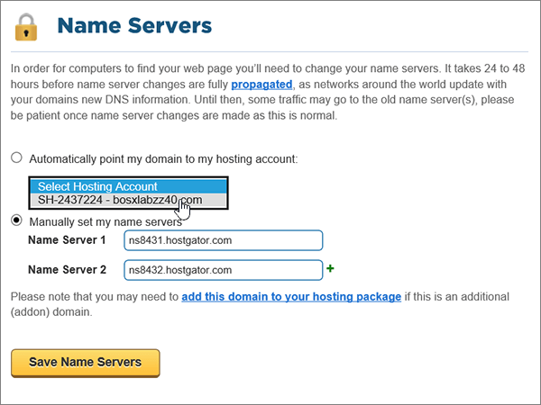
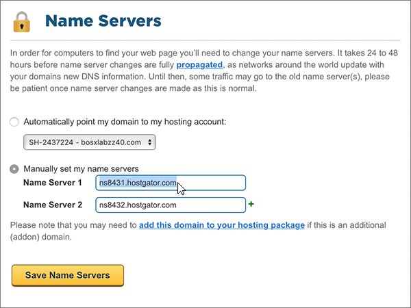
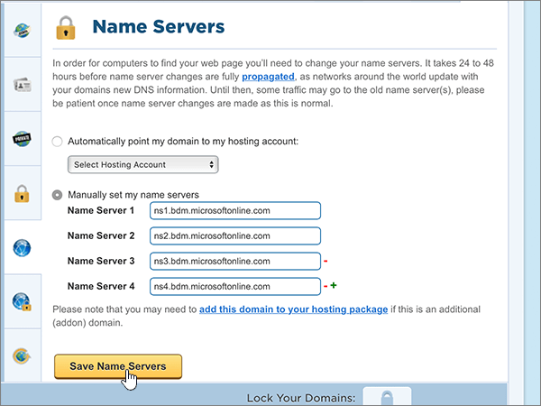

# Modificare i server dei nomi per configurare Office 365 con HostgatorChange nameservers to set up Office 365 with Hostgator

 **Se non si trova ciò che si sta cercando, [vedere le domande frequenti sui domini](../setup/domains-faq.md)**.**[Check the Domains FAQ](../setup/domains-faq.md)** if you don't find what you're looking for.
  
Seguire queste istruzioni se si vuole che Office 365 gestisca automaticamente i record DNS di Office 365. Se si preferisce, è possibile [gestire tutti i record DNS di Office 365 su Hostgator](create-dns-records-at-hostgator.md).Follow these instructions if you want Office 365 to manage your Office 365 DNS records for you. (If you prefer, you can [manage all your Office 365 DNS records at Hostgator](create-dns-records-at-hostgator.md).)
  
    
## Associare il dominio all'account di hosting.Point your domain to your hosting account.

> [!IMPORTANT]
> È necessario eseguire questa procedura prima di quella illustrata nella sezione seguente, **Aggiungere un record TXT a scopo di verifica**.You must perform this procedure before you perform the procedure in the following section, **Add a TXT record for verification**.
  
Seguire questa procedura per associare il dominio e gli account di hosting.Follow these steps to associate your domain and hosting accounts.
  
1. Per iniziare, passare alla pagina del portale per i clienti di Hostgator usando [questo collegamento](https://portal.hostgator.com/domain/manage). Verrà richiesto di eseguire l'accesso.To get started, go to your customer portal page at Hostgator by using [this link](https://portal.hostgator.com/domain/manage). You'll be prompted to log in.
    
    
  
2. Selezionare la scheda **domini** .Select the **Domains** tab.
    
    
  
3. Nella pagina **Gestisci domini** , nell'area **domini personali** , selezionare il dominio che si desidera aggiornare.On the **Manage Domains** page, in the **My Domains** area, select the domain you want to update.
    
    
  
4. Nell'area **Name Servers** della pagina **Domains Overview** selezionare **Change**.On the **Domains Overview** page, in the **Name Servers** area, select **Change**.
    
    
  
5. Nella pagina **Name Servers** per il dominio, nell'elenco a discesa **selezionare l'account di hosting** , scegliere l' **account di hosting** associato al dominio.On the **Name Servers** page for your domain, in the **Select Hosting Account** drop-down list, choose the **hosting account** that is associated with your domain.
    
    
  
6. Selezionare **Save Name Servers**.Select **Save Name Servers**.
    
    
  
## Aggiungere un record TXT a scopo di verificaAdd a TXT record for verification

> [!IMPORTANT]
> Prima di eseguire questa procedura, è necessario prima eseguire la procedura nella prima sezione di questo articolo, [puntare il dominio all'account di hosting.](#point-your-domain-to-your-hosting-account)Before you perform this procedure, you must first perform the procedure in the first section of this article, [Point your domain to your hosting account.](#point-your-domain-to-your-hosting-account).
  
Prima di usare il proprio dominio con Office 365, è necessario dimostrare di esserne proprietari. La capacità di accedere al proprio account nel registrar e di creare il record DNS dimostra a Office 365 che si è proprietari del dominio.Before you use your domain with Office 365, we have to make sure that you own it. Your ability to log in to your account at your domain registrar and create the DNS record proves to Office 365 that you own the domain.
  
> [!NOTE]
> Questo record viene usato esclusivamente per verificare di essere proprietari del dominio e non ha altri effetti. È possibile eliminarlo in un secondo momento, se si preferisce.This record is used only to verify that you own your domain; it doesn't affect anything else. You can delete it later, if you like.
  
1. Per iniziare, passare alla propria pagina cPanel su Hostgator. Verrà richiesto di eseguire l'accesso.To get started, go to your cPanel page at Hostgator. You'll be prompted to log in first.
    
    A ogni account ospitato su Hostgator è assegnato un indirizzo cPanel univoco. L'indirizzo cPanel dovrebbe avere un aspetto simile a https://YourSiteAddress:secure-port-number. Tale indirizzo sarà specificato nel messaggio di posta elettronica di iscrizione ricevuto da Hostgator.(Each hosted account at Hostgator is assigned a unique cPanel address. Your cPanel address should look like this: https://YourSiteAddress:secure-port-number. The sign-up email you received from Hostgator will specify that address.)
    
    > [!IMPORTANT]
    > To have a cPanel associated with your domain, you need a hosting account with Hostgator.To have a cPanel associated with your domain, you need a hosting account with Hostgator. Per iniziare a usare Office 365, è possibile acquistare un account di hosting da Hostgator o [modificare i record del server dei nomi del dominio](#change-your-domains-nameserver-ns-records) in modo che puntino a Office 365.To get started with Office 365, you can either purchase a hosting account from Hostgator or [change your domain's nameserver (NS) records](#change-your-domains-nameserver-ns-records) to point to Office 365. 
  
2. Nell'area **Domains** della pagina del **Pannello di controllo** selezionare **Advanced DNS zone editor**.On the **Control Panel** page, in the **Domains** area, select **Advanced DNS Zone Editor**.
    
    (You may have to scroll down.)(You may have to scroll down.) 
    
3. On the **Advanced DNS Zone Editor** page, in the **Add a Record** area, in the boxes for the new record, type or copy and paste the values from the following table.On the **Advanced DNS Zone Editor** page, in the **Add a Record** area, in the boxes for the new record, type or copy and paste the values from the following table. 
    
    Selezionare il valore **Type** nell'elenco a discesa.(Choose the **Type** value from the drop-down list.) 
    
|||||
|:-----|:-----|:-----|:-----|
|**Name****Name**   |**TTL****TTL**   |**Type****Type**   |**TXT Data****TXT Data**   |
|Usare il proprio  *nome_dominio*  , ad esempio fourthcoffee.com.Use your  *domain_name*  . (for example, fourthcoffee.com.)    **Questo valore DEVE terminare con un punto (.)****This value MUST end with a period (.)**   |11    |TXTTXT    |MS=ms *XXXXXXXX*MS=ms *XXXXXXXX*    **Note:** questo è un esempio.**Note:** This is an example. Usare il valore specifico di **Indirizzo di destinazione o puntamento** indicato nella tabella in Office 365.Use your specific **Destination or Points to Address** value here, from the table in Office 365. [Come trovarloHow do I find this?](../get-help-with-domains/information-for-dns-records.md)        |
   
4. Selezionare **Aggiungi record**.Select **Add Record**.
    
5. Attendere alcuni minuti prima di continuare, in modo che il record appena creato venga aggiornato in Internet.Wait a few minutes before you continue, so that the record you just created can update across the Internet.
    
Now that you've added the record at your domain registrar's site, you'll go back to Office 365 and request Office 365 to look for the record.Now that you've added the record at your domain registrar's site, you'll go back to Office 365 and request Office 365 to look for the record.
  
When Office 365 finds the correct TXT record, your domain is verified.When Office 365 finds the correct TXT record, your domain is verified.
  
1. Nell'interfaccia di amministrazione, andare alla pagina \*\*\*\* \> <a href="https://go.microsoft.com/fwlink/p/?linkid=834818" target="_blank">Domains</a> Settings.In the admin center, go to the **Settings** \> <a href="https://go.microsoft.com/fwlink/p/?linkid=834818" target="_blank">Domains</a> page.

    
2. Nella pagina **Domains** selezionare il dominio che si sta verificando.On the **Domains** page, select the domain that you are verifying. 
    
3. Nella pagina **configurazione** , selezionare **Avvia installazione**.On the **Setup** page, select **Start setup**.
    
4. Nella pagina **Verifica dominio** selezionare **Verifica**.On the **Verify domain** page, select **Verify**.
    
> [!NOTE]
> In genere l'applicazione delle modifiche al DNS richiede circa 15 minuti. A volte può tuttavia capitare che l'aggiornamento di una modifica nel sistema DNS di Internet richieda più tempo. In caso di problemi con il flusso di posta o di altro tipo dopo l'aggiunta dei record DNS, vedere [Individuare e correggere i problemi dopo l'aggiunta del dominio o dei record DNS in Office 365](../get-help-with-domains/find-and-fix-issues.md).Typically it takes about 15 minutes for DNS changes to take effect. However, it can occasionally take longer for a change you've made to update across the Internet's DNS system. If you're having trouble with mail flow or other issues after adding DNS records, see [Find and fix issues after adding your domain or DNS records in Office 365](../get-help-with-domains/find-and-fix-issues.md). 
  
## Modificare i record del server dei nomi del dominioChange your domain's nameserver (NS) records

Per completare la configurazione del dominio con Office 365, modificare i record del server dei nomi del dominio presso il registrar in modo che puntino ai server dei nomi primario e secondario di Office 365. Office 365 viene così configurato in modo da aggiornare automaticamente i record DNS del dominio. Verranno aggiunti tutti i record necessari per il funzionamento della posta elettronica, di Skype for Business online e del sito Web pubblico con il dominio.To complete setting up your domain with Office 365, you change your domain's NS records at your domain registrar to point to the Office 365 primary and secondary name servers. This sets up Office 365 to update the domain's DNS records for you. We'll add all records so that email, Skype for Business Online, and your public website work with your domain, and you'll be all set.
  
> [!CAUTION]
> Quando si modificano i record NS del dominio in modo che puntino ai server dei nomi di Office 365, questa modifica interessa tutti i servizi attualmente associati al dominio. Ad esempio, dopo questa modifica tutta la posta elettronica inviata al dominio (come roberto@ *nome_dominio*  .com) inizierà a essere recapitata a Office 365.When you change your domain's NS records to point to the Office 365 name servers, all the services that are currently associated with your domain are affected. For example, all email sent to your domain (like rob@ *your_domain*  .com) will start coming to Office 365 after you make this change.
  
> [!IMPORTANT]
> Nella procedura seguente viene illustrato come eliminare tutti gli altri server dei nomi indesiderati dall'elenco e come aggiungere i server dei nomi corretti se non sono già elencati.The following procedure will show you how to delete any other, unwanted nameservers from the list, and also how to add the correct nameservers if they are not already listed. Dopo aver completato la procedura descritta in questa sezione, gli unici server dei nomi che devono essere elencati sono questi quattro: **NS1.BDM.microsoftonline.com**, **NS2.BDM.microsoftonline.com**, **NS3.BDM.microsoftonline.com**e **NS4.BDM.microsoftonline.com**.When you have completed the steps in this section, the only nameservers that should be listed are these four:  **ns1.bdm.microsoftonline.com**, **ns2.bdm.microsoftonline.com**, **ns3.bdm.microsoftonline.com**, and **ns4.bdm.microsoftonline.com**.
  
1. Per iniziare, passare alla pagina del portale per i clienti di Hostgator usando [questo collegamento](https://portal.hostgator.com/domain/manage). Verrà richiesto di eseguire l'accesso.To get started, go to your customer portal page at Hostgator by using [this link](https://portal.hostgator.com/domain/manage). You'll be prompted to log in.
    
    
  
2. Selezionare la scheda **domini** .Select the **Domains** tab. 
    
    
  
3. Nella pagina **Gestisci domini** , nell'area **domini personali** , selezionare il dominio che si desidera aggiornare.On the **Manage Domains** page, in the **My Domains** area, select the domain you want to update. 
    
    
  
4. Nell'area **Name Servers** della pagina **Domain Overview** selezionare **Change**.On the **Domain Overview** page, in the **Name Servers** area, select **Change**.
    
    
  
5. Nella pagina **Name Servers** per il dominio, nell'elenco a discesa **selezionare l'account di hosting** , scegliere l' **account di hosting** associato al dominio.On the **Name Servers** page for your domain, in the **Select Hosting Account** drop-down list, choose the **hosting account** that is associated with your domain. 
    
    
  
6. Selezionare **imposta manualmente i server My Name**.Select **Manually set my name servers**.
    
    
  
7.   **Attenzione**: attenersi alla seguente procedura solo se sono presenti server dei nomi diversi dai quattro nameserver corretti.**CAUTION**: Follow these steps only if you have existing nameservers other than the four correct nameservers. (Ovvero, eliminare solo eventuali server dei nomi correnti che *non* sono denominati **NS1.BDM.microsoftonline.com**, **NS2.BDM.microsoftonline.com**, **NS3.BDM.microsoftonline.com**o **NS4.BDM.microsoftonline.com**).(That is, delete only any current nameservers that are  *not*  named **ns1.bdm.microsoftonline.com**, **ns2.bdm.microsoftonline.com**, **ns3.bdm.microsoftonline.com**, or **ns4.bdm.microsoftonline.com**.)
  
        Sempre nella pagina **Name Servers** del dominio, eliminare ognuno dei server dei nomi presenti nell'elenco selezionandolo e premendo **CANC**.Still on the **Name Servers** page for your domain, in the list of nameservers, delete each nameserver in the list by selecting it and then pressing the **Delete** key on your keyboard. 
    
   
  
8. Sempre nell'elenco dei server dei nomi, digitare oppure copiare e incollare i primi due valori della tabella seguente.Still in the list of nameservers, type or copy and paste the first two values from the following table.
    
|||
|:-----|:-----|
|**Name Server 1:****Name Server 1:**   |ns1.bdm.microsoftonline.comns1.bdm.microsoftonline.com    |
|**Name Server 2:****Name Server 2:**   |ns2.bdm.microsoftonline.comns2.bdm.microsoftonline.com    |
|**Name Server 3:****Name Server 3:**   |ns3.bdm.microsoftonline.comns3.bdm.microsoftonline.com    |
|**Name Server 4:****Name Server 4:**   |ns4.bdm.microsoftonline.comns4.bdm.microsoftonline.com    |
   
   
  
9. Aggiungere gli altri valori dei server dei nomi.Add the other nameserver values.
    
    Selezionare **(+)** Aggiungi, quindi digitare oppure copiare e incollare il valore della riga successiva della tabella nella casella relativa al record.Select **(+)** add, and then type or copy and paste the value from the next row of the table into the box for the record. 
    
    Ripetere questa procedura fino a creare tutti e quattro i record dei server dei nomi.Repeat this process until you have created all four nameserver records.
    
    
  
10. Selezionare **Save Name Servers**.Select **Save Name Servers**.
    
    
  
> [!NOTE]
> L'aggiornamento dei record dei server dei nomi nel sistema DNS di Internet può richiedere fino a diverse ore. Al termine, la posta elettronica e altri servizi di Office 365 verranno tutti impostati per funzionare con il dominio.Your nameserver record updates may take up to several hours to update across the Internet's DNS system. Then your Office 365 email and other services will be all set to work with your domain.