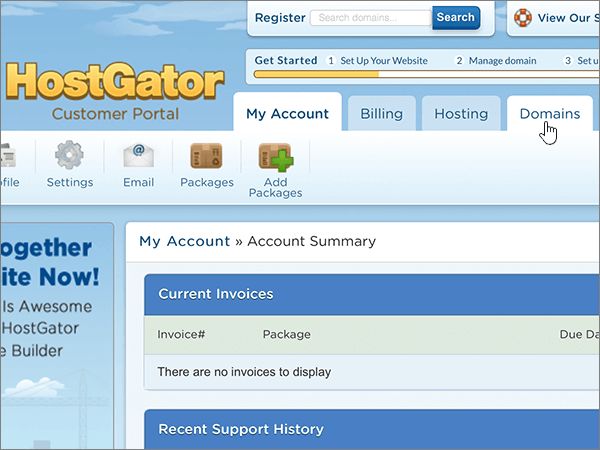

# Modificare i server dei nomi per configurare Microsoft 365 con Hostgator

 Se non si trova ciò che si sta cercando, **[vedere le domande frequenti sui domini](../setup/domains-faq.yml)**.
  
Seguire queste istruzioni se si desidera che Microsoft gestirà i record DNS. Se si preferisce, è possibile [gestire tutti i record DNS Microsoft su Hostgator.](create-dns-records-at-hostgator.md)
  
    
## Associare il dominio all'account di hosting.

> [!IMPORTANT]
> È necessario eseguire questa procedura prima di quella illustrata nella sezione seguente, **Aggiungere un record TXT a scopo di verifica**.
  
Seguire questa procedura per associare il dominio e gli account di hosting.
  
1. Per iniziare, passare alla pagina del portale per i clienti di Hostgator usando [questo collegamento](https://portal.hostgator.com/domain/manage). Verrà richiesto di eseguire l'accesso.
    
    
  
2. Selezionare la **scheda Domini.**
    
    
  
3. **Nell'area My** Domains della pagina Manage **Domains** selezionare il dominio che si desidera aggiornare.
    
    
  
4. Nell'area **Name Servers** della pagina **Domains Overview** selezionare **Change**.
    
    
  
5. Nella pagina **Name Servers** del dominio scegliere l'account **di hosting** associato al dominio nell'elenco a discesa Select **Hosting Account.**
    
    
  
6. Selezionare **Save Name Servers**.
    
    
  
## Aggiungere un record TXT a scopo di verifica

> [!IMPORTANT]
> Prima di eseguire questa procedura, è necessario eseguire la procedura descritta nella prima sezione di questo articolo, Puntare il dominio [all'account di hosting.](#point-your-domain-to-your-hosting-account)
  
Prima di usare il proprio dominio con Microsoft, è necessario dimostrare di esserne il proprietario. La capacità di accedere al proprio account nel registrar e di creare il record DNS dimostra a Microsoft che si è il proprietario del dominio.
  
> [!NOTE]
> Questo record viene usato esclusivamente per verificare di essere proprietari del dominio e non ha altri effetti. È possibile eliminarlo in un secondo momento, se si preferisce.
  
1. Per iniziare, passare alla propria pagina cPanel su Hostgator. Verrà richiesto di eseguire l'accesso.
    
    A ogni account ospitato su Hostgator è assegnato un indirizzo cPanel univoco. L'indirizzo cPanel dovrebbe avere un aspetto simile a https://YourSiteAddress:secure-port-number. Tale indirizzo sarà specificato nel messaggio di posta elettronica di iscrizione ricevuto da Hostgator.
    
    > [!IMPORTANT]
    > To have a cPanel associated with your domain, you need a hosting account with Hostgator. To get started, you can either purchase a hosting account from Hostgator or [change your domain's nameserver (NS) records](#change-your-domains-nameserver-ns-records) to point to Microsoft. 
  
2. Nell'area Domini della  pagina **Pannello** di controllo selezionare Advanced DNS **Zone Editor.**
    
    Può essere necessario scorrere la pagina. 
    
3. On the **Advanced DNS Zone Editor** page, in the **Add a Record** area, in the boxes for the new record, type or copy and paste the values from the following table. 
    
    Selezionare il valore **Type** nell'elenco a discesa. 
    
|||||
|:-----|:-----|:-----|:-----|
|**Nome**   |**TTL**   |**Type**   |**TXT Data**   |
|Usare il proprio  *nome_dominio*  , ad esempio fourthcoffee.com.  **Questo valore DEVE terminare con un punto (.)**   |1     |TXT    |MS=ms *XXXXXXXX*    **Note:** questo è un esempio. Usare il valore specifico di **Indirizzo di destinazione o puntamento** indicato nella tabella. [Come trovarlo](../get-help-with-domains/information-for-dns-records.md)        |
   
4. Selezionare **Aggiungi record.**
    
5. Attendere alcuni minuti prima di continuare, in modo che il record appena creato venga aggiornato in Internet.
    
Dopo aver aggiunto il record nel sito del registrar, si tornerà a Microsoft e si richiederà una ricerca del record.
  
Quando Microsoft trova il record TXT corretto, il dominio è verificato.
  
1. Nell'interfaccia di amministrazione passare a **Impostazioni** \> pagina <a href="https://go.microsoft.com/fwlink/p/?linkid=834818" target="_blank">Domini</a>.

    
2. Nella pagina **Domini** selezionare il dominio da verificare. 
    
3. Nella pagina **Configurazione** selezionare **Avvia configurazione**.
    
4. Nella pagina **Verifica dominio** selezionare **Verifica**.
    
> [!NOTE]
> In genere, l'applicazione delle modifiche al DNS richiede circa 15 minuti. Tuttavia, a volte può capitare che l'aggiornamento di una modifica nel sistema DNS di Internet richieda più tempo. In caso di problemi con il flusso di posta o di altro tipo dopo l'aggiunta dei record DNS, vedere [Individuare e correggere i problemi dopo l'aggiunta del dominio o dei record DNS](../get-help-with-domains/find-and-fix-issues.md). 
  
## Modificare i record del server dei nomi del dominio

Per completare la configurazione del dominio con Microsoft, è necessario modificare i record NS del dominio presso il registrar in modo che puntino ai server dei nomi primario e secondario Microsoft. Questo consente a Microsoft di aggiornare automaticamente i record DNS del dominio. Verranno aggiunti tutti i record necessari per il funzionamento della posta elettronica, di Skype for Business online e del sito Web pubblico con il dominio.
  
> [!CAUTION]
> Quando si modificano i record NS del dominio in modo che puntino ai server dei nomi Microsoft, vengono interessati tutti i servizi attualmente associati al dominio. Ad esempio, tutti i messaggi di posta elettronica inviati al dominio (ad esempio rob@ *your_domain*  .com) inizieranno a essere inviati a Microsoft dopo aver apportato questa modifica.
  
> [!IMPORTANT]
> Nella procedura seguente viene illustrato come eliminare altri server dei nomi indesiderati dall'elenco e come aggiungere i server dei nomi corretti se non sono già elencati. Dopo aver completato i passaggi descritti in questa sezione, gli unici server dei nomi che dovrebbero essere elencati sono i quattro seguenti:  **ns1.bdm.microsoftonline.com,** **ns2.bdm.microsoftonline.com,** **ns3.bdm.microsoftonline.com** e **ns4.bdm.microsoftonline.com**.
  
1. Per iniziare, passare alla pagina del portale per i clienti di Hostgator usando [questo collegamento](https://portal.hostgator.com/domain/manage). Verrà richiesto di eseguire l'accesso.
    
    
  
2. Selezionare la **scheda Domini.** 
    
    
  
3. **Nell'area My** Domains della pagina Manage **Domains** selezionare il dominio che si desidera aggiornare. 
    
    
  
4. Nell'area **Name Servers** della pagina **Domain Overview** selezionare **Change.**
    
    
  
5. Nella pagina **Name Servers** del dominio scegliere l'account **di hosting** associato al dominio nell'elenco a discesa Select **Hosting Account.** 
    
    
  
6. Selezionare **Imposta manualmente i server dei nomi.**
    
    
  
7.   **ATTENZIONE:** eseguire questa procedura solo se sono disponibili server dei nomi diversi da quattro server dei nomi corretti. In altre informazioni, eliminare solo i  server dei nomi correnti non denominati **ns1.bdm.microsoftonline.com,** **ns2.bdm.microsoftonline.com,** **ns3.bdm.microsoftonline.com** o **ns4.bdm.microsoftonline.com**.
  
        Sempre nella pagina **Name Servers** del dominio, eliminare ognuno dei server dei nomi presenti nell'elenco selezionandolo e premendo **CANC**. 
    
   
  
8. Sempre nell'elenco dei server dei nomi, digitare oppure copiare e incollare i primi due valori della tabella seguente.
    
|||
|:-----|:-----|
|**Name Server 1:**   |ns1.bdm.microsoftonline.com    |
|**Name Server 2:**   |ns2.bdm.microsoftonline.com    |
|**Name Server 3:**   |ns3.bdm.microsoftonline.com    |
|**Name Server 4:**   |ns4.bdm.microsoftonline.com    |
   
   
  
9. Aggiungere gli altri valori dei server dei nomi.
    
    Selezionare **(+)** aggiungere e quindi digitare oppure copiare e incollare il valore dalla riga successiva della tabella nella casella del record. 
    
    Ripetere questa procedura fino a creare tutti e quattro i record dei server dei nomi.
    
    
  
10. Selezionare **Save Name Servers**.
    
    
  
> [!NOTE]
> L'aggiornamento dei record dei server dei nomi nel sistema DNS di Internet può richiedere fino a diverse ore. Quindi la posta elettronica Microsoft e altri servizi saranno tutti impostati per l'utilizzo con il dominio.
