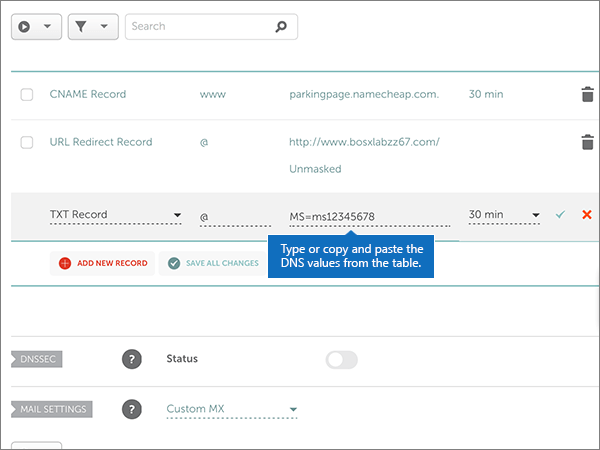

# Modificare i server dei nomi per configurare Office 365 con Namecheap

 Se non si trova ciò che si sta cercando, **[vedere le domande frequenti sui domini](../setup/domains-faq.md)**.
  
Seguire queste istruzioni se si vuole che Office 365 gestisca automaticamente i record DNS di Office 365. Se si preferisce, è possibile [gestire tutti i record DNS di Office 365 su Namecheap](create-dns-records-at-namecheap.md).
  
    
## Aggiungere un record TXT a scopo di verifica

1. Per iniziare, passare alla propria pagina dei domini su Namecheap usando [questo collegamento](https://www.namecheap.com/myaccount/login.aspx?ReturnUrl=%2f). Verrà richiesto di eseguire l'accesso e continuare.
    
    
  
2. Nella pagina di **destinazione** , in **account**, scegliere **Domain List** nell'elenco a discesa. 
    
    
  
3. Nella pagina **elenco dei domini** trovare il nome del dominio che si desidera modificare, quindi selezionare **Gestisci**.
    
    
  
4. Selezionare **DNS avanzato**.
    
    
  
5. Nella sezione **Host Records** selezionare **Aggiungi nuovo record**.
    
    
  
6. Nell'elenco a discesa **Type** selezionare **TXT Record**.
    
    > [!NOTE]
    > L'elenco a discesa **tipo** viene visualizzato automaticamente quando si seleziona **Aggiungi nuovo record**.
  
    
  
7. Nelle caselle del nuovo record digitare oppure copiare e incollare i valori della tabella seguente.
    
    Scegliere il valore **TTL** nell'elenco a discesa. 
    
|**Tipo**|**Host**|**Valore**|**TTL**|
|:-----|:-----|:-----|:-----|
|TXT    |@    |MS=ms *XXXXXXXX*    **Nota**: questo è un esempio. Usare il valore specifico di **Indirizzo di destinazione o puntamento** indicato nella tabella in Office 365.           [Come trovarlo](../get-help-with-domains/information-for-dns-records.md)          |30 min    |
   
   
  
8. Selezionare il controllo **Salva modifiche** (segno di spunta). 
    
    
  
9. Attendere alcuni minuti prima di continuare, in modo che il record appena creato venga aggiornato in Internet.
    
Now that you've added the record at your domain registrar's site, you'll go back to Office 365 and request Office 365 to look for the record.
  
When Office 365 finds the correct TXT record, your domain is verified.
  
1. Nell'interfaccia di amministrazione, andare alla pagina **** \> <a href="https://go.microsoft.com/fwlink/p/?linkid=834818" target="_blank">Domains</a> Settings.

    
2. Nella pagina **Domains** selezionare il dominio che si sta verificando. 
    
    
  
3. Nella pagina **configurazione** , selezionare **Avvia installazione**.
    
    
  
4. Nella pagina **Verifica dominio** selezionare **Verifica**.
    
    
  
> [!NOTE]
>  In genere l'applicazione delle modifiche al DNS richiede circa 15 minuti. A volte può tuttavia capitare che l'aggiornamento di una modifica nel sistema DNS di Internet richieda più tempo. In caso di problemi con il flusso di posta o altro dopo l'aggiunta dei record DNS, vedere [Risolvere i problemi dopo la modifica del nome di dominio o dei record DNS](../get-help-with-domains/find-and-fix-issues.md). 
  
## Modificare i record dei server dei nomi del dominio

Per completare la configurazione del dominio con Office 365, modificare i record del server dei nomi del dominio presso il registrar in modo che puntino ai server dei nomi primario e secondario di Office 365. Office 365 viene così configurato in modo da aggiornare automaticamente i record DNS del dominio. Verranno aggiunti tutti i record necessari per il funzionamento della posta elettronica, di Skype for Business online e del sito Web pubblico con il dominio.
  
> [!CAUTION]
> Quando si modificano i record NS del dominio in modo che puntino ai server dei nomi di Office 365, questa modifica interessa tutti i servizi attualmente associati al dominio. Ad esempio, dopo questa modifica tutta la posta elettronica inviata al dominio (come roberto@ *nome_dominio*  .com) inizierà a essere recapitata a Office 365. 
  
> [!IMPORTANT]
>  Una volta completata la procedura descritta in questa sezione, dovrebbero essere elencati  *solo*  questi quattro server dei nomi: >  ns1.bdm.microsoftonline.com >  ns2.bdm.microsoftonline.com >  ns3.bdm.microsoftonline.com >  ns4.bdm.microsoftonline.com >  La seguente procedura illustra come eliminare eventuali altri server dei nomi indesiderati dall'elenco e come aggiungere i server dei nomi  *corretti*  se non sono presenti nell'elenco. 
  
1. Per iniziare, passare alla propria pagina dei domini su Namecheap usando [questo collegamento](https://www.namecheap.com/myaccount/login.aspx?ReturnUrl=%2f). Verrà richiesto di eseguire l'accesso e continuare.
    
    
  
2. Nella pagina di **destinazione** , in **account**, scegliere **Domain List** nell'elenco a discesa. 
    
    
  
3. Nella pagina **elenco dei domini** trovare il nome del dominio che si desidera modificare, quindi selezionare **Gestisci**.
    
    
  
4. Selezionare **dominio**.
    
    
  
5. Trovare la sezione **NAMESERVERS** e quindi selezionare **Custom** dall'elenco a discesa **Namecheap Default**. 
    
    
  
6. A seconda del fatto che siano già presenti o meno i server dei nomi elencati nella pagina visualizzata, continuare con una delle due procedure seguenti.
    
### Se NON sono già elencati server dei nomi

1. Fare doppio clic su **Aggiungi server dei nomi** per aggiungere due nuove righe.
    
    
  
2. Nelle caselle **Nameserver** digitare oppure copiare e incollare i valori della tabella seguente.
    
|||
|:-----|:-----|
|**Nameserver 1**   |ns1.bdm.microsoftonline.com    |
|**Nameserver 2**   |ns2.bdm.microsoftonline.com    |
|**Nameserver 3**   |ns3.bdm.microsoftonline.com    |
|**Nameserver 4**   |ns4.bdm.microsoftonline.com    |
   
   
  
3. Selezionare il controllo **Salva** (segno di spunta). 
    
    
  
> [!NOTE]
> L'aggiornamento dei record dei server dei nomi nel sistema DNS di Internet può richiedere fino a diverse ore. Al termine, la posta elettronica e altri servizi di Office 365 verranno tutti impostati per funzionare con il dominio. 
  
### Se SONO già elencati server dei nomi

> [!CAUTION]
> Seguire questa procedura  *solo*  se sono presenti server dei nomi diversi dai quattro server dei nomi  *corretti*  . In altre parole, eliminare  *solo*  eventuali server dei nomi  *diversi*  da **ns1.bdm.microsoftonline.com**, **ns2.bdm.microsoftonline.com**, **ns3.bdm.microsoftonline.com** o **ns4.bdm.microsoftonline.com**. 
  
1. Se sono già elencati altri server dei nomi nelle caselle **Nameserver**, eliminarli selezionando ogni server e premendo **CANC**. 
    
    
  
2. Fare doppio clic su **Aggiungi server dei nomi** per aggiungere due nuove righe. 
    
    
  
3. Nelle caselle **Nameserver** digitare oppure copiare e incollare i valori della tabella seguente.
 
    
|||
|:-----|:-----|
|**Name Server 1**   |ns1.bdm.microsoftonline.com    |
|**Name Server 2**   |ns2.bdm.microsoftonline.com    |
|**Nameserver 3**   |ns3.bdm.microsoftonline.com    |
|**Nameserver 4**   |ns4.bdm.microsoftonline.com    |
   
   
  
4. Selezionare il controllo **Salva** (segno di spunta). 
    
    
  
> [!NOTE]
> L'aggiornamento dei record dei server dei nomi nel sistema DNS di Internet può richiedere fino a diverse ore. Al termine, la posta elettronica e altri servizi di Office 365 verranno tutti impostati per funzionare con il dominio.