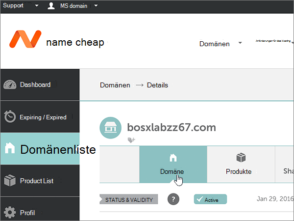
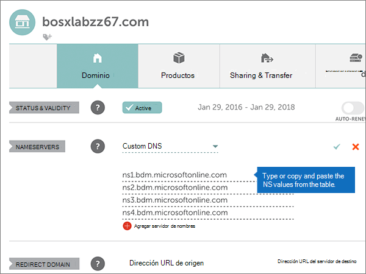
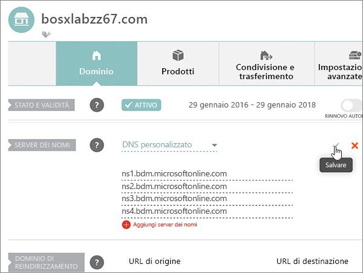
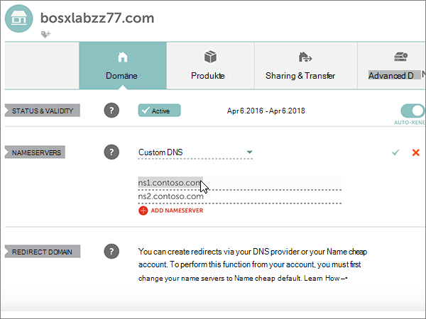

# Modificare i server dei nomi per configurare Microsoft con namecheapChange nameservers to set up Microsoft with Namecheap

 Se non si trova ciò che si sta cercando, **[vedere le domande frequenti sui domini](../setup/domains-faq.md)**.**[Check the Domains FAQ](../setup/domains-faq.md)** if you don't find what you're looking for.
  
Se si desidera gestire i record DNS per l'utente, seguire le istruzioni riportate di seguito.Follow these instructions if you want Microsoft to manage your DNS records for you. Se si preferisce, è possibile [gestire tutti i record Microsoft DNS in Namecheap](create-dns-records-at-namecheap.md).(If you prefer, you can [manage all your Microsoft DNS records at Namecheap](create-dns-records-at-namecheap.md).)
  
    
## Aggiungere un record TXT a scopo di verificaAdd a TXT record for verification

1. Per iniziare, passare alla propria pagina dei domini su Namecheap usando [questo collegamento](https://www.namecheap.com/myaccount/login.aspx?ReturnUrl=%2f). Verrà richiesto di eseguire l'accesso e continuare.To get started, go to your domains page at Namecheap by using [this link](https://www.namecheap.com/myaccount/login.aspx?ReturnUrl=%2f). You'll be prompted to Sign in and Continue.
    
    
  
2. Nella pagina di **destinazione** , in **account**, scegliere **Domain List** nell'elenco a discesa.On the **Landing** page, under **Account**, choose **Domain List** from the drop-down list. 
    
    
  
3. Nella pagina **elenco dei domini** trovare il nome del dominio che si desidera modificare, quindi selezionare **Gestisci**.On the **Domain List** page, find the name of the domain that you want to edit, and then select **Manage**.
    
    
  
4. Selezionare **DNS avanzato**.Select **Advanced DNS**.
    
    
  
5. Nella sezione **Host Records** selezionare **Aggiungi nuovo record**.In the **HOST RECORDS** section, select **ADD NEW RECORD**.
    
    
  
6. Nell'elenco a discesa **Type** selezionare **TXT Record**.In the **Type** drop-down, select **TXT Record**.
    
    > [!NOTE]
    > L'elenco a discesa **tipo** viene visualizzato automaticamente quando si seleziona **Aggiungi nuovo record**.The **Type** drop-down automatically appears when you select **ADD NEW RECORD**.
  
    
  
7. Nelle caselle del nuovo record digitare oppure copiare e incollare i valori della tabella seguente.In the boxes for the new record, type or copy and paste the values from the following table.
    
    Scegliere il valore **TTL** nell'elenco a discesa.(Choose the **TTL** value from the drop-down list.) 
    
|**Tipo****Type**|**Host****Host**|**Valore****Value**|**TTL****TTL**|
|:-----|:-----|:-----|:-----|
|TXTTXT    |@    |MS=ms *XXXXXXXX*MS=ms *XXXXXXXX*    **Nota**: questo è un esempio.**Note**: This is an example. Usare il valore specifico di **Indirizzo di destinazione o puntamento** indicato nella tabella.Use your specific **Destination or Points to Address** value here, from the table.           [Come trovarloHow do I find this?](../get-help-with-domains/information-for-dns-records.md)          |30 min30 min    |
   
   
  
8. Selezionare il controllo **Salva modifiche** (segno di spunta).Select the **Save Changes** (check mark) control. 
    
    
  
9. Attendere alcuni minuti prima di continuare, in modo che il record appena creato venga aggiornato in Internet.Wait a few minutes before you continue, so that the record you just created can update across the Internet.
    
Dopo aver aggiunto il record al sito del registrar, è possibile tornare a Microsoft e richiedere una ricerca per il record.Now that you've added the record at your domain registrar's site, you'll go back to Microsoft and request a search for the record.
  
Quando Microsoft trova il record TXT corretto, il dominio è verificato.When Microsoft finds the correct TXT record, your domain is verified.
  
1. Nell'interfaccia di amministrazione passare a **Impostazioni** \> pagina <a href="https://go.microsoft.com/fwlink/p/?linkid=834818" target="_blank">Domini</a>.In the admin center, go to the **Settings** \> <a href="https://go.microsoft.com/fwlink/p/?linkid=834818" target="_blank">Domains</a> page.

    
2. Nella pagina **Domini** selezionare il dominio da verificare.On the **Domains** page, select the domain that you are verifying. 
    
    
  
3. Nella pagina **Configurazione** selezionare **Avvia configurazione**.On the **Setup** page, select **Start setup**.
    
    
  
4. Nella pagina **Verifica dominio** selezionare **Verifica**.On the **Verify domain** page, select **Verify**.
    
    
  
> [!NOTE]
>  In genere, l'applicazione delle modifiche ai record DNS richiede circa 15 minuti. A volte, tuttavia, l'aggiornamento di una modifica nel sistema DNS di Internet può richiedere più tempo. In caso di problemi relativi al flusso di posta o di altro tipo dopo l'aggiunta dei record DNS, vedere [Risolvere i problemi dopo la modifica del nome di dominio o dei record DNS](../get-help-with-domains/find-and-fix-issues.md).Typically it takes about 15 minutes for DNS changes to take effect. However, it can occasionally take longer for a change you've made to update across the Internet's DNS system. If you're having trouble with mail flow or other issues after adding DNS records, see [Troubleshoot issues after changing your domain name or DNS records](../get-help-with-domains/find-and-fix-issues.md). 
  
## Modificare i record dei server dei nomi del dominioChange your domain's nameserver (NS) records

Per completare la configurazione del dominio con Microsoft, è necessario modificare i record NS del dominio presso il registrar in modo che puntino ai server dei nomi primari e secondari Microsoft.To complete setting up your domain with Microsoft, you change your domain's NS records at your domain registrar to point to the Microsoft primary and secondary name servers. Questo configura Microsoft per aggiornare i record DNS del dominio per l'utente.This sets up Microsoft to update the domain's DNS records for you. Verranno aggiunti tutti i record necessari per il funzionamento della posta elettronica, di Skype for Business online e del sito Web pubblico con il dominio.We'll add all records so that email, Skype for Business Online, and your public website work with your domain, and you'll be all set.
  
> [!CAUTION]
> Quando si modificano i record NS del dominio in modo che puntino ai server dei nomi Microsoft, sono coinvolti tutti i servizi attualmente associati al dominio.When you change your domain's NS records to point to the Microsoft name servers, all the services that are currently associated with your domain are affected. Ad esempio, tutta la posta elettronica inviata al dominio (come rob@ *your_domain* . com) inizierà a venire a Microsoft dopo aver apportato questa modifica.For example, all email sent to your domain (like rob@ *your_domain*  .com) will start coming to Microsoft after you make this change. 
  
> [!IMPORTANT]
>  Una volta completata la procedura descritta in questa sezione, dovrebbero essere elencati  *solo*  questi quattro server dei nomi: >  ns1.bdm.microsoftonline.com >  ns2.bdm.microsoftonline.com >  ns3.bdm.microsoftonline.com >  ns4.bdm.microsoftonline.com >  La seguente procedura illustra come eliminare eventuali altri server dei nomi indesiderati dall'elenco e come aggiungere i server dei nomi  *corretti*  se non sono presenti nell'elenco.When you have completed the steps in this section, the  *only*  nameservers that should be listed are these four: >  ns1.bdm.microsoftonline.com >  ns2.bdm.microsoftonline.com >  ns3.bdm.microsoftonline.com >  ns4.bdm.microsoftonline.com >  The following procedure will show you how to delete any other, unwanted nameservers from the list, and also how to add the  *correct*  nameservers if they are not already in the list. 
  
1. Per iniziare, passare alla propria pagina dei domini su Namecheap usando [questo collegamento](https://www.namecheap.com/myaccount/login.aspx?ReturnUrl=%2f). Verrà richiesto di eseguire l'accesso e continuare.To get started, go to your domains page at Namecheap by using [this link](https://www.namecheap.com/myaccount/login.aspx?ReturnUrl=%2f). You'll be prompted to Sign in and Continue.
    
    
  
2. Nella pagina di **destinazione** , in **account**, scegliere **Domain List** nell'elenco a discesa.On the **Landing** page, under **Account**, choose **Domain List** from the drop-down list. 
    
    
  
3. Nella pagina **elenco dei domini** trovare il nome del dominio che si desidera modificare, quindi selezionare **Gestisci**.On the **Domain List** page, find the name of the domain that you want to edit, and then select **Manage**.
    
    
  
4. Selezionare **dominio**.Select **Domain**.
    
    
  
5. Trovare la sezione **NAMESERVERS** e quindi selezionare **Custom** dall'elenco a discesa **Namecheap Default**.Find the **NAMESERVERS** section, and then select **Custom** from the **Namecheap Default** drop-down list. 
    
    
  
6. A seconda del fatto che siano già presenti o meno i server dei nomi elencati nella pagina visualizzata, continuare con una delle due procedure seguenti.Depending on whether or not there are already nameservers listed on the page that is displayed now, continue to one of the two following procedures.
    
### Se NON sono già elencati server dei nomiIf there are NO nameservers already listed

1. Fare doppio clic su **Aggiungi server dei nomi** per aggiungere due nuove righe.Select **ADD NAMESERVER** twice to add two new rows.
    
    
  
2. Nelle caselle **Nameserver** digitare oppure copiare e incollare i valori della tabella seguente.In the **Nameserver** boxes, type or copy and paste the values from the following table.
    
|||
|:-----|:-----|
|**Nameserver 1****Nameserver 1**   |ns1.bdm.microsoftonline.comns1.bdm.microsoftonline.com    |
|**Nameserver 2****Nameserver 2**   |ns2.bdm.microsoftonline.comns2.bdm.microsoftonline.com    |
|**Nameserver 3****Nameserver 3**   |ns3.bdm.microsoftonline.comns3.bdm.microsoftonline.com    |
|**Nameserver 4****Nameserver 4**   |ns4.bdm.microsoftonline.comns4.bdm.microsoftonline.com    |
   
   
  
3. Selezionare il controllo **Salva** (segno di spunta).Select the **Save** (check mark) control. 
    
    
  
> [!NOTE]
> L'aggiornamento dei record dei server dei nomi nel sistema DNS di Internet può richiedere fino a diverse ore.Your nameserver record updates may take up to several hours to update across the Internet's DNS system. L'indirizzo di posta elettronica e gli altri servizi di Microsoft saranno tutti impostati per l'utilizzo con il dominio.Then your Microsoft email and other services will be all set to work with your domain. 
  
### Se SONO già elencati server dei nomiIf there ARE nameservers already listed

> [!CAUTION]
> Seguire questa procedura  *solo*  se sono presenti server dei nomi diversi dai quattro server dei nomi  *corretti*  . In altre parole, eliminare  *solo*  eventuali server dei nomi  *diversi*  da **ns1.bdm.microsoftonline.com**, **ns2.bdm.microsoftonline.com**, **ns3.bdm.microsoftonline.com** o **ns4.bdm.microsoftonline.com**.Follow these steps  *only*  if you have existing nameservers other than the four  *correct*  nameservers. (That is, delete  *only*  any current nameservers that are  *not*  named **ns1.bdm.microsoftonline.com**, **ns2.bdm.microsoftonline.com**, **ns3.bdm.microsoftonline.com**, or **ns4.bdm.microsoftonline.com**.) 
  
1. Se sono già elencati altri server dei nomi nelle caselle **Nameserver**, eliminarli selezionando ogni server e premendo **CANC**.If there are any other nameservers listed in the **Nameserver** boxes, delete each one by selecting it and then pressing the **Delete** key on your keyboard. 
    
    
  
2. Fare doppio clic su **Aggiungi server dei nomi** per aggiungere due nuove righe.Select **ADD NAMESERVER** twice to add two new rows. 
    
    
  
3. Nelle caselle **Nameserver** digitare oppure copiare e incollare i valori della tabella seguente.In the **Nameserver** boxes, type or copy and paste the values from the following table.
 
    
|||
|:-----|:-----|
|**Name Server 1****Name Server 1**   |ns1.bdm.microsoftonline.comns1.bdm.microsoftonline.com    |
|**Name Server 2****Name Server 2**   |ns2.bdm.microsoftonline.comns2.bdm.microsoftonline.com    |
|**Nameserver 3****Nameserver 3**   |ns3.bdm.microsoftonline.comns3.bdm.microsoftonline.com    |
|**Nameserver 4****Nameserver 4**   |ns4.bdm.microsoftonline.comns4.bdm.microsoftonline.com    |
   
   
  
4. Selezionare il controllo **Salva** (segno di spunta).Select the **Save** (check mark) control. 
    
    
  
> [!NOTE]
> L'aggiornamento dei record dei server dei nomi nel sistema DNS di Internet può richiedere fino a diverse ore.Your nameserver record updates may take up to several hours to update across the Internet's DNS system. L'indirizzo di posta elettronica e gli altri servizi di Microsoft saranno tutti impostati per l'utilizzo con il dominio.Then your Microsoft email and other services will be all set to work with your domain.
