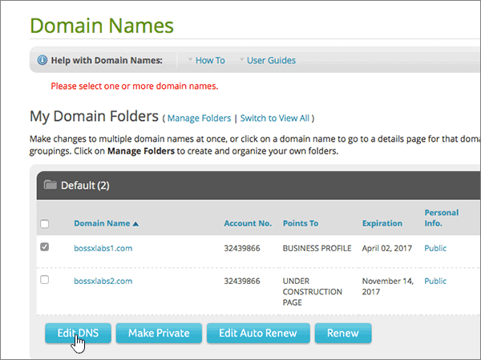
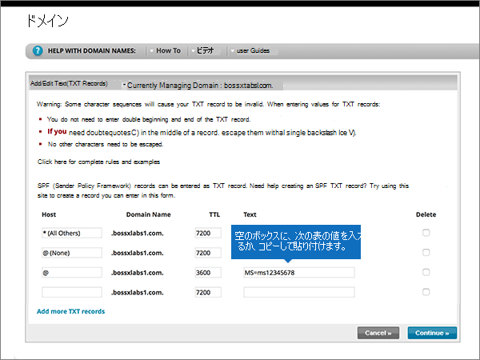

# Modificare i server dei nomi per configurare Office 365 con Network Solutions

 **Se non si trova ciò che si sta cercando, [vedere le domande frequenti sui domini](../setup/domains-faq.md)**.
  
Seguire queste istruzioni se si vuole che Office 365 gestisca automaticamente i record DNS di Office 365. Se si preferisce, è possibile [gestire tutti i record DNS di Office 365 su Network Solutions](create-dns-records-at-network-solutions.md).
  
    
## Aggiungere un record TXT su Network Solutions per verificare che si è proprietari del dominio

Prima di usare il proprio dominio con Office 365, è necessario dimostrare di esserne proprietari. La capacità di accedere al proprio account nel registrar e di creare il record DNS dimostra a Office 365 che si è proprietari del dominio.
  
> [!NOTE]
> Questo record viene usato esclusivamente per verificare di essere proprietari del dominio e non ha altri effetti. È possibile eliminarlo in un secondo momento, se si preferisce. 
  
Seguire i passaggi indicati sotto oppure [guardare il video (iniziare da 0:47)](https://support.office.com/article/Video-Change-nameservers-to-set-up-Office-365-with-Network-Solutions-69b092e3-c026-4d19-a7d0-16cdb2d8b261?ui=en-US&amp;rs=en-US&amp;ad=US).
  
1. Per iniziare, passare alla propria pagina dei domini su Network Solutions usando [questo collegamento](https://www.networksolutions.com/manage-it). Verrà richiesto di eseguire l'accesso.
    
    > [!IMPORTANT]
    > Prima di selezionare il pulsante di **accesso** , selezionare First **Manage My Domain Names** nell'elenco **a discesa log in to:** .
  
    
  
2. Selezionare la casella di controllo accanto al nome del dominio da modificare.
    
    
  
3. Selezionare **modifica DNS**.
    
    
  
4. Selezionare **Gestisci record DNS avanzati**.
    
    (You may have to scroll down.)
    
    
  
5. Scorrere verso il basso fino alla sezione **Text (TXT Records)** e quindi scegliere **Edit TXT Records**.
    
    
  
6. Nelle caselle del nuovo record digitare oppure copiare e incollare i valori della tabella seguente.
    
|**Host**|**TTL**|**Text**|
|:-----|:-----|:-----|
|@    (The system will change this value to **@ (None)** when you save the record.)    |3600    |MS=ms *XXXXXXXX*    **Nota**: questo è un esempio. Usare il valore specifico di **Indirizzo di destinazione o puntamento** indicato nella tabella in Office 365.           [Come trovarlo](../get-help-with-domains/information-for-dns-records.md)
   
    
   
  
7. Selezionare **continua**.
    
    
  
8. Selezionare **Salva modifiche**.
    
    
  
9. Attendere alcuni minuti prima di continuare, in modo che il record appena creato venga aggiornato in Internet.
    
Una volta aggiunto il record al sito del registrar, è possibile tornare in Office 365 e chiedere di cercarlo.
  
Quando Office 365 trova il record TXT corretto, il dominio è verificato.
  
1. Nell'interfaccia di amministrazione passare a **Impostazioni** \> pagina <a href="https://go.microsoft.com/fwlink/p/?linkid=834818" target="_blank">Domini</a>.

    
2. Nella pagina **Domini** selezionare il dominio da verificare. 
    
    
  
3. Nella pagina **Configurazione** selezionare **Avvia configurazione**.
    
    
  
4. Nella pagina **Verifica dominio** selezionare **Verifica**.
    
    
  
> [!NOTE]
>  In genere, l'applicazione delle modifiche ai record DNS richiede circa 15 minuti. A volte, tuttavia, l'aggiornamento di una modifica nel sistema DNS di Internet può richiedere più tempo. In caso di problemi relativi al flusso di posta o di altro tipo dopo l'aggiunta dei record DNS, vedere [Risolvere i problemi dopo la modifica del nome di dominio o dei record DNS](../get-help-with-domains/find-and-fix-issues.md). 
  
## Modificare i record dei server dei nomi del dominio

Per completare la configurazione del dominio con Office 365, modificare i record del server dei nomi del dominio presso il registrar in modo che puntino ai server dei nomi primario e secondario di Office 365. Office 365 viene così configurato in modo da aggiornare automaticamente i record DNS del dominio. Verranno aggiunti tutti i record necessari per il funzionamento della posta elettronica, di Skype for Business online e del sito Web pubblico con il dominio.
  
> [!CAUTION]
> Quando si modificano i record NS del dominio in modo che puntino ai server dei nomi di Office 365, questa modifica interessa tutti i servizi attualmente associati al dominio. Ad esempio, dopo questa modifica tutta la posta elettronica inviata al dominio (come roberto@ *nome_dominio*  .com) inizierà a essere recapitata a Office 365.
  
Modificare i record NS per consentire a Office 365 di configurare il dominio Seguire i passaggi indicati sotto oppure [guardare il video (iniziare da 2:23)](https://support.office.com/article/Video-Change-nameservers-to-set-up-Office-365-with-Network-Solutions-69b092e3-c026-4d19-a7d0-16cdb2d8b261?ui=en-US&amp;rs=en-US&amp;ad=US).
  
> [!IMPORTANT]
>  Dopo aver completato la procedura descritta in questa sezione, gli *unici* server dei nomi che devono essere elencati sono questi quattro: **NS1.BDM.microsoftonline.com**, **NS2.BDM.microsoftonline.com**, **NS3.BDM.microsoftonline.com**e **NS4.BDM.microsoftonline.com**. La seguente procedura illustra come eliminare eventuali altri server dei nomi indesiderati dall'elenco e come aggiungere i server dei nomi  *corretti*  se non sono presenti nell'elenco. 
  
1. Per iniziare, passare alla propria pagina dei domini su Network Solutions usando [questo collegamento](https://www.networksolutions.com/manage-it). Verrà richiesto di eseguire l'accesso.
    
    > [!IMPORTANT]
    > Prima di selezionare il pulsante di **accesso** , selezionare First **Manage My Domain Names** nell'elenco **a discesa log in to:** . 
  
    
  
2. Selezionare la casella di controllo accanto al nome del dominio da modificare.
    
    
  
3. Selezionare **modifica DNS**.
    
    
  
4. Selezionare **Sposta DNS**.
    
    
  
5. A seconda che siano o meno già presenti server dei nomi nella pagina visualizzata, continuare con una delle due procedure seguenti:
    
  - Se **NON** sono già elencati server dei nomi, [Se NON sono già elencati server dei nomi](#if-there-are-no-nameservers-already-listed).
    
  - Se **SONO** già elencati server dei nomi, [Se SONO già elencati server dei nomi](#if-there-are-nameservers-already-listed).
    
### Se NON sono già elencati server dei nomi

1. Nella sezione **specificare Domain Name Servers** della pagina **Domains** selezionare **Add more name servers**.
    
    
  
2. Nella pagina **Domain Names** digitare o copiare e incollare i valori del server dei nomi dalla tabella seguente. 
    
|||
|:-----|:-----|
|**Name Server 1**   |ns1.bdm.microsoftonline.com    |
|**Name Server 2**   |ns2.bdm.microsoftonline.com    |
|**Name Server 2**   |ns3.bdm.microsoftonline.com    |
|**Name Server 2**   |ns4.bdm.microsoftonline.com    |
   
    

  
3. Selezionare **Sposta DNS**.
    
    
  
4. Selezionare **Salva modifiche**.
    
    
  
> [!NOTE]
> L'aggiornamento dei record dei server dei nomi nel sistema DNS di Internet può richiedere fino a diverse ore. Al termine, la posta elettronica e altri servizi di Office 365 verranno tutti impostati per funzionare con il dominio. 
  
### Se SONO già elencati server dei nomi

> [!CAUTION]
> Seguire questa procedura  *solo*  se sono presenti server dei nomi diversi dai quattro server dei nomi  *corretti*  . In altre parole, eliminare  *solo*  eventuali server dei nomi  *diversi*  da **ns1.bdm.microsoftonline.com**, **ns2.bdm.microsoftonline.com**, **ns3.bdm.microsoftonline.com** o **ns4.bdm.microsoftonline.com**.
  
1. Se sono già presenti server dei nomi, eliminarli selezionando ogni server e premendo **CANC**.
    
    
  
2. Selezionare **Add more name servers**.
    
    
  
3. Nella pagina **Domain Names** digitare o copiare e incollare i valori del server dei nomi dalla tabella seguente.
 
    
|||
|:-----|:-----|
|**Name Server 1**   |ns1.bdm.microsoftonline.com    |
|**Name Server 2**   |ns2.bdm.microsoftonline.com    |
|**Name Server 3**   |ns3.bdm.microsoftonline.com    |
|**Name Server 4**   |ns4.bdm.microsoftonline.com    |
   
    

  
4. Selezionare **Sposta DNS**.
    
    
  
5. Selezionare **Salva modifiche.**
    
    
  
> [!NOTE]
> L'aggiornamento dei record dei server dei nomi nel sistema DNS di Internet può richiedere fino a diverse ore. Al termine, la posta elettronica e altri servizi di Office 365 verranno tutti impostati per funzionare con il dominio.
