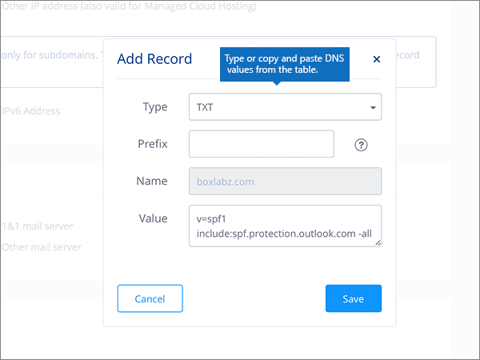

# Creare record DNS a 1&1 IONOS per MicrosoftCreate DNS records at 1&1 IONOS for Microsoft

 Se non si trova ciò che si sta cercando, **[vedere le domande frequenti sui domini](../setup/domains-faq.yml)**.**[Check the Domains FAQ](../setup/domains-faq.yml)** if you don't find what you're looking for. 
  
> [!CAUTION]
> Si noti che 1&1 IONOS non consente a un dominio di avere sia un record MX che un record CNAME di individuazione automatica di primo livello.Note that 1&1 IONOS doesn't allow a domain to have both an MX record and a top-level Autodiscover CNAME record. Ciò limita i modi in cui è possibile configurare Exchange Online per Microsoft.This limits the ways in which you can configure Exchange Online for Microsoft. Esiste una soluzione alternativa, ma  ti consigliamo di impiegarla solo se hai già esperienza con la creazione di sottodomini a 1&1 IONOS.There is a workaround, but we recommend employing it **only** if you already have experience with creating subdomains at 1&1 IONOS. > Se nonostante  questa limitazione del servizio si sceglie di gestire i propri record DNS Microsoft a 1&1 IONOS, seguire la procedura descritta in questo articolo per verificare il dominio e configurare i record DNS per la posta elettronica, Skype for Business online e così via.> If despite this [service limitation](../setup/domains-faq.yml) you choose to manage your own Microsoft DNS records at 1&1 IONOS, follow the steps in this article to verify your domain and to set up DNS records for email, Skype for Business Online, and so on. 
  
Dopo aver aggiunto questi record a 1&1 IONOS, il dominio sarà configurato per l'utilizzo con i servizi Microsoft.After you add these records at 1&1 IONOS, your domain will be set up to work with Microsoft services.
  
  
> [!NOTE]
> In genere, l'applicazione delle modifiche al DNS richiede circa 15 minuti. Tuttavia, a volte può capitare che l'aggiornamento di una modifica nel sistema DNS di Internet richieda più tempo. In caso di problemi con il flusso di posta o di altro tipo dopo l'aggiunta dei record DNS, vedere [Individuare e correggere i problemi dopo l'aggiunta del dominio o dei record DNS](../get-help-with-domains/find-and-fix-issues.md).Typically it takes about 15 minutes for DNS changes to take effect. However, it can occasionally take longer for a change you've made to update across the Internet's DNS system. If you're having trouble with mail flow or other issues after adding DNS records, see [Find and fix issues after adding your domain or DNS records](../get-help-with-domains/find-and-fix-issues.md). 
  
## Aggiungere un record TXT a scopo di verificaAdd a TXT record for verification

Prima di usare il proprio dominio con Microsoft, è necessario dimostrare di esserne il proprietario. La capacità di accedere al proprio account nel registrar e di creare il record DNS dimostra a Microsoft che si è il proprietario del dominio.Before you use your domain with Microsoft, we have to make sure that you own it. Your ability to log in to your account at your domain registrar and create the DNS record proves to Microsoft that you own the domain.
  
> [!NOTE]
> Questo record viene usato esclusivamente per verificare di essere proprietari del dominio e non ha altri effetti. È possibile eliminarlo in un secondo momento, se si preferisce.This record is used only to verify that you own your domain; it doesn't affect anything else. You can delete it later, if you like. 
  
Seguire i passaggi indicati sotto oppure [guardare il video (iniziare da 0:42)]().Follow the steps below or [watch the video (start at 0:42)]().
  
1. To get started, go to your domains page at 1&1 IONOS by using [this link](https://my.1and1.com/).To get started, go to your domains page at 1&1 IONOS by using [this link](https://my.1and1.com/). You'll be prompted to log in.You'll be prompted to log in.
    
2. Selezionare **Gestisci domini**.Select **Manage domains**.
    
3. Nella pagina **Centro dominio** individuare il dominio che si desidera aggiornare e quindi selezionare il controllo **Pannello** ( **v**) per tale dominio.On the **Domain Center** page, find the domain that you want to update, and then select the **Panel** ( **v**) control for that domain.
    
4. Nell'area **Impostazioni dominio** selezionare **Modifica impostazioni DNS.**In the **Domain Settings** area, select **Edit DNS Settings**.
    
5. Nella sezione **TXT and SRV Records** selezionare Add **Record**.In the **TXT and SRV Records** section, select **Add Record**.
    
6. In the **Add Record** area, in the boxes for the new record, type or copy and paste the values from the following table.In the **Add Record** area, in the boxes for the new record, type or copy and paste the values from the following table. 
    
    Selezionare il valore **Type** nell'elenco a discesa.(Choose the **Type** value from the drop-down list.) 
    
    ||||
    |:-----|:-----|:-----|
    |**Type****Type**   |**Prefix****Prefix**   |**Name Value****Name Value**   |
    |TXTTXT    |(Lasciare vuoto questo campo)(Leave this field blank)    |MS=ms *XXXXXXXX*MS=ms *XXXXXXXX*    NOTA: questo è un esempio.NOTE: This is an example. Usare il valore specifico di **Indirizzo di destinazione o puntamento** indicato nella tabella.Use your specific **Destination or Points to Address** value here, from the table. [Come trovarloHow do I find this?](../get-help-with-domains/information-for-dns-records.md)          |
   
7. Selezionare **Salva**.Select **Save**.
    
8. Selezionare **di nuovo Salva.**Select **Save** again. 
    
9. Nella finestra **di dialogo Modifica** impostazioni DNS selezionare **Sì.**In the **Edit DNS Settings** dialog box, select **Yes**.
    
10. Attendere alcuni minuti prima di continuare, in modo che il record appena creato venga aggiornato in Internet.Wait a few minutes before you continue, so that the record you just created can update across the Internet.
    
Una volta aggiunto il record al sito del registrar, è possibile tornare in Microsoft 365 e chiedere di cercarlo.Now that you've added the record at your domain registrar's site, you'll go back to Microsoft 365 and request Microsoft 365 to look for the record.
  
Quando Microsoft trova il record TXT corretto, il dominio è verificato.When Microsoft finds the correct TXT record, your domain is verified.
  
1. Nell'interfaccia di amministrazione di Microsoft, passare alla pagina **Impostazioni** \> <a href="https://go.microsoft.com/fwlink/p/?linkid=834818" target="_blank">Domini</a>.In the Microsoft admin center, go to the **Settings** \> <a href="https://go.microsoft.com/fwlink/p/?linkid=834818" target="_blank">Domains</a> page.

    
2. Nella pagina **Domini** selezionare il dominio da verificare.On the **Domains** page, select the domain that you are verifying. 
    
3. Nella pagina **Configurazione** selezionare **Avvia configurazione**.On the **Setup** page, select **Start setup**.
    
4. Nella pagina **Verifica dominio** selezionare **Verifica**.On the **Verify domain** page, select **Verify**.
    
> [!NOTE]
> In genere, l'applicazione delle modifiche al DNS richiede circa 15 minuti. Tuttavia, a volte può capitare che l'aggiornamento di una modifica nel sistema DNS di Internet richieda più tempo. In caso di problemi con il flusso di posta o di altro tipo dopo l'aggiunta dei record DNS, vedere [Individuare e correggere i problemi dopo l'aggiunta del dominio o dei record DNS](../get-help-with-domains/find-and-fix-issues.md).Typically it takes about 15 minutes for DNS changes to take effect. However, it can occasionally take longer for a change you've made to update across the Internet's DNS system. If you're having trouble with mail flow or other issues after adding DNS records, see [Find and fix issues after adding your domain or DNS records](../get-help-with-domains/find-and-fix-issues.md). 
  
## Aggiungere un record MX in modo che la posta elettronica del dominio venga recapitata in MicrosoftAdd an MX record so email for your domain will come to Microsoft

Seguire i passaggi indicati sotto oppure [guardare il video (iniziare da 3:22)]().Follow the steps below or [watch the video (start at 3:22)]().
  
> [!NOTE]
> Se ti sei registrato con 1und1.de, [accedi qui](https://go.microsoft.com/fwlink/?linkid=859152).If you've registered with 1und1.de, [sign in here](https://go.microsoft.com/fwlink/?linkid=859152). 
  
1. To get started, go to your domains page at 1&1 IONOS by using [this link](https://my.1and1.com/).To get started, go to your domains page at 1&1 IONOS by using [this link](https://my.1and1.com/). You'll be prompted to log in.You'll be prompted to log in.
    
2. Selezionare **Gestisci domini**.Select **Manage domains**.
    
3. Nella pagina **Centro dominio** individuare il dominio che si desidera aggiornare e quindi selezionare il controllo **Pannello** ( **v**) per tale dominio.On the **Domain Center** page, find the domain that you want to update, and then select the **Panel** ( **v**) control for that domain.
    
4. Nell'area **Impostazioni dominio** selezionare **Modifica impostazioni DNS.**In the **Domain Settings** area, select **Edit DNS Settings**.
    
5. Nell'area **Mail Exchanger (MX Record)** della sezione **MX Records** selezionare Other **mail server**.In the **MX Records** section, in the **Mail Exchanger (MX Record)** area, select **Other mail server**. Può essere necessario scorrere la pagina.(You may have to scroll down.)   
  
6. Se sono già presenti record MX, eliminarli selezionandone ognuno e premendo **CANC**.If there are any MX records already listed, delete each of them by selecting the record and then pressing the **Delete** key on your keyboard. Se l'elenco non include record MX, continuare con il passaggio successivo.(If there are no MX records already listed, continue to the next step.)  
  
7. Nelle caselle del record **MX 1** digitare oppure copiare e incollare i valori della tabella seguente.In the boxes for the **MX 1** record, type or copy and paste the values from the following table. 
    
    |**MX 1****MX 1**|**Priority****Priority**|
    |:-----|:-----|
    | *\<domain-key\>*  .mail.protection.outlook.com*\<domain-key\>*  .mail.protection.outlook.com     NOTA: ottieni la tua \<domain-key\> dal tuo account Microsoft.NOTE: Get your \<domain-key\> from your Microsoft account. [Come trovarloHow do I find this?](../get-help-with-domains/information-for-dns-records.md)          |10  10    Per altre informazioni sulla priorità, vedere [Informazioni sulla priorità MX](../setup/domains-faq.yml).For more information about priority, see [What is MX priority?](../setup/domains-faq.yml)   | 
    
     
  
8. Selezionare **Salva**.Select **Save**. Può essere necessario scorrere la pagina.(You may have to scroll down.) 
  
9. Nella finestra **di dialogo Modifica** impostazioni DNS selezionare **Sì.**In the **Edit DNS Settings** dialog box, select **Yes**. 
  
## Aggiungere i sei record CNAME necessari per MicrosoftAdd the six CNAME records that are required for Microsoft

1&1 IONOS richiede una soluzione alternativa in modo da poter utilizzare un record MX insieme ai record CNAME necessari per i servizi di posta elettronica Microsoft.1&1 IONOS requires a workaround so that you can use an MX record together with the CNAME records that are required for Microsoft email services. Questa soluzione alternativa richiede di creare un set di sottodomini a 1&1 IONOS e di assegnarli ai record CNAME.This workaround requires you to create a set of subdomains at 1&1 IONOS, and to assign them to CNAME records.
  
> [!IMPORTANT]
> Assicurarsi di avere almeno due sottodomini disponibili prima di avviare questa procedura.Make sure that you have at least two available subdomains before starting this procedure. Questa soluzione è consigliata solo se si ha già esperienza con la creazione di sottodomini a 1&1 IONOS.We recommend this solution only if you already have experience with creating subdomains at 1&1 IONOS. 
  
### Record CNAME di baseBasic CNAME records

Seguire i passaggi indicati sotto oppure [guardare il video (iniziare da 3:57)]().Follow the steps below or [watch the video (start at 3:57)]().
  
> [!NOTE]
> Se ti sei registrato con 1und1.de, [accedi qui](https://go.microsoft.com/fwlink/?linkid=859152).If you've registered with 1und1.de, [sign in here](https://go.microsoft.com/fwlink/?linkid=859152). 
  
1. To get started, go to your domains page at 1&1 IONOS by using [this link](https://my.1and1.com/).To get started, go to your domains page at 1&1 IONOS by using [this link](https://my.1and1.com/). You'll be prompted to log in.You'll be prompted to log in.
    
2. Selezionare **Gestisci domini**.Select **Manage domains**.
    
3. Nella pagina **Centro dominio** individuare il dominio che si desidera aggiornare e quindi selezionare **Gestisci sottodomini.**On the **Domain Center** page, find the domain that you want to update, and then select **Manage Subdomains**.   Ora creare due sottodomini e impostare un valore **Alias** per ognuno.Now you'll create two subdomains and set an **Alias** value for each. Questa operazione è necessaria perché 1&1 IONOS supporta un solo record CNAME di primo livello, ma Microsoft richiede diversi record CNAME.(This is required because 1&1 IONOS supports only one top-level CNAME record, but Microsoft requires several CNAME records.) Creare prima di tutto il sottodominio di individuazione automatica.First, you'll create the Autodiscover subdomain.
    
4. Nella sezione **Panoramica sottodominio** selezionare **Crea sottodominio.**In the **Subdomain Overview** section, select **Create Subdomain**.
    
    
  
5. Nella casella **Crea sottodominio** del nuovo sottodominio digitare oppure copiare e incollare solo il valore di **Crea sottodominio** dalla tabella seguente. Il valore per **Alias** viene aggiunto in un passaggio successivo.In the **Create Subdomain** box for the new subdomain, type or copy and paste only the **Create Subdomain** value from the following table. (You'll add the **Alias** value in a later step.)

    |**Crea sottodominio****Create Subdomain**|**Alias****Alias**|
    |:-----|:-----|
    |individuazione automaticaautodiscover    |autodiscover.outlook.comautodiscover.outlook.com   | 

    
  
6. Selezionare **Crea sottodominio**.Select **Create Subdomain**. 
  
7. Nella sezione **Panoramica sottodominio** individuare il sottodominio **di** individuazione automatica appena creato e quindi selezionare il controllo **Pannello (v)** per tale sottodominio.In the **Subdomain Overview** section, locate the **autodiscover** subdomain that you just created, and then select the **Panel (v)** control for that subdomain.  
  
8. Nell'area **Impostazioni sottodominio** selezionare **Modifica impostazioni DNS.**In the **Subdomain Settings** area, select **Edit DNS Settings**.  
  
9. Nell'area Indirizzo **IP (A Record)** della sezione Record **A/AAAA (indirizzi IP)** selezionare **CNAME**.In the **A/AAAA Records (IP Addresses)** section, in the **IP address (A Record)** area, select **CNAME**. 
  
10. Nella casella **Alias** digitare o copiare e incollare solo il valore di **Alias** dalla tabella seguente:In the **Alias:** box, type or copy and paste only the **Alias** value from the following table.  
    
    |**Crea sottodominio****Create Subdomain**|**Alias****Alias**|
    |:-----|:-----|
    |individuazione automaticaautodiscover    |autodiscover.outlook.comautodiscover.outlook.com   |

    
  
11. Selezionare la casella di controllo accanto alla dichiarazione di non responsabilità **Sono consapevole**.Select the check box for the **I am aware** disclaimer. 
  
12. Selezionare **Salva**.Select **Save**. 
  
  
### Record CNAME facoltativiAdditional CNAME records

Gli altri record CNAME creati con la procedura seguente abilitano i servizi di Skype for Business online. Sarà necessario eseguire gli stessi passaggi completati per creare i due record CNAME in precedenza.The additional CNAME records created in the following procedure enable Skype for Business Online services. You will employ the same steps that you used to create the two CNAME records you have already created.
  
1. Creare il terzo sottodominio (Lyncdiscover).Create the third subdomain (Lyncdiscover). Nella sezione **Panoramica sottodominio** selezionare **Crea sottodominio.**On the **Subdomain Overview** section, select **Create Subdomain**.
    
2. Nella casella **Crea sottodominio** del nuovo sottodominio digitare o copiare e incollare solo il valore di **Crea sottodominio** dalla tabella seguente. Il valore per **Alias** verrà aggiunto in un passaggio successivo.In the **Create Subdomain** box for the new subdomain, type or copy and paste only the **Create Subdomain** value from the following table. (You'll add the **Alias** value in a later step.)  
    
    |**Crea sottodominio****Create Subdomain**|**Alias****Alias**|
    |:-----|:-----|
    |lyncdiscoverlyncdiscover   |webdir.online.lync.comwebdir.online.lync.com  |
   
3. Selezionare **Crea sottodominio**.Select **Create Subdomain**.
    
4. Nella pagina **Centro dominio** selezionare **Gestisci sottodomini.**On the **Domain Center** page, select **Manage Subdomains**.
    
5. Nella sezione **Panoramica sottodominio** individuare il sottodominio **lyncdiscover** appena creato e quindi selezionare il controllo **Pannello (v)** per tale sottodominio.In the **Subdomain Overview** section, find the **lyncdiscover** subdomain that you just created, and then select the **Panel (v)** control for that subdomain.  Nell'area **Impostazioni sottodominio** selezionare **Modifica impostazioni DNS.**In the **Subdomain Settings** area, select **Edit DNS Settings**.
    
6. Nell'area Indirizzo **IP (A Record)** della sezione Record **A/AAAA (indirizzi IP)** selezionare **CNAME**.In the **A/AAAA Records (IP Addresses)** section, in the **IP address (A Record)** area, select **CNAME**.
    
7. Nella casella **Alias** digitare o copiare e incollare solo il valore di **Alias** dalla tabella seguente:In the **Alias:** box, type or copy and paste only the **Alias** value from the following table.  
    
    |**Crea sottodominio****Create Subdomain**|**Alias****Alias**|
    |:-----|:-----|
    |lyncdiscoverlyncdiscover    |webdir.online.lync.comwebdir.online.lync.com    |
   
8. Selezionare la casella di controllo **per la** dichiarazione di non responsabilità, quindi selezionare **Salva.**Select the check box for the **I am aware** disclaimer, and then select **Save**.
    
9. Nella finestra **di dialogo Modifica** impostazioni DNS selezionare **Sì.**In the **Edit DNS Settings** dialog box, select **Yes**.
    
10. Creare il quarto sottodominio (SIP):Create the fourth subdomain (SIP):  Nella sezione **Panoramica sottodominio** selezionare **Crea sottodominio.**In the **Subdomain Overview** section, select **Create Subdomain**.
    
11. Nella casella **Crea sottodominio** del nuovo sottodominio digitare o copiare e incollare solo il valore di **Crea sottodominio** dalla tabella seguente. Il valore per **Alias** verrà aggiunto in un passaggio successivo.In the **Create Subdomain** box for the new subdomain, type or copy and paste only the **Create Subdomain** value from the following table. (You'll add the **Alias** value in a later step.)  
    
    |**Crea sottodominio****Create Subdomain**|**Alias****Alias**|
    |:-----|:-----|
    |sipsip    |sipdir.online.lync.comsipdir.online.lync.com    |
   
12. Selezionare **Crea sottodominio**.Select **Create Subdomain**.
    
13. Nella pagina **Centro dominio** selezionare **Gestisci sottodomini.**On the **Domain Center** page, select **Manage Subdomains**.
    
14. Nella sezione **Panoramica sottodominio** individuare il sottodominio **sip** appena creato e quindi selezionare il controllo **Pannello (v)** per tale sottodominio.In the **Subdomain Overview** section, find the **sip** subdomain that you just created, and then select the **Panel (v)** control for that subdomain.  Nell'area **Impostazioni sottodominio** selezionare **Modifica impostazioni DNS.**In the **Subdomain Settings** area, select **Edit DNS Settings**.
    
15. Nell'area Indirizzo **IP (A Record)** della sezione Record **A/AAAA (indirizzi IP)** selezionare **CNAME**.In the **A/AAAA Records (IP Addresses)** section, in the **IP address (A Record)** area, select **CNAME**.
    
16. Nella casella **Alias** digitare o copiare e incollare solo il valore di **Alias** dalla tabella seguente:In the **Alias:** box, type or copy and paste only the **Alias** value from the following table. 
    
    |**Crea sottodominio****Create Subdomain**|**Alias****Alias**|
    |:-----|:-----|
    |sipsip    |sipdir.online.lync.comsipdir.online.lync.com    |
   
17. Selezionare la casella di controllo **per la** dichiarazione di non responsabilità, quindi selezionare **Salva.**Select the check box for the **I am aware** disclaimer, and then select **Save**.
    
18. Nella finestra **di dialogo Modifica** impostazioni DNS selezionare **Sì.**In the **Edit DNS Settings** dialog box, select **Yes**.
    
### Record CNAME necessari per MDMCNAME records needed for MDM

> [!IMPORTANT]
> Seguire la procedura usata per gli altri record CNAME, specificando però i valori disponibili nella tabella seguente.Follow the procedure that you used for the other four CNAME records, but supply the values from the following table. 
  
|**Crea sottodominio****Create Subdomain**|**Alias****Alias**|
|:-----|:-----|
|enterpriseregistrationenterpriseregistration    |enterpriseregistration.windows.netenterpriseregistration.windows.net    |
|enterpriseenrollmententerpriseenrollment    |enterpriseenrollment-s.manage.microsoft.comenterpriseenrollment-s.manage.microsoft.com    |
   
## Aggiungere un record TXT per SPF per evitare di ricevere posta indesiderataAdd a TXT record for SPF to help prevent email spam

> [!IMPORTANT]
> Non può essere presente più di un record TXT per SPF per un dominio.You cannot have more than one TXT record for SPF for a domain. Se il dominio ha più record SPF, si verificheranno errori nella gestione della posta elettronica, oltre a problemi di recapito e di classificazione della posta indesiderata.If your domain has more than one SPF record, you'll get email errors, as well as delivery and spam classification issues. Se si dispone già di un record SPF per il dominio, non crearne uno nuovo per Microsoft.If you already have an SPF record for your domain, don't create a new one for Microsoft. Aggiungere invece i valori Microsoft necessari al record corrente in modo da disporre di un singolo record  *SPF*  che include entrambi i set di valori.Instead, add the required Microsoft values to the current record so that you have a  *single*  SPF record that includes both sets of values. Servono esempi?Need examples? Consultare [Record Domain Name System (DNS) esterni per Microsoft](../../enterprise/external-domain-name-system-records.md).Check out these [External Domain Name System records for Microsoft](../../enterprise/external-domain-name-system-records.md). Per convalidare il record SPF, è possibile utilizzare uno di questi[strumenti di convalida SPF.](../setup/domains-faq.yml)To validate your SPF record, you can use one of these[SPF validation tools](../setup/domains-faq.yml). 
  
Seguire i passaggi indicati sotto oppure [guardare il video (iniziare da 5:09)]().Follow the steps below or [watch the video (start at 5:09)]().
  
> [!NOTE]
> Se ti sei registrato con 1und1.de, [accedi qui](https://go.microsoft.com/fwlink/?linkid=859152).If you've registered with 1und1.de, [sign in here](https://go.microsoft.com/fwlink/?linkid=859152). 
  
1. To get started, go to your domains page at 1&1 IONOS by using [this link](https://my.1and1.com/).To get started, go to your domains page at 1&1 IONOS by using [this link](https://my.1and1.com/). You'll be prompted to log in.You'll be prompted to log in.
    
2. Selezionare **Gestisci domini**.Select **Manage domains**.
    
3. Nella pagina **Centro dominio** individuare il dominio che si desidera aggiornare e quindi selezionare il controllo **Pannello** (**v**) per tale dominio.On the **Domain Center** page, find the domain that you want to update, and then select the **Panel** (**v**) control for that domain.
    
4. Nell'area **Impostazioni dominio** selezionare **Modifica impostazioni DNS.**In the **Domain Settings** area, select **Edit DNS Settings**.
    
5. Nella sezione **TXT and SRV Records** selezionare Add **Record**.In the **TXT and SRV Records** section, select **Add Record**.  Può essere necessario scorrere la pagina.(You may have to scroll down.)
    
6. In the **Add Record** area, in the boxes for the new record, type or copy and paste the values from the following table.In the **Add Record** area, in the boxes for the new record, type or copy and paste the values from the following table.  Selezionare il valore **Type** nell'elenco a discesa.(Choose the **Type** value from the drop-down list.)  
    
    |**Type****Type**|**Prefix****Prefix**|**Name Value****Name Value**|
    |:-----|:-----|:-----|
    |TXTTXT    |(Leave this field empty.)(Leave this field empty.)    |v=spf1 include:spf.protection.outlook.com -allv=spf1 include:spf.protection.outlook.com -all    **Nota:** è consigliabile copiare e incollare questa voce, in modo che tutti i caratteri di spaziatura siano corretti.**Note:** We recommend copying and pasting this entry, so that all of the spacing stays correct.           | 
    
    
  
7. Selezionare **Salva**.Select **Save**. 
  
8. Selezionare **Salva**.Select **Save**. 
  
9. Nella finestra **di dialogo Modifica** impostazioni DNS selezionare **Sì.**In the **Edit DNS Settings** dialog box, select **Yes**. 
  
## Aggiungere i due record SRV necessari per MicrosoftAdd the two SRV records that are required for Microsoft

Seguire i passaggi indicati sotto oppure [guardare il video (iniziare da 5:51)]().Follow the steps below or [watch the video (start at 5:51)]().
  
> [!NOTE]
> Se ti sei registrato con 1und1.de, [accedi qui](https://go.microsoft.com/fwlink/?linkid=859152).If you've registered with 1und1.de, [sign in here](https://go.microsoft.com/fwlink/?linkid=859152). 
  
1. To get started, go to your domains page at 1&1 IONOS by using [this link](https://my.1and1.com/).To get started, go to your domains page at 1&1 IONOS by using [this link](https://my.1and1.com/). You'll be prompted to log in.You'll be prompted to log in.
    
2. Selezionare **Gestisci domini**.Select **Manage domains**.
    
3. Nella pagina **Centro dominio** individuare il dominio che si desidera aggiornare e quindi selezionare il controllo **Pannello** ( **v**) per tale dominio.On the **Domain Center** page, find the domain that you want to update, and then select the **Panel** ( **v**) control for that domain.
    
4. Nell'area **Impostazioni dominio** selezionare **Modifica impostazioni DNS.**In the **Domain Settings** area, select **Edit DNS Settings**.
    
5. Nella sezione **TXT and SRV Records** selezionare Add **Record**.In the **TXT and SRV Records** section, select **Add Record**.
    
6. Aggiungere il primo dei due record SRV.Add the first of the two SRV records. Nelle caselle del nuovo record nell'area **Aggiungi record** digitare oppure copiare e incollare i valori della prima riga della tabella seguente.In the **Add Record** area, in the boxes for the new record, type or copy and paste the values from the first row in the following table.  Scegliere i **valori Type** e **TTL** nell'elenco a discesa.(Choose the **Type** and **TTL** values from the drop-down list.) 
    
    |**Tipo****Type**|**Service****Service**|**Protocol****Protocol**|**Name****Name**|**Host****Host**|**Priorità****Priority**|**Peso****Weight**|**Porta****Port**|**TTL****TTL**|
    |:-----|:-----|:-----|:-----|:-----|:-----|:-----|:-----|:-----|
    |SRVSRV    |sipsip    |tlstls    |Lasciare vuoto questo campo.(Leave this field empty.)    |sipdir.online.lync.comsipdir.online.lync.com    |100100    |11    |443443    |3600 (1 ora)3600 (1 h)    |
    |SRVSRV    |sipfederationtlssipfederationtls    |tcptcp    |Lasciare vuoto questo campo.(Leave this field empty.)    |sipfed.online.lync.comsipfed.online.lync.com    |100100    |11    |50615061    |3600 (1 ora)3600 (1 h)    |  
    
    
  
7. Selezionare **Salva**.Select **Save**.  
  
8. Selezionare **Salva**.Select **Save**.  
  
9. Nella finestra **di dialogo Modifica** impostazioni DNS selezionare **Sì.**In the **Edit DNS Settings** dialog box, select **Yes**.  
  
10. Aggiungere l'altro record SRV.Add the other SRV record.  Nella sezione **TXT and SRV Records** selezionare Add **Record**.In the **TXT and SRV Records** section, select **Add Record**.  Nell'area **Aggiungi record** creare un record utilizzando i valori dell'altra riga della tabella e quindi selezionare di nuovo **Aggiungi,** **Salva** e **Sì** per completare il record.In the **Add Record** area, create a record using the values from the other row in the table, and then again select **Add**, **Save**, and **Yes** to complete the record. 
    
> [!NOTE]
> In genere, l'applicazione delle modifiche al DNS richiede circa 15 minuti. Tuttavia, a volte può capitare che l'aggiornamento di una modifica nel sistema DNS di Internet richieda più tempo. In caso di problemi con il flusso di posta o di altro tipo dopo l'aggiunta dei record DNS, vedere [Individuare e correggere i problemi dopo l'aggiunta del dominio o dei record DNS](../get-help-with-domains/find-and-fix-issues.md).Typically it takes about 15 minutes for DNS changes to take effect. However, it can occasionally take longer for a change you've made to update across the Internet's DNS system. If you're having trouble with mail flow or other issues after adding DNS records, see [Find and fix issues after adding your domain or DNS records](../get-help-with-domains/find-and-fix-issues.md). 
