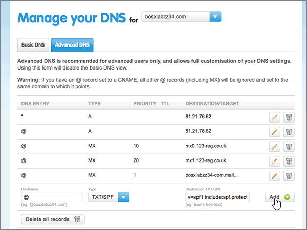
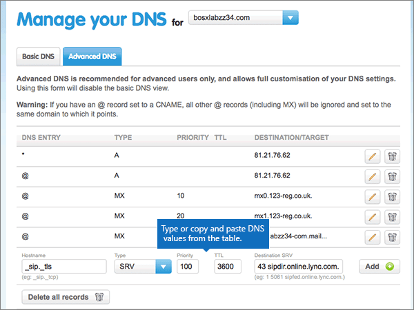

# Creare record DNS in 123-reg.co.uk per MicrosoftCreate DNS records at 123-reg.co.uk for Microsoft

 **Se non si trova ciò che si sta cercando, [vedere le domande frequenti sui domini](../setup/domains-faq.md)**.**[Check the Domains FAQ](../setup/domains-faq.md)** if you don't find what you're looking for. 
  
Se il provider di hosting DNS è 123-reg.co.uk, seguire i passaggi di questo articolo per verificare il dominio e configurare i record DNS per posta elettronica, Skype for Business online e così via.If 123-reg.co.uk is your DNS hosting provider, follow the steps in this article to verify your domain and set up DNS records for email, Skype for Business Online, and so on.
  
Dopo aver aggiunto questi record in 123-reg.co.uk, il dominio sarà configurato per l'uso con i servizi Microsoft.After you add these records at 123-reg.co.uk, your domain will be set up to work with Microsoft services.
  
Per ulteriori informazioni su Webhosting e DNS per i siti Web con Microsoft, vedere [utilizzare un sito Web pubblico con Microsoft](https://support.office.com/article/choose-a-public-website-3325d50e-d131-403c-a278-7f3296fe33a9).To learn about webhosting and DNS for websites with Microsoft, see [Use a public website with Microsoft](https://support.office.com/article/choose-a-public-website-3325d50e-d131-403c-a278-7f3296fe33a9).
  
> [!NOTE]
> Typically it takes about 15 minutes for DNS changes to take effect.Typically it takes about 15 minutes for DNS changes to take effect. However, it can occasionally take longer for a change you've made to update across the Internet's DNS system.However, it can occasionally take longer for a change you've made to update across the Internet's DNS system. In caso di problemi con il flusso di posta o altri problemi dopo l'aggiunta di record DNS, vedere [individuare e correggere i problemi dopo l'aggiunta del dominio o dei record DNS](../get-help-with-domains/find-and-fix-issues.md).If you're having trouble with mail flow or other issues after adding DNS records, see [Find and fix issues after adding your domain or DNS records](../get-help-with-domains/find-and-fix-issues.md). 
  
## Aggiungere un record TXT a scopo di verificaAdd a TXT record for verification

Prima di utilizzare il dominio con Microsoft, è necessario assicurarsi di possederlo.Before you use your domain with Microsoft, we have to make sure that you own it. La possibilità di eseguire l'accesso al proprio account presso il registrar e di creare il record DNS dimostra a Microsoft che si è proprietari del dominio.Your ability to log in to your account at your domain registrar and create the DNS record proves to Microsoft that you own the domain.
  
> [!NOTE]
> Questo record viene usato esclusivamente per verificare di essere proprietari del dominio e non ha altri effetti. È possibile eliminarlo in un secondo momento, se si preferisce.This record is used only to verify that you own your domain; it doesn't affect anything else. You can delete it later, if you like. 
  
1. Per iniziare, passare alla propria pagina dei domini su 123-reg.co.uk usando [questo collegamento](https://www.123-reg.co.uk/secure/cpanel/domain/overview). Verrà richiesto di eseguire l'accesso.To get started, go to your domains page at 123-reg.co.uk by using [this link](https://www.123-reg.co.uk/secure/cpanel/domain/overview). You'll be prompted to log in first.
    
2. On the **Domain name overview** page, select the name of the domain that you want to edit.On the **Domain name overview** page, select the name of the domain that you want to edit. 
    
3. Choose **DNS** from the **Select action** drop-down list.Choose **DNS** from the **Select action** drop-down list. 
    
4. Nella pagina **Gestisci il DNS** selezionare la scheda **DNS avanzata** .On the **Manage your DNS** page, select the **Advanced DNS** tab. 
    
5. In the **Advanced DNS** section, in the boxes for the new record, type or copy and paste the values from the following table.In the **Advanced DNS** section, in the boxes for the new record, type or copy and paste the values from the following table. 
    
    (Choose the **Type** value from the drop-down list.)(Choose the **Type** value from the drop-down list.) 
    
    ||||
    |:-----|:-----|:-----|
    |**Hostname****Hostname**   |**Type****Type**   |**Destination TXT/SPF****Destination TXT/SPF**   |
    |@    |TXT/SPFTXT/SPF    |MS=ms *XXXXXXXX*MS=ms *XXXXXXXX*    **Note:** questo è un esempio.**Note:** This is an example. Utilizzare il valore **di indirizzo di destinazione o puntamento** specifico qui, dalla tabella.Use your specific **Destination or Points to Address** value here, from the table. [Come trovarloHow do I find this?](../get-help-with-domains/information-for-dns-records.md)          |
   
6. Selezionare **Aggiungi**.Select **Add**.
    
7. Attendere alcuni minuti prima di continuare, in modo che il record appena creato venga aggiornato in Internet.Wait a few minutes before you continue, so that the record you just created can update across the Internet.
    
Dopo aver aggiunto il record al sito del registrar, è possibile tornare a Microsoft e richiedere una ricerca per il record.Now that you've added the record at your domain registrar's site, you'll go back to Microsoft and request a search for the record.
  
Quando Microsoft trova il record TXT corretto, il dominio è verificato.When Microsoft finds the correct TXT record, your domain is verified.
  
1. Nell'interfaccia di amministrazione di Microsoft, andare alla pagina <a href="https://go.microsoft.com/fwlink/p/?linkid=834818" target="_blank">Domains</a> **Settings** \> .In the Microsoft admin center, go to the **Settings** \> <a href="https://go.microsoft.com/fwlink/p/?linkid=834818" target="_blank">Domains</a> page.

    
2. Nella pagina **Domini** selezionare il dominio da verificare.On the **Domains** page, select the domain that you are verifying. 
    
3. Nella pagina **Configurazione** selezionare **Avvia configurazione**.On the **Setup** page, select **Start setup**.
    
4. Nella pagina **Verifica dominio** selezionare **Verifica**.On the **Verify domain** page, select **Verify**.
    
> [!NOTE]
> Typically it takes about 15 minutes for DNS changes to take effect.Typically it takes about 15 minutes for DNS changes to take effect. However, it can occasionally take longer for a change you've made to update across the Internet's DNS system.However, it can occasionally take longer for a change you've made to update across the Internet's DNS system. In caso di problemi con il flusso di posta o altri problemi dopo l'aggiunta di record DNS, vedere [individuare e correggere i problemi dopo l'aggiunta del dominio o dei record DNS](../get-help-with-domains/find-and-fix-issues.md).If you're having trouble with mail flow or other issues after adding DNS records, see [Find and fix issues after adding your domain or DNS records](../get-help-with-domains/find-and-fix-issues.md). 
  
## Aggiungere un record MX in modo che la posta elettronica per il dominio venga a MicrosoftAdd an MX record so email for your domain will come to Microsoft

1. Per iniziare, passare alla propria pagina dei domini su 123-reg.co.uk usando [questo collegamento](https://www.123-reg.co.uk/secure/cpanel/domain/overview).To get started, go to your domains page at 123-reg.co.uk by using [this link](https://www.123-reg.co.uk/secure/cpanel/domain/overview). Verrà richiesto di eseguire l'accesso.You'll be prompted to log in first.
    
2. On the **Domain name overview** page, select the name of the domain that you want to edit.On the **Domain name overview** page, select the name of the domain that you want to edit. 
    
3. Choose **DNS** from the **Select action** drop-down list.Choose **DNS** from the **Select action** drop-down list. 
    
4. Nella pagina **Gestisci il DNS** selezionare la scheda **DNS avanzata** .On the **Manage your DNS** page, select the **Advanced DNS** tab. 
    
5. In the **Advanced DNS** section, in the boxes for the new record, type or copy and paste the values from the following table.In the **Advanced DNS** section, in the boxes for the new record, type or copy and paste the values from the following table. 
    
    (Choose the **Type** value from the drop-down list.)(Choose the **Type** value from the drop-down list.) 
    
    |**Hostname****Hostname**|**Type****Type**|**Priority****Priority**|**Destination MX****Destination MX**|
    |:-----|:-----|:-----|:-----|
    |@    |MXMX    |1 1    Per altre informazioni sulla priorità, vedere [Informazioni sulla priorità MX](https://support.office.com/article/2784cc4d-95be-443d-b5f7-bb5dd867ba83.aspx).For more information about priority, see [What is MX priority?](https://support.office.com/article/2784cc4d-95be-443d-b5f7-bb5dd867ba83.aspx)   | *\<chiave-dominio\>*  .mail.protection.outlook.com.*\<domain-key\>*  .mail.protection.outlook.com.    **This value MUST end with a period (.)****This value MUST end with a period (.)**   **Nota:** Ottenere la \<propria chiave\> di dominio dal proprio account Microsoft.**Note:** Get your \<domain-key\> from your Microsoft account. [Come trovarloHow do I find this?](../get-help-with-domains/information-for-dns-records.md)          |
   
    
  
6. Selezionare **Aggiungi**.Select **Add**.
    
    
  
7. If there are any other MX records, remove each one by choosing the **Delete (trash can)** icon for that record.If there are any other MX records, remove each one by choosing the **Delete (trash can)** icon for that record. 
    
    
  
## Aggiungere i sei record CNAME necessari per MicrosoftAdd the six CNAME records that are required for Microsoft

1. Per iniziare, passare alla propria pagina dei domini su 123-reg.co.uk usando [questo collegamento](https://www.123-reg.co.uk/secure/cpanel/domain/overview).To get started, go to your domains page at 123-reg.co.uk by using [this link](https://www.123-reg.co.uk/secure/cpanel/domain/overview). Verrà richiesto di eseguire l'accesso.You'll be prompted to log in first.
    
2. On the **Domain name overview** page, select the name of the domain that you want to edit.On the **Domain name overview** page, select the name of the domain that you want to edit. 
    
3. Choose **DNS** from the **Select action** drop-down list.Choose **DNS** from the **Select action** drop-down list. 
    
4. Nella pagina **Gestisci il DNS** selezionare la scheda **DNS avanzata** .On the **Manage your DNS** page, select the **Advanced DNS** tab. 
    
5. Aggiungere il primo dei sei record CNAME.Add the first of the six CNAME records.
    
    In the **Advanced DNS** section, in the boxes for the new record, type or copy and paste the values from the following table.In the **Advanced DNS** section, in the boxes for the new record, type or copy and paste the values from the following table. 
    
    (Choose the **Type** value from the drop-down list.)(Choose the **Type** value from the drop-down list.) 
    
    |**Hostname****Hostname**|**Type****Type**|**Destination CNAME****Destination CNAME**|
    |:-----|:-----|:-----|
    |autodiscoverautodiscover    |CNAMECNAME    |autodiscover.outlook.com.autodiscover.outlook.com.    **This value MUST end with a period (.)****This value MUST end with a period (.)**   |
    |sipsip    |CNAMECNAME    |sipdir.online.lync.com.sipdir.online.lync.com.    **This value MUST end with a period (.)****This value MUST end with a period (.)**   |
    |lyncdiscoverlyncdiscover    |CNAMECNAME    |webdir.online.lync.com.webdir.online.lync.com.    **This value MUST end with a period (.)****This value MUST end with a period (.)**   |
    |enterpriseregistrationenterpriseregistration    |CNAMECNAME    |enterpriseregistration.windows.net.enterpriseregistration.windows.net.    **Questo valore DEVE terminare con un punto (.)****This value MUST end with a period (.)**   |
    |enterpriseenrollmententerpriseenrollment    |CNAMECNAME    |enterpriseenrollment-s.manage.microsoft.com.enterpriseenrollment-s.manage.microsoft.com.    **Questo valore DEVE terminare con un punto (.)****This value MUST end with a period (.)**   |
   
    
  
6. Selezionare **Aggiungi**.Select **Add**.
    
    
  
7. Aggiungere gli altri cinque record CNAME.Add the other five CNAME records.
    
    Nella sezione **Advanced DNS** creare un record usando i valori della riga successiva della tabella e quindi selezionare di nuovo **Add** per completare il record.In the **Advanced DNS** section, create a record using the values from the next row in the table, and then again select **Add** to complete that record. 
    
    Ripetere questa procedura fino a creare tutti e sei i record CNAME.Repeat this process until you have created all six CNAME records.
    
## Aggiungere un record TXT per SPF per evitare di ricevere posta indesiderataAdd a TXT record for SPF to help prevent email spam

> [!IMPORTANT]
> Non può essere presente più di un record TXT per SPF per un dominio.You cannot have more than one TXT record for SPF for a domain. Se il dominio ha più record SPF, si verificheranno errori nella gestione della posta elettronica, oltre a problemi di recapito e di classificazione della posta indesiderata.If your domain has more than one SPF record, you'll get email errors, as well as delivery and spam classification issues. Se si dispone già di un record SPF per il dominio, non crearne uno nuovo per Microsfot.If you already have an SPF record for your domain, don't create a new one for Microsfot. Al contrario, aggiungere i valori Microsoft necessari al record corrente in modo da disporre di un *singolo* record SPF che includa entrambi i set di valori.Instead, add the required Microsoft values to the current record so that you have a  *single*  SPF record that includes both sets of values. Servono esempi?Need examples? Estrarre questi [record di sistema per il nome di dominio esterno per Microsoft](https://support.office.com/article/c0531a6f-9e25-4f2d-ad0e-a70bfef09ac0#bkmk_spfrecords).Check out these [External Domain Name System records for Microsoft](https://support.office.com/article/c0531a6f-9e25-4f2d-ad0e-a70bfef09ac0#bkmk_spfrecords). To validate your SPF record, you can use one of these [SPF validation tools](../setup/domains-faq.md).To validate your SPF record, you can use one of these [SPF validation tools](../setup/domains-faq.md). 
  
1. Per iniziare, passare alla propria pagina dei domini su 123-reg.co.uk usando [questo collegamento](https://www.123-reg.co.uk/secure/cpanel/domain/overview).To get started, go to your domains page at 123-reg.co.uk by using [this link](https://www.123-reg.co.uk/secure/cpanel/domain/overview). Verrà richiesto di eseguire l'accesso.You'll be prompted to log in first.
    
2. On the **Domain name overview** page, select the name of the domain that you want to edit.On the **Domain name overview** page, select the name of the domain that you want to edit. 
    
3. Choose **DNS** from the **Select action** drop-down list.Choose **DNS** from the **Select action** drop-down list. 
    
4. Nella pagina **Gestisci il DNS** selezionare la scheda **DNS avanzata** .On the **Manage your DNS** page, select the **Advanced DNS** tab. 
    
5. In the **Advanced DNS** section, in the boxes for the new record, type or copy and paste the values from the following table.In the **Advanced DNS** section, in the boxes for the new record, type or copy and paste the values from the following table. 
    
    (Choose the **Type** value from the drop-down list.)(Choose the **Type** value from the drop-down list.) 
    
    |**Hostname****Hostname**|**Type****Type**|**Destination TXT/SPF****Destination TXT/SPF**|
    |:-----|:-----|:-----|
    |@    |TXT/SPFTXT/SPF    |v=spf1 include:spf.protection.outlook.com -allv=spf1 include:spf.protection.outlook.com -all    **Nota:** è consigliabile copiare e incollare questa voce, in modo che tutti i caratteri di spaziatura siano corretti.**Note:** We recommend copying and pasting this entry, so that all of the spacing stays correct.           |
   
    
  
6. Selezionare **Aggiungi**.Select **Add**.
    
    
  
## Aggiungere i due record SRV necessari per MicrosoftAdd the two SRV records that are required for Microsoft

1. Per iniziare, passare alla propria pagina dei domini su 123-reg.co.uk usando [questo collegamento](https://www.123-reg.co.uk/secure/cpanel/domain/overview).To get started, go to your domains page at 123-reg.co.uk by using [this link](https://www.123-reg.co.uk/secure/cpanel/domain/overview). Verrà richiesto di eseguire l'accesso.You'll be prompted to log in first.
    
2. On the **Domain name overview** page, select the name of the domain that you want to edit.On the **Domain name overview** page, select the name of the domain that you want to edit. 
    
3. Choose **DNS** from the **Select action** drop-down list.Choose **DNS** from the **Select action** drop-down list. 
    
4. Nella pagina **Gestisci il DNS** selezionare la scheda **DNS avanzata** .On the **Manage your DNS** page, select the **Advanced DNS** tab. 
    
5. Aggiungere il primo dei due record SRV:Add the first of the two SRV records:
    
    In the **Advanced DNS** section, in the boxes for the new record, type or copy and paste the values from the following table.In the **Advanced DNS** section, in the boxes for the new record, type or copy and paste the values from the following table. 
    
    (Choose the **Type** value from the drop-down list.)(Choose the **Type** value from the drop-down list.) 
    
    ||||||
    |:-----|:-----|:-----|:-----|:-----|
    |HostnameHostname|TypeType|PriorityPriority|TTLTTL|Destination SRVDestination SRV|
    |_sip. _tls_sip._tls|SRVSRV|100100|36003600|1 443 sipdir.online.lync.com.1 443 sipdir.online.lync.com. **This value MUST end with a period (.)****This value MUST end with a period (.)**  **Nota:** è consigliabile copiare e incollare questa voce, in modo che tutti i caratteri di spaziatura siano corretti.**Note:** We recommend copying and pasting this entry, so that all of the spacing stays correct.           |
    |_sipfederationtls. _tcp_sipfederationtls._tcp|SRVSRV|100100|36003600|1 5061 sipfed.online.lync.com.1 5061 sipfed.online.lync.com. **This value MUST end with a period (.)****This value MUST end with a period (.)**   **Nota:** è consigliabile copiare e incollare questa voce, in modo che tutti i caratteri di spaziatura siano corretti.**Note:** We recommend copying and pasting this entry, so that all of the spacing stays correct.           |
   
    
  
6. Selezionare **Aggiungi**.Select **Add**.
    
    
  
7. Per aggiungere l'altro record SRV:To add the other SRV record:
    
    Nella sezione **Advanced DNS** creare un record usando i valori della seconda riga della tabella e quindi fare di nuovo clic su **Aggiungi** per completare il record.In the **Advanced DNS** section, create a record by using the values from the second row in the table, and then again select **Add** to complete that record. 
    
> [!NOTE]
> Typically it takes about 15 minutes for DNS changes to take effect.Typically it takes about 15 minutes for DNS changes to take effect. However, it can occasionally take longer for a change you've made to update across the Internet's DNS system.However, it can occasionally take longer for a change you've made to update across the Internet's DNS system. In caso di problemi con il flusso di posta o altri problemi dopo l'aggiunta di record DNS, vedere [individuare e correggere i problemi dopo l'aggiunta del dominio o dei record DNS](../get-help-with-domains/find-and-fix-issues.md).If you're having trouble with mail flow or other issues after adding DNS records, see [Find and fix issues after adding your domain or DNS records](../get-help-with-domains/find-and-fix-issues.md). 
  
