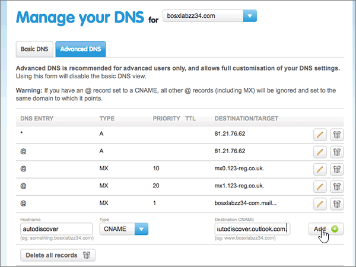

# Creare record DNS in 123-reg.co.uk per Microsoft

 **Se non si trova ciò che si sta cercando, [vedere le domande frequenti sui domini](../setup/domains-faq.yml)**. 
  
Se il provider di hosting DNS è 123-reg.co.uk, seguire i passaggi di questo articolo per verificare il dominio e configurare i record DNS per posta elettronica, Skype for Business online e così via.
  
Dopo aver aggiunto questi record in 123-reg.co.uk, il dominio sarà configurato per l'utilizzo con i servizi Microsoft.
  
  
> [!NOTE]
> In genere, l'applicazione delle modifiche al DNS richiede circa 15 minuti. Tuttavia, a volte può capitare che l'aggiornamento di una modifica nel sistema DNS di Internet richieda più tempo. In caso di problemi con il flusso di posta o di altro tipo dopo l'aggiunta dei record DNS, vedere [Individuare e correggere i problemi dopo l'aggiunta del dominio o dei record DNS](../get-help-with-domains/find-and-fix-issues.md). 
  
## Aggiungere un record TXT a scopo di verifica

Prima di usare il proprio dominio con Microsoft, è necessario dimostrare di esserne il proprietario. La capacità di accedere al proprio account nel registrar e di creare il record DNS dimostra a Microsoft che si è il proprietario del dominio.
  
> [!NOTE]
> Questo record viene usato esclusivamente per verificare di essere proprietari del dominio e non ha altri effetti. È possibile eliminarlo in un secondo momento, se si preferisce. 
  
1. Per iniziare, passare alla propria pagina dei domini su 123-reg.co.uk usando [questo collegamento](https://www.123-reg.co.uk/secure/cpanel/domain/overview). Verrà richiesto di eseguire l'accesso.
    
2. On the **Domain name overview** page, select the name of the domain that you want to edit. 
    
3. Choose **DNS** from the **Select action** drop-down list. 
    
4. Nella pagina **Manage your DNS** selezionare la scheda Advanced **DNS.** 
    
5. In the **Advanced DNS** section, in the boxes for the new record, type or copy and paste the values from the following table. 
    
    (Choose the **Type** value from the drop-down list.) 
    
    ||||
    |:-----|:-----|:-----|
    |**Hostname**   |**Type**   |**Destination TXT/SPF**   |
    |@    |TXT/SPF    |MS=ms *XXXXXXXX*    **Note:** questo è un esempio. Usare il valore specifico di **Indirizzo di destinazione o puntamento** indicato nella tabella. [Come trovarlo](../get-help-with-domains/information-for-dns-records.md)          |
   
6. Selezionare **Aggiungi**.
    
7. Attendere alcuni minuti prima di continuare, in modo che il record appena creato venga aggiornato in Internet.
    
Dopo aver aggiunto il record nel sito del registrar, si torna a Microsoft e si richiede una ricerca per il record.
  
Quando Microsoft trova il record TXT corretto, il dominio è verificato.
  
1. Nell'interfaccia di amministrazione di Microsoft, passare alla pagina **Impostazioni** \> <a href="https://go.microsoft.com/fwlink/p/?linkid=834818" target="_blank">Domini</a>.

    
2. Nella pagina **Domini** selezionare il dominio da verificare. 
    
3. Nella pagina **Configurazione** selezionare **Avvia configurazione**.
    
4. Nella pagina **Verifica dominio** selezionare **Verifica**.
    
> [!NOTE]
> In genere, l'applicazione delle modifiche al DNS richiede circa 15 minuti. Tuttavia, a volte può capitare che l'aggiornamento di una modifica nel sistema DNS di Internet richieda più tempo. In caso di problemi con il flusso di posta o di altro tipo dopo l'aggiunta dei record DNS, vedere [Individuare e correggere i problemi dopo l'aggiunta del dominio o dei record DNS](../get-help-with-domains/find-and-fix-issues.md). 
  
## Aggiungere un record MX in modo che la posta elettronica del dominio venga recapitata in Microsoft

1. Per iniziare, passare alla propria pagina dei domini su 123-reg.co.uk usando [questo collegamento](https://www.123-reg.co.uk/secure/cpanel/domain/overview). Verrà richiesto di eseguire l'accesso.
    
2. On the **Domain name overview** page, select the name of the domain that you want to edit. 
    
3. Choose **DNS** from the **Select action** drop-down list. 
    
4. Nella pagina **Manage your DNS** selezionare la scheda Advanced **DNS.** 
    
5. In the **Advanced DNS** section, in the boxes for the new record, type or copy and paste the values from the following table. 
    
    (Choose the **Type** value from the drop-down list.) 
    
    |**Hostname**|**Type**|**Priority**|**Destination MX**|
    |:-----|:-----|:-----|:-----|
    |@    |MX    |1    Per altre informazioni sulla priorità, vedere [Informazioni sulla priorità MX](../setup/domains-faq.yml).   | *\<domain-key\>*  .mail.protection.outlook.com.    **Questo valore DEVE terminare con un punto (.)**   **Nota:** ottenere il valore \<domain-key\> dal proprio account Microsoft. [Come trovarlo](../get-help-with-domains/information-for-dns-records.md)          |
   
    
  
6. Selezionare **Aggiungi**.
    
    
  
7. If there are any other MX records, remove each one by choosing the **Delete (trash can)** icon for that record. 
    
    
  
## Aggiungere i cinque record CNAME necessari per Microsoft

1. Per iniziare, passare alla propria pagina dei domini su 123-reg.co.uk usando [questo collegamento](https://www.123-reg.co.uk/secure/cpanel/domain/overview). Verrà richiesto di eseguire l'accesso.
    
2. On the **Domain name overview** page, select the name of the domain that you want to edit. 
    
3. Choose **DNS** from the **Select action** drop-down list. 
    
4. Nella pagina **Manage your DNS** selezionare la scheda Advanced **DNS.** 
    
5. Aggiungere il primo dei cinque record CNAME.
    
    In the **Advanced DNS** section, in the boxes for the new record, type or copy and paste the values from the following table. 
    
    (Choose the **Type** value from the drop-down list.) 
    
    |**Hostname**|**Type**|**Destination CNAME**|
    |:-----|:-----|:-----|
    |individuazione automatica    |CNAME    |autodiscover.outlook.com.    **Questo valore DEVE terminare con un punto (.)**   |
    |sip    |CNAME    |sipdir.online.lync.com.    **Questo valore DEVE terminare con un punto (.)**   |
    |lyncdiscover    |CNAME    |webdir.online.lync.com.    **Questo valore DEVE terminare con un punto (.)**   |
    |enterpriseregistration    |CNAME    |enterpriseregistration.windows.net.    **Questo valore DEVE terminare con un punto (.)**   |
    |enterpriseenrollment    |CNAME    |enterpriseenrollment-s.manage.microsoft.com.    **Questo valore DEVE terminare con un punto (.)**   |
   
    
  
6. Selezionare **Aggiungi**.
    
    
  
7. Aggiungere gli altri quattro record CNAME.
    
    Nella sezione **Advanced DNS** creare un record utilizzando i valori della riga successiva della tabella e quindi selezionare di nuovo **Add** per completare il record. 
    
    Ripetere questo processo finché non sono stati creati tutti e cinque i record CNAME.
    
## Aggiungere un record TXT per SPF per evitare di ricevere posta indesiderata

> [!IMPORTANT]
> Non può essere presente più di un record TXT per SPF per un dominio. Se il dominio ha più record SPF, si verificheranno errori nella gestione della posta elettronica, oltre a problemi di recapito e di classificazione della posta indesiderata. Se si dispone già di un record SPF per il dominio, non crearne uno nuovo per Microsoft. Aggiungere invece i valori Microsoft necessari al record corrente in modo da disporre di un singolo record  *SPF*  che include entrambi i set di valori. Servono esempi? Consultare [Record Domain Name System (DNS) esterni per Microsoft](../../enterprise/external-domain-name-system-records.md#external-dns-records-required-for-spf). To validate your SPF record, you can use one of these [SPF validation tools](../setup/domains-faq.yml). 
  
1. Per iniziare, passare alla propria pagina dei domini su 123-reg.co.uk usando [questo collegamento](https://www.123-reg.co.uk/secure/cpanel/domain/overview). Verrà richiesto di eseguire l'accesso.
    
2. On the **Domain name overview** page, select the name of the domain that you want to edit. 
    
3. Choose **DNS** from the **Select action** drop-down list. 
    
4. Nella pagina **Manage your DNS** selezionare la scheda Advanced **DNS.** 
    
5. In the **Advanced DNS** section, in the boxes for the new record, type or copy and paste the values from the following table. 
    
    (Choose the **Type** value from the drop-down list.) 
    
    |**Hostname**|**Type**|**Destination TXT/SPF**|
    |:-----|:-----|:-----|
    |@    |TXT/SPF    |v=spf1 include:spf.protection.outlook.com -all    **Nota:** è consigliabile copiare e incollare questa voce, in modo che tutti i caratteri di spaziatura siano corretti.           |
   
    
  
6. Selezionare **Aggiungi**.
    
    
  
## Aggiungere i due record SRV necessari per Microsoft

1. Per iniziare, passare alla propria pagina dei domini su 123-reg.co.uk usando [questo collegamento](https://www.123-reg.co.uk/secure/cpanel/domain/overview). Verrà richiesto di eseguire l'accesso.
    
2. On the **Domain name overview** page, select the name of the domain that you want to edit. 
    
3. Choose **DNS** from the **Select action** drop-down list. 
    
4. Nella pagina **Manage your DNS** selezionare la scheda Advanced **DNS.** 
    
5. Aggiungere il primo dei due record SRV:
    
    In the **Advanced DNS** section, in the boxes for the new record, type or copy and paste the values from the following table. 
    
    (Choose the **Type** value from the drop-down list.) 
    
    ||||||
    |:-----|:-----|:-----|:-----|:-----|
    |Hostname|Type|Priority|TTL|Destination SRV|
    |_sip._tls|SRV|100|3600|1 443 sipdir.online.lync.com. **Questo valore DEVE terminare con un punto (.)**  **Nota:** è consigliabile copiare e incollare questa voce, in modo che tutti i caratteri di spaziatura siano corretti.           |
    |_sipfederationtls._tcp|SRV|100|3600|1 5061 sipfed.online.lync.com. **Questo valore DEVE terminare con un punto (.)**   **Nota:** è consigliabile copiare e incollare questa voce, in modo che tutti i caratteri di spaziatura siano corretti.           |
   
    
  
6. Selezionare **Aggiungi**.
    
    
  
7. Per aggiungere l'altro record SRV:
    
    Nella sezione **Advanced DNS** creare un record utilizzando i valori della seconda riga della tabella e quindi selezionare di nuovo **Add** per completare il record. 
    
> [!NOTE]
> In genere, l'applicazione delle modifiche al DNS richiede circa 15 minuti. Tuttavia, a volte può capitare che l'aggiornamento di una modifica nel sistema DNS di Internet richieda più tempo. In caso di problemi con il flusso di posta o di altro tipo dopo l'aggiunta dei record DNS, vedere [Individuare e correggere i problemi dopo l'aggiunta del dominio o dei record DNS](../get-help-with-domains/find-and-fix-issues.md). 
