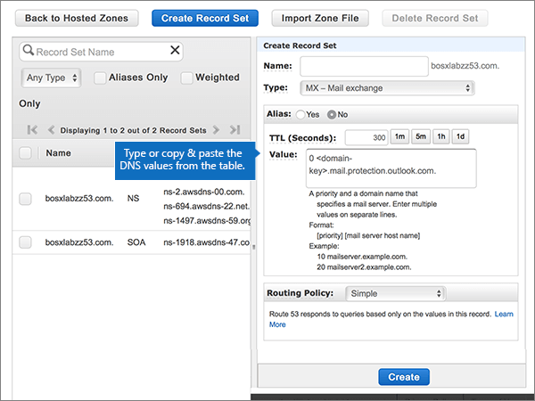
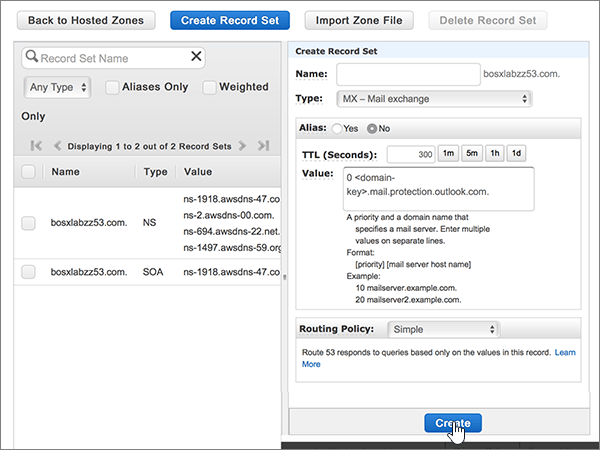
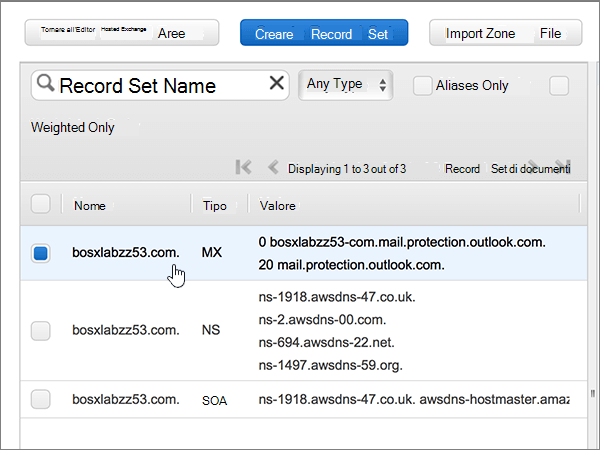
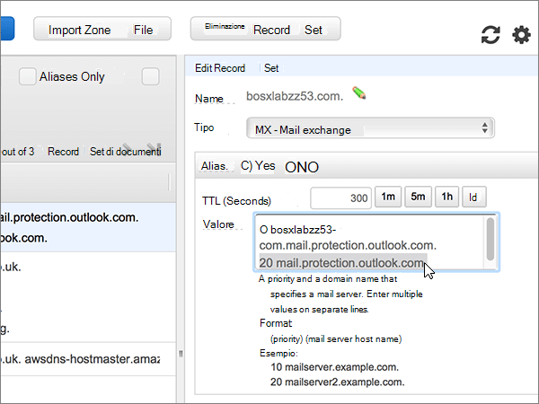
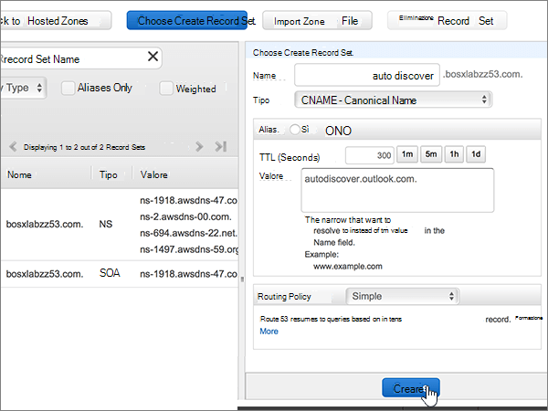
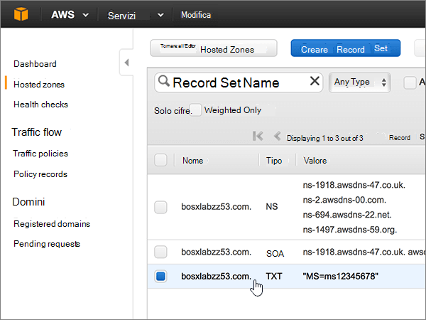
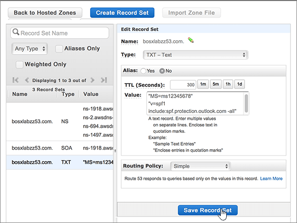
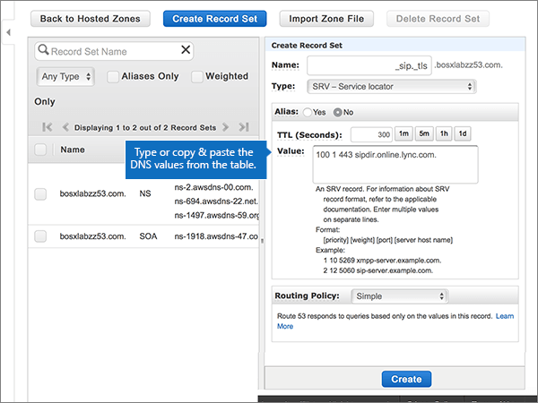
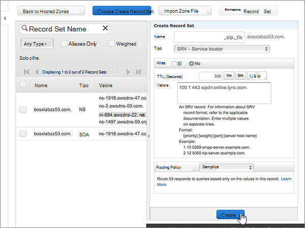

# Creare record DNS in Amazon Web Services (AWS) per Office 365

 Se non si trova ciò che si sta cercando, **[vedere le domande frequenti sui domini](../setup/domains-faq.md)**. 
  
Se AWS è il provider di hosting DNS, seguire la procedura descritta in questo articolo per verificare il dominio e configurare i record DNS per la posta elettronica, Skype online per le aziende e così via.
  
Dopo aver aggiunto questi record in AWS, il domino sarà configurato per l'uso con i servizi di Office 365.
  
Per informazioni su hosting Web e DNS per i siti Web con Office 365, vedere [Usare un sito Web pubblico con Office 365](https://support.office.com/article/choose-a-public-website-3325d50e-d131-403c-a278-7f3296fe33a9).
  
> [!NOTE]
> In genere l'applicazione delle modifiche al DNS richiede circa 15 minuti. A volte può tuttavia capitare che l'aggiornamento di una modifica nel sistema DNS di Internet richieda più tempo. In caso di problemi con il flusso di posta o di altro tipo dopo l'aggiunta dei record DNS, vedere [Individuare e correggere i problemi dopo l'aggiunta del dominio o dei record DNS in Office 365](../get-help-with-domains/find-and-fix-issues.md). 
  
## Aggiungere un record TXT a scopo di verifica

Prima di usare il proprio dominio con Office 365, è necessario dimostrare di esserne proprietari. La capacità di accedere al proprio account nel registrar e di creare il record DNS dimostra a Office 365 che si è proprietari del dominio.
  
> [!NOTE]
> Questo record viene usato esclusivamente per verificare di essere proprietari del dominio e non ha altri effetti. È possibile eliminarlo in un secondo momento, se si preferisce. 
  
1. Per iniziare, passare alla propria pagina dei domini su AWS usando [questo collegamento](https://console.aws.amazon.com/route53/home). Verrà richiesto di eseguire l'accesso.
    
2. Nella pagina **risorse** selezionare **aree ospitate**.
    
3. Nella pagina * * aree ospitate * *, nella colonna **nome dominio** , selezionare il nome del dominio che si desidera modificare. 
    
4. Selezionare **Crea set di record**.
    
5. In the **Create Record Set** area, in the boxes for the new record, type or copy and paste the values from the following table. 
    
    (Choose the **Type** and **Routing Policy** values from the drop-down lists.) 
    
    > [!TIP]
    > The quotation marks required by the onscreen instructions are supplied automatically. You don't need to type them manually. 
  
    |||||||
    |:-----|:-----|:-----|:-----|:-----|:-----|
    |**Nome**   |**Tipo**   |**Alias**   |**TTL (Seconds)**   |**Value**   |**Routing Policy**   |
    |(Leave this field empty.)    |TXT - Text    |No    |300    |MS=ms *XXXXXXXX*   **Note:** questo è un esempio. Usare il valore specifico di **Indirizzo di destinazione o puntamento** indicato nella tabella in Office 365. [Come trovarlo](../get-help-with-domains/information-for-dns-records.md)          |Semplice    |
   
6. Selezionare **Crea**.
    
7. Attendere alcuni minuti prima di continuare, in modo che il record appena creato venga aggiornato in Internet.
    
Una volta aggiunto il record al sito del registrar, è possibile tornare in Office 365 e chiedere di cercarlo.
  
Quando Office 365 trova il record TXT corretto, il dominio è verificato.
  
1. Nell'interfaccia di amministrazione passare a **Impostazioni** \> pagina <a href="https://go.microsoft.com/fwlink/p/?linkid=834818" target="_blank">Domini</a>.

    
2. Nella pagina **Domini** selezionare il dominio da verificare. 
    
3. Nella pagina **Configurazione** selezionare **Avvia configurazione**.
    
4. Nella pagina **Verifica dominio** selezionare **Verifica**.
    
> [!NOTE]
> In genere l'applicazione delle modifiche al DNS richiede circa 15 minuti. A volte può tuttavia capitare che l'aggiornamento di una modifica nel sistema DNS di Internet richieda più tempo. In caso di problemi con il flusso di posta o di altro tipo dopo l'aggiunta dei record DNS, vedere [Individuare e correggere i problemi dopo l'aggiunta del dominio o dei record DNS in Office 365](../get-help-with-domains/find-and-fix-issues.md). 
  
## Aggiungere un record MX in modo che la posta elettronica per il dominio venga recapitata in Office 365

1. Per iniziare, passare alla propria pagina dei domini su AWS usando [questo collegamento](https://console.aws.amazon.com/route53/home). Verrà richiesto di eseguire l'accesso.
    
2. Nella pagina **risorse** selezionare **aree ospitate**.
    
3. Nella colonna **nome dominio** della pagina **aree ospitate** selezionare il nome del dominio che si desidera modificare. 
    
4. Selezionare **Crea set di record**.
    
5. In the **Create Record Set** area, in the boxes for the new record, type or copy and paste the values from the following table. 
    
    (Choose the **Type** and **Routing Policy** values from the drop-down lists.) 
    
    |**Nome**|**Tipo**|**Alias**|**TTL (Seconds)**|**Value**|**Routing Policy**|
    |:-----|:-----|:-----|:-----|:-----|:-----|
    |Lasciare vuoto questo campo.    |MX - Mail exchange    |No    |300    |0  *\<chiave-dominio\>*  .mail.protection.outlook.com.    0 è il valore di priorità MX. Aggiungerlo all'inizio del valore MX, separato dal resto del valore da uno spazio.    **Questo valore DEVE terminare con un punto (.)**   **Nota:** ottenere il valore \<*domain-key*\> dall'account di Office 365. [Come trovarlo](../get-help-with-domains/information-for-dns-records.md)          |Semplice    |
       
    
  
6. Selezionare **Crea**.
    
    
  
7. Se ci sono altri record MX, rimuoverli.
    
    > [!IMPORTANT]
    > AWS archivia i record MX come un set che potrebbe contenere più record. **Non selezionare** **Elimina set di record**, in quanto verranno eliminati tutti i record MX, incluso quello appena aggiunto. Seguire invece queste istruzioni. 
  
    Per prima cosa, seleziona il set di record MX.
    
    
  
    Poi, nell'area **Edit Record Set**, eliminare ogni record MX obsoleto selezionando la voce nella casella **Value** e quindi premendo **CANC**. 
    
    
  
8. Selezionare **Salva set di record**.
    
    
  
## Aggiungere i cinque record CNAME necessari per Office 365

1. Per iniziare, passare alla propria pagina dei domini su AWS usando [questo collegamento](https://console.aws.amazon.com/route53/home). Verrà richiesto di eseguire l'accesso.
    
2. Nella pagina **risorse** selezionare **aree ospitate**.
    
3. Nella colonna **nome dominio** della pagina **aree ospitate** selezionare il nome del dominio che si desidera modificare. 
    
4. Selezionare **Crea set di record**.
    
5. Aggiungere il primo record CNAME.
    
    Nelle caselle del nuovo record nell'area **Create Record Set** digitare oppure copiare e incollare i valori della prima riga della tabella seguente. 
    
    Selezionare i valori **Type** e **Routing Policy** negli elenchi a discesa. 
    
    |**Nome**|**Tipo**|**Alias**|**TTL (Seconds)**|**Value**|**Routing Policy**|
    |:-----|:-----|:-----|:-----|:-----|:-----|
    |autodiscover    |CNAME - Canonical Name    |No    |300    |autodiscover.outlook.com.    **Questo valore DEVE terminare con un punto (.)**   |Semplice    |
    |sip    |CNAME - Canonical Name    |No    |300    |sipdir.online.lync.com.    **Questo valore DEVE terminare con un punto (.)**   |Semplice    |
    |lyncdiscover    |CNAME - Canonical Name    |No    |300    |webdir.online.lync.com.    **Questo valore DEVE terminare con un punto (.)**   |Semplice    |
    |enterpriseregistration    |CNAME - Canonical Name    |No    |300    |enterpriseregistration.windows.net.    **Questo valore DEVE terminare con un punto (.)**   |Semplice    |
    |enterpriseenrollment    |CNAME - Canonical Name    |No    |300    |enterpriseenrollment-s.manage.microsoft.com.    **Questo valore DEVE terminare con un punto (.)**   |Semplice    |
   
    
  
6. Selezionare **Crea**.
    
    
  
7. Aggiungere gli altri quattro record CNAME.
    
    Nella pagina **aree ospitate** , selezionare **Crea record set**, creare un record usando i valori della riga successiva della tabella e quindi fare di nuovo clic su **Crea** per completare il record. 
    
    Ripetere questa procedura fino a creare tutti e cinque i record CNAME.
    
## Aggiungere un record TXT per SPF per evitare di ricevere posta indesiderata

> [!IMPORTANT]
> Non può essere presente più di un record TXT per SPF per un dominio. Se il dominio ha più record SPF, si verificheranno errori nella gestione della posta elettronica, oltre a problemi di recapito e di classificazione della posta indesiderata. If you already have an SPF record for your domain, don't create a new one for Office 365. Al contrario, aggiungere i valori di Office 365 richiesti al record corrente in modo da ottenere un *unico* record SPF che include entrambi i set di valori. Servono esempi? Vedere queste [informazioni dettagliate e record SPF di esempio](https://support.office.com/article/c0531a6f-9e25-4f2d-ad0e-a70bfef09ac0). Per convalidare il record SPF, è possibile utilizzare uno di questi[strumenti di convalida SPF](../setup/domains-faq.md). 
  
1. Per iniziare, passare alla propria pagina dei domini su AWS usando [questo collegamento](https://console.aws.amazon.com/route53/home). Verrà richiesto di eseguire l'accesso.
    
2. Nella pagina **risorse** selezionare **aree ospitate**.
    
3. Nella colonna **nome dominio** della pagina **aree ospitate** selezionare il nome del dominio che si desidera modificare. 
    
4. Selezionare il set di record **txt** . 
    
    
  
5. Nell'area **Edit Record Set**, alla fine della voce corrente nella casella **Value** per il record esistente, premere INVIO per creare una nuova riga. Quindi, in questa nuova riga, sotto il valore esistente, digitare o incollare il valore della tabella seguente. Per un esempio, vedere la figura sotto la tabella. 
    
    |**Value:**|
    |:-----|
    |v=spf1 include:spf.protection.outlook.com -all    Le virgolette richieste dalle istruzioni visualizzate vengono specificate automaticamente. Non è necessario digitarle manualmente.    **Nota:** è consigliabile copiare e incollare questa voce, in modo che tutti i caratteri di spaziatura siano corretti.           |
   
    
  
6. Selezionare **Salva set di record**.
    
    
  
## Aggiungere i due record SRV necessari per Office 365

1. Per iniziare, passare alla propria pagina dei domini su AWS usando [questo collegamento](https://console.aws.amazon.com/route53/home). Verrà richiesto di eseguire l'accesso.
    
2. Nella pagina **risorse** selezionare **aree ospitate**.
    
3. Nella colonna **nome dominio** della pagina **aree ospitate** selezionare il nome del dominio che si desidera modificare. 
    
4. Selezionare **Crea set di record**.
    
5. Aggiungere il primo record SRV:
    
    Nelle caselle del nuovo record nell'area **Create Record Set** digitare oppure copiare e incollare i valori della prima riga della tabella seguente. 
    
    Selezionare i valori **Type** e **Routing Policy** negli elenchi a discesa. 
    
    |**Nome**|**Tipo**|**Alias**|**TTL (Seconds)**|**Value**|**Routing Policy**|
    |:-----|:-----|:-----|:-----|:-----|:-----|
    |_sip. _tls|SRV - Service locator|No|300|100 1 443 sipdir.online.lync.com. **Questo valore deve terminare con un punto (.).**>  **Nota:** è consigliabile copiare e incollare questa voce, in modo che tutti i caratteri di spaziatura siano corretti.           |Semplice|
    |_sipfederationtls. _tcp|SRV - Service locator|No|300|100 1 5061 sipfed.online.lync.com. **This value MUST end with a period (.)**  **Nota:** è consigliabile copiare e incollare questa voce, in modo che tutti i caratteri di spaziatura siano corretti.           |Semplice|
   
    
  
6. Selezionare **Crea**.
    
    
  
7. Per aggiungere l'altro record SRV:
    
    Nella pagina **aree ospitate** , selezionare **Crea record set**, creare un record usando i valori della riga successiva della tabella e quindi fare di nuovo clic su **Crea** per completare il record. 
    
> [!NOTE]
> In genere l'applicazione delle modifiche al DNS richiede circa 15 minuti. A volte può tuttavia capitare che l'aggiornamento di una modifica nel sistema DNS di Internet richieda più tempo. In caso di problemi con il flusso di posta o di altro tipo dopo l'aggiunta dei record DNS, vedere [Individuare e correggere i problemi dopo l'aggiunta del dominio o dei record DNS in Office 365](../get-help-with-domains/find-and-fix-issues.md). 
  
