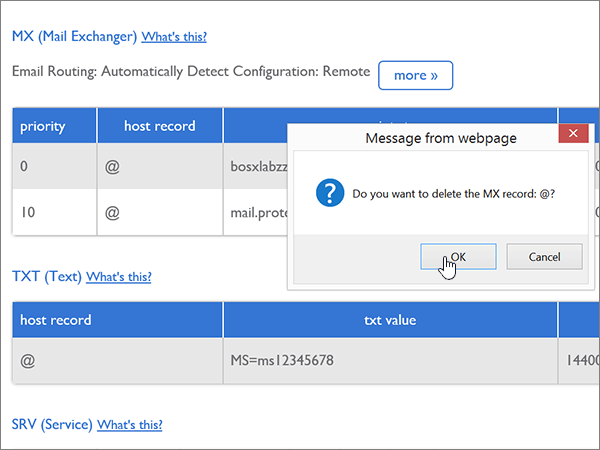

# Creare record DNS su Bluehost per MicrosoftCreate DNS records at Bluehost for Microsoft

 **Se non si trova ciò che si sta cercando, [vedere le domande frequenti sui domini](../setup/domains-faq.yml)**.**[Check the Domains FAQ](../setup/domains-faq.yml)** if you don't find what you're looking for. 
  
Se il proprio provider di hosting DNS è Bluehost, seguire i passaggi di questo articolo per verificare il dominio e configurare i record DNS per la posta elettronica, Skype for Business online e così via.If Bluehost is your DNS hosting provider, follow the steps in this article to verify your domain and set up DNS records for email, Skype for Business Online, and so on.
  
Dopo aver aggiunto questi record a Bluehost, il dominio sarà configurato per l'uso con i servizi Microsoft.After you add these records at Bluehost, your domain will be set up to work with Microsoft services.

> [!NOTE]
> In genere, l'applicazione delle modifiche al DNS richiede circa 15 minuti. Tuttavia, a volte può capitare che l'aggiornamento di una modifica nel sistema DNS di Internet richieda più tempo. In caso di problemi con il flusso di posta o di altro tipo dopo l'aggiunta dei record DNS, vedere [Individuare e correggere i problemi dopo l'aggiunta del dominio o dei record DNS](../get-help-with-domains/find-and-fix-issues.md).Typically it takes about 15 minutes for DNS changes to take effect. However, it can occasionally take longer for a change you've made to update across the Internet's DNS system. If you're having trouble with mail flow or other issues after adding DNS records, see [Find and fix issues after adding your domain or DNS records](../get-help-with-domains/find-and-fix-issues.md). 
  
## Aggiungere un record TXT a scopo di verificaAdd a TXT record for verification

Prima di usare il proprio dominio con Microsoft, è necessario dimostrare di esserne il proprietario. La capacità di accedere al proprio account nel registrar e di creare il record DNS dimostra a Microsoft che si è il proprietario del dominio.Before you use your domain with Microsoft, we have to make sure that you own it. Your ability to log in to your account at your domain registrar and create the DNS record proves to Microsoft that you own the domain.
  
> [!NOTE]
> Questo record viene usato esclusivamente per verificare di essere proprietari del dominio e non ha altri effetti. È possibile eliminarlo in un secondo momento, se si preferisce.This record is used only to verify that you own your domain; it doesn't affect anything else. You can delete it later, if you like. 
  
1. Per iniziare, passare alla propria pagina dei domini su Bluehost usando [questo collegamento](https://my.bluehost.com/cgi/dm).To get started, go to your domains page at Bluehost by using [this link](https://my.bluehost.com/cgi/dm). Verrà richiesto di eseguire l'accesso.You'll be prompted to log in first.
    
2. Nell'area **domain** della pagina **Domains** trovare la riga relativa al dominio da modificare e quindi selezionare la casella di controllo corrispondente.On the **domains** page, in the **domain** area, find the row for the domain that you're changing, and then select the check box for that domain. 
    
    Può essere necessario scorrere la pagina.(You may have to scroll down.)
    
3. Nell'area **_Domain_name_\*_ fare clic su**\* **Gestisci record DNS** nella riga _ DNS zone editor.In the **_domain_name_*_ area, on the _\* DNS Zone Editor*\* row, select **Manage DNS records**.
    
4. On the **DNS Zone Editor** page, in the **Add DNS Record** area, in the boxes for the new record, type or copy and paste the values from the following table.On the **DNS Zone Editor** page, in the **Add DNS Record** area, in the boxes for the new record, type or copy and paste the values from the following table. 
    
    Selezionare il valore **Type** nell'elenco a discesa.(Choose the **Type** value from the drop-down list.) 
    
    |||||
    |:-----|:-----|:-----|:-----|
    |**Host Record****Host Record**   |**TTL****TTL**   |**Type****Type**   |**TXT Value****TXT Value**   |
    |@    |1440014400    |TXTTXT    |MS=ms *XXXXXXXX*MS=ms *XXXXXXXX*    **Note:** questo è un esempio.**Note:** This is an example. Usare il valore specifico di **Indirizzo di destinazione o puntamento** indicato nella tabella.Use your specific **Destination or Points to Address** value here, from the table. [Come trovarloHow do I find this?](../get-help-with-domains/information-for-dns-records.md)          |
   
5. Selezionare **Aggiungi record**.Select **add record**.
    
6. Attendere alcuni minuti prima di continuare, in modo che il record appena creato venga aggiornato in Internet.Wait a few minutes before you continue, so that the record you just created can update across the Internet.
    
Dopo aver aggiunto il record al sito del registrar, è possibile tornare a Microsoft e richiedere una ricerca per il record.Now that you've added the record at your domain registrar's site, you'll go back to Microsoft and request a search for the record.
  
Quando Microsoft trova il record TXT corretto, il dominio è verificato.When Microsoft finds the correct TXT record, your domain is verified.
  
1. Nell'interfaccia di amministrazione di Microsoft, passare alla pagina **Impostazioni** \> <a href="https://go.microsoft.com/fwlink/p/?linkid=834818" target="_blank">Domini</a>.In the Microsoft admin center, go to the **Settings** \> <a href="https://go.microsoft.com/fwlink/p/?linkid=834818" target="_blank">Domains</a> page.

    
2. Nella pagina **Domini** selezionare il dominio da verificare.On the **Domains** page, select the domain that you are verifying. 
    
3. Nella pagina **Configurazione** selezionare **Avvia configurazione**.On the **Setup** page, select **Start setup**.
    
4. Nella pagina **Verifica dominio** selezionare **Verifica**.On the **Verify domain** page, select **Verify**.
    
> [!NOTE]
> In genere, l'applicazione delle modifiche al DNS richiede circa 15 minuti. Tuttavia, a volte può capitare che l'aggiornamento di una modifica nel sistema DNS di Internet richieda più tempo. In caso di problemi con il flusso di posta o di altro tipo dopo l'aggiunta dei record DNS, vedere [Individuare e correggere i problemi dopo l'aggiunta del dominio o dei record DNS](../get-help-with-domains/find-and-fix-issues.md).Typically it takes about 15 minutes for DNS changes to take effect. However, it can occasionally take longer for a change you've made to update across the Internet's DNS system. If you're having trouble with mail flow or other issues after adding DNS records, see [Find and fix issues after adding your domain or DNS records](../get-help-with-domains/find-and-fix-issues.md). 
  
## Aggiungere un record MX in modo che la posta elettronica del dominio venga recapitata in MicrosoftAdd an MX record so email for your domain will come to Microsoft

1. Per iniziare, passare alla propria pagina dei domini su Bluehost usando [questo collegamento](https://my.bluehost.com/cgi/dm).To get started, go to your domains page at Bluehost by using [this link](https://my.bluehost.com/cgi/dm). Verrà richiesto di eseguire l'accesso.You'll be prompted to log in first.
    
2. Nell'area **domain** della pagina **Domains** trovare la riga relativa al dominio da modificare e quindi selezionare la casella di controllo corrispondente.On the **domains** page, in the **domain** area, find the row for the domain that you're changing, and then select the check box for that domain. 
    
    Può essere necessario scorrere la pagina.(You may have to scroll down.)
    
3. Nell'area **_Domain_name_\*_ fare clic su**\* **Gestisci record DNS** nella riga _ DNS zone editor.In the **_domain_name_*_ area, on the _\* DNS Zone Editor*\* row, select **Manage DNS records**.
    
4. On the **DNS Zone Editor** page, in the **Add DNS Record** area, in the boxes for the new record, type or copy and paste the values from the following table.On the **DNS Zone Editor** page, in the **Add DNS Record** area, in the boxes for the new record, type or copy and paste the values from the following table. 
    
    Selezionare il valore **Type** nell'elenco a discesa.(Choose the **Type** value from the drop-down list.) 
    
    |**Host Record****Host Record**|**TTL****TTL**|**Type****Type**|**Points To****Points To**|**Priority****Priority**|
    |:-----|:-----|:-----|:-----|:-----|
    |@    |1440014400    |MXMX    | *\<domain-key\>*  .mail.protection.outlook.com*\<domain-key\>*  .mail.protection.outlook.com   **Nota:** ottenere il valore \<*domain-key*\> dal proprio account Microsoft.**Note:** Get your \<*domain-key*\> from your Microsoft account. [Come trovarloHow do I find this?](../get-help-with-domains/information-for-dns-records.md)          |00    Per altre informazioni sulla priorità, vedere [Che cos'è la priorità MX](https://docs.microsoft.com/microsoft-365/admin/setup/domains-faq).For more information about priority, see [What is MX priority?](https://docs.microsoft.com/microsoft-365/admin/setup/domains-faq)   |
   
   
  
5. Selezionare **Aggiungi record**.Select **add record**.
    
    
  
6. Rimuovere eventuali altri record MX presenti nella sezione **MX (Mail Exchanger)**.If there are any other MX records in the **MX (Mail Exchanger)** section, delete each of them. 
    
    Per uno degli altri record MX, selezionare **Elimina.**For one of the other MX records, select **Delete.**
    
    
  
7. Nella finestra di dialogo di conferma fare clic su **OK**.In the confirmation dialog box, select **OK**.
    
    
  
8. Usare la stessa procedura per eliminare eventuali altri record MX già presenti nell'elenco.Use the same process to delete any other MX records that were already listed.
    
## Aggiungere i sei record CNAME necessari per MicrosoftAdd the six CNAME records that are required for Microsoft

1. Per iniziare, passare alla propria pagina dei domini su Bluehost usando [questo collegamento](https://my.bluehost.com/cgi/dm).To get started, go to your domains page at Bluehost by using [this link](https://my.bluehost.com/cgi/dm). Verrà richiesto di eseguire l'accesso.You'll be prompted to log in first.
    
2. Nell'area **domain** della pagina **Domains** trovare la riga relativa al dominio da modificare e quindi selezionare la casella di controllo corrispondente.On the **domains** page, in the **domain** area, find the row for the domain that you're changing, and then select the check box for that domain. 
    
    Può essere necessario scorrere la pagina.(You may have to scroll down.)
    
3. Nell'area **_Domain_name_\*_ fare clic su**\* **Gestisci record DNS** nella riga _ DNS zone editor.In the **_domain_name_*_ area, on the _\* DNS Zone Editor*\* row, select **Manage DNS records**.
    
4. Nella sezione **a (host)** Records individuare la riga del record di **individuazione automatica** e quindi fare clic su **Elimina** per tale riga.In the **A (Host)** records section, find the row for the **autodiscover** record, and then select **delete** for that row. 
    
    > [!IMPORTANT]
    > È necessario eliminare il record di **individuazione automatica** esistente  *prima*  di aggiungere il record di **individuazione automatica** richiesto da Microsoft.You must delete the existing **autodiscover** record  *before*  adding the **autodiscover** record that is required by Microsoft. Bluehost non consente di mantenere due record **autodiscover** contemporaneamente.Bluehost does not allow you to maintain two **autodiscover** records simultaneously. 
  
    
  
5. Selezionare **OK**.Select **OK**.
    
    
  
6. Creare il primo dei sei record CNAME.Create the first of the six CNAME records.
    
    Nella pagina **DNS Zone Editor** digitare oppure copiare e incollare i valori della prima riga della tabella seguente nelle caselle del nuovo record nell'area **Add DNS Record**.On the **DNS Zone Editor** page, in the **Add DNS Record** area, in the boxes for the new record, type or copy and paste the values from the first row in the following table. 
    
    Selezionare il valore **Type** nell'elenco a discesa.(Choose the **Type** value from the drop-down list.) 
    
    |**Host Record****Host Record**|**TTL****TTL**|**Type****Type**|**Points To****Points To**|
    |:-----|:-----|:-----|:-----|
    |autodiscoverautodiscover    |1440014400    |CNAMECNAME    |autodiscover.outlook.comautodiscover.outlook.com    |
    |sipsip    |1440014400    |CNAMECNAME    |sipdir.online.lync.comsipdir.online.lync.com    |
    |lyncdiscoverlyncdiscover    |1440014400    |CNAMECNAME    |webdir.online.lync.comwebdir.online.lync.com    |
    |enterpriseregistrationenterpriseregistration    |1440014400    |CNAMECNAME    |enterpriseregistration.windows.netenterpriseregistration.windows.net    |
    |enterpriseenrollmententerpriseenrollment    |1440014400    |CNAMECNAME    |enterpriseenrollment-s.manage.microsoft.comenterpriseenrollment-s.manage.microsoft.com    |
   
    
  
7. Selezionare **Aggiungi record**.Select **add record**.
    
    
  
8. Aggiungere gli altri cinque record CNAME.Add each of the other five CNAME records.
    
    Sempre nella sezione **Add DNS record** creare un record usando i valori della riga successiva della tabella e quindi scegliere di nuovo **Add record** per completare il record.Still in the **Add DNS Record** section, create a record by using the values from the next row in the table, and then again select **add record** to complete that record. 
    
    Ripetere questa procedura fino a creare tutti e sei i record CNAME.Repeat this process until you have created all six CNAME records.
    
## Aggiungere un record TXT per SPF per evitare di ricevere posta indesiderataAdd a TXT record for SPF to help prevent email spam

> [!IMPORTANT]
> Non può essere presente più di un record TXT per SPF per un dominio.You cannot have more than one TXT record for SPF for a domain. Se il dominio ha più record SPF, si verificheranno errori nella gestione della posta elettronica, oltre a problemi di recapito e di classificazione della posta indesiderata.If your domain has more than one SPF record, you'll get email errors, as well as delivery and spam classification issues. Se si dispone già di un record SPF per il dominio, non crearne uno nuovo per Microsoft.If you already have an SPF record for your domain, don't create a new one for Microsoft. Al contrario, aggiungere i valori Microsoft necessari al record corrente in modo da disporre di un  *singolo*  record SPF che includa entrambi i set di valori.Instead, add the required Microsoft values to the current record so that you have a  *single*  SPF record that includes both sets of values. Servono esempi?Need examples? Consultare [Record Domain Name System (DNS) esterni per Microsoft](https://docs.microsoft.com/microsoft-365/enterprise/external-domain-name-system-records).Check out these [External Domain Name System records for Microsoft](https://docs.microsoft.com/microsoft-365/enterprise/external-domain-name-system-records). Per convalidare il record SPF, è possibile utilizzare uno di questi[strumenti di convalida SPF](../setup/domains-faq.yml).To validate your SPF record, you can use one of these[SPF validation tools](../setup/domains-faq.yml). 
  
1. Per iniziare, passare alla propria pagina dei domini su Bluehost usando [questo collegamento](https://my.bluehost.com/cgi/dm).To get started, go to your domains page at Bluehost by using [this link](https://my.bluehost.com/cgi/dm). Verrà richiesto di eseguire l'accesso.You'll be prompted to log in first.
    
2. Nell'area **domain** della pagina **Domains** trovare la riga relativa al dominio da modificare e quindi selezionare la casella di controllo corrispondente.On the **domains** page, in the **domain** area, find the row for the domain that you're changing, and then select the check box for that domain. 
    
    Può essere necessario scorrere la pagina.(You may have to scroll down.)
    
3. Nell'area **_Domain_name_\*_ fare clic su**\* **Gestisci record DNS** nella riga _ DNS zone editor.In the **_domain_name_*_ area, on the _\* DNS Zone Editor*\* row, select **Manage DNS records**.
    
4. On the **DNS Zone Editor** page, in the **Add DNS Record** area, in the boxes for the new record, type or copy and paste the values from the following table.On the **DNS Zone Editor** page, in the **Add DNS Record** area, in the boxes for the new record, type or copy and paste the values from the following table. 
    
    Selezionare il valore **Type** nell'elenco a discesa.(Choose the **Type** value from the drop-down list.) 
        
    |**Host Record****Host Record**|**TTL****TTL**|**Type****Type**|**TXT Value****TXT Value**|
    |:-----|:-----|:-----|:-----|
    |@    |1440014400    |TXTTXT    |v=spf1 include:spf.protection.outlook.com -allv=spf1 include:spf.protection.outlook.com -all   **Nota:** è consigliabile copiare e incollare questa voce, in modo che tutti i caratteri di spaziatura siano corretti.**Note:** We recommend copying and pasting this entry, so that all of the spacing stays correct.           |
   
    
  
5. Selezionare **Aggiungi record**.Select **add record**.
    
    
  
## Aggiungere i due record SRV necessari per MicrosoftAdd the two SRV records that are required for Microsoft

1. Per iniziare, passare alla propria pagina dei domini su Bluehost usando [questo collegamento](https://my.bluehost.com/cgi/dm).To get started, go to your domains page at Bluehost by using [this link](https://my.bluehost.com/cgi/dm). Verrà richiesto di eseguire l'accesso.You'll be prompted to log in first.
    
2. Nell'area **domain** della pagina **Domains** trovare la riga relativa al dominio da modificare e quindi selezionare la casella di controllo corrispondente.On the **domains** page, in the **domain** area, find the row for the domain that you're changing, and then select the check box for that domain. 
    
    Può essere necessario scorrere la pagina.(You may have to scroll down.)
    
3. Nell'area **_Domain_name_\*_ fare clic su**\* **Gestisci record DNS** nella riga _ DNS zone editor.In the **_domain_name_*_ area, on the _\* DNS Zone Editor*\* row, select **Manage DNS records**.
    
4. Creare il primo dei due record SRV.Create the first of the two SRV records.
    
    Nella pagina **DNS Zone Editor** digitare oppure copiare e incollare i valori della prima riga della tabella seguente nelle caselle del nuovo record nell'area **Add DNS Record**.On the **DNS Zone Editor** page, in the **Add DNS Record** area, in the boxes for the new record, type or copy and paste the values from the first row in the following table. 
    
    Selezionare il valore **Type** nell'elenco a discesa.(Choose the **Type** value from the drop-down list.) 
    
    |**Servizio****Service**|**Protocol****Protocol**|**Host****Host**|**TTL****TTL**|**Type****Type**|**Priorità****Priority**|**Peso****Weight**|**Porta****Port**|**Points To****Points To**|
    |:-----|:-----|:-----|:-----|:-----|:-----|:-----|:-----|:-----|
    |_sip_sip    |_tls_tls    |@    |1440014400    |SRVSRV    |100100    |1 1    |443443    |sipdir.online.lync.comsipdir.online.lync.com    |
    |_sipfederationtls_sipfederationtls    |_tcp_tcp    |@    |1440014400    |SRVSRV    |100100    |1 1    |50615061    |sipfed.online.lync.comsipfed.online.lync.com    |
   
    
  
5. Selezionare **Aggiungi record**.Select **add record**.
    
    
  
6. Aggiungere l'altro record SRV.Add the other SRV record.
    
    Sempre nella sezione **Add DNS record** creare un record usando i valori dell'altra riga della tabella e quindi selezionare di nuovo **Add record** per completare il record.Still in the **Add DNS Record** section, create a record by using the values from the other row in the table, and then again select **add record** to complete that record. 
    
> [!NOTE]
> In genere, l'applicazione delle modifiche al DNS richiede circa 15 minuti. Tuttavia, a volte può capitare che l'aggiornamento di una modifica nel sistema DNS di Internet richieda più tempo. In caso di problemi con il flusso di posta o di altro tipo dopo l'aggiunta dei record DNS, vedere [Individuare e correggere i problemi dopo l'aggiunta del dominio o dei record DNS](../get-help-with-domains/find-and-fix-issues.md).Typically it takes about 15 minutes for DNS changes to take effect. However, it can occasionally take longer for a change you've made to update across the Internet's DNS system. If you're having trouble with mail flow or other issues after adding DNS records, see [Find and fix issues after adding your domain or DNS records](../get-help-with-domains/find-and-fix-issues.md). 
  

