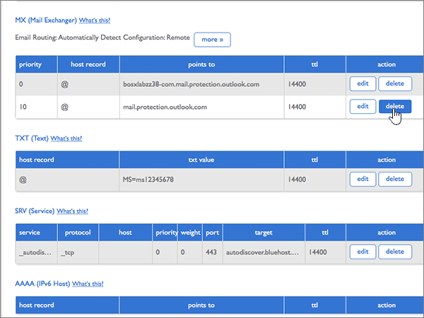

# Creare record DNS su Bluehost per Office 365

 **Se non si trova ciò che si sta cercando, [vedere le domande frequenti sui domini](../setup/domains-faq.md)**. 
  
Se il proprio provider di hosting DNS è Bluehost, seguire i passaggi di questo articolo per verificare il dominio e configurare i record DNS per la posta elettronica, Skype for Business online e così via.
  
Dopo aver aggiunto questi record in Bluehost, il domino sarà configurato per l'uso con i servizi di Office 365.
  
Per informazioni su hosting Web e DNS per i siti Web con Office 365, vedere [Usare un sito Web pubblico con Office 365](https://support.office.com/article/choose-a-public-website-3325d50e-d131-403c-a278-7f3296fe33a9).
  
> [!NOTE]
> In genere l'applicazione delle modifiche al DNS richiede circa 15 minuti. A volte può tuttavia capitare che l'aggiornamento di una modifica nel sistema DNS di Internet richieda più tempo. In caso di problemi con il flusso di posta o di altro tipo dopo l'aggiunta dei record DNS, vedere [Individuare e correggere i problemi dopo l'aggiunta del dominio o dei record DNS in Office 365](../get-help-with-domains/find-and-fix-issues.md). 
  
## Aggiungere un record TXT a scopo di verifica

Prima di usare il proprio dominio con Office 365, è necessario dimostrare di esserne proprietari. La capacità di accedere al proprio account nel registrar e di creare il record DNS dimostra a Office 365 che si è proprietari del dominio.
  
> [!NOTE]
> Questo record viene usato esclusivamente per verificare di essere proprietari del dominio e non ha altri effetti. È possibile eliminarlo in un secondo momento, se si preferisce. 
  
1. Per iniziare, passare alla propria pagina dei domini su Bluehost usando [questo collegamento](https://my.bluehost.com/cgi/dm). Verrà richiesto di eseguire l'accesso.
    
2. Nell'area **domain** della pagina **Domains** trovare la riga relativa al dominio da modificare e quindi selezionare la casella di controllo corrispondente. 
    
    Può essere necessario scorrere la pagina.
    
3. Nell'area ***Domain_name*** , nella riga **Editor zone DNS** , selezionare **Manage DNS Records**.
    
4. Nella pagina * * DNS zone editor * *, nell'area **Aggiungi record DNS** , nelle caselle del nuovo record digitare oppure copiare e incollare i valori della tabella seguente. 
    
    (Choose the **Type** value from the drop-down list.) 
    
    |||||
    |:-----|:-----|:-----|:-----|
    |**Host Record**   |**TTL**   |**Tipo**   |**TXT Value**   |
    |@    |14400    |TXT    |MS=ms *XXXXXXXX*    **Note:** questo è un esempio. Usare il valore specifico di **Indirizzo di destinazione o puntamento** indicato nella tabella in Office 365. [Come trovarlo](../get-help-with-domains/information-for-dns-records.md)          |
   
5. Selezionare **Aggiungi record**.
    
6. Attendere alcuni minuti prima di continuare, in modo che il record appena creato venga aggiornato in Internet.
    
Una volta aggiunto il record al sito del registrar, è possibile tornare in Office 365 e chiedere di cercarlo.
  
Quando Office 365 trova il record TXT corretto, il dominio è verificato.
  
1. Nell'interfaccia di amministrazione passare a **Impostazioni** \> pagina <a href="https://go.microsoft.com/fwlink/p/?linkid=834818" target="_blank">Domini</a>.

    
2. Nella pagina **Domini** selezionare il dominio da verificare. 
    
3. Nella pagina **Configurazione** selezionare **Avvia configurazione**.
    
4. Nella pagina **Verifica dominio** selezionare **Verifica**.
    
> [!NOTE]
> In genere l'applicazione delle modifiche al DNS richiede circa 15 minuti. A volte può tuttavia capitare che l'aggiornamento di una modifica nel sistema DNS di Internet richieda più tempo. In caso di problemi con il flusso di posta o di altro tipo dopo l'aggiunta dei record DNS, vedere [Individuare e correggere i problemi dopo l'aggiunta del dominio o dei record DNS in Office 365](../get-help-with-domains/find-and-fix-issues.md). 
  
## Aggiungere un record MX in modo che la posta elettronica per il dominio venga recapitata in Office 365

1. Per iniziare, passare alla propria pagina dei domini su Bluehost usando [questo collegamento](https://my.bluehost.com/cgi/dm). Verrà richiesto di eseguire l'accesso.
    
2. Nell'area **domain** della pagina **Domains** trovare la riga relativa al dominio da modificare e quindi selezionare la casella di controllo corrispondente. 
    
    Può essere necessario scorrere la pagina.
    
3. Nell'area ***Domain_name*** , nella riga **Editor zone DNS** , selezionare **Manage DNS Records**.
    
4. On the **DNS Zone Editor** page, in the **Add DNS Record** area, in the boxes for the new record, type or copy and paste the values from the following table. 
    
    (Choose the **Type** value from the drop-down list.) 
    
    |**Host Record**|**TTL**|**Type**|**Points To**|**Priority**|
    |:-----|:-----|:-----|:-----|:-----|
    |@    |14400    |MX    | *\<chiave-dominio\>*  .mail.protection.outlook.com   **Nota:** ottenere il valore \<*domain-key*\> dall'account di Office 365. [Come trovarla](../get-help-with-domains/information-for-dns-records.md)          |0    Per altre informazioni sulla priorità, vedere [Informazioni sulla priorità MX](https://support.office.com/article/2784cc4d-95be-443d-b5f7-bb5dd867ba83.aspx).   |
   
   
  
5. Selezionare **Aggiungi record**.
    
    
  
6. Rimuovere eventuali altri record MX presenti nella sezione **MX (Mail Exchanger)**. 
    
    Per uno degli altri record MX, selezionare **Elimina.**
    
    
  
7. Nella finestra di dialogo di conferma fare clic su **OK**.
    
    
  
8. Usare la stessa procedura per eliminare eventuali altri record MX già presenti nell'elenco.
    
## Aggiungere i sei record CNAME necessari per Office 365

1. Per iniziare, passare alla propria pagina dei domini su Bluehost usando [questo collegamento](https://my.bluehost.com/cgi/dm). Verrà richiesto di eseguire l'accesso.
    
2. Nell'area **domain** della pagina **Domains** trovare la riga relativa al dominio da modificare e quindi selezionare la casella di controllo corrispondente. 
    
    Può essere necessario scorrere la pagina.
    
3. Nell'area ***Domain_name*** , nella riga **Editor zone DNS** , selezionare **Manage DNS Records**.
    
4. Nella sezione **a (host)** Records individuare la riga del record di **individuazione automatica** e quindi fare clic su **Elimina** per tale riga. 
    
    > [!IMPORTANT]
    > È necessario eliminare il record **autodiscover** esistente  *prima*  di aggiungere il record **autodiscover** richiesto da Office 365. Bluehost non consente di mantenere due record **autodiscover** contemporaneamente. 
  
    
  
5. Selezionare **OK**.
    
    
  
6. Creare il primo dei sei record CNAME.
    
    Nella pagina **DNS Zone Editor** digitare oppure copiare e incollare i valori della prima riga della tabella seguente nelle caselle del nuovo record nell'area **Add DNS Record**. 
    
    (Choose the **Type** value from the drop-down list.) 
    
    |**Host Record**|**TTL**|**Type**|**Points To**|
    |:-----|:-----|:-----|:-----|
    |autodiscover    |14400    |CNAME    |autodiscover.outlook.com    |
    |sip    |14400    |CNAME    |sipdir.online.lync.com    |
    |lyncdiscover    |14400    |CNAME    |webdir.online.lync.com    |
    |enterpriseregistration    |14400    |CNAME    |enterpriseregistration.windows.net    |
    |enterpriseenrollment    |14400    |CNAME    |enterpriseenrollment-s.manage.microsoft.com    |
   
    
  
7. Selezionare **Aggiungi record**.
    
    
  
8. Aggiungere gli altri cinque record CNAME.
    
    Sempre nella sezione **Add DNS record** creare un record usando i valori della riga successiva della tabella e quindi scegliere di nuovo **Add record** per completare il record. 
    
    Ripetere questa procedura fino a creare tutti e sei i record CNAME.
    
## Aggiungere un record TXT per SPF per evitare di ricevere posta indesiderata

> [!IMPORTANT]
> Non può essere presente più di un record TXT per SPF per un dominio. Se il dominio ha più record SPF, si verificheranno errori nella gestione della posta elettronica, oltre a problemi di recapito e di classificazione della posta indesiderata. If you already have an SPF record for your domain, don't create a new one for Office 365. Al contrario, aggiungere i valori di Office 365 richiesti al record corrente in modo da ottenere un *unico* record SPF che include entrambi i set di valori. Servono esempi? Vedere queste [informazioni dettagliate e record SPF di esempio](https://support.office.com/article/c0531a6f-9e25-4f2d-ad0e-a70bfef09ac0). Per convalidare il record SPF, è possibile utilizzare uno di questi[strumenti di convalida SPF](../setup/domains-faq.md). 
  
1. Per iniziare, passare alla propria pagina dei domini su Bluehost usando [questo collegamento](https://my.bluehost.com/cgi/dm). Verrà richiesto di eseguire l'accesso.
    
2. Nell'area **domain** della pagina **Domains** trovare la riga relativa al dominio da modificare e quindi selezionare la casella di controllo corrispondente. 
    
    Può essere necessario scorrere la pagina.
    
3. Nell'area ***Domain_name*** , nella riga **Editor zone DNS** , selezionare **Manage DNS Records**.
    
4. On the **DNS Zone Editor** page, in the **Add DNS Record** area, in the boxes for the new record, type or copy and paste the values from the following table. 
    
    (Choose the **Type** value from the drop-down list.) 
        
    |**Host Record**|**TTL**|**Tipo**|**TXT Value**|
    |:-----|:-----|:-----|:-----|
    |@    |14400    |TXT    |v=spf1 include:spf.protection.outlook.com -all   **Nota:** è consigliabile copiare e incollare questa voce, in modo che tutti i caratteri di spaziatura siano corretti.           |
   
    
  
5. Selezionare **Aggiungi record**.
    
    
  
## Aggiungere i due record SRV necessari per Office 365

1. Per iniziare, passare alla propria pagina dei domini su Bluehost usando [questo collegamento](https://my.bluehost.com/cgi/dm). Verrà richiesto di eseguire l'accesso.
    
2. Nell'area **domain** della pagina **Domains** trovare la riga relativa al dominio da modificare e quindi selezionare la casella di controllo corrispondente. 
    
    Può essere necessario scorrere la pagina.
    
3. Nell'area ***Domain_name*** , nella riga **Editor zone DNS** , selezionare **Manage DNS Records**.
    
4. Creare il primo dei due record SRV.
    
    Nella pagina **DNS Zone Editor** digitare oppure copiare e incollare i valori della prima riga della tabella seguente nelle caselle del nuovo record nell'area **Add DNS Record**. 
    
    (Choose the **Type** value from the drop-down list.) 
    
    |**Servizio**|**Protocol**|**Host**|**TTL**|**Type**|**Priorità**|**Peso**|**Porta**|**Points To**|
    |:-----|:-----|:-----|:-----|:-----|:-----|:-----|:-----|:-----|
    |_sip    |_tls    |@    |14400    |SRV    |100    |1     |443    |sipdir.online.lync.com    |
    |_sipfederationtls    |_tcp    |@    |14400    |SRV    |100    |1     |5061    |sipfed.online.lync.com    |
   
    
  
5. Selezionare **Aggiungi record**.
    
    
  
6. Aggiungere l'altro record SRV.
    
    Sempre nella sezione **Add DNS record** creare un record usando i valori dell'altra riga della tabella e quindi selezionare di nuovo **Add record** per completare il record. 
    
> [!NOTE]
> In genere l'applicazione delle modifiche al DNS richiede circa 15 minuti. A volte può tuttavia capitare che l'aggiornamento di una modifica nel sistema DNS di Internet richieda più tempo. In caso di problemi con il flusso di posta o di altro tipo dopo l'aggiunta dei record DNS, vedere [Individuare e correggere i problemi dopo l'aggiunta del dominio o dei record DNS in Office 365](../get-help-with-domains/find-and-fix-issues.md). 
  

