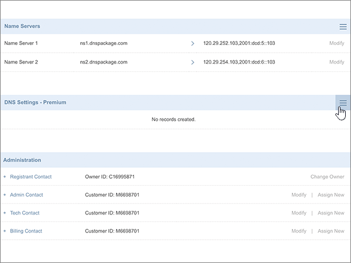
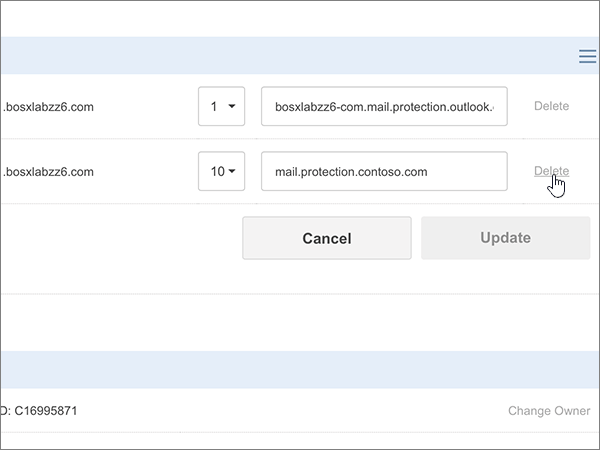
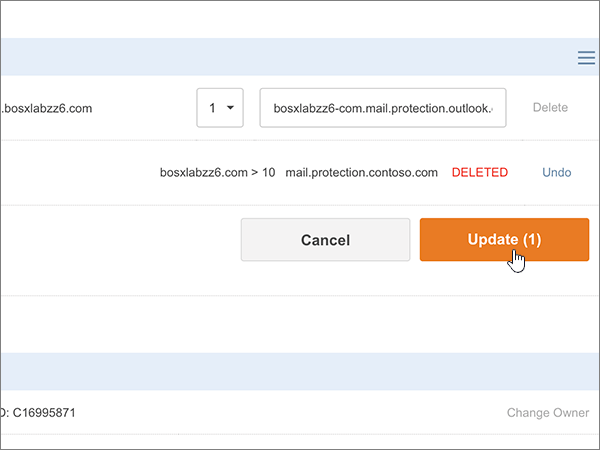

# Creare record DNS in Crazy Domains for Microsoft

 **Se non si trova ciò che si sta cercando, [vedere le domande frequenti sui domini](../setup/domains-faq.md)**. 
  
Se il proprio provider di hosting DNS è Crazy Domains, seguire i passaggi di questo articolo per verificare il dominio e configurare i record DNS per posta elettronica, Skype for Business online e così via.
  
Dopo aver aggiunto questi record in Crazy Domains, il dominio sarà configurato per l'uso con i servizi Microsoft.
  

  
> [!NOTE]
> In genere, l'applicazione delle modifiche ai record DNS richiede circa 15 minuti. A volte, tuttavia, l'aggiornamento di una modifica nel sistema DNS di Internet può richiedere più tempo. In caso di problemi relativi al flusso di posta o di altro tipo dopo l'aggiunta dei record DNS, vedere [Risolvere i problemi dopo la modifica del nome di dominio o dei record DNS](../get-help-with-domains/find-and-fix-issues.md). 
  
## Aggiungere un record TXT a scopo di verifica

Prima di usare il proprio dominio con Microsoft, è necessario dimostrare di esserne il proprietario. La capacità di accedere al proprio account nel registrar e di creare il record DNS dimostra a Microsoft che si è il proprietario del dominio.
  
> [!NOTE]
> Questo record viene usato esclusivamente per verificare di essere proprietari del dominio e non ha altri effetti. È possibile eliminarlo in un secondo momento, se si preferisce. 
  
1. Per iniziare, passare alla propria pagina dei domini su Crazy Domains usando [questo collegamento](https://manage.crazydomains.com/members/domains/). Verrà richiesto di eseguire l'accesso.
    
    
  
2. Nella sezione **My account** selezionare **Domains**.
    
    
  
3. Nella sezione **Domain** della pagina Domain **names** selezionare il nome del dominio da aggiornare. 
    
    
  
4. Nella sezione **impostazioni DNS** selezionare l'icona dell'elenco a discesa. 
    
    
  
5. Selezionare **Aggiungi record**.
    
    
  
6. Nell'elenco a discesa **Add Record** selezionare **TXT Record**. 
    
    
  
7. Selezionare **Aggiungi**.
    
    
  
8. Nelle caselle del nuovo record digitare oppure copiare e incollare i valori della tabella seguente.
    
    |**Sub Domain**|**Text Record**|
    |:-----|:-----|
    |(Leave this field empty.)    |MS=ms *XXXXXXXX*    **Note:** questo è un esempio. Usare il valore specifico di **Indirizzo di destinazione o puntamento** indicato nella tabella.           [Come trovarlo](../get-help-with-domains/information-for-dns-records.md)          |
   
    
  
9. Selezionare **Aggiorna**.
    
    
  
10. Attendere alcuni minuti prima di continuare, in modo che il record appena creato venga aggiornato in Internet.
    
Una volta che il record è stato aggiunto al sito del registrar, è possibile tornare a Microsoft e richiedere il record.
  
Quando Microsoft trova il record TXT corretto, il dominio è verificato.
  
1. Nell'interfaccia di amministrazione di Microsoft, passare alla pagina **Impostazioni** \> <a href="https://go.microsoft.com/fwlink/p/?linkid=834818" target="_blank">Domini</a>.

    
2. Nella pagina **Domini** selezionare il dominio da verificare. 
    
    
  
3. Nella pagina **Configurazione** selezionare **Avvia configurazione**.
    
    
  
4. Nella pagina **Verifica dominio** selezionare **Verifica**.
    
    
  
> [!NOTE]
>  In genere, l'applicazione delle modifiche ai record DNS richiede circa 15 minuti. A volte, tuttavia, l'aggiornamento di una modifica nel sistema DNS di Internet può richiedere più tempo. In caso di problemi relativi al flusso di posta o di altro tipo dopo l'aggiunta dei record DNS, vedere [Risolvere i problemi dopo la modifica del nome di dominio o dei record DNS](../get-help-with-domains/find-and-fix-issues.md). 
  
## Aggiungere un record MX in modo che la posta elettronica del dominio venga recapitata in Microsoft

1. Per iniziare, passare alla propria pagina dei domini su Crazy Domains usando [questo collegamento](https://manage.crazydomains.com/members/domains/). Verrà richiesto di eseguire l'accesso.
    
    
  
2. Nella sezione **My account** selezionare **Domains**.
    
    
  
3. Nella sezione **Domain** della pagina Domain **names** selezionare il nome del dominio da aggiornare. 
    
    
  
4. Nella sezione **impostazioni DNS** selezionare l'icona dell'elenco a discesa. 
    
    
  
5. Selezionare **Aggiungi record**.
    
    
  
6. Nell'elenco a discesa **Add Record:** selezionare **MX Record**. 
    
    
  
7. Selezionare **Aggiungi**.
    
    
  
8. Nelle caselle del nuovo record digitare oppure copiare e incollare i valori della tabella seguente.
    
    Scegliere il valore di **priorità** dall'elenco a discesa. 
    
    |**Posta per area**|**Priorità**|**Assegnato al server**|
    |:-----|:-----|:-----|
    |Lasciare vuoto questo campo.    |1    Per altre informazioni sulla priorità, vedere [Informazioni sulla priorità MX](https://docs.microsoft.com/microsoft-365/admin/setup/domains-faq).   | *\<chiave-dominio\>*  .mail.protection.outlook.com    **Nota:** Ottenere la propria * \<chiave\> di dominio* dal proprio account Microsoft.           [Come trovarlo](../get-help-with-domains/information-for-dns-records.md)          |
       
   
  
9. Selezionare **Aggiorna**.
    
    
  
10. Se nella sezione **MX record** sono presenti altri record MX, selezionare **Modify** per uno di questi record. 
    
    
  
11. Selezionare **Elimina**.
    
    
  
12. Selezionare **Aggiorna** per confermare l'eliminazione. 
    
    
  
13. Seguire la stessa procedura per eliminare tutti gli altri record MX nell'elenco, finché non rimane solo quello aggiunto in precedenza in questa procedura.
    
## Aggiungere i sei record CNAME necessari per Microsoft

1. Per iniziare, passare alla propria pagina dei domini su Crazy Domains usando [questo collegamento](https://manage.crazydomains.com/members/domains/). Verrà richiesto di eseguire l'accesso.
    
    
  
2. Nella sezione **My account** selezionare **Domains**.
    
    
  
3. Nella sezione **Domain** della pagina Domain **names** selezionare il nome del dominio da aggiornare. 
    
    
  
4. Nella sezione **impostazioni DNS** selezionare l'icona dell'elenco a discesa. 
    
    
  
5. Selezionare **Aggiungi record**.
    
    
  
6. Nell'elenco a discesa **Add Record:** selezionare **CNAME Record**. 
    
    
  
7. Selezionare **Aggiungi**.
    
    
  
8. Aggiungere il primo dei sei record CNAME.
    
    Nelle caselle del nuovo record digitare oppure copiare e incollare i valori dalla prima riga della tabella seguente.
    
    |**Sub Domain**|**Alias per**|
    |:-----|:-----|
    |individuazione automatica    |autodiscover.outlook.com    |
    |sip    |sipdir.online.lync.com    |
    |lyncdiscover    |webdir.online.lync.com    |
    |enterpriseregistration    |enterpriseregistration.windows.net    |
    |enterpriseenrollment    |enterpriseenrollment-s.manage.microsoft.com    |
   
    
  
9. Selezionare **Aggiungi record CNAME**.
    
    
  
10. Aggiungere il secondo record CNAME.
    
    Nelle caselle del nuovo record, utilizzare i valori della riga successiva della tabella e quindi selezionare di nuovo **Aggiungi record CNAME**.
    
    Ripetere questa procedura fino a creare tutti e sei i record CNAME.
    
11. Selezionare **Update** per salvare le modifiche. 
    
    
  
## Aggiungere un record TXT per SPF per evitare di ricevere posta indesiderata

> [!IMPORTANT]
> Non può essere presente più di un record TXT per SPF per un dominio. Se il dominio ha più record SPF, si verificheranno errori nella gestione della posta elettronica, oltre a problemi di recapito e di classificazione della posta indesiderata. Se si dispone già di un record SPF per il dominio, non crearne uno nuovo per Microsoft. Al contrario, aggiungere i valori Microsoft necessari al record corrente in modo da disporre di un *singolo* record SPF che includa entrambi i set di valori. 
  
1. Per iniziare, passare alla propria pagina dei domini su Crazy Domains usando [questo collegamento](https://manage.crazydomains.com/members/domains/). Verrà richiesto di eseguire l'accesso.
    
    
  
2. Nella sezione **My account** selezionare **Domains**.
    
    
  
3. Nella sezione **Domain** della pagina Domain **names** selezionare il nome del dominio da aggiornare. 
    
    
  
4. Nella sezione **impostazioni DNS** selezionare l'icona dell'elenco a discesa. 
    
    
  
5. Selezionare **Aggiungi record**.
    
    
  
6. Nell'elenco a discesa **Add Record:** selezionare **TXT Record**. 
    
    
  
7. Selezionare **Aggiungi**.
    
    
  
8. Nelle caselle del nuovo record digitare oppure incollare i valori della tabella seguente.
    
    |**Sub Domain**|**Text Record**|
    |:-----|:-----|
    |Lasciare vuoto questo campo.    |v=spf1 include:spf.protection.outlook.com -all    **Nota:** è consigliabile copiare e incollare questa voce, in modo che tutti i caratteri di spaziatura siano corretti.           |
   
    
  
9. Selezionare **Aggiorna**.
    
    
  
## Aggiungere i due record SRV necessari per Microsoft

1. Per iniziare, passare alla propria pagina dei domini su Crazy Domains usando [questo collegamento](https://manage.crazydomains.com/members/domains/). Verrà richiesto di eseguire l'accesso.
    
    
  
2. Nella sezione **My account** selezionare **Domains**.
    
    
  
3. Nella sezione **Domain** della pagina Domain **names** selezionare il nome del dominio da aggiornare. 
    
    
  
4. Nella sezione **impostazioni DNS** selezionare l'icona dell'elenco a discesa. 
    
    
  
5. Selezionare **Aggiungi record**.
    
    
  
6. Nell'elenco a discesa **Add Record:** selezionare **SRV Record**. 
    
    
  
7. Selezionare **Aggiungi**.
    
    
  
8. Aggiungere il primo dei due record SRV.
    
    Nelle caselle del nuovo record digitare oppure copiare e incollare i valori dalla prima riga della tabella seguente.
    
    |**Record Type**|**Sub Domain**|**Priorità**|**Peso**|**Porta**|**Target**|
    |:-----|:-----|:-----|:-----|:-----|:-----|
    |Record SRV    |_sip. _tls    |100    |1    |443    |sipdir.online.lync.com    |
    |Record SRV    |_sipfederationtls. _tcp    |100    |1    |5061    |sipfed.online.lync.com    |
   
    
  
9. Selezionare **Add SRV record**.
    
    
  
10. Aggiungere l'altro record SRV.
    
    Nelle caselle del nuovo record usare i valori della seconda riga nella tabella.
    
11. Selezionare **Update** per salvare le modifiche. 
    
    
  
> [!NOTE]
> In genere, l'applicazione delle modifiche ai record DNS richiede circa 15 minuti. A volte, tuttavia, l'aggiornamento di una modifica nel sistema DNS di Internet può richiedere più tempo. In caso di problemi relativi al flusso di posta o di altro tipo dopo l'aggiunta dei record DNS, vedere [Risolvere i problemi dopo la modifica del nome di dominio o dei record DNS](../get-help-with-domains/find-and-fix-issues.md). 
  
