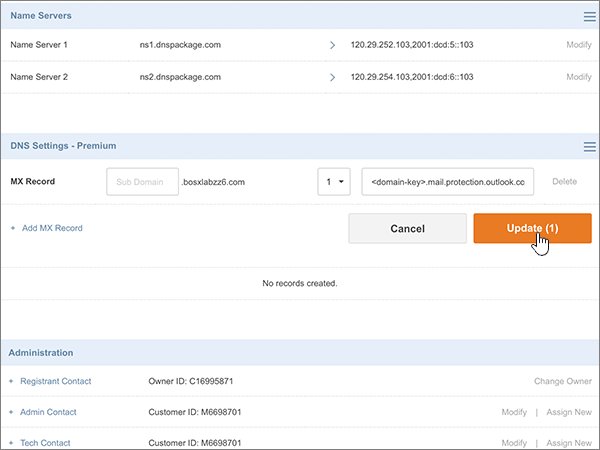
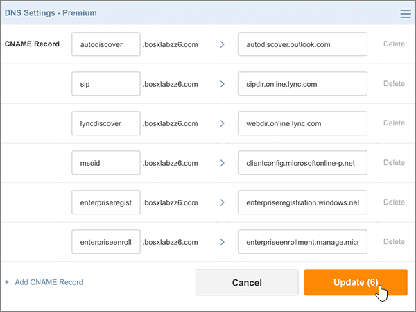
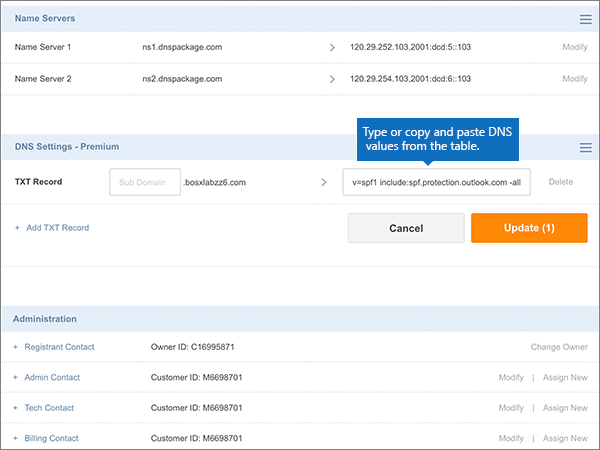
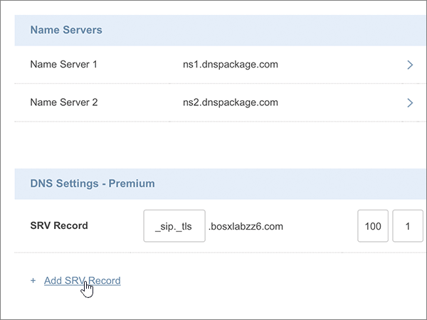

# Creare record DNS in Crazy Domains for MicrosoftCreate DNS records at Crazy Domains for Microsoft

 **Se non si trova ciò che si sta cercando, [vedere le domande frequenti sui domini](../setup/domains-faq.md)**.**[Check the Domains FAQ](../setup/domains-faq.md)** if you don't find what you're looking for. 
  
Se il proprio provider di hosting DNS è Crazy Domains, seguire i passaggi di questo articolo per verificare il dominio e configurare i record DNS per posta elettronica, Skype for Business online e così via.If Crazy Domains is your DNS hosting provider, follow the steps in this article to verify your domain and set up DNS records for email, Skype for Business Online, and so on.
  
Dopo aver aggiunto questi record in Crazy Domains, il dominio sarà configurato per l'uso con i servizi Microsoft.After you add these records at Crazy Domains, your domain will be set up to work with Microsoft services.
  
Per ulteriori informazioni su Webhosting e DNS per i siti Web con Microsoft, vedere [utilizzare un sito Web pubblico con Microsoft](https://support.office.com/article/choose-a-public-website-3325d50e-d131-403c-a278-7f3296fe33a9).To learn about webhosting and DNS for websites with Microsoft, see [Use a public website with Microsoft](https://support.office.com/article/choose-a-public-website-3325d50e-d131-403c-a278-7f3296fe33a9).
  
> [!NOTE]
> In genere, l'applicazione delle modifiche ai record DNS richiede circa 15 minuti. A volte, tuttavia, l'aggiornamento di una modifica nel sistema DNS di Internet può richiedere più tempo. In caso di problemi relativi al flusso di posta o di altro tipo dopo l'aggiunta dei record DNS, vedere [Risolvere i problemi dopo la modifica del nome di dominio o dei record DNS](../get-help-with-domains/find-and-fix-issues.md).Typically it takes about 15 minutes for DNS changes to take effect. However, it can occasionally take longer for a change you've made to update across the Internet's DNS system. If you're having trouble with mail flow or other issues after adding DNS records, see [Troubleshoot issues after changing your domain name or DNS records](../get-help-with-domains/find-and-fix-issues.md). 
  
## Aggiungere un record TXT a scopo di verificaAdd a TXT record for verification

Prima di utilizzare il dominio con Microsoft, è necessario assicurarsi di possederlo.Before you use your domain with Microsoft, we have to make sure that you own it. La possibilità di eseguire l'accesso al proprio account presso il registrar e di creare il record DNS dimostra a Microsoft che si è proprietari del dominio.Your ability to log in to your account at your domain registrar and create the DNS record proves to Microsoft that you own the domain.
  
> [!NOTE]
> Questo record viene usato esclusivamente per verificare di essere proprietari del dominio e non ha altri effetti. È possibile eliminarlo in un secondo momento, se si preferisce.This record is used only to verify that you own your domain; it doesn't affect anything else. You can delete it later, if you like. 
  
1. Per iniziare, passare alla propria pagina dei domini su Crazy Domains usando [questo collegamento](https://manage.crazydomains.com/members/domains/). Verrà richiesto di eseguire l'accesso.To get started, go to your domains page at Crazy Domains by using [this link](https://manage.crazydomains.com/members/domains/). You'll be prompted to log in first.
    
    
  
2. Nella sezione **My account** selezionare **Domains**.In the **My Account** section, select **Domains**.
    
    
  
3. Nella sezione **Domain** della pagina Domain **names** selezionare il nome del dominio da aggiornare.On the **Domain Names** page, in the **Domain** section, select the name of the domain that you are updating. 
    
    
  
4. Nella sezione **impostazioni DNS** selezionare l'icona dell'elenco a discesa.In the **DNS Settings** section, select the drop-down list icon. 
    
    
  
5. Selezionare **Aggiungi record**.Select **Add Record**.
    
    
  
6. Nell'elenco a discesa **Add Record** selezionare **TXT Record**.Choose **TXT Record** from the **Add Record** drop-down list. 
    
    
  
7. Selezionare **Aggiungi**.Select **Add**.
    
    
  
8. Nelle caselle del nuovo record digitare oppure copiare e incollare i valori della tabella seguente.In the boxes for the new record, type or copy and paste the values from the following table.
    
    |**Sub Domain****Sub Domain**|**Text Record****Text Record**|
    |:-----|:-----|
    |(Leave this field empty.)(Leave this field empty.)    |MS=ms *XXXXXXXX*MS=ms *XXXXXXXX*    **Note:** questo è un esempio.**Note:** This is an example. Utilizzare il valore **di indirizzo di destinazione o puntamento** specifico qui, dalla tabella.Use your specific **Destination or Points to Address** value here, from the table.           [Come trovarloHow do I find this?](../get-help-with-domains/information-for-dns-records.md)          |
   
    
  
9. Selezionare **Aggiorna**.Select **Update**.
    
    
  
10. Attendere alcuni minuti prima di continuare, in modo che il record appena creato venga aggiornato in Internet.Wait a few minutes before you continue, so that the record you just created can update across the Internet.
    
Dopo aver aggiunto il record al sito del registrar, è possibile tornare a Microsoft e richiedere il record.Now that you've added the record at your domain registrar's site, you'll go back to Microsoft and request the record.
  
Quando Microsoft trova il record TXT corretto, il dominio è verificato.When Microsoft finds the correct TXT record, your domain is verified.
  
1. Nell'interfaccia di amministrazione di Microsoft, andare alla pagina <a href="https://go.microsoft.com/fwlink/p/?linkid=834818" target="_blank">Domains</a> **Settings** \> .In the Microsoft admin center, go to the **Settings** \> <a href="https://go.microsoft.com/fwlink/p/?linkid=834818" target="_blank">Domains</a> page.

    
2. Nella pagina **Domini** selezionare il dominio da verificare.On the **Domains** page, select the domain that you are verifying. 
    
    
  
3. Nella pagina **Configurazione** selezionare **Avvia configurazione**.On the **Setup** page, select **Start setup**.
    
    
  
4. Nella pagina **Verifica dominio** selezionare **Verifica**.On the **Verify domain** page, select **Verify**.
    
    
  
> [!NOTE]
>  In genere, l'applicazione delle modifiche ai record DNS richiede circa 15 minuti. A volte, tuttavia, l'aggiornamento di una modifica nel sistema DNS di Internet può richiedere più tempo. In caso di problemi relativi al flusso di posta o di altro tipo dopo l'aggiunta dei record DNS, vedere [Risolvere i problemi dopo la modifica del nome di dominio o dei record DNS](../get-help-with-domains/find-and-fix-issues.md).Typically it takes about 15 minutes for DNS changes to take effect. However, it can occasionally take longer for a change you've made to update across the Internet's DNS system. If you're having trouble with mail flow or other issues after adding DNS records, see [Troubleshoot issues after changing your domain name or DNS records](../get-help-with-domains/find-and-fix-issues.md). 
  
## Aggiungere un record MX in modo che la posta elettronica per il dominio venga a MicrosoftAdd an MX record so email for your domain will come to Microsoft

1. Per iniziare, passare alla propria pagina dei domini su Crazy Domains usando [questo collegamento](https://manage.crazydomains.com/members/domains/). Verrà richiesto di eseguire l'accesso.To get started, go to your domains page at Crazy Domains by using [this link](https://manage.crazydomains.com/members/domains/). You'll be prompted to log in first.
    
    
  
2. Nella sezione **My account** selezionare **Domains**.In the **My Account** section, select **Domains**.
    
    
  
3. Nella sezione **Domain** della pagina Domain **names** selezionare il nome del dominio da aggiornare.On the **Domain Names** page, in the **Domain** section, select the name of the domain that you are updating. 
    
    
  
4. Nella sezione **impostazioni DNS** selezionare l'icona dell'elenco a discesa.In the **DNS Settings** section, select the drop-down list icon. 
    
    
  
5. Selezionare **Aggiungi record**.Select **Add Record**.
    
    
  
6. Nell'elenco a discesa **Add Record:** selezionare **MX Record**.Choose **MX Record** from the **Add Record:** drop-down list. 
    
    
  
7. Selezionare **Aggiungi**.Select **Add**.
    
    
  
8. Nelle caselle del nuovo record digitare oppure copiare e incollare i valori della tabella seguente.In the boxes for the new record, type or copy and paste the values from the following table.
    
    Scegliere il valore di **priorità** dall'elenco a discesa.(Choose the **Priority** value from the drop-down list.) 
    
    |**Posta per area****Mail For Zone**|**Priorità****Priority**|**Assegnato al server****Assigned To Server**|
    |:-----|:-----|:-----|
    |Lasciare vuoto questo campo.(Leave this field empty.)    |1 1    Per altre informazioni sulla priorità, vedere [Informazioni sulla priorità MX](https://support.office.com/article/2784cc4d-95be-443d-b5f7-bb5dd867ba83.aspx).For more information about priority, see [What is MX priority?](https://support.office.com/article/2784cc4d-95be-443d-b5f7-bb5dd867ba83.aspx)   | *\<chiave-dominio\>*  .mail.protection.outlook.com*\<domain-key\>*  .mail.protection.outlook.com    **Nota:** Ottenere la propria \* \<chiave\> di dominio\* dal proprio account Microsoft.**Note:** Get your  *\<domain-key\>*  from your Microsoft account.           [Come trovarloHow do I find this?](../get-help-with-domains/information-for-dns-records.md)          |
       
   
  
9. Selezionare **Aggiorna**.Select **Update**.
    
    
  
10. Se nella sezione **MX record** sono presenti altri record MX, selezionare **Modify** per uno di questi record.If there are any other MX records listed in the **MX Record** section, select **Modify** for one of those records. 
    
    
  
11. Selezionare **Elimina**.Select **Delete**.
    
    
  
12. Selezionare **Aggiorna** per confermare l'eliminazione.Select **Update** to confirm the deletion. 
    
    
  
13. Seguire la stessa procedura per eliminare tutti gli altri record MX nell'elenco, finché non rimane solo quello aggiunto in precedenza in questa procedura.Use the same process to remove any other MX records in the list, until only the one that you added earlier in this procedure remains.
    
## Aggiungere i sei record CNAME necessari per MicrosoftAdd the six CNAME records that are required for Microsoft

1. Per iniziare, passare alla propria pagina dei domini su Crazy Domains usando [questo collegamento](https://manage.crazydomains.com/members/domains/). Verrà richiesto di eseguire l'accesso.To get started, go to your domains page at Crazy Domains by using [this link](https://manage.crazydomains.com/members/domains/). You'll be prompted to log in first.
    
    
  
2. Nella sezione **My account** selezionare **Domains**.In the **My Account** section, select **Domains**.
    
    
  
3. Nella sezione **Domain** della pagina Domain **names** selezionare il nome del dominio da aggiornare.On the **Domain Names** page, in the **Domain** section, select the name of the domain that you are updating. 
    
    
  
4. Nella sezione **impostazioni DNS** selezionare l'icona dell'elenco a discesa.In the **DNS Settings** section, select the drop-down list icon. 
    
    
  
5. Selezionare **Aggiungi record**.Select **Add Record**.
    
    
  
6. Nell'elenco a discesa **Add Record:** selezionare **CNAME Record**.Choose **CNAME Record** from the **Add Record:** drop-down list. 
    
    
  
7. Selezionare **Aggiungi**.Select **Add**.
    
    
  
8. Aggiungere il primo dei sei record CNAME.Add the first of the six CNAME records.
    
    Nelle caselle del nuovo record digitare oppure copiare e incollare i valori dalla prima riga della tabella seguente.In the boxes for the new record, type or copy and paste the values from the first row of the following table.
    
    |**Sub Domain****Sub Domain**|**Alias per****Alias for**|
    |:-----|:-----|
    |individuazione automaticaautodiscover    |autodiscover.outlook.comautodiscover.outlook.com    |
    |sipsip    |sipdir.online.lync.comsipdir.online.lync.com    |
    |lyncdiscoverlyncdiscover    |webdir.online.lync.comwebdir.online.lync.com    |
    |enterpriseregistrationenterpriseregistration    |enterpriseregistration.windows.netenterpriseregistration.windows.net    |
    |enterpriseenrollmententerpriseenrollment    |enterpriseenrollment-s.manage.microsoft.comenterpriseenrollment-s.manage.microsoft.com    |
   
    
  
9. Selezionare **Aggiungi record CNAME**.Select **Add CNAME Record**.
    
    
  
10. Aggiungere il secondo record CNAME.Add the second CNAME record.
    
    Nelle caselle del nuovo record, utilizzare i valori della riga successiva della tabella e quindi selezionare di nuovo **Aggiungi record CNAME**.In the boxes for the new record, use the values from the next row in the table, and then again select **Add CNAME Record**.
    
    Ripetere questa procedura fino a creare tutti e sei i record CNAME.Repeat this process until you have created all six CNAME records.
    
11. Selezionare **Update** per salvare le modifiche.Select **Update** to save your changes. 
    
    
  
## Aggiungere un record TXT per SPF per evitare di ricevere posta indesiderataAdd a TXT record for SPF to help prevent email spam

> [!IMPORTANT]
> Non può essere presente più di un record TXT per SPF per un dominio.You cannot have more than one TXT record for SPF for a domain. Se il dominio ha più record SPF, si verificheranno errori nella gestione della posta elettronica, oltre a problemi di recapito e di classificazione della posta indesiderata.If your domain has more than one SPF record, you'll get email errors, as well as delivery and spam classification issues. Se si dispone già di un record SPF per il dominio, non crearne uno nuovo per Microsoft.If you already have an SPF record for your domain, don't create a new one for Microsoft. Al contrario, aggiungere i valori Microsoft necessari al record corrente in modo da disporre di un *singolo* record SPF che includa entrambi i set di valori.Instead, add the required Microsoft values to the current record so that you have a  *single*  SPF record that includes both sets of values. 
  
1. Per iniziare, passare alla propria pagina dei domini su Crazy Domains usando [questo collegamento](https://manage.crazydomains.com/members/domains/). Verrà richiesto di eseguire l'accesso.To get started, go to your domains page at Crazy Domains by using [this link](https://manage.crazydomains.com/members/domains/). You'll be prompted to log in first.
    
    
  
2. Nella sezione **My account** selezionare **Domains**.In the **My Account** section, select **Domains**.
    
    
  
3. Nella sezione **Domain** della pagina Domain **names** selezionare il nome del dominio da aggiornare.On the **Domain Names** page, in the **Domain** section, select the name of the domain that you are updating. 
    
    
  
4. Nella sezione **impostazioni DNS** selezionare l'icona dell'elenco a discesa.In the **DNS Settings** section, select the drop-down list icon. 
    
    
  
5. Selezionare **Aggiungi record**.Select **Add Record**.
    
    
  
6. Nell'elenco a discesa **Add Record:** selezionare **TXT Record**.Choose **TXT Record** from the **Add Record:** drop-down list. 
    
    
  
7. Selezionare **Aggiungi**.Select **Add**.
    
    
  
8. Nelle caselle del nuovo record digitare oppure incollare i valori della tabella seguente.In the boxes for the new record, type or paste the values from the following table.
    
    |**Sub Domain****Sub Domain**|**Text Record****Text Record**|
    |:-----|:-----|
    |Lasciare vuoto questo campo.(Leave this field empty.)    |v=spf1 include:spf.protection.outlook.com -allv=spf1 include:spf.protection.outlook.com -all    **Nota:** è consigliabile copiare e incollare questa voce, in modo che tutti i caratteri di spaziatura siano corretti.**Note:** We recommend copying and pasting this entry, so that all of the spacing stays correct.           |
   
    
  
9. Selezionare **Aggiorna**.Select **Update**.
    
    
  
## Aggiungere i due record SRV necessari per MicrosoftAdd the two SRV records that are required for Microsoft

1. Per iniziare, passare alla propria pagina dei domini su Crazy Domains usando [questo collegamento](https://manage.crazydomains.com/members/domains/). Verrà richiesto di eseguire l'accesso.To get started, go to your domains page at Crazy Domains by using [this link](https://manage.crazydomains.com/members/domains/). You'll be prompted to log in first.
    
    
  
2. Nella sezione **My account** selezionare **Domains**.In the **My Account** section, select **Domains**.
    
    
  
3. Nella sezione **Domain** della pagina Domain **names** selezionare il nome del dominio da aggiornare.On the **Domain Names** page, in the **Domain** section, select the name of the domain that you are updating. 
    
    
  
4. Nella sezione **impostazioni DNS** selezionare l'icona dell'elenco a discesa.In the **DNS Settings** section, select the drop-down list icon. 
    
    
  
5. Selezionare **Aggiungi record**.Select **Add Record**.
    
    
  
6. Nell'elenco a discesa **Add Record:** selezionare **SRV Record**.Choose **SRV Record** from the **Add Record:** drop-down list. 
    
    
  
7. Selezionare **Aggiungi**.Select **Add**.
    
    
  
8. Aggiungere il primo dei due record SRV.Add the first of the two SRV records.
    
    Nelle caselle del nuovo record digitare oppure copiare e incollare i valori dalla prima riga della tabella seguente.In the boxes for the new record, type or copy and paste the values from the first row of the following table.
    
    |**Record Type****Record Type**|**Sub Domain****Sub Domain**|**Priorità****Priority**|**Peso****Weight**|**Porta****Port**|**Target****Target**|
    |:-----|:-----|:-----|:-----|:-----|:-----|
    |Record SRVSRV Record    |_sip. _tls_sip._tls    |100100    |1 1    |443443    |sipdir.online.lync.comsipdir.online.lync.com    |
    |Record SRVSRV Record    |_sipfederationtls. _tcp_sipfederationtls._tcp    |100100    |1 1    |50615061    |sipfed.online.lync.comsipfed.online.lync.com    |
   
    
  
9. Selezionare **Add SRV record**.Select **Add SRV Record**.
    
    
  
10. Aggiungere l'altro record SRV.Add the other SRV record.
    
    Nelle caselle del nuovo record usare i valori della seconda riga nella tabella.In the boxes for the new record, use the values from the second row in the table.
    
11. Selezionare **Update** per salvare le modifiche.Select **Update** to save your changes. 
    
    
  
> [!NOTE]
> In genere, l'applicazione delle modifiche ai record DNS richiede circa 15 minuti. A volte, tuttavia, l'aggiornamento di una modifica nel sistema DNS di Internet può richiedere più tempo. In caso di problemi relativi al flusso di posta o di altro tipo dopo l'aggiunta dei record DNS, vedere [Risolvere i problemi dopo la modifica del nome di dominio o dei record DNS](../get-help-with-domains/find-and-fix-issues.md).Typically it takes about 15 minutes for DNS changes to take effect. However, it can occasionally take longer for a change you've made to update across the Internet's DNS system. If you're having trouble with mail flow or other issues after adding DNS records, see [Troubleshoot issues after changing your domain name or DNS records](../get-help-with-domains/find-and-fix-issues.md). 
  
