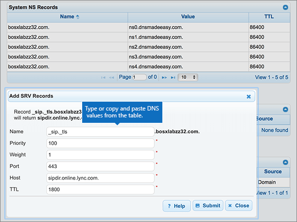

# Creare record DNS in DNSMadeEasy per Office 365Create DNS records at DNSMadeEasy for Office 365

 **Se non si trova ciò che si sta cercando, [vedere le domande frequenti sui domini](../setup/domains-faq.md)**.**[Check the Domains FAQ](../setup/domains-faq.md)** if you don't find what you're looking for. 
  
Se il proprio provider di hosting DNS è DNSMadeEasy, seguire i passaggi di questo articolo per verificare il dominio e configurare i record DNS per la posta elettronica, Skype for Business online e così via.If DNSMadeEasy is your DNS hosting provider, follow the steps in this article to verify your domain and set up DNS records for email, Skype for Business Online, and so on.
  
Dopo aver aggiunto questi record in DNSMadeEasy, il domino sarà configurato per l'uso con i servizi di Office 365.After you add these records at DNSMadeEasy, your domain will be set up to work with Office 365 services.
  
Per informazioni su hosting Web e DNS per i siti Web con Office 365, vedere [Usare un sito Web pubblico con Office 365](https://support.office.com/article/choose-a-public-website-3325d50e-d131-403c-a278-7f3296fe33a9).To learn about webhosting and DNS for websites with Office 365, see [Use a public website with Office 365](https://support.office.com/article/choose-a-public-website-3325d50e-d131-403c-a278-7f3296fe33a9).
  
> [!NOTE]
> In genere l'applicazione delle modifiche al DNS richiede circa 15 minuti. A volte può tuttavia capitare che l'aggiornamento di una modifica nel sistema DNS di Internet richieda più tempo. In caso di problemi con il flusso di posta o di altro tipo dopo l'aggiunta dei record DNS, vedere [Individuare e correggere i problemi dopo l'aggiunta del dominio o dei record DNS in Office 365](../get-help-with-domains/find-and-fix-issues.md).Typically it takes about 15 minutes for DNS changes to take effect. However, it can occasionally take longer for a change you've made to update across the Internet's DNS system. If you're having trouble with mail flow or other issues after adding DNS records, see [Find and fix issues after adding your domain or DNS records in Office 365](../get-help-with-domains/find-and-fix-issues.md). 
  
## Aggiungere un record TXT a scopo di verificaAdd a TXT record for verification

Prima di usare il proprio dominio con Office 365, è necessario dimostrare di esserne proprietari. La capacità di accedere al proprio account nel registrar e di creare il record DNS dimostra a Office 365 che si è proprietari del dominio.Before you use your domain with Office 365, we have to make sure that you own it. Your ability to log in to your account at your domain registrar and create the DNS record proves to Office 365 that you own the domain.
  
> [!NOTE]
> Questo record viene usato esclusivamente per verificare di essere proprietari del dominio e non ha altri effetti. È possibile eliminarlo in un secondo momento, se si preferisce.This record is used only to verify that you own your domain; it doesn't affect anything else. You can delete it later, if you like. 
  
> [!IMPORTANT]
> Per gli account DNSMadeEasy, il dominio aggiunto è stato acquistato da un registrar diverso.For DNSMadeEasy accounts, the domain you added was purchased from a separate domain registrar. DNSMadeEasy non offre servizi di registrazione di domini.DNSMadeEasy does not offer domain registration services. La possibilità di accedere a DNSMadeEasy e di creare il record DNS è una prova sufficiente della proprietà.Your ability to log in at DNSMadeEasy and create the DNS record is sufficient proof of ownership. 
  
1. Per iniziare, passare alla propria pagina dei domini su DNSMadeEasy usando [questo collegamento](https://cp.dnsmadeeasy.com/).To get started, go to your domains page at DNSMadeEasy by using [this link](https://cp.dnsmadeeasy.com/). Verrà richiesto di eseguire l'accesso.You'll be prompted to login first.
    
2. Nella pagina **console di gestione** , nell'area **domini aggiornati di recente** , selezionare il dominio che si desidera aggiornare.On the **Management Console** page, in the **Recently Updated Domains** area, select the domain that you want to update. 
    
3. Nell'area **txt Records** della pagina **+** **Managed DNS** selezionare il controllo () ( **Aggiungi nuovo**).On the **Managed DNS** page, in the **TXT Records** area, select the ( **+**) control ( **Add new**).
    
    (You may have to scroll down.)(You may have to scroll down.)
    
4. In the **Add TXT Records** area, in the boxes for the new record, type or copy and paste the values from the following table.In the **Add TXT Records** area, in the boxes for the new record, type or copy and paste the values from the following table. 
    
    ||||
    |:-----|:-----|:-----|
    |**Nome****Name**   |**Value****Value**   |**TTL****TTL**   |
    |Lasciare vuoto questo campo.(Leave this field empty.)    |MS=ms *XXXXXXXX*MS=ms *XXXXXXXX*    **Note:** questo è un esempio.**Note:** This is an example. Usare il valore specifico di **Indirizzo di destinazione o puntamento** indicato nella tabella in Office 365.Use your specific **Destination or Points to Address** value here, from the table in Office 365. [Come trovarloHow do I find this?](../get-help-with-domains/information-for-dns-records.md)          |18001800    |
   
5. Selezionare **Invia**.Select **Submit**.
    
6. Attendere alcuni minuti prima di continuare, in modo che il record appena creato venga aggiornato in Internet.Wait a few minutes before you continue, so that the record you just created can update across the Internet.
    
Now that you've added the record at your domain registrar's site, you'll go back to Office 365 and request Office 365 to look for the record.Now that you've added the record at your domain registrar's site, you'll go back to Office 365 and request Office 365 to look for the record.
  
When Office 365 finds the correct TXT record, your domain is verified.When Office 365 finds the correct TXT record, your domain is verified.
  
1. Nell'interfaccia di amministrazione, andare alla pagina \*\*\*\* \> <a href="https://go.microsoft.com/fwlink/p/?linkid=834818" target="_blank">Domains</a> Settings.In the admin center, go to the **Settings** \> <a href="https://go.microsoft.com/fwlink/p/?linkid=834818" target="_blank">Domains</a> page.

    
2. Nella pagina **Domains** selezionare il dominio che si sta verificando.On the **Domains** page, select the domain that you are verifying. 
    
3. Nella pagina **configurazione** , selezionare **Avvia installazione**.On the **Setup** page, select **Start setup**.
    
4. Nella pagina **Verifica dominio** selezionare **Verifica**.On the **Verify domain** page, select **Verify**.
    
> [!NOTE]
> In genere l'applicazione delle modifiche al DNS richiede circa 15 minuti. A volte può tuttavia capitare che l'aggiornamento di una modifica nel sistema DNS di Internet richieda più tempo. In caso di problemi con il flusso di posta o di altro tipo dopo l'aggiunta dei record DNS, vedere [Individuare e correggere i problemi dopo l'aggiunta del dominio o dei record DNS in Office 365](../get-help-with-domains/find-and-fix-issues.md).Typically it takes about 15 minutes for DNS changes to take effect. However, it can occasionally take longer for a change you've made to update across the Internet's DNS system. If you're having trouble with mail flow or other issues after adding DNS records, see [Find and fix issues after adding your domain or DNS records in Office 365](../get-help-with-domains/find-and-fix-issues.md). 
  
## Aggiungere un record MX in modo che la posta elettronica per il dominio venga recapitata in Office 365Add an MX record so email for your domain will come to Office 365

1. Per iniziare, passare alla propria pagina dei domini su DNSMadeEasy usando [questo collegamento](https://cp.dnsmadeeasy.com/). Verrà richiesto di eseguire l'accesso.To get started, go to your domains page at DNSMadeEasy by using [this link](https://cp.dnsmadeeasy.com/). You'll be prompted to login first.
    
2. Nella pagina **console di gestione** , nell'area **domini aggiornati di recente** , selezionare il dominio che si desidera aggiornare.On the **Management Console** page, in the **Recently Updated Domains** area, select the domain that you want to update. 
    
    Nella pagina **console di gestione** , nell'area **domini aggiornati di recente** , selezionare il dominio che si desidera aggiornare.On the **Management Console** page, in the **Recently Updated Domains** area, select the domain that you want to update. 
    
    
  
3. Nell'area **MX Records** della pagina **Managed DNS** selezionare il controllo **(+)** ( **Aggiungi nuovo**).On the **Managed DNS** page, in the **MX Records** area, select the **(+)** control ( **Add new**).
    
    (You may have to scroll down.)(You may have to scroll down.)
    
    
  
4. Nelle caselle del nuovo record nell'area **Add MX Records** digitare oppure copiare e incollare i valori della tabella seguente.In the **Add MX Records** area, in the boxes for the new record, type or copy and paste the values from the following table. 
    
    Può essere necessario scorrere la pagina.(You may have to scroll down.)
    
    |**Nome****Name**|**Server****Server**|**MX Level****MX Level**|**TTL****TTL**|
    |:-----|:-----|:-----|:-----|
    |Lasciare vuoto questo campo.(Leave this field empty.)    | *\<chiave-dominio\>*  .mail.protection.outlook.com*\<domain-key\>*  .mail.protection.outlook.com    **Questo valore DEVE terminare con un punto (.)****This value MUST end with a period (.)**   **Nota:** Ottenere la \<propria *chiave* \> di dominio dall'account di Office 365.**Note:** Get your \<*domain-key*\> from your Office 365 account. [Come trovarloHow do I find this?](../get-help-with-domains/information-for-dns-records.md)          |10 10    Per altre informazioni sulla priorità, vedere [Informazioni sulla priorità MX](https://support.office.com/article/2784cc4d-95be-443d-b5f7-bb5dd867ba83.aspx).For more information about priority, see [What is MX priority?](https://support.office.com/article/2784cc4d-95be-443d-b5f7-bb5dd867ba83.aspx)   |18001800    |
   
    
  
5. Selezionare **Invia**.Select **Submit**.
    
    
  
6. Se sono presenti altri record MX nella sezione **MX Records**, eliminarli tutti selezionandoli uno alla volta.If there are any other MX records listed in the **MX Records** section, delete all of them by selecting each one. 
    
    
  
7. Quando vengono selezionati tutti i record, selezionare **Elimina selezionato**.When all records are selected, select **Delete selected**.
    
    
  
8. Nella finestra di dialogo **Delete MX Records** selezionare **Delete** per confermare le modifiche.In the **Delete MX Records** dialog box, select **Delete** to confirm your changes. 
    
    
  
## Aggiungere i cinque record CNAME necessari per Office 365Add the five CNAME records that are required for Office 365

1. Per iniziare, passare alla propria pagina dei domini su DNSMadeEasy usando [questo collegamento](https://cp.dnsmadeeasy.com/). Verrà richiesto di eseguire l'accesso.To get started, go to your domains page at DNSMadeEasy by using [this link](https://cp.dnsmadeeasy.com/). You'll be prompted to login first.
    
2. Nella pagina **console di gestione** , nell'area **domini aggiornati di recente** , selezionare il dominio che si desidera aggiornare.On the **Management Console** page, in the **Recently Updated Domains** area, select the domain that you want to update. 
    
3. Nell'area **CNAME Records** della pagina **Managed DNS** selezionare il controllo **(+)** ( **Aggiungi nuovo**).On the **Managed DNS** page, in the **CNAME Records** area, select the **(+)** control ( **Add new**).
    
    Può essere necessario scorrere la pagina.(You may have to scroll down.)
    
    
  
4. Aggiungere il primo dei cinque record CNAME.Add the first of the five CNAME records.
    
    Nelle caselle del nuovo record nell'area **Add CNAME Records** digitare oppure copiare e incollare i valori della prima riga della tabella seguente.In the **Add CNAME Records** area, in the boxes for the new record, type or copy and paste the values from the first row in the following table. 
    
    |**Name****Name**|**Alias to****Alias to**|**TTL****TTL**|
    |:-----|:-----|:-----|
    |autodiscoverautodiscover    |autodiscover.outlook.com.autodiscover.outlook.com.    **Questo valore DEVE terminare con un punto (.)****This value MUST end with a period (.)**   |18001800    |
    |sipsip    |sipdir.online.lync.com.sipdir.online.lync.com.    **Questo valore DEVE terminare con un punto (.)****This value MUST end with a period (.)**   |18001800    |
    |lyncdiscoverlyncdiscover    |webdir.online.lync.com.webdir.online.lync.com.    **Questo valore DEVE terminare con un punto (.)****This value MUST end with a period (.)**   |18001800    |
    |enterpriseregistrationenterpriseregistration    |enterpriseregistration.windows.net.enterpriseregistration.windows.net.    **Questo valore DEVE terminare con un punto (.)****This value MUST end with a period (.)**   |18001800    |
    |enterpriseenrollmententerpriseenrollment    |enterpriseenrollment-s.manage.microsoft.com.enterpriseenrollment-s.manage.microsoft.com.    **Questo valore DEVE terminare con un punto (.)****This value MUST end with a period (.)**   |18001800    |
   
    
  
5. Selezionare **Invia**.Select **Submit**.
    
    
  
6. Aggiungere ognuno degli altri quattro record CNAME.Add each of the other four CNAME records.
    
    Nella sezione **CNAME Records** selezionare il controllo **(+)** ( **Aggiungi nuovo**), creare un record usando i valori della riga successiva della tabella e quindi fare di nuovo clic su **Submit** per completare il record.In the **CNAME Records** section, select the **(+)** control ( **Add new**), create a record by using the values from the next row in the table, and then again select **Submit** to complete that record. 
    
    Ripetere questa procedura fino a creare tutti e cinque i record CNAME.Repeat this process until you have created all five CNAME records.
    
## Aggiungere un record TXT per SPF per evitare di ricevere posta indesiderataAdd a TXT record for SPF to help prevent email spam

> [!IMPORTANT]
> You cannot have more than one TXT record for SPF for a domain.You cannot have more than one TXT record for SPF for a domain. If your domain has more than one SPF record, you'll get email errors, as well as delivery and spam classification issues.If your domain has more than one SPF record, you'll get email errors, as well as delivery and spam classification issues. If you already have an SPF record for your domain, don't create a new one for Office 365.If you already have an SPF record for your domain, don't create a new one for Office 365. Al contrario, aggiungere i valori di Office 365 necessari al record corrente in modo che sia presente un *singolo* record SPF che includa entrambi i set di valori.Instead, add the required Office 365 values to the current record so that you have a  *single*  SPF record that includes both sets of values. Servono esempi?Need examples? Vedere queste [informazioni dettagliate e record SPF di esempio](https://support.office.com/article/c0531a6f-9e25-4f2d-ad0e-a70bfef09ac0).Check out these [External Domain Name System records for Office 365](https://support.office.com/article/c0531a6f-9e25-4f2d-ad0e-a70bfef09ac0). Per convalidare il record SPF, è possibile utilizzare uno di questi[strumenti di convalida SPF](../setup/domains-faq.md).To validate your SPF record, you can use one of these[SPF validation tools](../setup/domains-faq.md). 
  
1. Per iniziare, passare alla propria pagina dei domini su DNSMadeEasy usando [questo collegamento](https://cp.dnsmadeeasy.com/).To get started, go to your domains page at DNSMadeEasy by using [this link](https://cp.dnsmadeeasy.com/). Verrà richiesto di eseguire l'accesso.You'll be prompted to login first.
    
2. Nella pagina **console di gestione** , nell'area **domini aggiornati di recente** , selezionare il dominio che si desidera aggiornare.On the **Management Console** page, in the **Recently Updated Domains** area, select the domain that you want to update. 
    
3. Nell'area **txt Records** della pagina **Managed DNS** selezionare il controllo **(+)** ( **Aggiungi nuovo**).On the **Managed DNS** page, in the **TXT Records** area, select the **(+)** control ( **Add new**).
    
    Può essere necessario scorrere la pagina.(You may have to scroll down.)
    
    
  
4. In the **Add TXT Records** area, in the boxes for the new record, type or copy and paste the values from the following table.In the **Add TXT Records** area, in the boxes for the new record, type or copy and paste the values from the following table. 
    
    |**Nome****Name**|**Value****Value**|**TTL****TTL**|
    |:-----|:-----|:-----|
    |Lasciare vuoto questo campo.(Leave this field empty.)    |v=spf1 include:spf.protection.outlook.com -allv=spf1 include:spf.protection.outlook.com -all    **Nota:** è consigliabile copiare e incollare questa voce, in modo che tutti i caratteri di spaziatura siano corretti.**Note:** We recommend copying and pasting this entry, so that all of the spacing stays correct.           |18001800    |
   
    
  
5. Selezionare **Invia**.Select **Submit**.
    
    
  
## Aggiungere i due record SRV necessari per Office 365Add the two SRV records that are required for Office 365

1. Per iniziare, passare alla propria pagina dei domini su DNSMadeEasy usando [questo collegamento](https://cp.dnsmadeeasy.com/). Verrà richiesto di eseguire l'accesso.To get started, go to your domains page at DNSMadeEasy by using [this link](https://cp.dnsmadeeasy.com/). You'll be prompted to login first.
    
2. Nella pagina **console di gestione** , nell'area **domini aggiornati di recente** , selezionare il dominio che si desidera aggiornare.On the **Management Console** page, in the **Recently Updated Domains** area, select the domain that you want to update. 
    
3. Nell'area **SRV Records** della pagina **Managed DNS** selezionare il controllo **(+)** ( **Aggiungi nuovo**).On the **Managed DNS** page, in the **SRV Records** area, select the **(+)** control ( **Add new**).
    
    Può essere necessario scorrere la pagina.(You may have to scroll down)
    
    
  
4. Aggiungere il primo dei due record SRV.Add the first of the two SRV records.
    
    Nelle caselle del nuovo record nell'area **Add SRV Records** digitare oppure copiare e incollare i valori della prima riga della tabella seguente.In the **Add SRV Records** area, in the boxes for the new record, type or copy and paste the values from the first row in the following table. 
    
    |**Name****Name**|**Priority****Priority**|**Peso****Weight**|**Port****Port**|**Host****Host**|**TTL****TTL**|
    |:-----|:-----|:-----|:-----|:-----|:-----|
    |_sip. _tls_sip._tls    |100100    |11    |443443    |sipdir.online.lync.com.sipdir.online.lync.com.    **Questo valore DEVE terminare con un punto (.)****This value MUST end with a period (.)**   |18001800    |
    |_sipfederationtls. _tcp_sipfederationtls._tcp    |100100    |11    |50615061    |sipfed.online.lync.com.sipfed.online.lync.com.    **Questo valore DEVE terminare con un punto (.)****This value MUST end with a period (.)**   |18001800    |
   
    
  
5. Selezionare **Invia**.Select **Submit**.
    
    
  
6. Aggiungere l'altro record SRV.Add the other SRV record.
    
    Nella sezione **SRV Records** selezionare il controllo **(+)** ( **Aggiungi nuovo**), creare un record usando i valori della riga successiva della tabella e quindi fare di nuovo clic su **Submit** per completare il record.In the **SRV Records** section, select the **(+)** control ( **Add new**), create a record by using the values from the next row in the table, and then again select **Submit** to complete that record. 
    
> [!NOTE]
> In genere l'applicazione delle modifiche al DNS richiede circa 15 minuti. A volte può tuttavia capitare che l'aggiornamento di una modifica nel sistema DNS di Internet richieda più tempo. In caso di problemi con il flusso di posta o di altro tipo dopo l'aggiunta dei record DNS, vedere [Individuare e correggere i problemi dopo l'aggiunta del dominio o dei record DNS in Office 365](../get-help-with-domains/find-and-fix-issues.md).Typically it takes about 15 minutes for DNS changes to take effect. However, it can occasionally take longer for a change you've made to update across the Internet's DNS system. If you're having trouble with mail flow or other issues after adding DNS records, see [Find and fix issues after adding your domain or DNS records in Office 365](../get-help-with-domains/find-and-fix-issues.md). 
  

