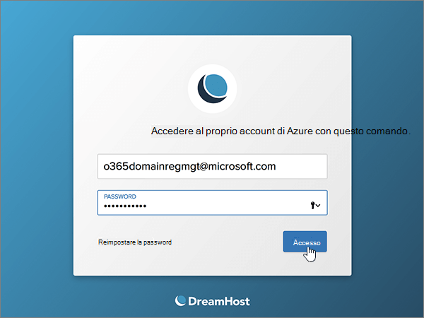

# Creare record DNS in DreamHost per MicrosoftCreate DNS records at Dreamhost for Microsoft

 Se non si trova ciò che si sta cercando, **[vedere le domande frequenti sui domini](../setup/domains-faq.yml)**.**[Check the Domains FAQ](../setup/domains-faq.yml)** if you don't find what you're looking for. 
  
Se il proprio provider di hosting DNS è DreamHost, seguire i passaggi di questo articolo per verificare il dominio e configurare i record DNS per posta elettronica, Lync e così via.If DreamHost is your DNS hosting provider, follow the steps in this article to verify your domain and set up DNS records for email, Lync, and so on.
 
Dopo aver aggiunto questi record in DreamHost, il dominio sarà configurato per l'uso con i servizi Microsoft.After you add these records at DreamHost, your domain will be set up to work with Microsoft services.
  
  
> [!NOTE]
> In genere, l'applicazione delle modifiche ai record DNS richiede circa 15 minuti. A volte, tuttavia, l'aggiornamento di una modifica nel sistema DNS di Internet può richiedere più tempo. In caso di problemi relativi al flusso di posta o di altro tipo dopo l'aggiunta dei record DNS, vedere [Risolvere i problemi dopo la modifica del nome di dominio o dei record DNS](../get-help-with-domains/find-and-fix-issues.md).Typically it takes about 15 minutes for DNS changes to take effect. However, it can occasionally take longer for a change you've made to update across the Internet's DNS system. If you're having trouble with mail flow or other issues after adding DNS records, see [Troubleshoot issues after changing your domain name or DNS records](../get-help-with-domains/find-and-fix-issues.md). 
  
## Aggiungere un record TXT a scopo di verificaAdd a TXT record for verification

Prima di usare il proprio dominio con Microsoft, è necessario dimostrare di esserne il proprietario. La capacità di accedere al proprio account nel registrar e di creare il record DNS dimostra a Microsoft che si è il proprietario del dominio.Before you use your domain with Microsoft, we have to make sure that you own it. Your ability to log in to your account at your domain registrar and create the DNS record proves to Microsoft that you own the domain.
  
> [!NOTE]
> Questo record viene usato esclusivamente per verificare di essere proprietari del dominio e non ha altri effetti. È possibile eliminarlo in un secondo momento, se si preferisce.This record is used only to verify that you own your domain; it doesn't affect anything else. You can delete it later, if you like. 
  
1. Per iniziare, passare alla propria pagina dei domini su DreamHost usando [questo collegamento](https://panel.dreamhost.com/). Verrà richiesto di eseguire l'accesso.To get started, go to your domains page at DreamHost by using [this link](https://panel.dreamhost.com/). You'll be prompted to Sign in.
    
    
  
2. Nella pagina **Dashboard** selezionare **Domains** e quindi **Manage Domains**.On the **Dashboard** page, select **Domains**, and then **Manage Domains**.
    
    
  
3. Nella sezione **Domain** della pagina **Manage** Domains selezionare **DNS** per il dominio che si desidera modificare.On the **Manage Domains** page, in the **Domain** section, select **DNS** for the domain that you want to edit. 
    
    
  
4. In the **Add a custom DNS record** section, in the boxes for the new record, type or copy and paste the values from the following table.In the **Add a custom DNS record** section, in the boxes for the new record, type or copy and paste the values from the following table. 
    
    (You may have to scroll down.)(You may have to scroll down.)
    
    Selezionare il valore **Type** nell'elenco a discesa.(Choose the **Type** value from the drop-down list.) 
    
    |**Nome****Name**|**Tipo****Type**|**Valore****Value**|**Commento****Comment**|
    |:-----|:-----|:-----|:-----|
    |(Leave this field empty.)(Leave this field empty.)    |TXTTXT    |MS=ms *XXXXXXXX*MS=ms *XXXXXXXX*    **Note:** questo è un esempio.**Note:** This is an example. Usare il valore specifico di **Indirizzo di destinazione o puntamento** indicato nella tabella.Use your specific **Destination or Points to Address** value here, from the table.           [Come trovarloHow do I find this?](../get-help-with-domains/information-for-dns-records.md)          |Questo campo è facoltativo.(This field is optional.)    |
   
   
  
5. Selezionare **Aggiungi record adesso.**Select **Add Record Now!**
    
    
  
6. Attendere alcuni minuti prima di continuare, in modo che il record appena creato venga aggiornato in Internet.Wait a few minutes before you continue, so that the record you just created can update across the Internet.
    
Una volta che il record è stato aggiunto al sito del registrar, è possibile tornare a Microsoft e richiedere il record.Now that you've added the record at your domain registrar's site, you'll go back to Microsoft and request the record.
  
Quando Microsoft trova il record TXT corretto, il dominio è verificato.When Microsoft finds the correct TXT record, your domain is verified.
  
1. Nell'interfaccia di amministrazione di Microsoft, passare alla pagina **Impostazioni** \> <a href="https://go.microsoft.com/fwlink/p/?linkid=834818" target="_blank">Domini</a>.In the Microsoft admin center, go to the **Settings** \> <a href="https://go.microsoft.com/fwlink/p/?linkid=834818" target="_blank">Domains</a> page.

    
2. Nella pagina **Domini** selezionare il dominio da verificare.On the **Domains** page, select the domain that you are verifying. 
    
    
  
3. Nella pagina **Configurazione** selezionare **Avvia configurazione**.On the **Setup** page, select **Start setup**.
    
    
  
4. Nella pagina **Verifica dominio** selezionare **Verifica**.On the **Verify domain** page, select **Verify**.
    
    
  
> [!NOTE]
>  In genere, l'applicazione delle modifiche ai record DNS richiede circa 15 minuti. A volte, tuttavia, l'aggiornamento di una modifica nel sistema DNS di Internet può richiedere più tempo. In caso di problemi relativi al flusso di posta o di altro tipo dopo l'aggiunta dei record DNS, vedere [Risolvere i problemi dopo la modifica del nome di dominio o dei record DNS](../get-help-with-domains/find-and-fix-issues.md).Typically it takes about 15 minutes for DNS changes to take effect. However, it can occasionally take longer for a change you've made to update across the Internet's DNS system. If you're having trouble with mail flow or other issues after adding DNS records, see [Troubleshoot issues after changing your domain name or DNS records](../get-help-with-domains/find-and-fix-issues.md). 
  

  
## Aggiungere un record MX in modo che la posta elettronica del dominio venga recapitata in MicrosoftAdd an MX record so email for your domain will come to Microsoft

Effettuare le operazioni seguenti.Follow the steps below.
  
1. Per iniziare, passare alla propria pagina dei domini su DreamHost usando [questo collegamento](https://panel.dreamhost.com/). Verrà richiesto di eseguire l'accesso.To get started, go to your domains page at DreamHost by using [this link](https://panel.dreamhost.com/). You'll be prompted to Sign in.
    
    
  
2. Nella pagina **Dashboard** selezionare **mail** e quindi **MX personalizzato**.On the **Dashboard** page, select **Mail**, and then **Custom MX**.
    
    
  
3. Nella colonna **azioni** della sezione **Gestisci recapito della posta** selezionare **modifica** per il dominio che si desidera modificare.In the **Manage Mail Delivery** section, in the **Actions** column, select **Edit** for the domain that you want to edit. 
    
    
  
4. Nelle caselle del nuovo record nella sezione **Custom MX Record** digitare oppure copiare e incollare i valori della tabella seguente.In the **Custom MX Record** section, in the boxes for the new record, type or copy and paste the following values from the following table. 
    
    Può essere necessario scorrere la pagina.(You may have to scroll down.)
    
    Se sono presenti altri record MX esistenti, contrassegnarli come da eliminare.(If there are any other existing MX records, mark those records to be deleted.)
    
    |**Record MX (obbligatorio)****MX Record (required)**|
    |:-----|
    |0  *\<domain-key\>*  .mail.protection.outlook.com.0  *\<domain-key\>*  .mail.protection.outlook.com.    **Questo valore DEVE terminare con un punto (.)****This value MUST end with a period (.)**   0 è il valore di priorità MX. Aggiungerlo all'inizio del valore MX, separato dal resto del valore da uno spazio.  The 0 is the MX priority value. Add it to the beginning of the MX value, separated from the remainder of the value by a space.    **Nota:** Ottenere il vostro  *\<domain-key\>*  dal vostro account Microsoft.**Note:** Get your  *\<domain-key\>*  from your Microsoft account.           [Come trovarloHow do I find this?](../get-help-with-domains/information-for-dns-records.md)          |
   
    
  
5. Selezionare **modifica questo dominio per utilizzare i record MX personalizzati subito.**Select **Change this domain to use custom MX records now!**
    
    
  
6. Se sono presenti altri record MX, eliminarli selezionandone ognuno e premendo **CANC**.If there are any other existing MX records, delete each record by selecting the entry and then pressing the **Delete** key on your keyboard. 
    
    
  
7. Se sono stati eliminati tutti i record, selezionare **Aggiorna i record MX personalizzati subito.**If you have deleted any records, select **Update your custom MX records now!**
    
    

  
## Aggiungere i sei record CNAME necessari per MicrosoftAdd the six CNAME records that are required for Microsoft

Effettuare le operazioni seguenti.Follow the steps below.
  
1. Per iniziare, passare alla propria pagina dei domini su DreamHost usando [questo collegamento](https://panel.dreamhost.com/). Verrà richiesto di eseguire l'accesso.To get started, go to your domains page at DreamHost by using [this link](https://panel.dreamhost.com/). You'll be prompted to Sign in.
    
    
  
2. Nella pagina **Dashboard** selezionare **Domains** e quindi **Manage Domains**.On the **Dashboard** page, select **Domains**, and then **Manage Domains**.
    
    
  
3. Nella sezione **Domain** della pagina **Manage** Domains selezionare **DNS** per il dominio che si desidera modificare.On the **Manage Domains** page, in the **Domain** section, select **DNS** for the domain that you want to edit. 
    
    
  
4. Nelle caselle del nuovo record nella sezione **Add a custom DNS Record** digitare oppure copiare e incollare i valori dalla prima riga della tabella seguente.In the **Add a custom DNS record** section, in the boxes for the new record, type or copy and paste the values from the first row in the following table. 
    
    Può essere necessario scorrere la pagina.(You may have to scroll down.)
    
    Selezionare il valore **Type** nell'elenco a discesa.(Choose the **Type** value from the drop-down list.) 
    
    |**Nome****Name**|**Tipo****Type**|**Valore****Value**|**Commento****Comment**|
    |:-----|:-----|:-----|:-----|
    |individuazione automaticaautodiscover    |CNAMECNAME    |autodiscover.outlook.com.autodiscover.outlook.com.    **Questo valore DEVE terminare con un punto (.)****This value MUST end with a period (.)**   |Questo campo è facoltativo.(This field is optional.)    |
    |sipsip    |CNAMECNAME    |sipdir.online.lync.com.sipdir.online.lync.com.    **Questo valore DEVE terminare con un punto (.)****This value MUST end with a period (.)**   |Questo campo è facoltativo.(This field is optional.)    |
    |lyncdiscoverlyncdiscover    |CNAMECNAME    |webdir.online.lync.com.webdir.online.lync.com.    **Questo valore DEVE terminare con un punto (.)****This value MUST end with a period (.)**   |Questo campo è facoltativo.(This field is optional.)    |
    |enterpriseregistrationenterpriseregistration    |CNAMECNAME    |enterpriseregistration.windows.net.enterpriseregistration.windows.net.    **Questo valore DEVE terminare con un punto (.)****This value MUST end with a period (.)**   |Questo campo è facoltativo.(This field is optional.)    |
    |enterpriseenrollmententerpriseenrollment    |CNAMECNAME    |enterpriseenrollment-s.manage.microsoft.com.enterpriseenrollment-s.manage.microsoft.com.    **Questo valore DEVE terminare con un punto (.)****This value MUST end with a period (.)**   |Questo campo è facoltativo.(This field is optional.)    |
   
    
  
5. Selezionare **Aggiungi record adesso.**Select **Add Record Now!**
    
    
  
6. Se si utilizzano i due passaggi precedenti e i valori delle altre cinque righe nella tabella, aggiungere ognuno degli altri cinque record CNAME.Using the preceding two steps and the values from the other five rows in the table, add each of the other five CNAME records.

  
## Aggiungere un record TXT per SPF per evitare di ricevere posta indesiderataAdd a TXT record for SPF to help prevent email spam

> [!IMPORTANT]
> Non può essere presente più di un record TXT per SPF per un dominio.You cannot have more than one TXT record for SPF for a domain. Se il dominio ha più record SPF, si verificheranno errori nella gestione della posta elettronica, oltre a problemi di recapito e di classificazione della posta indesiderata.If your domain has more than one SPF record, you'll get email errors, as well as delivery and spam classification issues. Se si dispone già di un record SPF per il dominio, non crearne uno nuovo per Microsoft.If you already have an SPF record for your domain, don't create a new one for Microsoft. Al contrario, aggiungere i valori Microsoft necessari al record corrente in modo da disporre di un  *singolo*  record SPF che includa entrambi i set di valori.Instead, add the required Microsoft values to the current record so that you have a  *single*  SPF record that includes both sets of values.
  
Effettuare le operazioni seguenti.Follow the steps below.
  
1. Per iniziare, passare alla propria pagina dei domini su DreamHost usando [questo collegamento](https://panel.dreamhost.com/). Verrà richiesto di eseguire l'accesso.To get started, go to your domains page at DreamHost by using [this link](https://panel.dreamhost.com/). You'll be prompted to Sign in.
    
    
  
2. Nella pagina **Dashboard** selezionare **Domains** e quindi **Manage Domains**.On the **Dashboard** page, select **Domains**, and then **Manage Domains**.
    
    
  
3. Nella sezione **Domain** della pagina **Manage** Domains selezionare **DNS** per il dominio che si desidera modificare.On the **Manage Domains** page, in the **Domain** section, select **DNS** for the domain that you want to edit. 
    
    
  
4. Nelle caselle del nuovo record nella sezione **Add a custom DNS Record** digitare oppure copiare e incollare i valori dalla prima riga della tabella seguente.In the **Add a custom DNS record** section, in the boxes for the new record, type or copy and paste the values from the first row in the following table. 
    
    Può essere necessario scorrere la pagina.(You may have to scroll down.)
    
    Selezionare il valore **Type** nell'elenco a discesa.(Choose the **Type** value from the drop-down list.) 
    
    |**Nome****Name**|**Tipo****Type**|**Valore****Value**|**Commento****Comment**|
    |:-----|:-----|:-----|:-----|
    |(Leave this field empty.)(Leave this field empty.)    |TXTTXT    |v=spf1 include:spf.protection.outlook.com -allv=spf1 include:spf.protection.outlook.com -all    **Nota:** è consigliabile copiare e incollare questa voce, in modo che tutti i caratteri di spaziatura siano corretti.**Note:** We recommend copying and pasting this entry, so that all of the spacing stays correct.           |Questo campo è facoltativo.(This field is optional.)    |
   
   
  
5. Selezionare **Aggiungi record adesso.**Select **Add Record Now!**
    
    
  
6. Usando i due passaggi descritti in precedenza e i valori dalla seconda riga nella tabella, aggiungere l'altro record SRV.Using the preceding two steps and the values from the second row in the table, add the other SRV record.
    
  
## Aggiungere i due record SRV necessari per MicrosoftAdd the two SRV records that are required for Microsoft

Effettuare le operazioni seguenti.Follow the steps below.
  
1. Per iniziare, passare alla propria pagina dei domini su DreamHost usando [questo collegamento](https://panel.dreamhost.com/). Verrà richiesto di eseguire l'accesso.To get started, go to your domains page at DreamHost by using [this link](https://panel.dreamhost.com/). You'll be prompted to Sign in.
    
    
  
2. Nella pagina **Dashboard** selezionare **Domains** e quindi **Manage Domains**.On the **Dashboard** page, select **Domains**, and then **Manage Domains**.
    
    
  
3. Nella sezione **Domain** della pagina **Manage** Domains selezionare **DNS** per il dominio che si desidera modificare.On the **Manage Domains** page, in the **Domain** section, select **DNS** for the domain that you want to edit. 
    
    
  
4. Nelle caselle del nuovo record nella sezione **Add a custom DNS Record** digitare oppure copiare e incollare i valori dalla prima riga della tabella seguente.In the **Add a custom DNS record** section, in the boxes for the new record, type or copy and paste the values from the first row in the following table. 
    
    Può essere necessario scorrere la pagina.(You may have to scroll down.)
    
    Selezionare il valore **Type** nell'elenco a discesa.(Choose the **Type** value from the drop-down list.) 
    
    |**Nome****Name**|**Tipo****Type**|**Valore****Value**|**Commento****Comment**|
    |:-----|:-----|:-----|:-----|
    |_sip._tls_sip._tls    |SRVSRV    |100 1 443100 1 443    sipdir.online.lync.com.sipdir.online.lync.com.    **Questo valore DEVE terminare con un punto (.)****This value MUST end with a period (.)**   |Questo campo è facoltativo.(This field is optional.)    |
    |_sipfederationtls._tcp_sipfederationtls._tcp    |SRVSRV    |100 1 5061100 1 5061    sipfed.online.lync.com.sipfed.online.lync.com.    **Questo valore DEVE terminare con un punto (.)****This value MUST end with a period (.)**   |Questo campo è facoltativo.(This field is optional.)    |
   
    
  
5. Selezionare **Aggiungi record adesso!**.Select **Add Record Now!**.
    
    
  
6. Usando i due passaggi descritti in precedenza e i valori dalla seconda riga nella tabella, aggiungere l'altro record SRV.Using the preceding two steps and the values from the second row in the table, add the other SRV record.
    
> [!NOTE]
>  In genere, l'applicazione delle modifiche ai record DNS richiede circa 15 minuti. A volte, tuttavia, l'aggiornamento di una modifica nel sistema DNS di Internet può richiedere più tempo. In caso di problemi relativi al flusso di posta o di altro tipo dopo l'aggiunta dei record DNS, vedere [Risolvere i problemi dopo la modifica del nome di dominio o dei record DNS](../get-help-with-domains/find-and-fix-issues.md).Typically it takes about 15 minutes for DNS changes to take effect. However, it can occasionally take longer for a change you've made to update across the Internet's DNS system. If you're having trouble with mail flow or other issues after adding DNS records, see [Troubleshoot issues after changing your domain name or DNS records](../get-help-with-domains/find-and-fix-issues.md). 

  
