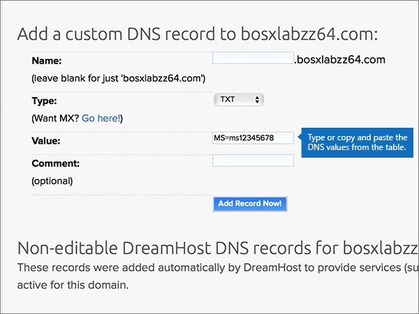
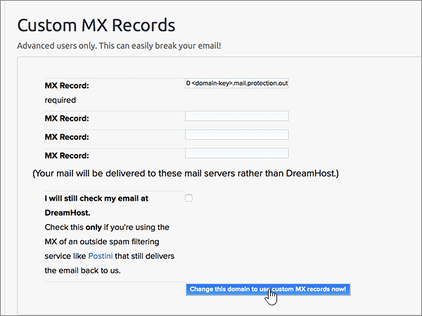

# Creare record DNS su Dreamhost per Office 365

 Se non si trova ciò che si sta cercando, **[vedere le domande frequenti sui domini](../setup/domains-faq.md)**. 
  
Se il proprio provider di hosting DNS è DreamHost, seguire i passaggi di questo articolo per verificare il dominio e configurare i record DNS per posta elettronica, Lync e così via.
 
Dopo aver aggiunto questi record in DreamHost, il domino sarà configurato per l'uso con i servizi di Office 365.
  
Per informazioni su hosting Web e DNS per i siti Web con Office 365, vedere [Usare un sito Web pubblico con Office 365](https://support.office.com/article/a8178510-501d-4bd8-9921-b04f2e9517a5.aspx).
  
> [!NOTE]
> In genere, l'applicazione delle modifiche ai record DNS richiede circa 15 minuti. A volte, tuttavia, l'aggiornamento di una modifica nel sistema DNS di Internet può richiedere più tempo. In caso di problemi relativi al flusso di posta o di altro tipo dopo l'aggiunta dei record DNS, vedere [Risolvere i problemi dopo la modifica del nome di dominio o dei record DNS](../get-help-with-domains/find-and-fix-issues.md). 
  
## Aggiungere un record TXT a scopo di verifica

Prima di usare il proprio dominio con Office 365, è necessario dimostrare di esserne proprietari. La capacità di accedere al proprio account nel registrar e di creare il record DNS dimostra a Office 365 che si è proprietari del dominio.
  
> [!NOTE]
> Questo record viene usato esclusivamente per verificare di essere proprietari del dominio e non ha altri effetti. È possibile eliminarlo in un secondo momento, se si preferisce. 
  
1. Per iniziare, passare alla propria pagina dei domini su DreamHost usando [questo collegamento](https://panel.dreamhost.com/). Verrà richiesto di eseguire l'accesso.
    
    
  
2. Nella pagina **Dashboard** selezionare **Domains**e quindi **Manage Domains**.
    
    
  
3. Nella sezione **Domain** della pagina **Manage** Domains selezionare **DNS** per il dominio che si desidera modificare. 
    
    
  
4. In the **Add a custom DNS record** section, in the boxes for the new record, type or copy and paste the values from the following table. 
    
    (You may have to scroll down.)
    
    (Choose the **Type** value from the drop-down list.) 
    
    |**Nome**|**Tipo**|**Valore**|**Commento**|
    |:-----|:-----|:-----|:-----|
    |(Leave this field empty.)    |TXT    |MS=ms *XXXXXXXX*    **Note:** questo è un esempio. Usare il valore specifico di **Indirizzo di destinazione o puntamento** indicato nella tabella in Office 365.           [Come trovarlo](../get-help-with-domains/information-for-dns-records.md)          |Questo campo è facoltativo.    |
   
   
  
5. Selezionare **Aggiungi record adesso.**
    
    
  
6. Attendere alcuni minuti prima di continuare, in modo che il record appena creato venga aggiornato in Internet.
    
Una volta aggiunto il record al sito del registrar, è possibile tornare in Office 365 e chiedere di cercarlo.
  
Quando Office 365 trova il record TXT corretto, il dominio è verificato.
  
1. Nell'interfaccia di amministrazione passare a **Impostazioni** \> pagina <a href="https://go.microsoft.com/fwlink/p/?linkid=834818" target="_blank">Domini</a>.

    
2. Nella pagina **Domini** selezionare il dominio da verificare. 
    
    
  
3. Nella pagina **Configurazione** selezionare **Avvia configurazione**.
    
    
  
4. Nella pagina **Verifica dominio** selezionare **Verifica**.
    
    
  
> [!NOTE]
>  In genere, l'applicazione delle modifiche ai record DNS richiede circa 15 minuti. A volte, tuttavia, l'aggiornamento di una modifica nel sistema DNS di Internet può richiedere più tempo. In caso di problemi relativi al flusso di posta o di altro tipo dopo l'aggiunta dei record DNS, vedere [Risolvere i problemi dopo la modifica del nome di dominio o dei record DNS](../get-help-with-domains/find-and-fix-issues.md). 
  

  
## Aggiungere un record MX in modo che la posta elettronica per il dominio venga recapitata in Office 365

Effettuare le operazioni seguenti.
  
1. Per iniziare, passare alla propria pagina dei domini su DreamHost usando [questo collegamento](https://panel.dreamhost.com/). Verrà richiesto di eseguire l'accesso.
    
    
  
2. Nella pagina **Dashboard** selezionare **mail**e quindi **MX personalizzato**.
    
    
  
3. Nella colonna **azioni** della sezione **Gestisci recapito della posta** selezionare **modifica** per il dominio che si desidera modificare. 
    
    
  
4. Nelle caselle del nuovo record nella sezione **Custom MX Record** digitare oppure copiare e incollare i valori della tabella seguente. 
    
    Può essere necessario scorrere la pagina.
    
    Se sono presenti altri record MX esistenti, contrassegnarli come da eliminare.
    
    |**Record MX (obbligatorio)**|
    |:-----|
    |0  *\<chiave-dominio\>*  .mail.protection.outlook.com.    **Questo valore DEVE terminare con un punto (.)**   0 è il valore di priorità MX. Aggiungerlo all'inizio del valore MX, separato dal resto del valore da uno spazio.    **Nota:** Ottenere la propria * \<chiave\> di dominio* dall'account di Office 365.           [Come trovarlo](../get-help-with-domains/information-for-dns-records.md)          |
   
    
  
5. Selezionare **modifica questo dominio per utilizzare i record MX personalizzati subito.**
    
    
  
6. Se sono presenti altri record MX, eliminarli selezionandone ognuno e premendo **CANC**. 
    
    
  
7. Se sono stati eliminati tutti i record, selezionare **Aggiorna i record MX personalizzati subito.**
    
    

  
## Aggiungere i sei record CNAME necessari per Office 365

Effettuare le operazioni seguenti.
  
1. Per iniziare, passare alla propria pagina dei domini su DreamHost usando [questo collegamento](https://panel.dreamhost.com/). Verrà richiesto di eseguire l'accesso.
    
    
  
2. Nella pagina **Dashboard** selezionare **Domains**e quindi **Manage Domains**.
    
    
  
3. Nella sezione **Domain** della pagina **Manage** Domains selezionare **DNS** per il dominio che si desidera modificare. 
    
    
  
4. Nelle caselle del nuovo record nella sezione **Add a custom DNS Record** digitare oppure copiare e incollare i valori dalla prima riga della tabella seguente. 
    
    (You may have to scroll down.)
    
    (Choose the **Type** value from the drop-down list.) 
    
    |**Nome**|**Tipo**|**Valore**|**Commento**|
    |:-----|:-----|:-----|:-----|
    |autodiscover    |CNAME    |autodiscover.outlook.com.    **Questo valore DEVE terminare con un punto (.)**   |Questo campo è facoltativo.    |
    |sip    |CNAME    |sipdir.online.lync.com.    **Questo valore DEVE terminare con un punto (.)**   |Questo campo è facoltativo.    |
    |lyncdiscover    |CNAME    |webdir.online.lync.com.    **Questo valore DEVE terminare con un punto (.)**   |Questo campo è facoltativo.    |
    |enterpriseregistration    |CNAME    |enterpriseregistration.windows.net.    **Questo valore DEVE terminare con un punto (.)**   |Questo campo è facoltativo.    |
    |enterpriseenrollment    |CNAME    |enterpriseenrollment-s.manage.microsoft.com.    **Questo valore DEVE terminare con un punto (.)**   |Questo campo è facoltativo.    |
   
    
  
5. Selezionare **Aggiungi record adesso.**
    
    
  
6. Se si utilizzano i due passaggi precedenti e i valori delle altre cinque righe nella tabella, aggiungere ognuno degli altri cinque record CNAME.

  
## Aggiungere un record TXT per SPF per evitare di ricevere posta indesiderata

> [!IMPORTANT]
> Non può essere presente più di un record TXT per SPF per un dominio. Se il dominio ha più record SPF, si verificheranno errori nella gestione della posta elettronica, oltre a problemi di recapito e di classificazione della posta indesiderata. If you already have an SPF record for your domain, don't create a new one for Office 365. Al contrario, aggiungere i valori di Office 365 richiesti al record corrente in modo da ottenere un *unico* record SPF che include entrambi i set di valori.
  
Effettuare le operazioni seguenti.
  
1. Per iniziare, passare alla propria pagina dei domini su DreamHost usando [questo collegamento](https://panel.dreamhost.com/). Verrà richiesto di eseguire l'accesso.
    
    
  
2. Nella pagina **Dashboard** selezionare **Domains**e quindi **Manage Domains**.
    
    
  
3. Nella sezione **Domain** della pagina **Manage** Domains selezionare **DNS** per il dominio che si desidera modificare. 
    
    
  
4. Nelle caselle del nuovo record nella sezione **Add a custom DNS Record** digitare oppure copiare e incollare i valori dalla prima riga della tabella seguente. 
    
    (You may have to scroll down.)
    
    (Choose the **Type** value from the drop-down list.) 
    
    |**Nome**|**Tipo**|**Valore**|**Commento**|
    |:-----|:-----|:-----|:-----|
    |(Leave this field empty.)    |TXT    |v=spf1 include:spf.protection.outlook.com -all    **Nota:** è consigliabile copiare e incollare questa voce, in modo che tutti i caratteri di spaziatura siano corretti.           |Questo campo è facoltativo.    |
   
   
  
5. Selezionare **Aggiungi record adesso.**
    
    
  
6. Usando i due passaggi descritti in precedenza e i valori dalla seconda riga nella tabella, aggiungere l'altro record SRV.
    
  
## Aggiungere i due record SRV necessari per Office 365

Effettuare le operazioni seguenti.
  
1. Per iniziare, passare alla propria pagina dei domini su DreamHost usando [questo collegamento](https://panel.dreamhost.com/). Verrà richiesto di eseguire l'accesso.
    
    
  
2. Nella pagina **Dashboard** selezionare **Domains**e quindi **Manage Domains**.
    
    
  
3. Nella sezione **Domain** della pagina **Manage** Domains selezionare **DNS** per il dominio che si desidera modificare. 
    
    
  
4. Nelle caselle del nuovo record nella sezione **Add a custom DNS Record** digitare oppure copiare e incollare i valori dalla prima riga della tabella seguente. 
    
    (You may have to scroll down.)
    
    (Choose the **Type** value from the drop-down list.) 
    
    |**Nome**|**Tipo**|**Valore**|**Commento**|
    |:-----|:-----|:-----|:-----|
    |_sip. _tls    |SRV    |100 1 443    sipdir.online.lync.com.    **Questo valore DEVE terminare con un punto (.)**   |Questo campo è facoltativo.    |
    |_sipfederationtls. _tcp    |SRV    |100 1 5061    sipfed.online.lync.com.    **Questo valore DEVE terminare con un punto (.)**   |Questo campo è facoltativo.    |
   
    
  
5. Selezionare **Aggiungi record adesso!**.
    
    
  
6. Usando i due passaggi descritti in precedenza e i valori dalla seconda riga nella tabella, aggiungere l'altro record SRV.
    
> [!NOTE]
>  In genere, l'applicazione delle modifiche ai record DNS richiede circa 15 minuti. A volte, tuttavia, l'aggiornamento di una modifica nel sistema DNS di Internet può richiedere più tempo. In caso di problemi relativi al flusso di posta o di altro tipo dopo l'aggiunta dei record DNS, vedere [Risolvere i problemi dopo la modifica del nome di dominio o dei record DNS](../get-help-with-domains/find-and-fix-issues.md). 

  
