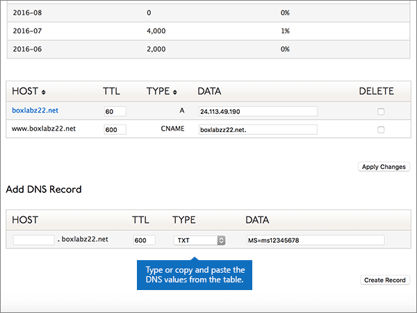

# Creare record DNS in Dyn.com per Microsoft

 **Se non si trova ciò che si sta cercando, vedere le [domande frequenti sui domini](../setup/domains-faq.md)**. 
  
Se il proprio provider di hosting DNS è Dyn.com, seguire i passaggi di questo articolo per verificare il dominio e configurare i record DNS per posta elettronica, Skype for Business online e così via.
 

  
> [!NOTE]
>  In genere, l'applicazione delle modifiche ai record DNS richiede circa 15 minuti. A volte, tuttavia, l'aggiornamento di una modifica nel sistema DNS di Internet può richiedere più tempo. In caso di problemi relativi al flusso di posta o di altro tipo dopo l'aggiunta dei record DNS, vedere [Risolvere i problemi dopo la modifica del nome di dominio o dei record DNS](../get-help-with-domains/find-and-fix-issues.md). 
  
## Aggiungere un record TXT a scopo di verifica

1. Per iniziare, passare alla propria pagina dei domini su Dyn.com usando [questo collegamento](https://account.dyn.com/dns/). Verrà richiesto di eseguire l'accesso.
    
    
  
2. Nella pagina **Servizi a livello di area** selezionare **dyn servizio DNS standard** per il dominio che si desidera modificare. 
    
3. Nella pagina **DNS** per il dominio, selezionare **Preferenze**.
    
4. Selezionare **Abilita interfaccia Expert**.
    
5. In the **Add DNS Record** section, in the boxes for the new record, type or copy and paste the values from the following table. 
    
    (Choose the **Type** value from the drop-down list.) 
    
    |**Host**|**TTL**|**Tipo**|**Dati**|
    |:-----|:-----|:-----|:-----|
    |(Leave this field empty.)    |600    |TXT    |MS=ms *XXXXXXXX*    **Note:** questo è un esempio. Usare il valore specifico di **Indirizzo di destinazione o puntamento** indicato nella tabella.           [Come trovarlo](../get-help-with-domains/information-for-dns-records.md)          |
       
   
  
6. Selezionare **Crea record**.
    
    
  
7. Attendere alcuni minuti prima di continuare, in modo che il record appena creato venga aggiornato in Internet.
    
Una volta che il record è stato aggiunto al sito del registrar, è possibile tornare a Microsoft e richiedere il record.
  
Quando Microsoft trova il record TXT corretto, il dominio è verificato.
  
1. Nell'interfaccia di amministrazione di Microsoft, passare alla pagina **Impostazioni** \> <a href="https://go.microsoft.com/fwlink/p/?linkid=834818" target="_blank">Domini</a>.

    
2. Nella pagina **Domini** selezionare il dominio da verificare. 
    
    
  
3. Nella pagina **Configurazione** selezionare **Avvia configurazione**.
    
    
  
4. Nella pagina **Verifica dominio** selezionare **Verifica**.
    
    
  
> [!NOTE]
>  In genere, l'applicazione delle modifiche ai record DNS richiede circa 15 minuti. A volte, tuttavia, l'aggiornamento di una modifica nel sistema DNS di Internet può richiedere più tempo. In caso di problemi relativi al flusso di posta o di altro tipo dopo l'aggiunta dei record DNS, vedere [Risolvere i problemi dopo la modifica del nome di dominio o dei record DNS](../get-help-with-domains/find-and-fix-issues.md). 
  
## Aggiungere un record MX in modo che la posta elettronica del dominio venga recapitata in Microsoft

1. Per iniziare, passare alla propria pagina dei domini su Dyn.com usando [questo collegamento](https://account.dyn.com/dns/). Verrà richiesto di eseguire l'accesso.
    
    
  
2. Nella pagina **Servizi a livello di area** selezionare **dyn servizio DNS standard** per il dominio che si desidera modificare. 
    
3. Nella pagina DNS per il dominio, selezionare **Preferenze**.
    
4. Selezionare **Abilita interfaccia Expert**.
    
5. In the **Add DNS Record** section, in the boxes for the new record, type or copy and paste the values from the following table. 
    
    (Choose the **Type** value from the drop-down list.) 
    
    |**Host**|**TTL**|**Tipo**|**Dati**|
    |:-----|:-----|:-----|:-----|
    |(Leave this field empty.)    |600    |MX    |10  *\<chiave-dominio\>*  .mail.protection.outlook.com.    **Questo valore DEVE terminare con un punto (.)**   **10** è il valore di priorità MX. Aggiungerlo all'inizio del valore MX, separato dal resto del valore da uno spazio.    **Nota:** Ottenere la propria * \<chiave\> di dominio* dal proprio account Microsoft.           [Come trovarlo](../get-help-with-domains/information-for-dns-records.md)           Per altre informazioni sulla priorità, vedere [Che cos'è la priorità MX](https://support.office.com/article/2784cc4d-95be-443d-b5f7-bb5dd867ba83.aspx).   |
   
    
  
6. Selezionare **Crea record**.
    
    
  
7. Se sono presenti altri record MX, rimuoverli selezionando la casella di controllo per ognuno di essi nella colonna **Delete**. 
    
    
  
8. Selezionare **Applica modifiche**.
    
    
  
## Aggiungere i sei record CNAME necessari per Microsoft

1. Per iniziare, passare alla propria pagina dei domini su Dyn.com usando [questo collegamento](https://account.dyn.com/dns/). Verrà richiesto di eseguire l'accesso.
    
    
  
2. Nella pagina **Servizi a livello di area** selezionare **dyn servizio DNS standard** per il dominio che si desidera modificare. 
    
3. Nella pagina **DNS** per il dominio, selezionare **Preferenze**.
    
4. Selezionare **Abilita interfaccia Expert**.
    
5. Aggiungere il primo dei sei record CNAME.
    
    Nelle caselle del nuovo record nella sezione **Add DNS Record** digitare oppure copiare e incollare i valori della prima riga della tabella seguente. 
    
    Selezionare il valore **Type** nell'elenco a discesa. 
    
    |**Host**|**TTL**|**Tipo**|**Data**|
    |:-----|:-----|:-----|:-----|
    |autodiscover    |600    |CNAME    |autodiscover.outlook.com.    **This value MUST end with a period (.)**   |
    |sip    |600    |CNAME    |sipdir.online.lync.com.    **This value MUST end with a period (.)**   |
    |lyncdiscover    |600    |CNAME    |webdir.online.lync.com.    **This value MUST end with a period (.)**   |
    |enterpriseregistration    |600    |CNAME    |enterpriseregistration.windows.net.    **This value MUST end with a period (.)**   |
    |enterpriseenrollment    |600    |CNAME    |enterpriseenrollment-s.manage.microsoft.com.    **This value MUST end with a period (.)**   |
   
    
  
6. Selezionare **Crea record**.
    
    
  
7. Aggiungere i cinque record CNAME restanti.
    
    Nella sezione **Add DNS record** creare un record usando i valori della riga successiva della tabella e quindi selezionare di nuovo **create record** per completare il record. 
    
    Ripetere questa procedura fino a creare tutti e sei i record CNAME.
    
## Aggiungere un record TXT per SPF per evitare di ricevere posta indesiderata

> [!IMPORTANT]
> Non può essere presente più di un record TXT per SPF per un dominio. Se il dominio ha più record SPF, si verificheranno errori nella gestione della posta elettronica, oltre a problemi di recapito e di classificazione della posta indesiderata. Se si dispone già di un record SPF per il dominio, non crearne uno nuovo per Microsoft. Al contrario, aggiungere i valori Microsoft necessari al record corrente in modo da disporre di un *singolo* record SPF che includa entrambi i set di valori.
  
1. Per iniziare, passare alla propria pagina dei domini su Dyn.com usando [questo collegamento](https://account.dyn.com/dns/). Verrà richiesto di eseguire l'accesso.
    
    
  
2. Nella pagina **Servizi a livello di area** selezionare **dyn servizio DNS standard** per il dominio che si desidera modificare. 
    
3. Nella pagina **DNS** per il dominio, selezionare **Preferenze**.
    
4. Selezionare **Abilita interfaccia Expert**.
    
5. In the **Add DNS Record** section, in the boxes for the new record, type or copy and paste the values from the following table. 
    
    (Choose the **Type** value from the drop-down list.) 
    
    |**Host**|**TTL**|**Tipo**|**Dati**|
    |:-----|:-----|:-----|:-----|
    |(Leave this field empty.)    |600    |TXT    |v=spf1 include:spf.protection.outlook.com -all    **Nota:** è consigliabile copiare e incollare questa voce, in modo che tutti i caratteri di spaziatura siano corretti.           |
   
    
  
6. Selezionare **Crea record**.
    
    
  
## Aggiungere i due record SRV necessari per Microsoft

1. Per iniziare, passare alla propria pagina dei domini su Dyn.com usando [questo collegamento](https://account.dyn.com/dns/). Verrà richiesto di eseguire l'accesso per primo 
    
    
  
2. Nella pagina **Servizi a livello di area** selezionare **dyn servizio DNS standard** per il dominio che si desidera modificare. 
    
3. Nella pagina **DNS** per il dominio, selezionare **Preferenze**.
    
4. Selezionare **Abilita interfaccia Expert**.
    
5. Aggiungere il primo dei due record SRV.
    
    Nelle caselle del nuovo record nella sezione **Add DNS Record** digitare oppure copiare e incollare i valori della prima riga della tabella seguente. 
    
    Selezionare il valore **Type** nell'elenco a discesa. 
    
    |**Host**|**TTL**|**Tipo**|**Data**|
    |:-----|:-----|:-----|:-----|
    |_sip. _tls|600|SRV|100 1 443 sipdir.online.lync.com. **This value MUST end with a period (.)** **Nota:** è consigliabile copiare e incollare questa voce, in modo che tutti i caratteri di spaziatura siano corretti.           |
    |_sipfederationtls. _tcp|600|SRV|100 1 5061 sipfed.online.lync.com. **This value MUST end with a period (.)**  **Nota:** è consigliabile copiare e incollare questa voce, in modo che tutti i caratteri di spaziatura siano corretti.           |
   
    
  
6. Selezionare **Crea record**.
    
    
  
7. Aggiungere l'altro record SRV.
    
    Nella sezione **Add DNS record** creare un record usando i valori della seconda riga della tabella e quindi selezionare di nuovo **create record** per completare il record. 
    
> [!NOTE]
>  In genere, l'applicazione delle modifiche ai record DNS richiede circa 15 minuti. A volte, tuttavia, l'aggiornamento di una modifica nel sistema DNS di Internet può richiedere più tempo. In caso di problemi relativi al flusso di posta o di altro tipo dopo l'aggiunta dei record DNS, vedere [Risolvere i problemi dopo la modifica del nome di dominio o dei record DNS](../get-help-with-domains/find-and-fix-issues.md). 
  
