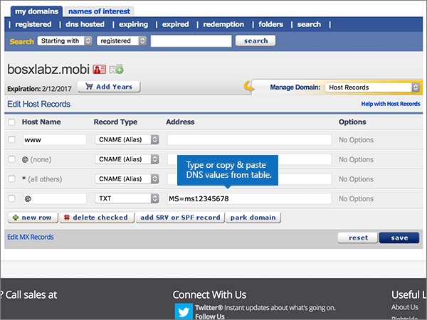

# Creare record DNS in eNomCentral per Microsoft

 **Se non si trova ciò che si sta cercando, [vedere le domande frequenti sui domini](../setup/domains-faq.md)**.

Se il proprio provider di hosting DNS è eNomCentral, seguire i passaggi di questo articolo per verificare il dominio e configurare i record DNS per posta elettronica, Skype for Business online e così via.

Dopo aver aggiunto questi record in eNomCentral, il dominio sarà configurato per l'uso con i servizi Microsoft.

> [!NOTE]
> In genere, l'applicazione delle modifiche ai record DNS richiede circa 15 minuti. A volte, tuttavia, l'aggiornamento di una modifica nel sistema DNS di Internet può richiedere più tempo. In caso di problemi relativi al flusso di posta o di altro tipo dopo l'aggiunta dei record DNS, vedere [Risolvere i problemi dopo la modifica del nome di dominio o dei record DNS](../get-help-with-domains/find-and-fix-issues.md).

## Aggiungere un record TXT a scopo di verifica

Prima di usare il proprio dominio con Microsoft, è necessario dimostrare di esserne il proprietario. La capacità di accedere al proprio account nel registrar e di creare il record DNS dimostra a Microsoft che si è il proprietario del dominio.

> [!NOTE]
> Questo record viene usato esclusivamente per verificare di essere proprietari del dominio e non ha altri effetti. È possibile eliminarlo in un secondo momento, se si preferisce.

Seguire i passaggi indicati sotto oppure [guardare il video (iniziare da 0:46)](https://support.microsoft.com/office/3766a9e8-77dd-4a42-908d-89b076143e7d).

1. Per iniziare, passare alla propria pagina dei domini su eNom Central usando [questo collegamento](https://www.enomcentral.com/domains/Domain-Manager.aspx?tab=registered). Verrà richiesto di eseguire l'accesso.

   

2. In **My Domains**selezionare il nome del dominio che si desidera modificare.

   

3. Nell'elenco a discesa **Manage Domain** scegliere **Host Records**.

   

4. Nelle caselle del nuovo record digitare oppure copiare e incollare i valori della tabella seguente.

   Scegliere il valore del **tipo di record** nell'elenco a discesa.

   |Nome host|Record Type|Indirizzo|
   |---|---|---|
   |@|TXT|MS=ms *XXXXXXXX*    **Note:** questo è un esempio. Usare il valore specifico di **Indirizzo di destinazione o puntamento** indicato nella tabella. [Come trovarlo](../get-help-with-domains/information-for-dns-records.md)|

   

5. Selezionare **Salva**.

   

6. Attendere alcuni minuti prima di continuare, in modo che il record appena creato venga aggiornato in Internet.

Una volta aggiunto il record al sito del registrar, è possibile tornare in Microsoft 365 e chiedere di cercarlo.

Quando Microsoft trova il record TXT corretto, il dominio è verificato.

1. Nell'interfaccia di amministrazione di Microsoft, passare alla pagina **Impostazioni** \> <a href="https://go.microsoft.com/fwlink/p/?linkid=834818" target="_blank">Domini</a>.

2. Nella pagina **Domini** selezionare il dominio da verificare.

3. Nella pagina **Configurazione** selezionare **Avvia configurazione**.

4. Nella pagina **Verifica dominio** selezionare **Verifica**.

> [!NOTE]
> In genere, l'applicazione delle modifiche ai record DNS richiede circa 15 minuti. A volte, tuttavia, l'aggiornamento di una modifica nel sistema DNS di Internet può richiedere più tempo. In caso di problemi relativi al flusso di posta o di altro tipo dopo l'aggiunta dei record DNS, vedere [Risolvere i problemi dopo la modifica del nome di dominio o dei record DNS](../get-help-with-domains/find-and-fix-issues.md).

## Aggiungere un record MX in modo che la posta elettronica del dominio venga recapitata in Microsoft

Seguire i passaggi indicati sotto oppure [guardare il video (iniziare da 3:40)](https://support.microsoft.com/office/3766a9e8-77dd-4a42-908d-89b076143e7d).

1. Per iniziare, passare alla propria pagina dei domini su eNom Central usando [questo collegamento](https://www.enomcentral.com/domains/Domain-Manager.aspx?tab=registered). Verrà richiesto di eseguire l'accesso.

   

2. In **My Domains**selezionare il nome del dominio che si desidera modificare.

   

3. Nell'elenco a discesa **Manage Domain** scegliere **Email Settings**.

   

4. Nell'elenco a discesa **Service Selection** scegliere **User (MX)**.

   

5. In the boxes for the new record, type or copy and paste the values from the following table.

   |Nome host|Indirizzo|Pref|
   |---|---|---|
   |@| *\<domain-key\>*. mail.protection.outlook.com.    **Questo valore DEVE terminare con un punto (.)**   **Nota:** Ottenere il vostro *\<domain-key\>* dal vostro account Microsoft. [Come trovarlo](../get-help-with-domains/information-for-dns-records.md)|10     Per altre informazioni sulla priorità, vedere [Informazioni sulla priorità MX](https://docs.microsoft.com/microsoft-365/admin/setup/domains-faq).|

   

6. Selezionare **Salva**.

   

7. Se sono presenti altri record MX esistenti, selezionare le caselle di controllo corrispondenti per selezionarli.

   

8. Selezionare **Delete Checked**.

   

## Aggiungere i record CNAME necessari per Microsoft

Seguire i passaggi indicati sotto oppure [guardare il video (iniziare da 4:24)](https://support.microsoft.com/office/3766a9e8-77dd-4a42-908d-89b076143e7d).

1. Per iniziare, passare alla propria pagina dei domini su eNom Central usando [questo collegamento](https://www.enomcentral.com/domains/Domain-Manager.aspx?tab=registered). Verrà richiesto di eseguire l'accesso.

   

2. In **My Domains**selezionare il nome del dominio che si desidera modificare.

   

3. Nell'elenco a discesa **Manage Domain** scegliere **Host Records**.

   

4. Selezionare **nuova riga**.

   

5. Nelle caselle dei nuovi sei record digitare oppure copiare e incollare i valori seguenti.

   Scegliere il valore del **tipo di record** nell'elenco a discesa.

   |Nome host|Record Type|Indirizzo|
   |---|---|---|
   |autodiscover|CNAME (alias)|autodiscover.outlook.com.    **Questo valore DEVE terminare con un punto (.)**|
   |sip|CNAME (alias)|sipdir.online.lync.com.    **Questo valore DEVE terminare con un punto (.)**|
   |lyncdiscover|CNAME (alias)|webdir.online.lync.com.    **Questo valore DEVE terminare con un punto (.)**|
   |enterpriseregistration|CNAME (alias)|enterpriseregistration.windows.net.    **Questo valore DEVE terminare con un punto (.)**|
   |enterpriseenrollment|CNAME (alias)|enterpriseenrollment-s.manage.microsoft.com.    **Questo valore DEVE terminare con un punto (.)**|

   

6. Selezionare **Salva**.

   

## Aggiungere un record TXT per SPF per evitare di ricevere posta indesiderata

> [!IMPORTANT]
> Non può essere presente più di un record TXT per SPF per un dominio. Se il dominio ha più record SPF, si verificheranno errori nella gestione della posta elettronica, oltre a problemi di recapito e di classificazione della posta indesiderata. Se si dispone già di un record SPF per il dominio, non crearne uno nuovo per Microsoft. Al contrario, aggiungere i valori Microsoft necessari al record corrente in modo da disporre di un *singolo* record SPF che includa entrambi i set di valori.

Seguire i passaggi indicati sotto oppure [guardare il video (iniziare da 5:12)](https://support.microsoft.com/office/3766a9e8-77dd-4a42-908d-89b076143e7d).

1. Per iniziare, passare alla propria pagina dei domini su eNom Central usando [questo collegamento](https://www.enomcentral.com/domains/Domain-Manager.aspx?tab=registered). Verrà richiesto di eseguire l'accesso.

   

2. In **My Domains**selezionare il nome del dominio che si desidera modificare.

   

3. Nell'elenco a discesa **Manage Domain** scegliere **Host Records**.

   

4. Nelle caselle del nuovo record digitare oppure copiare e incollare i valori della tabella seguente.

   Scegliere il valore del **tipo di record** nell'elenco a discesa.

   |Nome host|Record Type|Indirizzo|
   |---|---|---|
   |@|TXT|v=spf1 include:spf.protection.outlook.com -all   **Nota:** è consigliabile copiare e incollare questa voce, in modo che tutti i caratteri di spaziatura siano corretti.|

   

5. Selezionare **Salva**.

   

## Aggiungere i due record SRV necessari per Microsoft

Seguire i passaggi indicati sotto oppure [guardare il video (iniziare da 5:50)](https://support.microsoft.com/office/3766a9e8-77dd-4a42-908d-89b076143e7d).

1. Per iniziare, passare alla propria pagina dei domini su eNom Central usando [questo collegamento](https://www.enomcentral.com/domains/Domain-Manager.aspx?tab=registered). Verrà richiesto di eseguire l'accesso.

   

2. In **My Domains**selezionare il nome del dominio che si desidera modificare.

   

3. Nell'elenco a discesa **Manage Domain** scegliere **Host Records**.

   

4. A destra della **nuova riga**, selezionare **Aggiungi record SRV o SPF**.

   

5. Nelle caselle dei nuovi due record digitare oppure copiare e incollare i valori della tabella seguente.

   |Servizio|Protocollo|Priority|Peso|Porta|Destinazione (hostname)|
   |---|---|---|---|---|---|
   |_sip|_tls|100|1 |443|sipdir.online.lync.com.    **Questo valore DEVE terminare con un punto (.)**|
   |_sipfederationtls|_tcp|100|1 |5061|sipfed.online.lync.com.    **Questo valore DEVE terminare con un punto (.)**|

   

6. Seleziona **Salva**

   

> [!NOTE]
> In genere, l'applicazione delle modifiche ai record DNS richiede circa 15 minuti. A volte, tuttavia, l'aggiornamento di una modifica nel sistema DNS di Internet può richiedere più tempo. In caso di problemi relativi al flusso di posta o di altro tipo dopo l'aggiunta dei record DNS, vedere [Risolvere i problemi dopo la modifica del nome di dominio o dei record DNS](../get-help-with-domains/find-and-fix-issues.md).
