# Creare record DNS in Freenom per MicrosoftCreate DNS records at Freenom for Microsoft

Se non si trovano le informazioni desiderate, vedere le [domande frequenti sui domini](../setup/domains-faq.md).[Check the Domains FAQ ](../setup/domains-faq.md) if you don't find what you're looking for. 
  
> [!CAUTION]
> Il sito Web Freenom non supporta i record SRV, quindi diverse funzionalità di Skype for Business Online e Outlook Web App non funzioneranno.The Freenom website doesn't support SRV records, which means that several Skype for Business Online and Outlook Web App features won't work. Indipendentemente dal piano Microsoft utilizzato, sono presenti limitazioni rilevanti del servizio e potrebbe essere opportuno passare a un provider di hosting DNS diverso.No matter which Microsoft plan you use, there are significant service limitations, and you may want to switch to a different DNS hosting provider. 
  
Se nonostante le limitazioni del servizio, si sceglie di gestire i propri record Microsoft DNS in Freenom, seguire la procedura descritta in questo articolo per verificare il dominio e configurare i record DNS per la posta elettronica e altri servizi.If despite the service limitations, you choose to manage your own Microsoft DNS records at Freenom, follow the steps in this article to verify your domain and set up DNS records for email and other services.
  
  
> [!NOTE]
> In genere, l'applicazione delle modifiche ai record DNS richiede circa 15 minuti. A volte, tuttavia, l'aggiornamento di una modifica nel sistema DNS di Internet può richiedere più tempo. In caso di problemi relativi al flusso di posta o di altro tipo dopo l'aggiunta dei record DNS, vedere [Risolvere i problemi dopo la modifica del nome di dominio o dei record DNS](../get-help-with-domains/find-and-fix-issues.md).Typically it takes about 15 minutes for DNS changes to take effect. However, it can occasionally take longer for a change you've made to update across the Internet's DNS system. If you're having trouble with mail flow or other issues after adding DNS records, see [Troubleshoot issues after changing your domain name or DNS records](../get-help-with-domains/find-and-fix-issues.md). 
  
## Aggiungere un record TXT a scopo di verificaAdd a TXT record for verification

Prima di usare il proprio dominio con Microsoft, è necessario dimostrare di esserne il proprietario. La capacità di accedere al proprio account nel registrar e di creare il record DNS dimostra a Microsoft che si è il proprietario del dominio.Before you use your domain with Microsoft, we have to make sure that you own it. Your ability to log in to your account at your domain registrar and create the DNS record proves to Microsoft that you own the domain.
  
> [!NOTE]
> Questo record viene usato esclusivamente per verificare di essere proprietari del dominio e non ha altri effetti. È possibile eliminarlo in un secondo momento, se si preferisce.This record is used only to verify that you own your domain; it doesn't affect anything else. You can delete it later, if you like. 
  
1. Per iniziare, passare alla propria pagina dei domini in Freenom usando [questo collegamento](https://my.freenom.com/).To get started, go to your domains page in Freenom by using [this link](https://my.freenom.com/). Verrà chiesto di accedere.You'll be prompted to log in.
    
    
  
2. Selezionare **Servizi**, quindi selezionare **domini personali**.Select **Services**, and then select **My Domains**.
    
    
  
3. Per il dominio che si desidera modificare, selezionare **Gestisci dominio**.For the domain that you want to edit, select **Manage Domain**.
    
    
  
4. Selezionare **Gestisci FREENOM DNS**.Select **Manage Freenom DNS**.
    
    
  
5. In **Add Record** scegliere **TXT** dal menu nella colonna **Type**.Under **Add Record**, in the **Type** column, choose **TXT** from the menu. 
    
    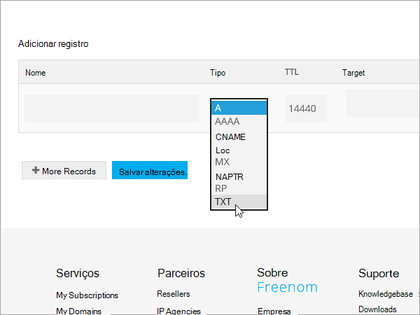
  
6. Nelle caselle per il nuovo record digitare oppure copiare e incollare i valori indicati nella tabella seguente.In the boxes for the new record, type or copy and paste the values from the following table. 
    
    |**Nome****Name**|**Type****Type**|**TTL****TTL**|**Destinazione****Target**|
    |:-----|:-----|:-----|:-----|
    |(lasciare vuoto)(leave blank)    |TXTTXT    |3600 (secondi)3600 (seconds)    |MS = msXXXXXXXXMS=msXXXXXXXX    **Note:** questo è un esempio.**Note:** This is an example. Usare il valore specifico di **Indirizzo di destinazione o puntamento** indicato nella tabella.Use your specific **Destination or Points to Address** value here, from the table.           [Come trovarloHow do I find this?](../get-help-with-domains/information-for-dns-records.md)          |
   
    
  
7. Selezionare **Salva modifiche**.Select **Save Changes**.
    
    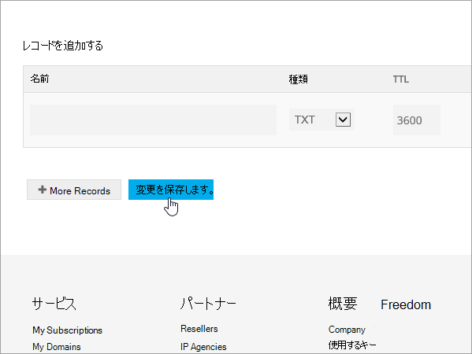
  
8. Attendere alcuni minuti prima di continuare, in modo che il record appena creato venga aggiornato in Internet.Wait a few minutes before you continue, so that the record you just created can update across the Internet.
    
Una volta che il record è stato aggiunto al sito del registrar, è possibile tornare a Microsoft e richiedere il record.Now that you've added the record at your domain registrar's site, you'll go back to Microsoft and request the record.
  
Quando Microsoft trova il record TXT corretto, il dominio è verificato.When Microsoft finds the correct TXT record, your domain is verified.
  
1. Nell'interfaccia di amministrazione di Microsoft, passare alla pagina **Impostazioni** \> <a href="https://go.microsoft.com/fwlink/p/?linkid=834818" target="_blank">Domini</a>.In the Microsoft admin center, go to the **Settings** \> <a href="https://go.microsoft.com/fwlink/p/?linkid=834818" target="_blank">Domains</a> page.

    
2. Nella pagina **Domini** selezionare il dominio da verificare.On the **Domains** page, select the domain that you are verifying. 
    
    
  
3. Nella pagina **Configurazione** selezionare **Avvia configurazione**.On the **Setup** page, select **Start setup**.
    
    
  
4. Nella pagina **Verifica dominio** selezionare **Verifica**.On the **Verify domain** page, select **Verify**.
    
    
  
> [!NOTE]
>  In genere, l'applicazione delle modifiche ai record DNS richiede circa 15 minuti. A volte, tuttavia, l'aggiornamento di una modifica nel sistema DNS di Internet può richiedere più tempo. In caso di problemi relativi al flusso di posta o di altro tipo dopo l'aggiunta dei record DNS, vedere [Risolvere i problemi dopo la modifica del nome di dominio o dei record DNS](../get-help-with-domains/find-and-fix-issues.md).Typically it takes about 15 minutes for DNS changes to take effect. However, it can occasionally take longer for a change you've made to update across the Internet's DNS system. If you're having trouble with mail flow or other issues after adding DNS records, see [Troubleshoot issues after changing your domain name or DNS records](../get-help-with-domains/find-and-fix-issues.md). 
  
## Aggiungere un record MX in modo che la posta elettronica del dominio venga recapitata in MicrosoftAdd an MX record so email for your domain will come to Microsoft

1. Per iniziare, passare alla propria pagina dei domini in Freenom usando [questo collegamento](https://my.freenom.com/).To get started, go to your domains page in Freenom by using [this link](https://my.freenom.com/). Verrà chiesto di accedere.You'll be prompted to log in.
    
    
  
2. Selezionare **Servizi**, quindi selezionare **domini personali**.Select **Services**, and then select **My Domains**.
    
    
  
3. Per il dominio che si desidera modificare, selezionare **Gestisci dominio**.For the domain that you want to edit, select **Manage Domain**.
    
    
  
4. Impostare il nome utilizzato per il dominio sui server dei nomi predefiniti di Freenom.Set the name serves for your domain to the default Freenom name servers. Selezionare **strumenti di gestione**e quindi fare clic su **Server dei nomi**.Select **Management Tools**, and then select **Nameservers**.
    
    
  
5. Verificare che sia selezionata l'opzione **Usa server dei nomi predefiniti** , quindi selezionare **Cambia server dei nomi**.Make sure **Use default nameservers** is selected, and then select **Change Nameservers**.
    
    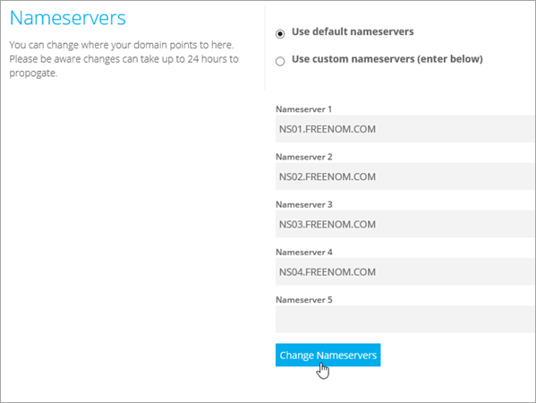
  
6. Selezionare **Gestisci FREENOM DNS**.Select **Manage Freenom DNS**.
    
    
  
7. In **Add Record** scegliere **MX** dal menu nella colonna **Type**.Under **Add Record**, in the **Type** column, choose **MX** from the menu. 
    
    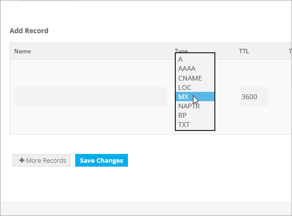
  
8. Nelle caselle del nuovo record digitare oppure copiare e incollare i valori dalla prima riga della tabella seguente..In the boxes for the new record, type or copy and paste the values from the first row of the following table. 
    
    |**Nome****Name**|**Type****Type**|**TTL****TTL**|**Destinazione****Target**|**Priorità****Priority**|
    |:-----|:-----|:-----|:-----|:-----|
    |(lasciare vuoto)(leave blank)    |MX (Mail Exchanger)MX (Mail Exchanger)    |3600 (secondi)3600 (seconds)    |\<domain-key\>. mail.protection.outlook.com\<domain-key\>.mail.protection.outlook.com    **Nota:** Ottenere il vostro  *\<domain-key\>*  dal vostro account Microsoft.**Note:** Get your  *\<domain-key\>*  from your Microsoft account.   [Come trovarloHow do I find this?](../get-help-with-domains/information-for-dns-records.md)          |10  10    Per altre informazioni sulla priorità, vedere [What is MX priority?](https://docs.microsoft.com/microsoft-365/admin/setup/domains-faq).For more information about priority, see [What is MX priority?](https://docs.microsoft.com/microsoft-365/admin/setup/domains-faq)   |
   
   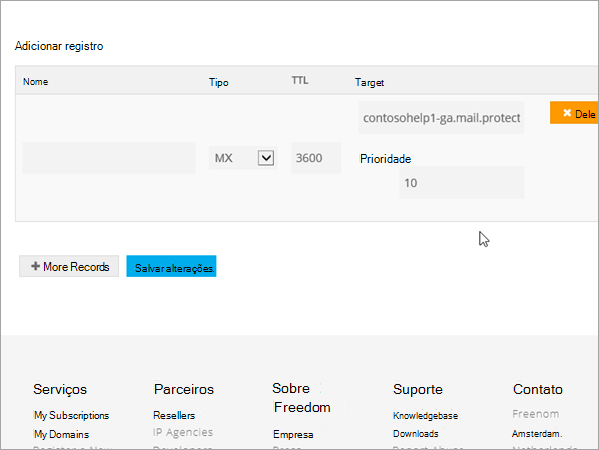
  
9. Selezionare **Salva modifiche**.Select **Save Changes**.
    
    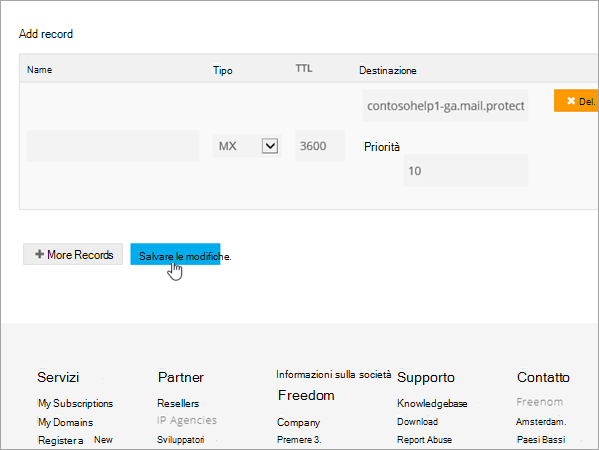
  
10. Se ci sono altri record MX, eliminarli.If there are any other MX records, delete them all. Per ogni record, selezionare **Elimina**.For each record, select **Delete**. Quando **si vuole davvero rimuovere questa voce?** viene visualizzata, selezionare **OK**.When the message **Do you really want to remove this entry?** appears, select **OK**.
    
## Aggiungere i record CNAME necessari per MicrosoftAdd the CNAME records that are required for Microsoft

1. Per iniziare, passare alla propria pagina dei domini in Freenom usando [questo collegamento](https://my.freenom.com/).To get started, go to your domains page in Freenom by using [this link](https://my.freenom.com/). Verrà chiesto di accedere.You'll be prompted to log in.
    
    
  
2. Selezionare **Servizi**, quindi selezionare **domini personali**.Select **Services**, and then select **My Domains**.
    
    
  
3. Per il dominio che si desidera modificare, selezionare **Gestisci dominio**.For the domain that you want to edit, select **Manage Domain**.
    
    
  
4. Selezionare **Gestisci FREENOM DNS**.Select **Manage Freenom DNS**.
    
    
  
5. In **Add Record** scegliere **CNAME** dal menu nella colonna **Type**.Under **Add Record**, in the **Type** column, choose **CNAME** from the menu. 
    
    
  
6. Creare il primo record CNAME. Nelle caselle del nuovo record digitare oppure copiare e incollare i valori della prima riga della tabella seguente.Create the first CNAME record. In the boxes for the new record, type or copy and paste the values from the first row of the following table. 
    
    |**Nome****Name**|**Tipo di record****Record type**|**TTL****TTL**|**Destinazione****Target**|
    |:-----|:-----|:-----|:-----|
    |individuazione automaticaautodiscover    |CNAMECNAME    |3600 (secondi)3600 (seconds)    |autodiscover.outlook.comautodiscover.outlook.com    |
    |sipsip    |CNAMECNAME    |3600 (secondi)3600 (seconds)    |sipdir.online.lync.comsipdir.online.lync.com    |
    |lyncdiscoverlyncdiscover    |CNAMECNAME    |3600 (secondi)3600 (seconds)    |webdir.online.lync.comwebdir.online.lync.com    |
    |enterpriseregistrationenterpriseregistration    |CNAMECNAME    |3600 (secondi)3600 (seconds)    |enterpriseregistration.windows.netenterpriseregistration.windows.net    |
    |enterpriseenrollmententerpriseenrollment    |CNAMECNAME    |3600 (secondi)3600 (seconds)    |enterpriseenrollment-s.manage.microsoft.comenterpriseenrollment-s.manage.microsoft.com    |
   
    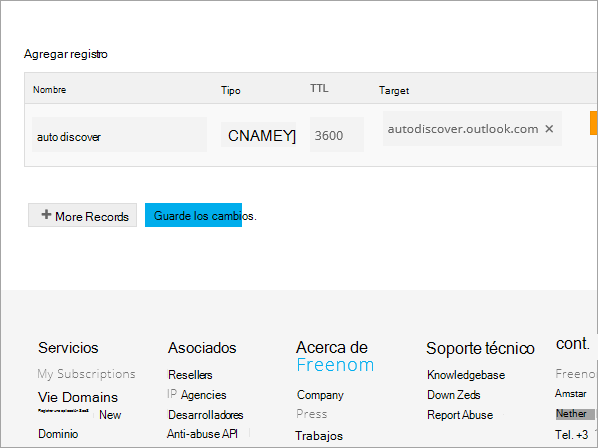
  
7. Selezionare **Salva modifiche**.Select **Save Changes**.
    
    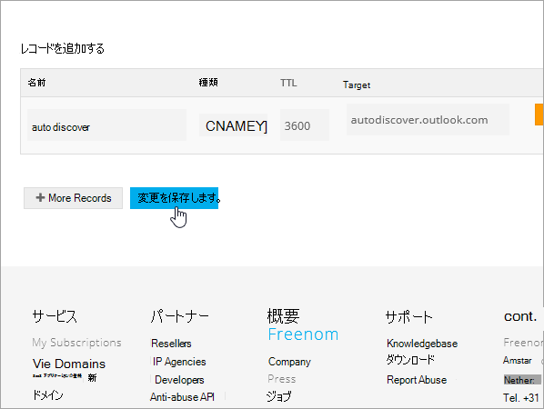
  
8. Ripetere i passaggi precedenti per creare gli altri cinque record CNAME.Repeat the previous steps to create the other five CNAME records. 
    
    Per ogni record, digitare o copiare e incollare i valori dalla riga successiva della tabella precedente nelle caselle corrispondenti.For each record, type or copy and paste the values from the next row of the table above into the boxes for that record.
    
## Aggiungere un record TXT per SPF per evitare di ricevere posta indesiderataAdd a TXT record for SPF to help prevent email spam

> [!IMPORTANT]
> Non può essere presente più di un record TXT per SPF per un dominio.You cannot have more than one TXT record for SPF for a domain. Se il dominio ha più record SPF, si verificheranno errori nella gestione della posta elettronica, oltre a problemi di recapito e di classificazione della posta indesiderata.If your domain has more than one SPF record, you'll get email errors, as well as delivery and spam classification issues. Se si dispone già di un record SPF per il dominio, non crearne uno nuovo per Microsoft.If you already have an SPF record for your domain, don't create a new one for Microsoft. Al contrario, aggiungere i valori Microsoft necessari al record corrente in modo da disporre di un  *singolo*  record SPF che includa entrambi i set di valori.Instead, add the required Microsoft values to the current record so that you have a  *single*  SPF record that includes both sets of values. 

1. Per iniziare, passare alla propria pagina dei domini in Freenom usando [questo collegamento](https://my.freenom.com/).To get started, go to your domains page in Freenom by using [this link](https://my.freenom.com/). Verrà chiesto di accedere.You'll be prompted to log in.
    
    
  
2. Selezionare **Servizi**, quindi selezionare **domini personali**.Select **Services**, and then select **My Domains**.
    
    
  
3. Per il dominio che si desidera modificare, selezionare **Gestisci dominio**.For the domain that you want to edit, select **Manage Domain**.
    
    
  
4. Selezionare **Gestisci FREENOM DNS**.Select **Manage Freenom DNS**.
    
    
  
5. In **Add Record** scegliere **TXT** dal menu nella colonna **Type**.Under **Add Record**, in the **Type** column, choose **TXT** from the menu. 
    
    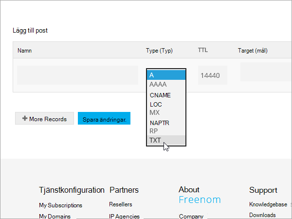
  
6. Nelle caselle del nuovo record digitare oppure copiare e incollare i valori seguenti.In the boxes for the new record, type or copy and paste the following values. 
    
    |**Nome****Name**|**Tipo di record****Record type**|**TTL****TTL**|**Destinazione****Target**|
    |:-----|:-----|:-----|:-----|
    |(lasciare vuoto)(leave blank)    |TXTTXT    |3600 (secondi)3600 (seconds)    |v=spf1 include:spf.protection.outlook.com -allv=spf1 include:spf.protection.outlook.com -all   **Nota:** è consigliabile copiare e incollare questa voce, in modo che tutti i caratteri di spaziatura siano corretti.**Note:** We recommend copying and pasting this entry, so that all of the spacing stays correct.           |
   
    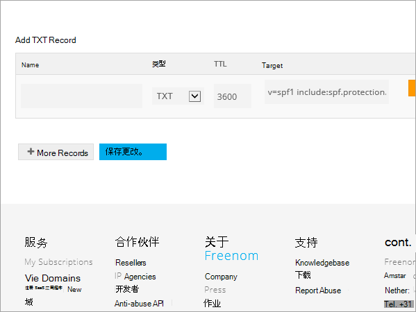
  
7. Selezionare **Salva modifiche**.Select **Save Changes**.
    
    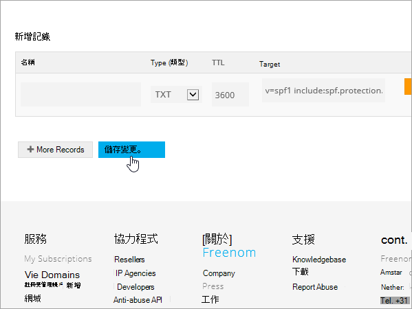
  

