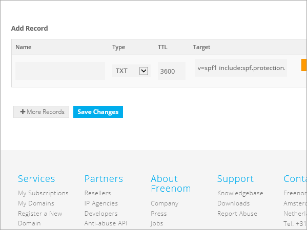

# Creare record DNS in Freenom per Microsoft

Se non si trovano le informazioni desiderate, vedere le [domande frequenti sui domini](../setup/domains-faq.md). 
  
> [!CAUTION]
> Il sito Web Freenom non supporta i record SRV, quindi diverse funzionalità di Skype for Business Online e Outlook Web App non funzioneranno. Indipendentemente dal piano Microsoft utilizzato, sono presenti limitazioni rilevanti del servizio e potrebbe essere opportuno passare a un provider di hosting DNS diverso. 
  
Se nonostante le limitazioni del servizio, si sceglie di gestire i propri record Microsoft DNS in Freenom, seguire la procedura descritta in questo articolo per verificare il dominio e configurare i record DNS per la posta elettronica e altri servizi.
  
  
> [!NOTE]
> In genere, l'applicazione delle modifiche ai record DNS richiede circa 15 minuti. A volte, tuttavia, l'aggiornamento di una modifica nel sistema DNS di Internet può richiedere più tempo. In caso di problemi relativi al flusso di posta o di altro tipo dopo l'aggiunta dei record DNS, vedere [Risolvere i problemi dopo la modifica del nome di dominio o dei record DNS](../get-help-with-domains/find-and-fix-issues.md). 
  
## Aggiungere un record TXT a scopo di verifica

Prima di usare il proprio dominio con Microsoft, è necessario dimostrare di esserne il proprietario. La capacità di accedere al proprio account nel registrar e di creare il record DNS dimostra a Microsoft che si è il proprietario del dominio.
  
> [!NOTE]
> Questo record viene usato esclusivamente per verificare di essere proprietari del dominio e non ha altri effetti. È possibile eliminarlo in un secondo momento, se si preferisce. 
  
1. Per iniziare, passare alla propria pagina dei domini in Freenom usando [questo collegamento](https://my.freenom.com/). Verrà chiesto di accedere.
    
    
  
2. Selezionare **Servizi**, quindi selezionare **domini personali**.
    
    
  
3. Per il dominio che si desidera modificare, selezionare **Gestisci dominio**.
    
    
  
4. Selezionare **Gestisci FREENOM DNS**.
    
    
  
5. In **Add Record** scegliere **TXT** dal menu nella colonna **Type**. 
    
    
  
6. Nelle caselle per il nuovo record digitare oppure copiare e incollare i valori indicati nella tabella seguente. 
    
    |**Nome**|**Tipo**|**TTL**|**Destinazione**|
    |:-----|:-----|:-----|:-----|
    |(lasciare vuoto)    |TXT    |3600 (secondi)    |MS = msXXXXXXXX    **Note:** questo è un esempio. Usare il valore specifico di **Indirizzo di destinazione o puntamento** indicato nella tabella.           [Come trovarlo](../get-help-with-domains/information-for-dns-records.md)          |
   
    
  
7. Selezionare **Salva modifiche**.
    
    
  
8. Attendere alcuni minuti prima di continuare, in modo che il record appena creato venga aggiornato in Internet.
    
Una volta che il record è stato aggiunto al sito del registrar, è possibile tornare a Microsoft e richiedere il record.
  
Quando Microsoft trova il record TXT corretto, il dominio è verificato.
  
1. Nell'interfaccia di amministrazione di Microsoft, passare alla pagina **Impostazioni** \> <a href="https://go.microsoft.com/fwlink/p/?linkid=834818" target="_blank">Domini</a>.

    
2. Nella pagina **Domini** selezionare il dominio da verificare. 
    
    
  
3. Nella pagina **Configurazione** selezionare **Avvia configurazione**.
    
    
  
4. Nella pagina **Verifica dominio** selezionare **Verifica**.
    
    
  
> [!NOTE]
>  In genere, l'applicazione delle modifiche ai record DNS richiede circa 15 minuti. A volte, tuttavia, l'aggiornamento di una modifica nel sistema DNS di Internet può richiedere più tempo. In caso di problemi relativi al flusso di posta o di altro tipo dopo l'aggiunta dei record DNS, vedere [Risolvere i problemi dopo la modifica del nome di dominio o dei record DNS](../get-help-with-domains/find-and-fix-issues.md). 
  
## Aggiungere un record MX in modo che la posta elettronica del dominio venga recapitata in Microsoft

1. Per iniziare, passare alla propria pagina dei domini in Freenom usando [questo collegamento](https://my.freenom.com/). Verrà chiesto di accedere.
    
    
  
2. Selezionare **Servizi**, quindi selezionare **domini personali**.
    
    
  
3. Per il dominio che si desidera modificare, selezionare **Gestisci dominio**.
    
    
  
4. Impostare il nome utilizzato per il dominio sui server dei nomi predefiniti di Freenom. Selezionare **strumenti di gestione**e quindi fare clic su **Server dei nomi**.
    
    
  
5. Verificare che sia selezionata l'opzione **Usa server dei nomi predefiniti** , quindi selezionare **Cambia server dei nomi**.
    
    
  
6. Selezionare **Gestisci FREENOM DNS**.
    
    
  
7. In **Add Record** scegliere **MX** dal menu nella colonna **Type**. 
    
    
  
8. Nelle caselle del nuovo record digitare oppure copiare e incollare i valori dalla prima riga della tabella seguente.. 
    
    |**Nome**|**Tipo**|**TTL**|**Destinazione**|**Priorità**|
    |:-----|:-----|:-----|:-----|:-----|
    |(lasciare vuoto)    |MX (Mail Exchanger)    |3600 (secondi)    |\<Domain-Key\>. mail.Protection.Outlook.com    **Nota:** Ottenere la propria * \<chiave\> di dominio* dal proprio account Microsoft.   [Come trovarlo](../get-help-with-domains/information-for-dns-records.md)          |10      Per altre informazioni sulla priorità, vedere [What is MX priority?](https://support.office.com/article/17d415c1-067e-4974-84d5-aaeaf3a0c0a9).   |
   
   
  
9. Selezionare **Salva modifiche**.
    
    
  
10. Se ci sono altri record MX, eliminarli. Per ogni record, selezionare **Elimina**. Quando **si vuole davvero rimuovere questa voce?** viene visualizzata, selezionare **OK**.
    
## Aggiungere i record CNAME necessari per Microsoft

1. Per iniziare, passare alla propria pagina dei domini in Freenom usando [questo collegamento](https://my.freenom.com/). Verrà chiesto di accedere.
    
    
  
2. Selezionare **Servizi**, quindi selezionare **domini personali**.
    
    
  
3. Per il dominio che si desidera modificare, selezionare **Gestisci dominio**.
    
    
  
4. Selezionare **Gestisci FREENOM DNS**.
    
    
  
5. In **Add Record** scegliere **CNAME** dal menu nella colonna **Type**. 
    
    
  
6. Creare il primo record CNAME. Nelle caselle del nuovo record digitare oppure copiare e incollare i valori della prima riga della tabella seguente. 
    
    |**Nome**|**Tipo di record**|**TTL**|**Destinazione**|
    |:-----|:-----|:-----|:-----|
    |autodiscover    |CNAME    |3600 (secondi)    |autodiscover.outlook.com    |
    |sip    |CNAME    |3600 (secondi)    |sipdir.online.lync.com    |
    |lyncdiscover    |CNAME    |3600 (secondi)    |webdir.online.lync.com    |
    |enterpriseregistration    |CNAME    |3600 (secondi)    |enterpriseregistration.windows.net    |
    |enterpriseenrollment    |CNAME    |3600 (secondi)    |enterpriseenrollment-s.manage.microsoft.com    |
   
    
  
7. Selezionare **Salva modifiche**.
    
    
  
8. Ripetere i passaggi precedenti per creare gli altri cinque record CNAME. 
    
    Per ogni record, digitare o copiare e incollare i valori dalla riga successiva della tabella precedente nelle caselle corrispondenti.
    
## Aggiungere un record TXT per SPF per evitare di ricevere posta indesiderata

> [!IMPORTANT]
> Non può essere presente più di un record TXT per SPF per un dominio. Se il dominio ha più record SPF, si verificheranno errori nella gestione della posta elettronica, oltre a problemi di recapito e di classificazione della posta indesiderata. Se si dispone già di un record SPF per il dominio, non crearne uno nuovo per Microsoft. Al contrario, aggiungere i valori Microsoft necessari al record corrente in modo da disporre di un *singolo* record SPF che includa entrambi i set di valori. 

1. Per iniziare, passare alla propria pagina dei domini in Freenom usando [questo collegamento](https://my.freenom.com/). Verrà chiesto di accedere.
    
    
  
2. Selezionare **Servizi**, quindi selezionare **domini personali**.
    
    
  
3. Per il dominio che si desidera modificare, selezionare **Gestisci dominio**.
    
    
  
4. Selezionare **Gestisci FREENOM DNS**.
    
    
  
5. In **Add Record** scegliere **TXT** dal menu nella colonna **Type**. 
    
    
  
6. Nelle caselle del nuovo record digitare oppure copiare e incollare i valori seguenti. 
    
    |**Nome**|**Tipo di record**|**TTL**|**Destinazione**|
    |:-----|:-----|:-----|:-----|
    |(lasciare vuoto)    |TXT    |3600 (secondi)    |v=spf1 include:spf.protection.outlook.com -all   **Nota:** è consigliabile copiare e incollare questa voce, in modo che tutti i caratteri di spaziatura siano corretti.           |
   
    
  
7. Selezionare **Salva modifiche**.
    
    
  

