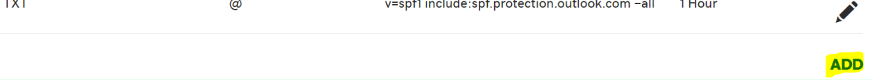

# Creare record DNS su GoDaddy per Microsoft

 **Se non si trova ciò che si sta cercando, [vedere le domande frequenti sui domini](../setup/domains-faq.yml)**.

Se il proprio provider di hosting DNS è GoDaddy, seguire i passaggi di questo articolo per verificare il dominio e configurare i record DNS per posta elettronica, Skype for Business online e così via.

Dopo aver aggiunto questi record in GoDaddy, il dominio sarà configurato per l'utilizzo con i servizi Microsoft.

> [!NOTE]
> In genere, l'applicazione delle modifiche ai record DNS richiede circa 15 minuti. A volte, tuttavia, l'aggiornamento di una modifica nel sistema DNS di Internet può richiedere più tempo. In caso di problemi relativi al flusso di posta o di altro tipo dopo l'aggiunta dei record DNS, vedere [Risolvere i problemi dopo la modifica del nome di dominio o dei record DNS](../get-help-with-domains/find-and-fix-issues.md).

## Aggiungere un record TXT a scopo di verifica

Prima di usare il proprio dominio con Microsoft, è necessario dimostrare di esserne il proprietario. La capacità di accedere al proprio account nel registrar e di creare il record DNS dimostra a Microsoft che si è il proprietario del dominio.

> [!NOTE]
> Questo record viene usato esclusivamente per verificare di essere proprietari del dominio e non ha altri effetti. È possibile eliminarlo in un secondo momento, se si preferisce.

Effettuare le operazioni seguenti.

1. Per iniziare, passare alla propria pagina dei domini su GoDaddy usando [questo collegamento](https://account.godaddy.com/products/?go_redirect=disabled). Verrà richiesto di eseguire l'accesso.

    

2. In **Domini** selezionare DNS nel dominio che si desidera modificare.

    

3. Selezionare **Aggiungi**.

    

4. Scegliere **TXT (Text)** nell'elenco a discesa. Nelle caselle del nuovo record digitare oppure copiare e incollare i valori della tabella seguente.

    |**Tipo di record** |**Host**|**TXT Value**|**TTL** |
    |:-----|:-----|:-----|:-----|
    |TXT (testo)|@|MS=ms *XXXXXXXX* **Nota:** questo è un esempio. Usare il valore specifico di **Indirizzo di destinazione o puntamento** indicato nella tabella. [Come trovarlo](../get-help-with-domains/information-for-dns-records.md)|1 ora   Selezionare un valore nell'elenco a discesa.|

      

5. Selezionare **Salva**.

6. Attendere alcuni minuti prima di continuare, in modo che il record appena creato venga aggiornato in Internet.

Una volta che il record è stato aggiunto al sito del registrar, è possibile tornare a Microsoft e richiedere il record.

Quando Microsoft trova il record TXT corretto, il dominio è verificato.
  
1. Nell'interfaccia di amministrazione di Microsoft, passare alla pagina **Impostazioni** \> <a href="https://go.microsoft.com/fwlink/p/?linkid=834818" target="_blank">Domini</a>.

    
2. Nella pagina **Domini** selezionare il dominio da verificare. 
    
    
  
3. Nella pagina **Configurazione** selezionare **Avvia configurazione**.

4. Nella pagina **Verifica dominio** selezionare **Verifica**.

> [!NOTE]
>  In genere, l'applicazione delle modifiche ai record DNS richiede circa 15 minuti. A volte, tuttavia, l'aggiornamento di una modifica nel sistema DNS di Internet può richiedere più tempo. In caso di problemi relativi al flusso di posta o di altro tipo dopo l'aggiunta dei record DNS, vedere [Risolvere i problemi dopo la modifica del nome di dominio o dei record DNS](../get-help-with-domains/find-and-fix-issues.md).

## Aggiungere un record MX in modo che la posta elettronica del dominio venga recapitata in Microsoft

Effettuare le operazioni seguenti.

1. Per iniziare, passare alla propria pagina dei domini su GoDaddy usando [questo collegamento](https://account.godaddy.com/products/?go_redirect=disabled). Verrà richiesto di eseguire l'accesso.

    

2. In **Domini** selezionare DNS nel dominio che si desidera modificare.

    

3. Selezionare **Aggiungi**.

    

4. Scegliere **MX (Mail Exchanger)** nell'elenco a discesa.

    

5. Nelle caselle del nuovo record digitare oppure copiare e incollare i valori della tabella seguente.

    Scegliere il **valore TTL** nell'elenco a discesa.

    |**Tipo di record**|**Host**|**Punta a**|**Priorità**|**TTL**|
    |:-----|:-----|:-----|:-----|:-----|
    |MX (Mail Exchanger)    |@    | *\<domain-key\>*  .mail.protection.outlook.com    **Nota:** Ottenere  *\<domain-key\>*  l'utente dal proprio account Microsoft.           [Come trovarlo](../get-help-with-domains/information-for-dns-records.md)          |10      Per altre informazioni sulla priorità, vedere [Informazioni sulla priorità MX](../setup/domains-faq.yml).   |1 ora    |

6. Selezionare **Salva**.

## Aggiungere i record CNAME necessari per Microsoft

Effettuare le operazioni seguenti.

1. Per iniziare, passare alla propria pagina dei domini su GoDaddy usando [questo collegamento](https://account.godaddy.com/products/?go_redirect=disabled). Verrà richiesto di eseguire l'accesso.

    

2. In **Domini** selezionare DNS nel dominio che si desidera modificare.

    

3. Selezionare **Aggiungi**.

    

4. Scegliere **CNAME (Alias)** nell'elenco a discesa.

    

5. Creare il primo record CNAME.

    Nelle caselle del nuovo record digitare oppure copiare e incollare i valori dalla prima riga della tabella seguente.

    Scegliere il **valore TTL** nell'elenco a discesa.

    |**Tipo di record**|**Host**|**Punta a**|**TTL**|
    |:-----|:-----|:-----|:-----|
    |CNAME (alias)    |individuazione automatica    |autodiscover.outlook.com    |1 ora    |
    |CNAME (alias)    |sip    |sipdir.online.lync.com    |1 ora    |
    |CNAME (alias)    |lyncdiscover    |webdir.online.lync.com    |1 ora    |
    |CNAME (alias)    |enterpriseregistration    |enterpriseregistration.windows.net    |1 ora    |
    |CNAME (alias)    |enterpriseenrollment    |enterpriseenrollment.manage.microsoft.com    |1 ora    |

6. Ripetere questi passaggi per aggiungere il record CNAME successivo fino a quando non sono stati creati tutti e sei i record CNAME.

## Aggiungere un record TXT per SPF per evitare di ricevere posta indesiderata

> [!IMPORTANT]
> Non può essere presente più di un record TXT per SPF per un dominio. Se il dominio ha più record SPF, si verificheranno errori nella gestione della posta elettronica, oltre a problemi di recapito e di classificazione della posta indesiderata. Se si dispone già di un record SPF per il dominio, non crearne uno nuovo per Microsoft. Aggiungere invece i valori Microsoft necessari al record corrente in modo da disporre di un singolo record  *SPF*  che include entrambi i set di valori.

Effettuare le operazioni seguenti.

1. Per iniziare, passare alla propria pagina dei domini su GoDaddy usando [questo collegamento](https://account.godaddy.com/products/?go_redirect=disabled). Verrà richiesto di eseguire l'accesso.

    

2. In **Domini** selezionare DNS nel dominio che si desidera modificare.

    

3. Selezionare **Aggiungi**.

    

4. Scegliere **TXT (Text)** nell'elenco a discesa.

    

5. Nelle caselle del nuovo record digitare oppure copiare e incollare i valori seguenti.

    Scegliere il **valore TTL** dagli elenchi a discesa.

    |**Tipo di record**|**Host**|**TXT Value**|**TTL**|
    |:-----|:-----|:-----|:-----|
    |TXT (testo)    |@    |v=spf1 include:spf.protection.outlook.com -all    **Nota:** è consigliabile copiare e incollare questa voce, in modo che tutti i caratteri di spaziatura siano corretti.           |1 ora    |

    

6. Selezionare **Salva**.

## Aggiungere i due record SRV necessari per Microsoft

Effettuare le operazioni seguenti.

1. Per iniziare, passare alla propria pagina dei domini su GoDaddy usando [questo collegamento](https://account.godaddy.com/products/?go_redirect=disabled). Verrà richiesto di eseguire l'accesso.

    

2. In **Domini** selezionare DNS nel dominio che si desidera modificare.

    

3. Selezionare **Aggiungi**.

    

4. Scegliere **SRV** nell'elenco a discesa.

    

5. Creare il primo record SRV.

    Nelle caselle del nuovo record digitare oppure copiare e incollare i valori dalla prima riga della tabella seguente.

    Scegliere i **valori Tipo di record** e **TTL** dagli elenchi a discesa.

    |**Tipo di record**|**Nome**|**Destinazione**|**Protocollo**|**Servizio**|**Priorità**|**Peso**|**Porta**|**TTL**|
    |:-----|:-----|:-----|:-----|:-----|:-----|:-----|:-----|:-----|
    |SRV (Service)    |@    |sipdir.online.lync.com    |_tls    |_sip    |100    |1    |443    |1 ora    |
    |SRV (Service)    |@    |sipfed.online.lync.com    |_tcp    |_sipfederationtls    |100    |1    |5061    |1 ora    |

    

6. Ripetere **il passaggio 5** per creare l'altro record SRV.

7. Selezionare **Salva**.

> [!NOTE]
> In genere, l'applicazione delle modifiche ai record DNS richiede circa 15 minuti. A volte, tuttavia, l'aggiornamento di una modifica nel sistema DNS di Internet può richiedere più tempo. In caso di problemi relativi al flusso di posta o di altro tipo dopo l'aggiunta dei record DNS, vedere [Risolvere i problemi dopo la modifica del nome di dominio o dei record DNS](../get-help-with-domains/find-and-fix-issues.md).