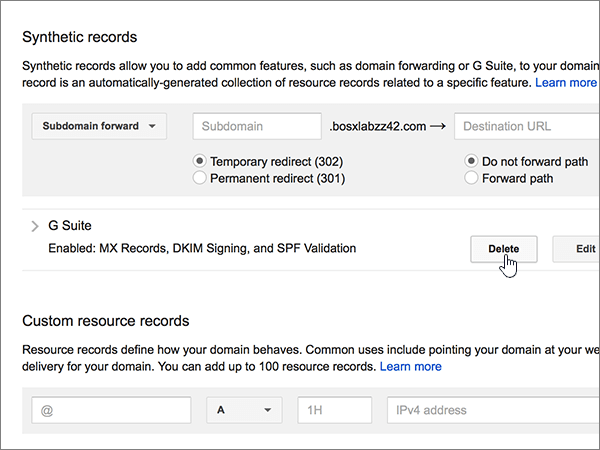
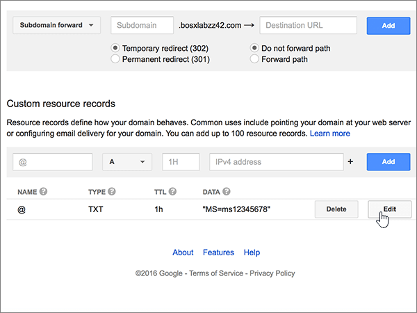

# Creare record DNS su Google Domains per Office 365

 **Se non si trova ciò che si sta cercando, [vedere le domande frequenti sui domini](../setup/domains-faq.md)**. 
  
Se il proprio provider di hosting DNS è Google Domains, seguire i passaggi di questo articolo per verificare il dominio e configurare i record DNS per posta elettronica, Lync e così via.
  
Dopo aver aggiunto questi record in Google Domains, il domino sarà configurato per l'uso con i servizi di Office 365.
  
Per informazioni su hosting Web e DNS per i siti Web con Office 365, vedere [Usare un sito Web pubblico con Office 365](https://support.office.com/article/choose-a-public-website-3325d50e-d131-403c-a278-7f3296fe33a9).
  
> [!NOTE]
> In genere l'applicazione delle modifiche al DNS richiede circa 15 minuti. A volte può tuttavia capitare che l'aggiornamento di una modifica nel sistema DNS di Internet richieda più tempo. In caso di problemi con il flusso di posta o di altro tipo dopo l'aggiunta dei record DNS, vedere [Individuare e correggere i problemi dopo l'aggiunta del dominio o dei record DNS in Office 365](../get-help-with-domains/find-and-fix-issues.md). 
  
## Aggiungere un record TXT a scopo di verifica

Prima di usare il proprio dominio con Office 365, è necessario dimostrare di esserne proprietari. La capacità di accedere al proprio account nel registrar e di creare il record DNS dimostra a Office 365 che si è proprietari del dominio.
  
> [!NOTE]
> Questo record viene usato esclusivamente per verificare di essere proprietari del dominio e non ha altri effetti. È possibile eliminarlo in un secondo momento, se si preferisce. 
  
1. Per iniziare, passare alla propria pagina dei domini su Google Domains usando [questo collegamento](https://domains.google.com/registrar). Verrà richiesto di eseguire l'accesso. A questo scopo:
    
1. Selezionare **Accedi**.
    
2. Immettere le credenziali di accesso e quindi selezionare **di nuovo accedi**.
    
2. Nella pagina **My Domains** trovare il dominio che si desidera utilizzare con Office 365 e selezionare il collegamento **Gestisci** accanto a esso. Nel riquadro di spostamento a sinistra, selezionare **DNS**.
    
3. Nelle caselle del nuovo record nella sezione * * Custom Resource Records * * digitare oppure copiare e incollare i valori della tabella seguente. 
    
    (You may have to scroll down.)
    
    (Choose the **Type** value from the drop-down list.) 
    
    |||||
    |:-----|:-----|:-----|:-----|
    |**Nome**   |**Tipo**   |**TTL**   |**Data**   |
    |@    |TXT    |1H    |MS=ms *XXXXXXXX*    **Note:** questo è un esempio. Usare il valore specifico di **Indirizzo di destinazione o puntamento** indicato nella tabella in Office 365. [Come trovarlo](../get-help-with-domains/information-for-dns-records.md)          |
   
4. Seleziona **Aggiungi**.
    
5. Attendere alcuni minuti prima di continuare, in modo che il record appena creato venga aggiornato in Internet.
    
Now that you've added the record at your domain registrar's site, you'll go back to Office 365 and request Office 365 to look for the record.
  
When Office 365 finds the correct TXT record, your domain is verified.
  
1. Nell'interfaccia di amministrazione, andare alla pagina **** \> <a href="https://go.microsoft.com/fwlink/p/?linkid=834818" target="_blank">Domains</a> Settings.

    
2. Nella pagina **Domains** selezionare il dominio che si sta verificando. 
    
3. Nella pagina **configurazione** , selezionare **Avvia installazione**.
    
4. Nella pagina **Verifica dominio** selezionare **Verifica**.
    
> [!NOTE]
> In genere l'applicazione delle modifiche al DNS richiede circa 15 minuti. A volte può tuttavia capitare che l'aggiornamento di una modifica nel sistema DNS di Internet richieda più tempo. In caso di problemi con il flusso di posta o di altro tipo dopo l'aggiunta dei record DNS, vedere [Individuare e correggere i problemi dopo l'aggiunta del dominio o dei record DNS in Office 365](../get-help-with-domains/find-and-fix-issues.md). 

  
## Aggiungere un record MX in modo che la posta elettronica per il dominio venga recapitata in Office 365

1. Per iniziare, passare alla propria pagina dei domini su Google Domains usando [questo collegamento](https://domains.google.com/registrar). Verrà richiesto di eseguire l'accesso. A questo scopo:
    
2. Selezionare **Accedi**.
    
3. Immettere le credenziali di accesso e quindi selezionare **di nuovo accedi**.
4. Nella sezione **Domain** **della pagina** Domains selezionare **configure DNS** for the Domain che si desidera modificare.
    
    > [!IMPORTANT]
    > Con un account di posta elettronica di G Suite, prima di tutto è necessario eliminare i record MX associati all'account. I record MX di G Suite impediscono l'aggiunta di altri record, tra cui quelli necessari per Office 365. Si noti che l'eliminazione di record di G Suite non comporta l'eliminazione dell'account di G Suite. Per eliminare i record MX di G Suite, seguire i passaggi seguenti. 
  
5. Nell'area **G Suite** della sezione **Synthetic Records** selezionare **Delete**.
    
    (You may have to scroll down.)
    
    
  
6. Selezionare **Elimina**.
    
    
  
7. In the **Custom resource records** section, in the boxes for the new record, type or copy and paste the values from the following table. 
    
    (You may have to scroll down.)
    
    (Choose the **Type** value from the drop-down list.) 
    
    |**Nome**|**Tipo**|**TTL**|**Data**|
    |:-----|:-----|:-----|:-----|
    |@    |MX    |1H    |0  *\<chiave-dominio\>*  .mail.protection.outlook.com.    **Questo valore DEVE terminare con un punto (.)**   **0** è il valore di priorità MX. Aggiungerlo all'inizio del valore MX, separato dal resto del valore da uno spazio.    **Nota:** Ottenere la \<propria *chiave* \> di dominio dall'account di Office 365.  [Come trovarlo](../get-help-with-domains/information-for-dns-records.md)          Per altre informazioni sulla priorità, vedere [Informazioni sulla priorità MX](https://support.office.com/article/2784cc4d-95be-443d-b5f7-bb5dd867ba83.aspx).   |
   
    
  
5. Seleziona **Aggiungi**.
    
    
  
6. Se sono presenti altri record MX personalizzati, rimuoverli.
    
1. Selezionare **modifica** nella riga MX record. 
    
    
  
2. Per ognuno degli altri record MX personalizzati, selezionare la voce nella casella **dati** e quindi premere **Canc** sulla tastiera per eliminare il record. 
    
    Continuare fino a eliminare la voce **Data** per tutti gli altri record MX. 
    
    
  
7. Quando è stata eliminata la voce di **dati** per ognuno degli altri record MX, selezionare **Salva** per salvare le modifiche. 
    
    
  
## Aggiungere i cinque record CNAME necessari per Office 365

1. Per iniziare, passare alla propria [pagina Google Domains] (https://domains.google.com/registrar) e accedere.
    
2. Nella sezione **Domain** **della pagina** Domains selezionare **configure DNS** for the Domain che si desidera modificare. 
    
3. Aggiungere il primo record CNAME.
    
    Nelle caselle del nuovo record nella sezione **Custom resource records** digitare oppure copiare e incollare i valori dalla prima riga della tabella seguente. 
    
    (You may have to scroll down.)
    
    (Choose the **Type** value from the drop-down list.) 
    
    |**Nome**|**Tipo**|**TTL**|**Data**|
    |:-----|:-----|:-----|:-----|
    |autodiscover    |CNAME    |1H    |autodiscover.outlook.com.    **This value MUST end with a period (.)**   |
    |sip    |CNAME    |1H    |sipdir.online.lync.com.    **This value MUST end with a period (.)**   |
    |lyncdiscover    |CNAME    |1H    |webdir.online.lync.com.    **This value MUST end with a period (.)**   |
    |enterpriseregistration    |CNAME    |1H    |enterpriseregistration.windows.net.    **This value MUST end with a period (.)**   |
    |enterpriseenrollment    |CNAME    |1H    |enterpriseenrollment-s.manage.microsoft.com.    **This value MUST end with a period (.)**   |
   
    
  
4. Seleziona **Aggiungi**.
    
    
  
5. Aggiungere gli altri quattro record CNAME.
    
    Nella sezione **Custom Resource Records** creare un record usando i valori della riga successiva della tabella e quindi scegliere di nuovo **Add** per completare il record. 
    
    Ripetere questa procedura fino a creare tutti i record CNAME necessari.
    
## Aggiungere un record TXT per SPF per evitare di ricevere posta indesiderata

> [!IMPORTANT]
> You cannot have more than one TXT record for SPF for a domain. If your domain has more than one SPF record, you'll get email errors, as well as delivery and spam classification issues. If you already have an SPF record for your domain, don't create a new one for Office 365. Instead, add the required Office 365 values to the current record so that you have a single SPF record that includes both sets of values. Servono esempi? Vedere queste [informazioni dettagliate e record SPF di esempio](https://support.office.com/article/c0531a6f-9e25-4f2d-ad0e-a70bfef09ac0#bkmk_spfrecords). Per convalidare il record SPF, è possibile usare uno di questi [strumenti di convalida SPF](../setup/domains-faq.md). 
  
1. Per iniziare, passare alla propria pagina dei domini su Google Domains usando [questo collegamento](https://domains.google.com/registrar). Verrà richiesto di eseguire l'accesso. A questo scopo:
    
1. Selezionare **Accedi**.
    
2. Immettere le credenziali di accesso e quindi selezionare **di nuovo accedi**.
    
3. Nella sezione **Domain** **della pagina** Domains selezionare **configure DNS** for the Domain che si desidera modificare. 
    
4. Nella sezione **record di risorse personalizzate** fare clic su **modifica**nella riga TXT record. 
    
    > [!IMPORTANT]
    > Google Domains archivia i record TXT come un set che potrebbe contenere più record. Quando si ha almeno un altro record TXT, ad esempio il record TXT usato per verificare il dominio, è necessario aggiungere nuovi record TXT a tale set di record. Quando si tenta immettere altri record TXT come voci separate, viene generato il messaggio di errore **Duplicate record**. 
  
    
  
5. Selezionare il controllo **(+)** . 
    
    
  
6. Nelle caselle del nuovo record digitare oppure copiare e incollare i valori della tabella seguente.
    
    Può essere necessario scorrere la pagina.
    
    |**Data**|
    |:-----|
    |v=spf1 include:spf.protection.outlook.com -all    

    > [!NOTE]
    > We recommend copying and pasting this entry, so that all of the spacing stays correct.           
   
   
  
7. Selezionare **Salva**.
    
    
  
## Aggiungere i due record SRV necessari per Office 365

1. Per iniziare, passare alla propria pagina dei domini su Google Domains usando [questo collegamento](https://domains.google.com/registrar). Verrà richiesto di eseguire l'accesso. A questo scopo:
    
2. Selezionare **Accedi**.
    
3. Immettere le credenziali di accesso e quindi selezionare **di nuovo accedi**.
    
4. Nella sezione **Domain** **della pagina** Domains selezionare **configure DNS** for the Domain che si desidera modificare. 
    
5. Aggiungere il primo record SRV.
    
    In the **Custom resource records** section, in the boxes for the new record, type or copy and paste the values from the following table. 
    
    (You may have to scroll down.)
    
    (Choose the **Type** value from the drop-down list.) 
    
    |**Nome**|**Tipo**|**TTL**|**Dati**|
    |:-----|:-----|:-----|:-----|
    |_sip. _tls|SRV|1H|100 1 443 sipdir.online.lync.com. **Questo valore deve terminare con un punto (.).** **Nota:** È consigliabile copiare e incollare questa voce, in modo che tutti gli spazi siano corretti.           |
    |_sipfederationtls. _tcp|SRV|1H|100 1 5061 sipfed.online.lync.com. **This value MUST end with a period (.)**

    We recommend copying and pasting this entry, so that all of the spacing stays correct.       
   
    
  
6. Seleziona **Aggiungi**.
    
    
  
7. Aggiungere l'altro record SRV.
    
    Nella sezione **Custom Resource Records** creare un record usando i valori della seconda riga della tabella e quindi fare di nuovo clic su **Aggiungi** per completare il record. 
    
    > [!NOTE]
    > In genere l'applicazione delle modifiche al DNS richiede circa 15 minuti. A volte può tuttavia capitare che l'aggiornamento di una modifica nel sistema DNS di Internet richieda più tempo. In caso di problemi con il flusso di posta o di altro tipo dopo l'aggiunta dei record DNS, vedere [Individuare e correggere i problemi dopo l'aggiunta del dominio o dei record DNS in Office 365](../get-help-with-domains/find-and-fix-issues.md). 
  
