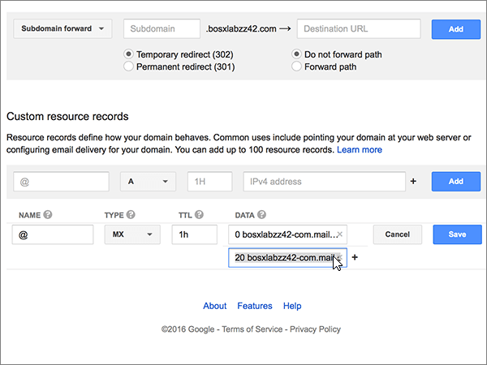
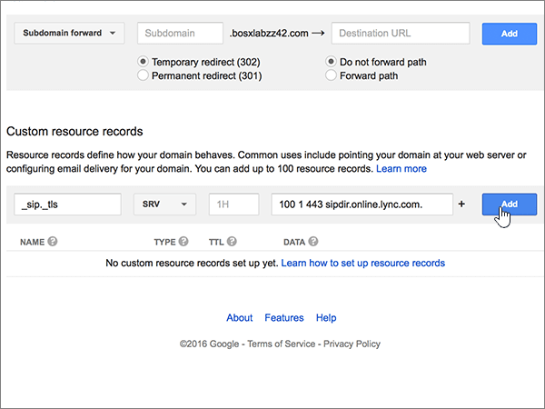

# Creare record DNS su Google Domains per Microsoft

 Se non si trova ciò che si sta cercando, **[vedere le domande frequenti sui domini](../setup/domains-faq.md)**. 
  
Se il proprio provider di hosting DNS è Google Domains, seguire i passaggi di questo articolo per verificare il dominio e configurare i record DNS per posta elettronica, Lync e così via.
  
Dopo aver aggiunto questi record in Google Domains, il domino sarà configurato per l'uso con i servizi di Microsoft.
  

  
> [!NOTE]
> Solitamente, affinché le modifiche DNS diventino effettive, sono necessari circa 15 minuti. A volte può tuttavia capitare che l'aggiornamento di una modifica nel sistema DNS di Internet richieda più tempo. In caso di problemi con il flusso di posta o di altro tipo dopo l'aggiunta dei record DNS, vedere [Individuare e correggere i problemi dopo l'aggiunta del dominio o dei record DNS in Microsoft](../get-help-with-domains/find-and-fix-issues.md). 
  
## Aggiungere un record TXT a scopo di verifica

Before you use your domain with Microsoft, we have to make sure that you own it. Your ability to log in to your account at your domain registrar and create the DNS record proves to Microsoft that you own the domain.
  
> [!NOTE]
> This record is used only to verify that you own your domain; it doesn't affect anything else. You can delete it later, if you like. 
  
1. To get started, go to your domains page at Google Domains by using [this link](https://domains.google.com/registrar). You'll be prompted to sign in. To do so:
    
1. Scegliere **Accedi**.
    
2. Immettere le credenziali di accesso e poi selezionare di nuovo **Accedi**.
    
2. Nella pagina **My domains** individuare il dominio che si vuole usare con Microsoft e selezionare il collegamento **GESTISCI** accanto. Nel riquadro di spostamento sinistro scegliere **DNS**.
    
3. Nelle caselle del nuovo record nella sezione **Custom resource records** digitare oppure copiare e incollare i valori della tabella seguente. 
    
    Può essere necessario scorrere la pagina.
    
    Selezionare il valore **Type** nell'elenco a discesa. 
    
    |||||
    |:-----|:-----|:-----|:-----|
    |**Nome**   |**Type**   |**TTL**   |**Dati**   |
    |@    |TXT    |1H    |MS=ms *XXXXXXXX*    **Note:** questo è un esempio. Usare il valore specifico di **Indirizzo di destinazione o puntamento** indicato nella tabella. [Come trovarlo](../get-help-with-domains/information-for-dns-records.md)          |
   
4. Selezionare **Aggiungi**.
    
5. Attendere alcuni minuti prima di continuare, in modo che il record appena creato venga aggiornato in Internet.
    
Una volta che il record è stato aggiunto al sito del registrar, è possibile tornare a Microsoft e richiedere il record.
  
Quando Microsoft trova il record TXT corretto, il dominio è verificato.
  
1. Nell'interfaccia di amministrazione di Microsoft, passare alla pagina **Impostazioni** \> <a href="https://go.microsoft.com/fwlink/p/?linkid=834818" target="_blank">Domini</a>.

    
2. Nella pagina **Domini** selezionare il dominio da verificare. 
    
3. Nella pagina **Configurazione** selezionare **Avvia configurazione**.
    
4. Nella pagina **Verifica dominio** selezionare **Verifica**.
    
> [!NOTE]
> Typically it takes about 15 minutes for DNS changes to take effect. However, it can occasionally take longer for a change you've made to update across the Internet's DNS system. If you're having trouble with mail flow or other issues after adding DNS records, see [Find and fix issues after adding your domain or DNS records](../get-help-with-domains/find-and-fix-issues.md). 

  
## Aggiungere un record MX in modo che la posta elettronica del dominio venga recapitata in Microsoft

1. To get started, go to your domains page at Google Domains by using [this link](https://domains.google.com/registrar). You'll be prompted to sign in. To do so:
    
2. Scegliere **Accedi**.
    
3. Immettere le credenziali di accesso e poi selezionare di nuovo **Accedi**.
4. Nella pagina **Domains**, nella sezione **Domain**, selezionare **Configura DNS** per il dominio che si vuole modificare.
    
    > [!IMPORTANT]
    > Con un account di posta elettronica di G Suite, prima di tutto è necessario eliminare i record MX associati all'account. I record MX di G Suite impediscono l'aggiunta di altri record, tra cui quelli necessari per Microsoft. Si noti che l'eliminazione di record di G Suite non comporta l'eliminazione dell'account di G Suite. Per eliminare i record MX di G Suite, seguire i passaggi seguenti. 
  
5. Nella sezione **Synthetic records**, nell’area **G Suite**, selezionare **Elimina**.
    
    Potrebbe essere necessario scorrere la pagina.
    
    
  
6. Selezionare **Elimina**.
    
    
  
7. Nelle caselle del nuovo record nella sezione **Custom resource records** digitare oppure copiare e incollare i valori della tabella seguente. 
    
    Può essere necessario scorrere la pagina.
    
    Selezionare il valore **Type** nell'elenco a discesa. 
    
    |**Nome**|**Type**|**TTL**|**Dati**|
    |:-----|:-----|:-----|:-----|
    |@    |MX    |1H    |0  *\<domain-key\>*  .mail.protection.outlook.com.    **Questo valore DEVE terminare con un punto (.)**   The **0** is the MX priority value. Add it to the beginning of the MX value, separated from the remainder of the value by a space.    **Nota:** ottenere il valore \<*domain-key*\> dal proprio account Microsoft.  [Come trovarlo](../get-help-with-domains/information-for-dns-records.md)          Per altre informazioni sulla priorità, vedere [Che cos'è la priorità MX](https://docs.microsoft.com/microsoft-365/admin/setup/domains-faq).   |
   
    
  
5. Selezionare **Aggiungi**.
    
    
  
6. Se sono presenti altri record MX personalizzati, rimuoverli.
    
1. Fare clic su **Modifica**nella riga del record MX. 
    
    
  
2. Per ognuno degli altri record MX personalizzati, selezionare la voce nella casella **Dati** e premere il tasto **Elimina** sulla tastiera per eliminare il record. 
    
    Continuare fino a eliminare la voce **Data** per tutti gli altri record MX. 
    
    
  
7. Dopo avere eliminato la voce **Dati** per ognuno degli altri record MX, selezionare **Salva** per salvare le modifiche. 
    
    
  
## Aggiungere i cinque record CNAME necessari per Microsoft

1. Per iniziare, passare alla propria [pagina Google Domains] (https://domains.google.com/registrar) ed effettuare l’accesso.
    
2. Nella pagina **Domains**, nella sezione **Domain**, selezionare **Configura DNS** per il dominio che si vuole modificare. 
    
3. Aggiungere il primo record CNAME.
    
    Nelle caselle del nuovo record nella sezione **Custom resource records** digitare oppure copiare e incollare i valori dalla prima riga della tabella seguente. 
    
    Può essere necessario scorrere la pagina.
    
    Selezionare il valore **Type** nell'elenco a discesa. 
    
    |**Nome**|**Type**|**TTL**|**Dati**|
    |:-----|:-----|:-----|:-----|
    |individuazione automatica    |CNAME    |1H    |autodiscover.outlook.com.    **Questo valore DEVE terminare con un punto (.)**   |
    |sip    |CNAME    |1H    |sipdir.online.lync.com.    **Questo valore DEVE terminare con un punto (.)**   |
    |lyncdiscover    |CNAME    |1H    |webdir.online.lync.com.    **Questo valore DEVE terminare con un punto (.)**   |
    |enterpriseregistration    |CNAME    |1H    |enterpriseregistration.windows.net.    **Questo valore DEVE terminare con un punto (.)**   |
    |enterpriseenrollment    |CNAME    |1H    |enterpriseenrollment-s.manage.microsoft.com.    **Questo valore DEVE terminare con un punto (.)**   |
   
    
  
4. Selezionare **Aggiungi**.
    
    
  
5. Aggiungere gli altri quattro record CNAME.
    
    Nella sezione **Custom resource records** creare un record usando i valori della riga successiva della tabella e quindi selezionare di nuovo **Aggiungi** per completare il record. 
    
    Ripetere questa procedura fino a creare tutti e sei i record CNAME necessari.
    
## Aggiungere un record TXT per SPF per evitare di ricevere posta indesiderata

> [!IMPORTANT]
> Non può essere presente più di un record TXT per SPF per un dominio. Se il dominio ha più record SPF, si verificheranno errori nella gestione della posta elettronica, oltre a problemi di recapito e di classificazione della posta indesiderata. Se si dispone già di un record SPF per il dominio, non crearne uno nuovo per Microsoft. Al contrario, aggiungere i valori di Microsoft necessari al record corrente in modo da ottenere un unico record SPF che include entrambi i set di valori. Servono esempi? Consultare [Record Domain Name System (DNS) esterni per Microsoft](https://docs.microsoft.com/office365/enterprise/external-domain-name-system-records#bkmk_spfrecords). To validate your SPF record, you can use one of these [SPF validation tools](../setup/domains-faq.md). 
  
1. To get started, go to your domains page at Google Domains by using [this link](https://domains.google.com/registrar). You'll be prompted to sign in. To do so:
    
1. Scegliere **Accedi**.
    
2. Immettere le credenziali di accesso e poi selezionare di nuovo **Accedi**.
    
3. Nella pagina **Domains**, nella sezione **Domain**, selezionare **Configura DNS** per il dominio che si vuole modificare. 
    
4. Nella riga del record TXT nella sezione **Custom resource records** selezionare **Modifica**. 
    
    > [!IMPORTANT]
    > Google Domains stores TXT records as a set that may contain multiple records. When you have at least one other TXT record, such as the TXT record you used to verify your domain, you must add TXT new records to that record set. Any attempt to enter additional TXT records as separate entries will result in a **Duplicate record** error message. 
  
    
  
5. Selezionare il controllo **(+)**. 
    
    
  
6. Nelle caselle del nuovo record digitare oppure copiare e incollare i valori della tabella seguente.
    
    Può essere necessario scorrere la pagina.
    
    |**Dati**|
    |:-----|
    |v=spf1 include:spf.protection.outlook.com -all    

    > [!NOTE]
    > È consigliabile copiare e incollare questa voce, in modo che tutti i caratteri di spaziatura siano corretti.           
   
   
  
7. Seleziona **Salva**.
    
    
  
## Aggiungere i due record SRV necessari per Microsoft

1. To get started, go to your domains page at Google Domains by using [this link](https://domains.google.com/registrar). You'll be prompted to sign in. To do so:
    
2. Scegliere **Accedi**.
    
3. Immettere le credenziali di accesso e poi selezionare di nuovo **Accedi**.
    
4. Nella pagina **Domains**, nella sezione **Domain**, selezionare **Configura DNS** per il dominio che si vuole modificare. 
    
5. Aggiungere il primo record SRV.
    
    Nelle caselle del nuovo record nella sezione **Custom resource records** digitare oppure copiare e incollare i valori della tabella seguente. 
    
    Può essere necessario scorrere la pagina.
    
    Selezionare il valore **Type** nell'elenco a discesa. 
    
    |**Nome**|**Type**|**TTL**|**Dati**|
    |:-----|:-----|:-----|:-----|
    |_sip._tls|SRV|1H|100 1 443 sipdir.online.lync.com. **Questo valore DEVE terminare con un punto (.)** **Nota:** È consigliabile copiare e incollare questa voce, in modo che tutti i caratteri di spaziatura siano corretti.           |
    |_sipfederationtls._tcp|SRV|1H|100 1 5061 sipfed.online.lync.com. **Questo valore DEVE terminare con un punto (.)**

    È consigliabile copiare e incollare questa voce, in modo che tutti i caratteri di spaziatura siano corretti.       
   
    
  
6. Selezionare **Aggiungi**.
    
    
  
7. Aggiungere l'altro record SRV.
    
    Nella sezione **Custom resource records** creare un record usando i valori della seconda riga della tabella e quindi scegliere di nuovo **Aggiungi** per completare il record. 
    
    > [!NOTE]
    > Typically it takes about 15 minutes for DNS changes to take effect. However, it can occasionally take longer for a change you've made to update across the Internet's DNS system. If you're having trouble with mail flow or other issues after adding DNS records, see [Find and fix issues after adding your domain or DNS records](../get-help-with-domains/find-and-fix-issues.md). 
  
