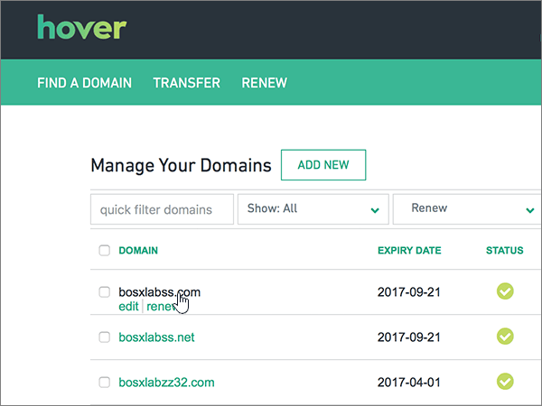
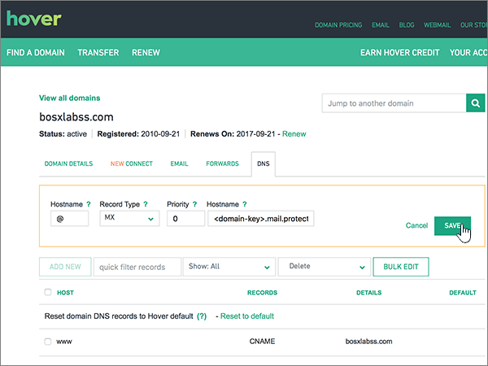
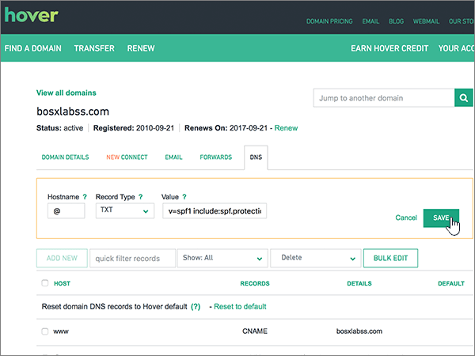

# Creare record DNS su Hover per Office 365

 **Se non si trova ciò che si sta cercando, [vedere le domande frequenti sui domini](../setup/domains-faq.md)**. 
  
Se il proprio provider di hosting DNS è Hover, seguire i passaggi di questo articolo per verificare il dominio e configurare i record DNS per posta elettronica, Skype for Business online e così via.
     
Dopo aver aggiunto questi record in Hover, il domino sarà configurato per l'uso con i servizi di Office 365.
  
Per informazioni su hosting Web e DNS per i siti Web con Office 365, vedere [Usare un sito Web pubblico con Office 365](https://support.office.com/article/choose-a-public-website-3325d50e-d131-403c-a278-7f3296fe33a9).
  
> [!NOTE]
>  In genere, l'applicazione delle modifiche ai record DNS richiede circa 15 minuti. A volte, tuttavia, l'aggiornamento di una modifica nel sistema DNS di Internet può richiedere più tempo. In caso di problemi relativi al flusso di posta o di altro tipo dopo l'aggiunta dei record DNS, vedere [Risolvere i problemi dopo la modifica del nome di dominio o dei record DNS](../get-help-with-domains/find-and-fix-issues.md). 
  
## Aggiungere un record TXT a scopo di verifica

Prima di usare il proprio dominio con Office 365, è necessario dimostrare di esserne proprietari. La capacità di accedere al proprio account nel registrar e di creare il record DNS dimostra a Office 365 che si è proprietari del dominio.
  
> [!NOTE]
> Questo record viene usato esclusivamente per verificare di essere proprietari del dominio e non ha altri effetti. È possibile eliminarlo in un secondo momento, se si preferisce. 
  
Seguire i passaggi indicati sotto oppure [guardare il video](https://support.office.com/article/Video-Create-DNS-records-at-Hover-for-Office-365-182bd58e-8fe4-4717-9233-3a3546b72ad2?ui=en-US&amp;rs=en-US&amp;ad=US).
  
1. Per iniziare, passare alla propria pagina dei domini su Hover usando [questo collegamento](https://www.hover.com/domains). Verrà richiesto di eseguire l'accesso.
    
    
  
2. In **Manage your Domains**selezionare il nome del dominio che si desidera modificare.
    
    
  
3. Selezionare la scheda **DNS** . 
    
    
  
4. Selezionare **Aggiungi nuovo**.
    
    
  
5. In the boxes for the new record, select **TXT** for the **Record Type**, and then type or copy and paste the values from the following table.
    
    ||||
    |:-----|:-----|:-----|
    |Nome host    |Tipo di record    |Valore    |
    |@    |TXT    |MS=ms *XXXXXXXX*    **Note:** questo è un esempio. Usare il valore specifico di **Indirizzo di destinazione o puntamento** indicato nella tabella in Office 365.           [Come trovarlo](../get-help-with-domains/information-for-dns-records.md)          |
   
    
  
6. Selezionare **Salva**.
    
    
  
7. Attendere alcuni minuti prima di continuare, in modo che il record appena creato venga aggiornato in Internet.
    
Now that you've added the record at your domain registrar's site, you'll go back to Office 365 and request Office 365 to look for the record.
  
When Office 365 finds the correct TXT record, your domain is verified.
  
1. Nell'interfaccia di amministrazione, andare alla pagina **** \> <a href="https://go.microsoft.com/fwlink/p/?linkid=834818" target="_blank">Domains</a> Settings.
    
2. Nella pagina **Domains** selezionare il dominio che si sta verificando. 
    
    
  
3. Nella pagina **configurazione** , selezionare **Avvia installazione**.
    
    
  
4. Nella pagina **Verifica dominio** selezionare **Verifica**.
    
    
  
> [!NOTE]
>  In genere l'applicazione delle modifiche al DNS richiede circa 15 minuti. A volte può tuttavia capitare che l'aggiornamento di una modifica nel sistema DNS di Internet richieda più tempo. In caso di problemi con il flusso di posta o altro dopo l'aggiunta dei record DNS, vedere [Risolvere i problemi dopo la modifica del nome di dominio o dei record DNS](../get-help-with-domains/find-and-fix-issues.md). 
  
## Aggiungere un record MX in modo che la posta elettronica per il dominio venga recapitata in Office 365

Seguire i passaggi indicati sotto oppure [guardare il video](https://support.office.com/article/Video-Create-DNS-records-at-Hover-for-Office-365-182bd58e-8fe4-4717-9233-3a3546b72ad2?ui=en-US&amp;rs=en-US&amp;ad=US).
  
1. Per iniziare, passare alla propria pagina dei domini su Hover usando [questo collegamento](https://www.hover.com/domains). Verrà richiesto di eseguire l'accesso.
    
    
  
2. In **Manage your Domains**selezionare il nome del dominio che si desidera modificare.
    
    
  
3. Selezionare la scheda **DNS** . 
    
    
  
4. Selezionare **Aggiungi nuovo**.
    
    
  
5. Nelle caselle del nuovo record selezionare **MX** per **Record Type** e quindi digitare oppure copiare e incollare i valori della tabella seguente.
    
    |**Nome host**|**Tipo di record**|**Priority**|**Hostname**|
    |:-----|:-----|:-----|:-----|
    |@    |MX    |0    Per altre informazioni sulla priorità, vedere [Informazioni sulla priorità MX](https://support.office.com/article/2784cc4d-95be-443d-b5f7-bb5dd867ba83.aspx).   | *\<chiave-dominio\>*  .mail.protection.outlook.com    **Nota:** Ottenere la propria * \<chiave\> di dominio* dall'account di Office 365.           [Come trovarlo](../get-help-with-domains/information-for-dns-records.md)          |
   
    
  
6. Selezionare **Salva**.
    
    
  
7. Se sono presenti altri record MX, usare il processo in due passaggi seguente per rimuovere ognuno di essi:
    
    In primo luogo, mouse su un record che si desidera rimuovere, selezionare **Elimina**.
    
    
  
    In secondo luogo, selezionare **Sì** per confermare ogni eliminazione. 
    
    
  
    Ripetere quest'operazione fino a eliminare tutti i record MX, ad eccezione di quello aggiunto in precedenza in questa procedura.
    
## Aggiungere i record CNAME necessari per Office 365

Seguire i passaggi indicati sotto oppure [guardare il video](https://support.office.com/article/Video-Create-DNS-records-at-Hover-for-Office-365-182bd58e-8fe4-4717-9233-3a3546b72ad2?ui=en-US&amp;rs=en-US&amp;ad=US).
  
1. Per iniziare, passare alla propria pagina dei domini su Hover usando [questo collegamento](https://www.hover.com/domains). Verrà richiesto di eseguire l'accesso.
    
    
  
2. In **Manage your Domains**selezionare il nome del dominio che si desidera modificare.
    
    
  
3. Selezionare la scheda **DNS** . 
    
    
  
4. Aggiungere il primo dei sei record CNAME.
    
    Selezionare **Aggiungi nuovo**.
    
    
  
5. Nelle caselle vuote del nuovo record selezionare **CNAME** per **Record Type** e quindi digitare oppure copiare e incollare i valori dalla prima riga nella tabella seguente.
    
    |**Hostname**|**Tipo di record**|**Target Host**|
    |:-----|:-----|:-----|
    |autodiscover    |CNAME    |autodiscover.outlook.com    |
    |sip    |CNAME    |sipdir.online.lync.com    |
    |lyncdiscover    |CNAME    |webdir.online.lync.com    |
    |enterpriseregistration    |CNAME    |enterpriseregistration.windows.net    |
    |enterpriseenrollment    |CNAME    |enterpriseenrollment-s.manage.microsoft.com    |
   
    
  
6. Selezionare **Salva**.
    
    
  
7. Usando i tre passaggi descritti in precedenza e i valori dalle altre cinque righe nella tabella, aggiungere ognuno degli altri cinque record CNAME.
    
## Aggiungere un record TXT per SPF per evitare di ricevere posta indesiderata

> [!IMPORTANT]
> You cannot have more than one TXT record for SPF for a domain. If your domain has more than one SPF record, you'll get email errors, as well as delivery and spam classification issues. If you already have an SPF record for your domain, don't create a new one for Office 365. Al contrario, aggiungere i valori di Office 365 necessari al record corrente in modo che sia presente un *singolo* record SPF che includa entrambi i set di valori. 
  
Seguire i passaggi indicati sotto oppure [guardare il video](https://support.office.com/article/Video-Create-DNS-records-at-Hover-for-Office-365-182bd58e-8fe4-4717-9233-3a3546b72ad2?ui=en-US&amp;rs=en-US&amp;ad=US).
  
1. Per iniziare, passare alla propria pagina dei domini su Hover usando [questo collegamento](https://www.hover.com/domains). Verrà richiesto di eseguire l'accesso.
    
    
  
2. In **Manage your Domains**selezionare il nome del dominio che si desidera modificare.
    
    
  
3. Selezionare la scheda **DNS** . 
    
    
  
4. Selezionare **Aggiungi nuovo**.
    
    
  
5. In the boxes for the new record, select **TXT** for the **Record Type**, and then type or copy and paste the values from the following table.
    
    |**Nome host**|**Tipo di record**|**Valore**|
    |:-----|:-----|:-----|
    |@    |TXT    |v=spf1 include:spf.protection.outlook.com -all   **Nota:** è consigliabile copiare e incollare questa voce, in modo che tutti i caratteri di spaziatura siano corretti.           |
   
    
  
6. Selezionare **Salva**.
    
    
  
## Aggiungere i due record SRV necessari per Office 365

Seguire i passaggi indicati sotto oppure [guardare il video](https://support.office.com/article/Video-Create-DNS-records-at-Hover-for-Office-365-182bd58e-8fe4-4717-9233-3a3546b72ad2?ui=en-US&amp;rs=en-US&amp;ad=US).
  
1. Per iniziare, passare alla propria pagina dei domini su Hover usando [questo collegamento](https://www.hover.com/domains). Verrà richiesto di eseguire l'accesso.
    
    
  
2. In **Manage your Domains**selezionare il nome del dominio che si desidera modificare.
    
    
  
3. Selezionare la scheda **DNS** . 
    
    
  
4. Aggiungere il primo dei due record SRV.
    
    Selezionare **Aggiungi nuovo**.
    
    
  
5. Nelle caselle vuote del nuovo record selezionare **SRV** per **Record Type** e quindi digitare oppure copiare e incollare i valori dalla prima riga nella tabella seguente.
    
    |**Hostname**|**Tipo di record**|**Priority**|**Peso**|**Port**|**Target**|
    |:-----|:-----|:-----|:-----|:-----|:-----|
    |_sip. _tls    |SRV    |100    |1    |443    |sipdir.online.lync.com    |
    |_sipfederationtls. _tcp    |SRV    |100    |1    |5061    |sipfed.online.lync.com    |
   
    
  
6. Selezionare **Salva**.
    
    
  
7. Usando i tre passaggi descritti in precedenza e i valori dalla seconda riga nella tabella, aggiungere l'altro record SRV.
    
> [!NOTE]
> In genere l'applicazione delle modifiche al DNS richiede circa 15 minuti. A volte può tuttavia capitare che l'aggiornamento di una modifica nel sistema DNS di Internet richieda più tempo. In caso di problemi con il flusso di posta o altro dopo l'aggiunta dei record DNS, vedere [Risolvere i problemi dopo la modifica del nome di dominio o dei record DNS](../get-help-with-domains/find-and-fix-issues.md). 
  
