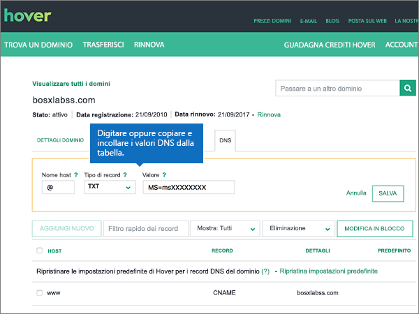

# Creare record DNS su Hover per Office 365Create DNS records at Hover for Office 365

 **Se non si trova ciò che si sta cercando, [vedere le domande frequenti sui domini](../setup/domains-faq.md)**.**[Check the Domains FAQ](../setup/domains-faq.md)** if you don't find what you're looking for. 
  
Se il proprio provider di hosting DNS è Hover, seguire i passaggi di questo articolo per verificare il dominio e configurare i record DNS per posta elettronica, Skype for Business online e così via.If Hover is your DNS hosting provider, follow the steps in this article to verify your domain and set up DNS records for email, Skype for Business Online, and so on.
     
Dopo aver aggiunto questi record in Hover, il domino sarà configurato per l'uso con i servizi di Office 365.After you add these records at Hover, your domain will be set up to work with Office 365 services.
  
Per informazioni su hosting Web e DNS per i siti Web con Office 365, vedere [Usare un sito Web pubblico con Office 365](https://support.office.com/article/choose-a-public-website-3325d50e-d131-403c-a278-7f3296fe33a9).To learn about webhosting and DNS for websites with Office 365, see [Use a public website with Office 365](https://support.office.com/article/choose-a-public-website-3325d50e-d131-403c-a278-7f3296fe33a9).
  
> [!NOTE]
>  In genere, l'applicazione delle modifiche ai record DNS richiede circa 15 minuti. A volte, tuttavia, l'aggiornamento di una modifica nel sistema DNS di Internet può richiedere più tempo. In caso di problemi relativi al flusso di posta o di altro tipo dopo l'aggiunta dei record DNS, vedere [Risolvere i problemi dopo la modifica del nome di dominio o dei record DNS](../get-help-with-domains/find-and-fix-issues.md).Typically it takes about 15 minutes for DNS changes to take effect. However, it can occasionally take longer for a change you've made to update across the Internet's DNS system. If you're having trouble with mail flow or other issues after adding DNS records, see [Troubleshoot issues after changing your domain name or DNS records](../get-help-with-domains/find-and-fix-issues.md). 
  
## Aggiungere un record TXT a scopo di verificaAdd a TXT record for verification

Prima di usare il proprio dominio con Office 365, è necessario dimostrare di esserne proprietari. La capacità di accedere al proprio account nel registrar e di creare il record DNS dimostra a Office 365 che si è proprietari del dominio.Before you use your domain with Office 365, we have to make sure that you own it. Your ability to log in to your account at your domain registrar and create the DNS record proves to Office 365 that you own the domain.
  
> [!NOTE]
> Questo record viene usato esclusivamente per verificare di essere proprietari del dominio e non ha altri effetti. È possibile eliminarlo in un secondo momento, se si preferisce.This record is used only to verify that you own your domain; it doesn't affect anything else. You can delete it later, if you like. 
  
Seguire i passaggi indicati sotto oppure [guardare il video](https://support.office.com/article/Video-Create-DNS-records-at-Hover-for-Office-365-182bd58e-8fe4-4717-9233-3a3546b72ad2?ui=en-US&amp;rs=en-US&amp;ad=US).Follow the steps below or [watch the video](https://support.office.com/article/Video-Create-DNS-records-at-Hover-for-Office-365-182bd58e-8fe4-4717-9233-3a3546b72ad2?ui=en-US&amp;rs=en-US&amp;ad=US).
  
1. Per iniziare, passare alla propria pagina dei domini su Hover usando [questo collegamento](https://www.hover.com/domains). Verrà richiesto di eseguire l'accesso.To get started, go to your domains page at Hover by using [this link](https://www.hover.com/domains). You'll be prompted to sign in.
    
    
  
2. In **Manage your Domains**selezionare il nome del dominio che si desidera modificare.Under **Manage Your Domains**, select the name of the domain that you want to edit.
    
    
  
3. Selezionare la scheda **DNS** .Select the **DNS** tab. 
    
    
  
4. Selezionare **Aggiungi nuovo**.Select **Add New**.
    
    
  
5. In the boxes for the new record, select **TXT** for the **Record Type**, and then type or copy and paste the values from the following table.In the boxes for the new record, select **TXT** for the **Record Type**, and then type or copy and paste the values from the following table.
    
    ||||
    |:-----|:-----|:-----|
    |Nome hostHostname    |Tipo di recordRecord Type    |ValoreValue    |
    |@    |TXTTXT    |MS=ms *XXXXXXXX*MS=ms *XXXXXXXX*    **Note:** questo è un esempio. Usare il valore specifico di **Indirizzo di destinazione o puntamento** indicato nella tabella in Office 365.           [Come trovarlo](../get-help-with-domains/information-for-dns-records.md)**Note:** This is an example. Use your specific **Destination or Points to Address** value here, from the table in Office 365.           [How do I find this?](../get-help-with-domains/information-for-dns-records.md)          |
   
    
  
6. Selezionare **Salva**.Select **Save**.
    
    
  
7. Attendere alcuni minuti prima di continuare, in modo che il record appena creato venga aggiornato in Internet.Wait a few minutes before you continue, so that the record you just created can update across the Internet.
    
Una volta aggiunto il record al sito del registrar, è possibile tornare in Office 365 e chiedere di cercarlo.Now that you've added the record at your domain registrar's site, you'll go back to Office 365 and request Office 365 to look for the record.
  
Quando Office 365 trova il record TXT corretto, il dominio è verificato.When Office 365 finds the correct TXT record, your domain is verified.
  
1. Nell'interfaccia di amministrazione passare a **Impostazioni** \> pagina <a href="https://go.microsoft.com/fwlink/p/?linkid=834818" target="_blank">Domini</a>.In the admin center, go to the **Settings** \> <a href="https://go.microsoft.com/fwlink/p/?linkid=834818" target="_blank">Domains</a> page.
    
2. Nella pagina **Domini** selezionare il dominio da verificare.On the **Domains** page, select the domain that you are verifying. 
    
    
  
3. Nella pagina **Configurazione** selezionare **Avvia configurazione**.On the **Setup** page, select **Start setup**.
    
    
  
4. Nella pagina **Verifica dominio** selezionare **Verifica**.On the **Verify domain** page, select **Verify**.
    
    
  
> [!NOTE]
>  In genere, l'applicazione delle modifiche ai record DNS richiede circa 15 minuti. A volte, tuttavia, l'aggiornamento di una modifica nel sistema DNS di Internet può richiedere più tempo. In caso di problemi relativi al flusso di posta o di altro tipo dopo l'aggiunta dei record DNS, vedere [Risolvere i problemi dopo la modifica del nome di dominio o dei record DNS](../get-help-with-domains/find-and-fix-issues.md).Typically it takes about 15 minutes for DNS changes to take effect. However, it can occasionally take longer for a change you've made to update across the Internet's DNS system. If you're having trouble with mail flow or other issues after adding DNS records, see [Troubleshoot issues after changing your domain name or DNS records](../get-help-with-domains/find-and-fix-issues.md). 
  
## Aggiungere un record MX in modo che la posta elettronica per il dominio venga recapitata in Office 365Add an MX record so email for your domain will come to Office 365

Seguire i passaggi indicati sotto oppure [guardare il video](https://support.office.com/article/Video-Create-DNS-records-at-Hover-for-Office-365-182bd58e-8fe4-4717-9233-3a3546b72ad2?ui=en-US&amp;rs=en-US&amp;ad=US).Follow the steps below or [watch the video](https://support.office.com/article/Video-Create-DNS-records-at-Hover-for-Office-365-182bd58e-8fe4-4717-9233-3a3546b72ad2?ui=en-US&amp;rs=en-US&amp;ad=US).
  
1. Per iniziare, passare alla propria pagina dei domini su Hover usando [questo collegamento](https://www.hover.com/domains). Verrà richiesto di eseguire l'accesso.To get started, go to your domains page at Hover by using [this link](https://www.hover.com/domains). You'll be prompted to sign in.
    
    
  
2. In **Manage your Domains**selezionare il nome del dominio che si desidera modificare.Under **Manage Your Domains**, select the name of the domain that you want to edit.
    
    
  
3. Selezionare la scheda **DNS** .Select the **DNS** tab. 
    
    
  
4. Selezionare **Aggiungi nuovo**.Select **Add New**.
    
    
  
5. Nelle caselle del nuovo record selezionare **MX** per **Record Type** e quindi digitare oppure copiare e incollare i valori della tabella seguente.In the boxes for the new record, select **MX** for the **Record Type**, and then type or copy and paste the values from the following table.
    
    |**Nome host****Hostname**|**Tipo di record****Record Type**|**Priority****Priority**|**Hostname****Hostname**|
    |:-----|:-----|:-----|:-----|
    |@    |MXMX    |00    Per altre informazioni sulla priorità, vedere [Informazioni sulla priorità MX](https://support.office.com/article/2784cc4d-95be-443d-b5f7-bb5dd867ba83.aspx).For more information about priority, see [What is MX priority?](https://support.office.com/article/2784cc4d-95be-443d-b5f7-bb5dd867ba83.aspx)   | *\<chiave-dominio\>*  .mail.protection.outlook.com*\<domain-key\>*  .mail.protection.outlook.com    **Nota:** Ottenere la propria \* \<chiave\> di dominio\* dall'account di Office 365.**Note:** Get your  *\<domain-key\>*  from your Office 365 account.           [Come trovarloHow do I find this?](../get-help-with-domains/information-for-dns-records.md)          |
   
    
  
6. Selezionare **Salva**.Select **Save**.
    
    
  
7. Se sono presenti altri record MX, usare il processo in due passaggi seguente per rimuovere ognuno di essi:If there are any other MX records, use the following two-step process to remove each of them:
    
    In primo luogo, mouse su un record che si desidera rimuovere, selezionare **Elimina**.First, mousing over a record that you want to remove, select **Delete**.
    
    
  
    In secondo luogo, selezionare **Sì** per confermare ogni eliminazione.Second, select **Yes** to confirm each deletion. 
    
    
  
    Ripetere quest'operazione fino a eliminare tutti i record MX, ad eccezione di quello aggiunto in precedenza in questa procedura.Repeat this process until you have deleted all MX records except for the one that you added earlier in this procedure.
    
## Aggiungere i record CNAME necessari per Office 365Add the CNAME records that are required for Office 365

Seguire i passaggi indicati sotto oppure [guardare il video](https://support.office.com/article/Video-Create-DNS-records-at-Hover-for-Office-365-182bd58e-8fe4-4717-9233-3a3546b72ad2?ui=en-US&amp;rs=en-US&amp;ad=US).Follow the steps below or [watch the video](https://support.office.com/article/Video-Create-DNS-records-at-Hover-for-Office-365-182bd58e-8fe4-4717-9233-3a3546b72ad2?ui=en-US&amp;rs=en-US&amp;ad=US).
  
1. Per iniziare, passare alla propria pagina dei domini su Hover usando [questo collegamento](https://www.hover.com/domains). Verrà richiesto di eseguire l'accesso.To get started, go to your domains page at Hover by using [this link](https://www.hover.com/domains). You'll be prompted to sign in.
    
    
  
2. In **Manage your Domains**selezionare il nome del dominio che si desidera modificare.Under **Manage Your Domains**, select the name of the domain that you want to edit.
    
    
  
3. Selezionare la scheda **DNS** .Select the **DNS** tab. 
    
    
  
4. Aggiungere il primo dei sei record CNAME.Add the first of the six CNAME records.
    
    Selezionare **Aggiungi nuovo**.Select **Add New**.
    
    
  
5. Nelle caselle vuote del nuovo record selezionare **CNAME** per **Record Type** e quindi digitare oppure copiare e incollare i valori dalla prima riga nella tabella seguente.In the empty boxes for the new record, select **CNAME** for the **Record Type**, and then type or copy and paste the values from the first row in the following table.
    
    |**Nome host****Hostname**|**Tipo di record****Record Type**|**Target Host****Target Host**|
    |:-----|:-----|:-----|
    |autodiscoverautodiscover    |CNAMECNAME    |autodiscover.outlook.comautodiscover.outlook.com    |
    |sipsip    |CNAMECNAME    |sipdir.online.lync.comsipdir.online.lync.com    |
    |lyncdiscoverlyncdiscover    |CNAMECNAME    |webdir.online.lync.comwebdir.online.lync.com    |
    |enterpriseregistrationenterpriseregistration    |CNAMECNAME    |enterpriseregistration.windows.netenterpriseregistration.windows.net    |
    |enterpriseenrollmententerpriseenrollment    |CNAMECNAME    |enterpriseenrollment-s.manage.microsoft.comenterpriseenrollment-s.manage.microsoft.com    |
   
    
  
6. Selezionare **Salva**.Select **Save**.
    
    
  
7. Usando i tre passaggi descritti in precedenza e i valori dalle altre cinque righe nella tabella, aggiungere ognuno degli altri cinque record CNAME.Using the preceding three steps and the values from the other five rows in the table, add each of the other five CNAME records.
    
## Aggiungere un record TXT per SPF per evitare di ricevere posta indesiderataAdd a TXT record for SPF to help prevent email spam

> [!IMPORTANT]
> Non può essere presente più di un record TXT per SPF per un dominio.You cannot have more than one TXT record for SPF for a domain. Se il dominio ha più record SPF, si verificheranno errori nella gestione della posta elettronica, oltre a problemi di recapito e di classificazione della posta indesiderata.If your domain has more than one SPF record, you'll get email errors, as well as delivery and spam classification issues. If you already have an SPF record for your domain, don't create a new one for Office 365.If you already have an SPF record for your domain, don't create a new one for Office 365. Al contrario, aggiungere i valori di Office 365 richiesti al record corrente in modo da ottenere un *unico* record SPF che include entrambi i set di valori.Instead, add the required Office 365 values to the current record so that you have a  *single*  SPF record that includes both sets of values. 
  
Seguire i passaggi indicati sotto oppure [guardare il video](https://support.office.com/article/Video-Create-DNS-records-at-Hover-for-Office-365-182bd58e-8fe4-4717-9233-3a3546b72ad2?ui=en-US&amp;rs=en-US&amp;ad=US).Follow the steps below or [watch the video](https://support.office.com/article/Video-Create-DNS-records-at-Hover-for-Office-365-182bd58e-8fe4-4717-9233-3a3546b72ad2?ui=en-US&amp;rs=en-US&amp;ad=US).
  
1. Per iniziare, passare alla propria pagina dei domini su Hover usando [questo collegamento](https://www.hover.com/domains). Verrà richiesto di eseguire l'accesso.To get started, go to your domains page at Hover by using [this link](https://www.hover.com/domains). You'll be prompted to sign in.
    
    
  
2. In **Manage your Domains**selezionare il nome del dominio che si desidera modificare.Under **Manage Your Domains**, select the name of the domain that you want to edit.
    
    
  
3. Selezionare la scheda **DNS** .Select the **DNS** tab. 
    
    
  
4. Selezionare **Aggiungi nuovo**.Select **Add New**.
    
    
  
5. In the boxes for the new record, select **TXT** for the **Record Type**, and then type or copy and paste the values from the following table.In the boxes for the new record, select **TXT** for the **Record Type**, and then type or copy and paste the values from the following table.
    
    |**Nome host****Hostname**|**Tipo di record****Record Type**|**Valore****Value**|
    |:-----|:-----|:-----|
    |@    |TXTTXT    |v=spf1 include:spf.protection.outlook.com -allv=spf1 include:spf.protection.outlook.com -all   **Nota:** è consigliabile copiare e incollare questa voce, in modo che tutti i caratteri di spaziatura siano corretti.**Note:** We recommend copying and pasting this entry, so that all of the spacing stays correct.           |
   
    
  
6. Selezionare **Salva**.Select **Save**.
    
    
  
## Aggiungere i due record SRV necessari per Office 365Add the two SRV records that are required for Office 365

Seguire i passaggi indicati sotto oppure [guardare il video](https://support.office.com/article/Video-Create-DNS-records-at-Hover-for-Office-365-182bd58e-8fe4-4717-9233-3a3546b72ad2?ui=en-US&amp;rs=en-US&amp;ad=US).Follow the steps below or [watch the video](https://support.office.com/article/Video-Create-DNS-records-at-Hover-for-Office-365-182bd58e-8fe4-4717-9233-3a3546b72ad2?ui=en-US&amp;rs=en-US&amp;ad=US).
  
1. Per iniziare, passare alla propria pagina dei domini su Hover usando [questo collegamento](https://www.hover.com/domains). Verrà richiesto di eseguire l'accesso.To get started, go to your domains page at Hover by using [this link](https://www.hover.com/domains). You'll be prompted to sign in.
    
    
  
2. In **Manage your Domains**selezionare il nome del dominio che si desidera modificare.Under **Manage Your Domains**, select the name of the domain that you want to edit.
    
    
  
3. Selezionare la scheda **DNS** .Select the **DNS** tab. 
    
    
  
4. Aggiungere il primo dei due record SRV.Add the first of the two SRV records.
    
    Selezionare **Aggiungi nuovo**.Select **Add New**.
    
    
  
5. Nelle caselle vuote del nuovo record selezionare **SRV** per **Record Type** e quindi digitare oppure copiare e incollare i valori dalla prima riga nella tabella seguente.In the empty boxes for the new record, select **SRV** for the **Record Type**, and then type or copy and paste the values from the first row in the following table.
    
    |**Hostname****Hostname**|**Tipo di record****Record Type**|**Priorità****Priority**|**Peso****Weight**|**Porta****Port**|**Target****Target**|
    |:-----|:-----|:-----|:-----|:-----|:-----|
    |_sip. _tls_sip._tls    |SRVSRV    |100100    |11    |443443    |sipdir.online.lync.comsipdir.online.lync.com    |
    |_sipfederationtls. _tcp_sipfederationtls._tcp    |SRVSRV    |100100    |11    |50615061    |sipfed.online.lync.comsipfed.online.lync.com    |
   
    
  
6. Selezionare **Salva**.Select **Save**.
    
    
  
7. Usando i tre passaggi descritti in precedenza e i valori dalla seconda riga nella tabella, aggiungere l'altro record SRV.Using the preceding three steps and the values from the second row in the table, add the other SRV record.
    
> [!NOTE]
> In genere, l'applicazione delle modifiche ai record DNS richiede circa 15 minuti. A volte, tuttavia, l'aggiornamento di una modifica nel sistema DNS di Internet può richiedere più tempo. In caso di problemi relativi al flusso di posta o di altro tipo dopo l'aggiunta dei record DNS, vedere [Risolvere i problemi dopo la modifica del nome di dominio o dei record DNS](../get-help-with-domains/find-and-fix-issues.md).Typically it takes about 15 minutes for DNS changes to take effect. However, it can occasionally take longer for a change you've made to update across the Internet's DNS system. If you're having trouble with mail flow or other issues after adding DNS records, see [Troubleshoot issues after changing your domain name or DNS records](../get-help-with-domains/find-and-fix-issues.md). 
  
