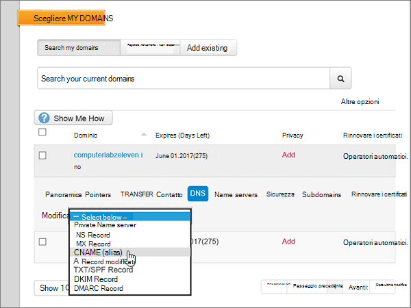
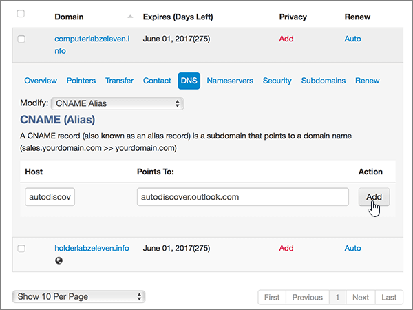

# Creare record DNS su MyDomain per MicrosoftCreate DNS records at MyDomain for Microsoft

  
 Se non si trova ciò che si sta cercando, **[vedere le domande frequenti sui domini](../setup/domains-faq.yml)**.**[Check the Domains FAQ](../setup/domains-faq.yml)** if you don't find what you're looking for. 
  
> [!CAUTION]
> Il sito Web MyDomain non supporta i record SRV, quindi diverse funzionalità di Skype for Business Online e Outlook Web App non funzioneranno. Indipendentemente dal piano di Microsoft in uso, se si gestiscono i record DNS su MyDomain ci saranno [significative limitazioni del servizio](../setup/domains-faq.yml), quindi è consigliabile passare a un provider di hosting DNS diverso.The MyDomain website doesn't support SRV records, which means several Skype for Business Online and Outlook Web App features won't work. No matter which Microsoft plan you use, if you manage your DNS records at MyDomain, there are [significant service limitations](../setup/domains-faq.yml), and you might want to switch to a different DNS hosting provider. 
  
Se si sceglie di gestire i propri record DNS di Microsoft in MyDomain nonostante le limitazioni del servizio, seguire i passaggi di questo articolo per configurare i record DNS per la posta elettronica, Skype for Business Online e così via.If you choose to manage your own Microsoft DNS records at MyDomain despite the service limitations, follow the steps in this article to set up your DNS records for email, Skype for Business Online, and so on.
    
Dopo aver aggiunto questi record a MyDomain, il domino sarà configurato per l'uso con i servizi Microsoft.After you add these records at MyDomain, your domain will be set up to work with Microsoft services.
  

  
> [!NOTE]
> In genere, l'applicazione delle modifiche al DNS richiede circa 15 minuti. Tuttavia, a volte può capitare che l'aggiornamento di una modifica nel sistema DNS di Internet richieda più tempo. In caso di problemi con il flusso di posta o di altro tipo dopo l'aggiunta dei record DNS, vedere [Individuare e correggere i problemi dopo l'aggiunta del dominio o dei record DNS](../get-help-with-domains/find-and-fix-issues.md).Typically it takes about 15 minutes for DNS changes to take effect. However, it can occasionally take longer for a change you've made to update across the Internet's DNS system. If you're having trouble with mail flow or other issues after adding DNS records, see [Find and fix issues after adding your domain or DNS records](../get-help-with-domains/find-and-fix-issues.md). 
  
## Aggiungere un record TXT a scopo di verificaAdd a TXT record for verification

Prima di usare il proprio dominio con Microsoft, è necessario dimostrare di esserne il proprietario. La capacità di accedere al proprio account nel registrar e di creare il record DNS dimostra a Microsoft che si è il proprietario del dominio.Before you use your domain with Microsoft, we have to make sure that you own it. Your ability to log in to your account at your domain registrar and create the DNS record proves to Microsoft that you own the domain.
  
> [!NOTE]
> Questo record viene usato esclusivamente per verificare di essere proprietari del dominio e non ha altri effetti. È possibile eliminarlo in un secondo momento, se si preferisce.This record is used only to verify that you own your domain; it doesn't affect anything else. You can delete it later, if you like. 
  
1. Per iniziare, passare alla propria pagina dei domini su MyDomain usando [questo collegamento](https://www.mydomain.com/controlpanel). Verrà richiesto di eseguire l'accesso.To get started, go to your domains page at MyDomain by using [this link](https://www.mydomain.com/controlpanel). You'll be prompted to log in first.
    
2. Nella sezione **Preferiti** selezionare **Dominio centrale**.In the **My Favorites** section, select **Domain Central**.
    
3. In **Dominio** selezionare il nome del dominio da modificare.Under **Domain**, select the name of the domain that you want to edit.
    
4. Nella riga **Panoramica** scegliere **DNS**.In the **Overview** row, select **DNS**.
    
5. Nell'elenco a discesa **Modifica** selezionare **Record TXT/SPF**.From the **Modify** drop-down list, choose **TXT/SPF Record**.
    
6. Nella casella del nuovo record, in **Contenuto**, digitare oppure copiare e incollare il valore della tabella seguente.Under **Content**, in the box for the new record, type or copy and paste the value from the following table.
    
    ||
    |:-----|
    |**Contenuto****Content**   |
    |MS=ms *XXXXXXXX*MS=ms *XXXXXXXX*    **Note:** questo è un esempio.**Note:** This is an example. Usare il valore specifico di **Indirizzo di destinazione o puntamento** indicato nella tabella.Use your specific **Destination or Points to Address** value here, from the table. [Come trovarloHow do I find this?](../get-help-with-domains/information-for-dns-records.md)          |
   
7. Selezionare **Aggiungi**.Select **Add**.
    
8. Attendere alcuni minuti prima di continuare, in modo che il record appena creato venga aggiornato in Internet.Wait a few minutes before you continue, so that the record you just created can update across the Internet.
    
Una volta che il record è stato aggiunto al sito del registrar, è possibile tornare a Microsoft e richiedere il record.Now that you've added the record at your domain registrar's site, you'll go back to Microsoft and request the record.
  
Quando Microsoft trova il record TXT corretto, il dominio è verificato.When Microsoft finds the correct TXT record, your domain is verified.
  
1. Nell'interfaccia di amministrazione di Microsoft, passare alla pagina **Impostazioni** \> <a href="https://go.microsoft.com/fwlink/p/?linkid=834818" target="_blank">Domini</a>.In the Microsoft admin center, go to the **Settings** \> <a href="https://go.microsoft.com/fwlink/p/?linkid=834818" target="_blank">Domains</a> page.
    
2. Nella pagina **Domini** selezionare il dominio da verificare.On the **Domains** page, select the domain that you are verifying. 
    
3. Nella pagina **Configurazione** selezionare **Avvia configurazione**.On the **Setup** page, select **Start setup**.
    
4. Nella pagina **Verifica dominio** selezionare **Verifica**.On the **Verify domain** page, select **Verify**.
    
> [!NOTE]
> In genere, l'applicazione delle modifiche al DNS richiede circa 15 minuti. Tuttavia, a volte può capitare che l'aggiornamento di una modifica nel sistema DNS di Internet richieda più tempo. In caso di problemi con il flusso di posta o di altro tipo dopo l'aggiunta dei record DNS, vedere [Individuare e correggere i problemi dopo l'aggiunta del dominio o dei record DNS](../get-help-with-domains/find-and-fix-issues.md).Typically it takes about 15 minutes for DNS changes to take effect. However, it can occasionally take longer for a change you've made to update across the Internet's DNS system. If you're having trouble with mail flow or other issues after adding DNS records, see [Find and fix issues after adding your domain or DNS records](../get-help-with-domains/find-and-fix-issues.md). 
  
## Aggiungere un record MX in modo che la posta elettronica del dominio venga recapitata in MicrosoftAdd an MX record so email for your domain will come to Microsoft

1. Per iniziare, passare alla propria pagina dei domini su MyDomain usando [questo collegamento](https://www.mydomain.com/controlpanel). Verrà richiesto di eseguire l'accesso.To get started, go to your domains page at MyDomain by using [this link](https://www.mydomain.com/controlpanel). You'll be prompted to log in first.
    
2. Nella sezione **Preferiti** selezionare **Dominio centrale**.In the **My Favorites** section, select **Domain Central**.
    
3. In **Dominio** selezionare il nome del dominio da modificare.Under **Domain**, select the name of the domain that you want to edit.
    
4. Nella riga **Panoramica** scegliere **DNS**.In the **Overview** row, select **DNS**.
    
5. Nell'elenco a discesa **Modify** selezionare **MX Record**.From the **Modify** drop-down list, choose **MX Record**.
    
    
  
6. Nelle caselle del nuovo record digitare oppure copiare e incollare i valori della tabella seguente.In the boxes for the new record, type or copy and paste the values from the following table.
    
    |**Priorità****Priority**|**Host****Host**|**Points To:****Points To:**|
    |:-----|:-----|:-----|
    |00    Per altre informazioni sulla priorità, vedere [Che cos'è la priorità MX](../setup/domains-faq.yml).For more information about priority, see [What is MX priority?](../setup/domains-faq.yml)   |@    | *\<domain-key\>*  .mail.protection.outlook.com*\<domain-key\>*  .mail.protection.outlook.com    **Nota:** ottenere il valore \<*domain-key*\> dal proprio account Microsoft.**Note:** Get your \<*domain-key*\> from your Microsoft account. > [Come trovarlo?](../get-help-with-domains/information-for-dns-records.md) > [How do I find this?](../get-help-with-domains/information-for-dns-records.md)          |
   
    
  
7. Selezionare **Aggiungi**.Select **Add**.
    
    
  
8. Se sono presenti altri record MX, selezionare **Remove** nella colonna **Action** di ogni record per eliminarlo.If there are any other existing MX records, select **Remove** in the **Action** column for each one to delete it. 
    
    
  
9. Selezionare **OK**.Select **OK**.
    
    
  
## Aggiungere i record CNAME necessari per MicrosoftAdd the CNAME records that are required for Microsoft

1. Per iniziare, passare alla propria pagina dei domini su MyDomain usando [questo collegamento](https://www.mydomain.com/controlpanel). Verrà richiesto di eseguire l'accesso.To get started, go to your domains page at MyDomain by using [this link](https://www.mydomain.com/controlpanel). You'll be prompted to log in first.
    
2. Nella sezione **Preferiti** selezionare **Dominio centrale**.In the **My Favorites** section, select **Domain Central**.
    
3. In **Dominio** selezionare il nome del dominio da modificare.Under **Domain**, select the name of the domain that you want to edit.
    
4. Nella riga **Panoramica** scegliere **DNS**.In the **Overview** row, select **DNS**.
    
5. Nell'elenco a discesa **Modify** selezionare **CNAME Alias**.From the **Modify** drop-down list, choose **CNAME Alias**.
    
    
  
6. Aggiungere il primo record CNAME.Add the first CNAME record.
    
    Nelle caselle del nuovo record digitare oppure copiare e incollare i valori dalla prima riga della tabella seguente.In the boxes for the new record, type or copy and paste the values from the first row of the following table.
    
    |**Host****Host**|**Points To:****Points To:**|
    |:-----|:-----|
    |individuazione automaticaautodiscover    |autodiscover.outlook.comautodiscover.outlook.com    |
    |sipsip    |sipdir.online.lync.comsipdir.online.lync.com    |
    |lyncdiscoverlyncdiscover    |webdir.online.lync.comwebdir.online.lync.com    |
    |enterpriseregistrationenterpriseregistration    |enterpriseregistration.windows.netenterpriseregistration.windows.net    |
    |enterpriseenrollmententerpriseenrollment    |enterpriseenrollment-s.manage.microsoft.comenterpriseenrollment-s.manage.microsoft.com    |
   
    
  
7. Selezionare **Aggiungi** per aggiungere il primo record.Select **Add** to add the first record. 
    
    
  
8. Aggiungere il secondo record CNAME.Add the second CNAME record.
    
    Usare i valori della seconda riga della tabella precedente e quindi selezionare **Aggiungi** per aggiungere il secondo record.Use the values from the second row of the table above, and then select **Add** to add the second record. 
    
    Aggiungere i record rimanenti allo stesso modo, usando i valori dalla terza, quarta, quinta e sesta riga della tabella.Add the remaining records in the same way, using the values from the third, fourth, fifth, and sixth rows of the table.
    
## Aggiungere un record TXT per SPF per evitare di ricevere posta indesiderataAdd a TXT record for SPF to help prevent email spam

> [!IMPORTANT]
> Non può essere presente più di un record TXT per SPF per un dominio.You cannot have more than one TXT record for SPF for a domain. Se il dominio ha più record SPF, si verificheranno errori nella gestione della posta elettronica, oltre a problemi di recapito e di classificazione della posta indesiderata.If your domain has more than one SPF record, you'll get email errors, as well as delivery and spam classification issues. Se si dispone già di un record SPF per il dominio, non crearne uno nuovo per Microsoft.If you already have an SPF record for your domain, don't create a new one for Microsoft. Al contrario, aggiungere i valori di Microsoft necessari al record corrente in modo da ottenere un unico record SPF che include entrambi i set di valori.Instead, add the required Microsoft values to the current record so that you have a single SPF record that includes both sets of values. Servono esempi?Need examples? Consultare [Record Domain Name System (DNS) esterni per Microsoft](../../enterprise/external-domain-name-system-records.md).Check out these [External Domain Name System records for Microsoft](../../enterprise/external-domain-name-system-records.md). To validate your SPF record, you can use one of these [SPF validation tools](../setup/domains-faq.yml).To validate your SPF record, you can use one of these [SPF validation tools](../setup/domains-faq.yml). 
  
1. Per iniziare, passare alla propria pagina dei domini su MyDomain usando [questo collegamento](https://www.mydomain.com/controlpanel). Verrà richiesto di eseguire l'accesso.To get started, go to your domains page at MyDomain by using [this link](https://www.mydomain.com/controlpanel). You'll be prompted to log in first.
    
2. Nella sezione **Preferiti** selezionare **Dominio centrale**.In the **My Favorites** section, select **Domain Central**.
    
3. In **Dominio** selezionare il nome del dominio da modificare.Under **Domain**, select the name of the domain that you want to edit.
    
4. Nella riga **Panoramica** scegliere **DNS**.In the **Overview** row, select **DNS**.
    
5. Nell'elenco a discesa **Modify** selezionare **TXT/SPF Record**.From the **Modify** drop-down list, choose **TXT/SPF Record**.
    
    
  
6. Nella casella del nuovo record, in **Contenuto**, digitare oppure copiare e incollare il valore della tabella seguente.Under **Content**, in the box for the new record, type or copy and paste the value from the following table.
    
    |**Contenuto****Content**|
    |:-----|
    |v=spf1 include:spf.protection.outlook.com -allv=spf1 include:spf.protection.outlook.com -all    **Nota:** è consigliabile copiare e incollare questa voce, in modo che tutti i caratteri di spaziatura siano corretti.**Note:** We recommend copying and pasting this entry, so that all of the spacing stays correct.           |
   
    
  
7. Selezionare **Aggiungi**.Select **Add**.
    
    
  
## Aggiungere i due record SRV necessari per MicrosoftAdd the two SRV records that are required for Microsoft

> [!CAUTION]
> Il sito Web MyDomain non supporta i record SRV, quindi diverse funzionalità di Skype for Business Online e Outlook Web App non funzioneranno. Indipendentemente dal piano di Microsoft in uso, se si gestiscono i record DNS su MyDomain ci saranno [significative limitazioni del servizio](../setup/domains-faq.yml), quindi è consigliabile passare a un provider di hosting DNS diverso.The MyDomain website doesn't support SRV records, which means several Skype for Business Online and Outlook Web App features won't work. No matter which Microsoft plan you use, if you manage your DNS records at MyDomain, there are [significant service limitations](../setup/domains-faq.yml), and you might want to switch to a different DNS hosting provider. 
  
> [!NOTE]
> In genere, l'applicazione delle modifiche al DNS richiede circa 15 minuti. Tuttavia, a volte può capitare che l'aggiornamento di una modifica nel sistema DNS di Internet richieda più tempo. In caso di problemi con il flusso di posta o di altro tipo dopo l'aggiunta dei record DNS, vedere [Individuare e correggere i problemi dopo l'aggiunta del dominio o dei record DNS](../get-help-with-domains/find-and-fix-issues.md).Typically it takes about 15 minutes for DNS changes to take effect. However, it can occasionally take longer for a change you've made to update across the Internet's DNS system. If you're having trouble with mail flow or other issues after adding DNS records, see [Find and fix issues after adding your domain or DNS records](../get-help-with-domains/find-and-fix-issues.md). 
