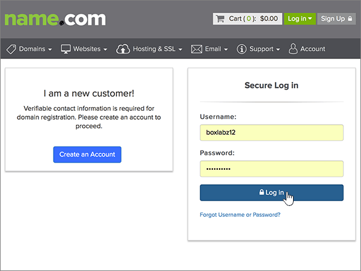
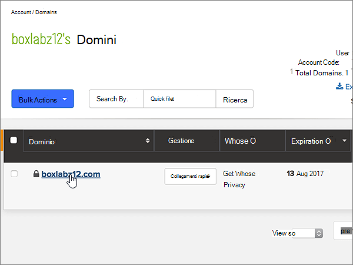
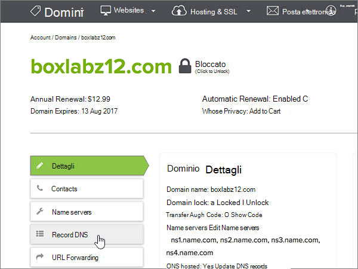
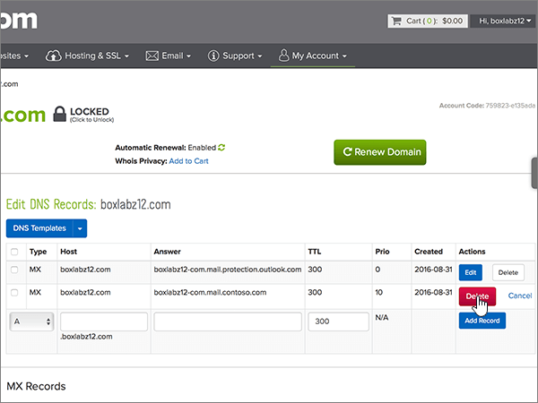
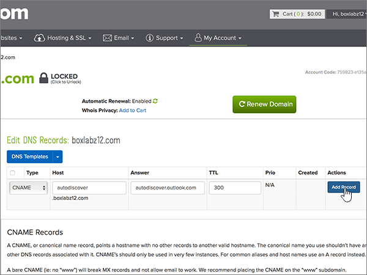

# Creare record DNS in name.com per MicrosoftCreate DNS records at name.com for Microsoft

 **Se non si trova ciò che si sta cercando, [vedere le domande frequenti sui domini](../setup/domains-faq.yml)**.**[Check the Domains FAQ](../setup/domains-faq.yml)** if you don't find what you're looking for. 
  
Se il proprio provider di hosting DNS è name.com, seguire i passaggi di questo articolo per verificare il dominio e configurare i record DNS per posta elettronica, Skype for Business online e così via.If name.com is your DNS hosting provider, follow the steps in this article to verify your domain and set up DNS records for email, Skype for Business Online, and so on.
  
Dopo aver aggiunto questi record in name.com, il dominio sarà configurato per l'uso con i servizi Microsoft.After you add these records at name.com, your domain will be set up to work with Microsoft services.

  
> [!NOTE]
> In genere, l'applicazione delle modifiche ai record DNS richiede circa 15 minuti. A volte, tuttavia, l'aggiornamento di una modifica nel sistema DNS di Internet può richiedere più tempo. In caso di problemi relativi al flusso di posta o di altro tipo dopo l'aggiunta dei record DNS, vedere [Risolvere i problemi dopo la modifica del nome di dominio o dei record DNS](../get-help-with-domains/find-and-fix-issues.md).Typically it takes about 15 minutes for DNS changes to take effect. However, it can occasionally take longer for a change you've made to update across the Internet's DNS system. If you're having trouble with mail flow or other issues after adding DNS records, see [Troubleshoot issues after changing your domain name or DNS records](../get-help-with-domains/find-and-fix-issues.md). 
  
## Aggiungere un record TXT a scopo di verificaAdd a TXT record for verification

Prima di usare il proprio dominio con Microsoft, è necessario dimostrare di esserne il proprietario. La capacità di accedere al proprio account nel registrar e di creare il record DNS dimostra a Microsoft che si è il proprietario del dominio.Before you use your domain with Microsoft, we have to make sure that you own it. Your ability to log in to your account at your domain registrar and create the DNS record proves to Microsoft that you own the domain.
  
> [!NOTE]
> Questo record viene usato esclusivamente per verificare di essere proprietari del dominio e non ha altri effetti. È possibile eliminarlo in un secondo momento, se si preferisce.This record is used only to verify that you own your domain; it doesn't affect anything else. You can delete it later, if you like. 
  
1. Per iniziare, passare alla propria pagina dei domini su name.com usando [questo collegamento](https://www.name.com/account/domain). Verrà richiesto di eseguire l'accesso.To get started, go to your domains page at name.com by using [this link](https://www.name.com/account/domain). You'll be prompted to log in first.
    
    
  
2. In **My Domains** selezionare il nome del dominio che si desidera modificare.Under **My Domains**, select the name of the domain that you want to modify.
    
    
  
3. Nella colonna **Details** selezionare **DNS Records**.In the **Details** column, select **DNS Records**. 
    
    
  
4. Nelle caselle del nuovo record digitare oppure copiare e incollare i valori della tabella seguente.In the boxes for the new record, type or copy and paste the values from the following table.
    
    Selezionare il valore **Type** nell'elenco a discesa.(Choose the **Type** value from the drop-down list.) 
    
    |||||
    |:-----|:-----|:-----|:-----|
    |**Tipo****Type**   |**Host****Host**   |**Answer****Answer**   |**TTL****TTL**   |
    |TXTTXT    |(Leave this field empty.)(Leave this field empty.)    |MS=ms *XXXXXXXX*MS=ms *XXXXXXXX*    **Note:** questo è un esempio.**Note:** This is an example. Usare il valore specifico di **Indirizzo di destinazione o puntamento** indicato nella tabella.Use your specific **Destination or Points to Address** value here, from the table.           [Come trovarloHow do I find this?](../get-help-with-domains/information-for-dns-records.md)          |Usare il valore predefinito (300).Use the default value (300).    |
   
    
  
5. Selezionare **Aggiungi record**.Select **Add Record**.
    
    
  
6. Attendere alcuni minuti prima di continuare, in modo che il record appena creato venga aggiornato in Internet.Wait a few minutes before you continue, so that the record you just created can update across the Internet.
    
Una volta che il record è stato aggiunto al sito del registrar, è possibile tornare a Microsoft e richiedere il record.Now that you've added the record at your domain registrar's site, you'll go back to Microsoft and request the record.
  
Quando Microsoft trova il record TXT corretto, il dominio è verificato.When Microsoft finds the correct TXT record, your domain is verified.
  
1. Nell'interfaccia di amministrazione passare a **Impostazioni** \> pagina <a href="https://go.microsoft.com/fwlink/p/?linkid=834818" target="_blank">Domini</a>.In the admin center, go to the **Settings** \> <a href="https://go.microsoft.com/fwlink/p/?linkid=834818" target="_blank">Domains</a> page.
    
2. Nella pagina **Domini** selezionare il dominio da verificare.On the **Domains** page, select the domain that you are verifying. 
    
    
  
3. Nella pagina **Configurazione** selezionare **Avvia configurazione**.On the **Setup** page, select **Start setup**.
    
    
  
4. Nella pagina **Verifica dominio** selezionare **Verifica**.On the **Verify domain** page, select **Verify**.
    
    
  
> [!NOTE]
> In genere, l'applicazione delle modifiche ai record DNS richiede circa 15 minuti. A volte, tuttavia, l'aggiornamento di una modifica nel sistema DNS di Internet può richiedere più tempo. In caso di problemi relativi al flusso di posta o di altro tipo dopo l'aggiunta dei record DNS, vedere [Risolvere i problemi dopo la modifica del nome di dominio o dei record DNS](../get-help-with-domains/find-and-fix-issues.md).Typically it takes about 15 minutes for DNS changes to take effect. However, it can occasionally take longer for a change you've made to update across the Internet's DNS system. If you're having trouble with mail flow or other issues after adding DNS records, see [Troubleshoot issues after changing your domain name or DNS records](../get-help-with-domains/find-and-fix-issues.md). 
  
## Aggiungere un record MX in modo che la posta elettronica del dominio venga recapitata in MicrosoftAdd an MX record so email for your domain will come to Microsoft

1. Per iniziare, passare alla propria pagina dei domini su name.com usando [questo collegamento](https://www.name.com/account/domain). Verrà richiesto di eseguire l'accesso.To get started, go to your domains page at name.com by using [this link](https://www.name.com/account/domain). You'll be prompted to log in first.
    
    
  
2. In **My Domains** selezionare il nome del dominio che si desidera modificare.Under **My Domains**, select the name of the domain that you want to modify.
    
    
  
3. Nella colonna **Details** selezionare **DNS Records**.In the **Details** column, select **DNS Records**. 
    
    
  
4. Nelle caselle del nuovo record digitare oppure copiare e incollare i valori della tabella seguente.In the boxes for the new record, type or copy and paste the values from the following table.
    
    Selezionare il valore **Type** nell'elenco a discesa.(Choose the **Type** value from the drop-down list.) 
    
    |**Tipo****Type**|**Host****Host**|**Answer****Answer**|**TTL****TTL**|**Prio****Prio**|
    |:-----|:-----|:-----|:-----|:-----|
    |MXMX    |Lasciare vuoto questo campo.(Leave this field empty.)    | *\<domain-key\>*  .mail.protection.outlook.com*\<domain-key\>*  .mail.protection.outlook.com    **Nota:** Ottenere il vostro  *\<domain-key\>*  dal vostro account Microsoft.**Note:** Get your  *\<domain-key\>*  from your Microsoft account.           [Come trovarloHow do I find this?](../get-help-with-domains/information-for-dns-records.md)          |Usare il valore predefinito (300).Use the default value (300).    |00    Per altre informazioni sulla priorità, vedere [Che cos'è la priorità MX](https://docs.microsoft.com/microsoft-365/admin/setup/domains-faq).For more information about priority, see [What is MX priority?](https://docs.microsoft.com/microsoft-365/admin/setup/domains-faq)   |
   
   
  
5. Selezionare **Aggiungi record**.Select **Add Record**.
    
    
  
6. Se sono presenti altri record MX, usare il processo in due passaggi seguente per rimuovere ognuno di essi:If there are any other MX records, delete each of them by using the following two-step procedure:
    
    Per ogni altro record MX, selezionare **Elimina** nella colonna **azioni** .For each other MX record, select **Delete** in the **Actions** column. 
    
    
  
    Per confermare ogni eliminazione, selezionare di nuovo **Delete** nella colonna **Actions** .To confirm each deletion, select **Delete** in the **Actions** column again. 
    
    
  
    Ripetere questa procedura in due passaggi fino a eliminare ogni altro record MX.Repeat this two-step procedure until you have deleted each of the other MX records.
    
## Aggiungere i record CNAME necessari per MicrosoftAdd the CNAME records that are required for Microsoft

1. Per iniziare, passare alla propria pagina dei domini su name.com usando [questo collegamento](https://www.name.com/account/domain). Verrà richiesto di eseguire l'accesso.To get started, go to your domains page at name.com by using [this link](https://www.name.com/account/domain). You'll be prompted to log in first.
    
    
  
2. In **My Domains** selezionare il nome del dominio che si desidera modificare.Under **My Domains**, select the name of the domain that you want to modify.
    
    
  
3. Nella colonna **Details** selezionare **DNS Records**.In the **Details** column, select **DNS Records**. 
    
    
  
4. Aggiungere il primo record CNAME.Add the first CNAME record.
    
    Nelle caselle del nuovo record digitare oppure copiare e incollare i valori dalla prima riga della tabella seguente.In the boxes for the new record, type or copy and paste the values from the first row of the following table.
    
    Selezionare il valore **Type** nell'elenco a discesa.(Choose the **Type** value from the drop-down list.) 
    
    |**Tipo****Type**|**Host****Host**|**Answer****Answer**|**TTL****TTL**|
    |:-----|:-----|:-----|:-----|
    |CNAMECNAME    |individuazione automaticaautodiscover    |autodiscover.outlook.comautodiscover.outlook.com    |Usare il valore predefinito (300).Use the default value (300).    |
    |CNAMECNAME    |sipsip    |sipdir.online.lync.comsipdir.online.lync.com    |Usare il valore predefinito (300).Use the default value (300).    |
    |CNAMECNAME    |lyncdiscoverlyncdiscover    |webdir.online.lync.comwebdir.online.lync.com    |Usare il valore predefinito (300).Use the default value (300).    |
    |CNAMECNAME    |enterpriseregistrationenterpriseregistration    |enterpriseregistration.windows.netenterpriseregistration.windows.net    |Usare il valore predefinito (300).Use the default value (300).    |
    |CNAMECNAME    |enterpriseenrollmententerpriseenrollment    |enterpriseenrollment-s.manage.microsoft.comenterpriseenrollment-s.manage.microsoft.com    |Usare il valore predefinito (300).Use the default value (300).    |
   
   
  
5. Selezionare **Aggiungi record** per aggiungere il primo record.Select **Add Record** to add the first record. 
    
    
  
6. Aggiungere il secondo record CNAME.Add the second CNAME record.
    
    Utilizzare i valori della seconda riga della tabella precedente e quindi fare clic su **Aggiungi record** per aggiungere il secondo record.Use the values from the second row of the table above, and then select **Add Record** to add the second record. 
    
    Aggiungere i record rimanenti allo stesso modo, usando i valori dalla terza, quarta, quinta e sesta riga della tabella.Add the remaining records in the same way, using the values from the third, fourth, fifth, and sixth rows of the table.
    
## Aggiungere un record TXT per SPF per evitare di ricevere posta indesiderataAdd a TXT record for SPF to help prevent email spam

> [!IMPORTANT]
> Non può essere presente più di un record TXT per SPF per un dominio.You cannot have more than one TXT record for SPF for a domain. Se il dominio ha più record SPF, si verificheranno errori nella gestione della posta elettronica, oltre a problemi di recapito e di classificazione della posta indesiderata.If your domain has more than one SPF record, you'll get email errors, as well as delivery and spam classification issues. Se si dispone già di un record SPF per il dominio, non crearne uno nuovo per Microsoft.If you already have an SPF record for your domain, don't create a new one for Microsoft. Al contrario, aggiungere i valori Microsoft necessari al record corrente in modo da disporre di un  *singolo*  record SPF che includa entrambi i set di valori.Instead, add the required Microsoft values to the current record so that you have a  *single*  SPF record that includes both sets of values. 
  
1. Per iniziare, passare alla propria pagina dei domini su name.com usando [questo collegamento](https://www.name.com/account/domain). Verrà richiesto di eseguire l'accesso.To get started, go to your domains page at name.com by using [this link](https://www.name.com/account/domain). You'll be prompted to log in first.
    
    
  
2. In **My Domains** selezionare il nome del dominio che si desidera modificare.Under **My Domains**, select the name of the domain that you want to modify.

    
  
3. Nella colonna **Details** selezionare **DNS Records**.In the **Details** column, select **DNS Records**. 
    
    
  
4. Nelle caselle del nuovo record digitare oppure copiare e incollare i valori della tabella seguente.In the boxes for the new record, type or copy and paste the values from the following table.
    
    Selezionare il valore **Type** nell'elenco a discesa.(Choose the **Type** value from the drop-down list.) 
    
    |**Tipo****Type**|**Host****Host**|**Answer****Answer**|**TTL****TTL**|
    |:-----|:-----|:-----|:-----|
    |TXTTXT    |(Leave this field empty.)(Leave this field empty.)    |v=spf1 include:spf.protection.outlook.com -allv=spf1 include:spf.protection.outlook.com -all    **Nota:** è consigliabile copiare e incollare questa voce, in modo che tutti i caratteri di spaziatura siano corretti.**Note:** We recommend copying and pasting this entry, so that all of the spacing stays correct.           |Use the default value (300).Use the default value (300).    |
   
   
  
5. Selezionare **Aggiungi record**.Select **Add Record**.
    
    
  
## Aggiungere i due record SRV necessari per MicrosoftAdd the two SRV records that are required for Microsoft

1. Per iniziare, passare alla propria pagina dei domini su name.com usando [questo collegamento](https://www.name.com/account/domain). Verrà richiesto di eseguire l'accesso.To get started, go to your domains page at name.com by using [this link](https://www.name.com/account/domain). You'll be prompted to log in first.
    
    
  
2. In **My Domains** selezionare il nome del dominio che si desidera modificare.Under **My Domains**, select the name of the domain that you want to modify.
    
    
  
3. Nella colonna **Details** selezionare **DNS Records +**.In the **Details** column, select **DNS Records+**. 
    
    
  
4. Aggiungere il primo record SRV:Add the first SRV record:
    
    Nelle caselle del nuovo record digitare oppure copiare e incollare i valori dalla prima riga della tabella seguente.In the boxes for the new record, type or copy and paste the values from the first row of the following table.
    
    Selezionare il valore **Type** nell'elenco a discesa.(Choose the **Type** value from the drop-down list.) 
    
    |**Tipo****Type**|**Service****Service**|**Weight****Weight**|**TTL****TTL**|**Prio****Prio**|**Protocol****Protocol**|**Port****Port**|**Target****Target**|
    |:-----|:-----|:-----|:-----|:-----|:-----|:-----|:-----|
    |SRVSRV|sipsip|1 1|Usare il valore predefinito (300).Use the default value (300).|100100|tlstls|443443|sipdir.online.lync.comsipdir.online.lync.com   **Nota:** è consigliabile copiare e incollare questa voce, in modo che tutti i caratteri di spaziatura siano corretti.**Note:** We recommend copying and pasting this entry, so that all of the spacing stays correct.           |
    |SRVSRV|sipfederationtlssipfederationtls|1 1|Usare il valore predefinito (300).Use the default value (300).|100100|tcptcp|50615061|sipfed.online.lync.comsipfed.online.lync.com  **Nota:** è consigliabile copiare e incollare questa voce, in modo che tutti i caratteri di spaziatura siano corretti.**Note:** We recommend copying and pasting this entry, so that all of the spacing stays correct.           |
   
   
  
5. Selezionare **Aggiungi record**.Select **Add Record**.

    
  
6. Aggiungere il secondo record SRV:Add the second SRV record:

Utilizzare i valori della riga successiva della tabella precedente e quindi fare clic su **Aggiungi record** per aggiungere il secondo record.Use the values from the next row of the table above, and then select **Add Record** to add the second record.

>[!NOTE]
>In genere, l'applicazione delle modifiche ai record DNS richiede circa 15 minuti. A volte, tuttavia, l'aggiornamento di una modifica nel sistema DNS di Internet può richiedere più tempo. In caso di problemi relativi al flusso di posta o di altro tipo dopo l'aggiunta dei record DNS, vedere [Risolvere i problemi dopo la modifica del nome di dominio o dei record DNS](../get-help-with-domains/find-and-fix-issues.md).Typically it takes about 15 minutes for DNS changes to take effect. However, it can occasionally take longer for a change you've made to update across the Internet's DNS system. If you're having trouble with mail flow or other issues after adding DNS records, see [Troubleshoot issues after changing your domain name or DNS records](../get-help-with-domains/find-and-fix-issues.md).
