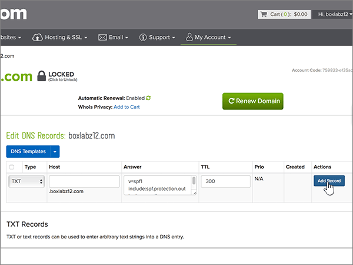

# Creare record DNS in name.com per Microsoft

 **Se non si trova ciò che si sta cercando, [vedere le domande frequenti sui domini](../setup/domains-faq.md)**. 
  
Se il proprio provider di hosting DNS è name.com, seguire i passaggi di questo articolo per verificare il dominio e configurare i record DNS per posta elettronica, Skype for Business online e così via.
  
Dopo aver aggiunto questi record in name.com, il dominio sarà configurato per l'uso con i servizi Microsoft.

  
> [!NOTE]
> In genere, l'applicazione delle modifiche ai record DNS richiede circa 15 minuti. A volte, tuttavia, l'aggiornamento di una modifica nel sistema DNS di Internet può richiedere più tempo. In caso di problemi relativi al flusso di posta o di altro tipo dopo l'aggiunta dei record DNS, vedere [Risolvere i problemi dopo la modifica del nome di dominio o dei record DNS](../get-help-with-domains/find-and-fix-issues.md). 
  
## Aggiungere un record TXT a scopo di verifica

Prima di usare il proprio dominio con Microsoft, è necessario dimostrare di esserne il proprietario. La capacità di accedere al proprio account nel registrar e di creare il record DNS dimostra a Microsoft che si è il proprietario del dominio.
  
> [!NOTE]
> Questo record viene usato esclusivamente per verificare di essere proprietari del dominio e non ha altri effetti. È possibile eliminarlo in un secondo momento, se si preferisce. 
  
1. Per iniziare, passare alla propria pagina dei domini su name.com usando [questo collegamento](https://www.name.com/account/domain). Verrà richiesto di eseguire l'accesso.
    
    
  
2. In **My Domains**selezionare il nome del dominio che si desidera modificare.
    
    
  
3. Nella colonna **Details** selezionare **DNS Records**. 
    
    
  
4. Nelle caselle del nuovo record digitare oppure copiare e incollare i valori della tabella seguente.
    
    (Choose the **Type** value from the drop-down list.) 
    
    |||||
    |:-----|:-----|:-----|:-----|
    |**Tipo**   |**Host**   |**Answer**   |**TTL**   |
    |TXT    |(Leave this field empty.)    |MS=ms *XXXXXXXX*    **Note:** questo è un esempio. Usare il valore specifico di **Indirizzo di destinazione o puntamento** indicato nella tabella.           [Come trovarlo](../get-help-with-domains/information-for-dns-records.md)          |Use the default value (300).    |
   
    
  
5. Selezionare **Aggiungi record**.
    
    
  
6. Attendere alcuni minuti prima di continuare, in modo che il record appena creato venga aggiornato in Internet.
    
Una volta che il record è stato aggiunto al sito del registrar, è possibile tornare a Microsoft e richiedere il record.
  
Quando Microsoft trova il record TXT corretto, il dominio è verificato.
  
1. Nell'interfaccia di amministrazione passare a **Impostazioni** \> pagina <a href="https://go.microsoft.com/fwlink/p/?linkid=834818" target="_blank">Domini</a>.
    
2. Nella pagina **Domini** selezionare il dominio da verificare. 
    
    
  
3. Nella pagina **Configurazione** selezionare **Avvia configurazione**.
    
    
  
4. Nella pagina **Verifica dominio** selezionare **Verifica**.
    
    
  
> [!NOTE]
> In genere, l'applicazione delle modifiche ai record DNS richiede circa 15 minuti. A volte, tuttavia, l'aggiornamento di una modifica nel sistema DNS di Internet può richiedere più tempo. In caso di problemi relativi al flusso di posta o di altro tipo dopo l'aggiunta dei record DNS, vedere [Risolvere i problemi dopo la modifica del nome di dominio o dei record DNS](../get-help-with-domains/find-and-fix-issues.md). 
  
## Aggiungere un record MX in modo che la posta elettronica del dominio venga recapitata in Microsoft

1. Per iniziare, passare alla propria pagina dei domini su name.com usando [questo collegamento](https://www.name.com/account/domain). Verrà richiesto di eseguire l'accesso.
    
    
  
2. In **My Domains**selezionare il nome del dominio che si desidera modificare.
    
    
  
3. Nella colonna **Details** selezionare **DNS Records**. 
    
    
  
4. Nelle caselle del nuovo record digitare oppure copiare e incollare i valori della tabella seguente.
    
    (Choose the **Type** value from the drop-down list.) 
    
    |**Tipo**|**Host**|**Answer**|**TTL**|**Prio**|
    |:-----|:-----|:-----|:-----|:-----|
    |MX    |Lasciare vuoto questo campo.    | *\<domain-key\>*. mail.protection.outlook.com    **Nota:** Ottenere il vostro *\<domain-key\>* dal vostro account Microsoft.           [Come trovarlo](../get-help-with-domains/information-for-dns-records.md)          |Use the default value (300).    |0    Per altre informazioni sulla priorità, vedere [Informazioni sulla priorità MX](https://docs.microsoft.com/microsoft-365/admin/setup/domains-faq).   |
   
   
  
5. Selezionare **Aggiungi record**.
    
    
  
6. Se sono presenti altri record MX, usare il processo in due passaggi seguente per rimuovere ognuno di essi:
    
    Per ogni altro record MX, selezionare **Elimina** nella colonna **azioni** . 
    
    
  
    Per confermare ogni eliminazione, selezionare di nuovo **Delete** nella colonna **Actions** . 
    
    
  
    Ripetere questa procedura in due passaggi fino a eliminare ogni altro record MX.
    
## Aggiungere i record CNAME necessari per Microsoft

1. Per iniziare, passare alla propria pagina dei domini su name.com usando [questo collegamento](https://www.name.com/account/domain). Verrà richiesto di eseguire l'accesso.
    
    
  
2. In **My Domains**selezionare il nome del dominio che si desidera modificare.
    
    
  
3. Nella colonna **Details** selezionare **DNS Records**. 
    
    
  
4. Aggiungere il primo record CNAME.
    
    Nelle caselle del nuovo record digitare oppure copiare e incollare i valori dalla prima riga della tabella seguente.
    
    Selezionare il valore **Type** nell'elenco a discesa. 
    
    |**Tipo**|**Host**|**Answer**|**TTL**|
    |:-----|:-----|:-----|:-----|
    |CNAME    |individuazione automatica    |autodiscover.outlook.com    |Usare il valore predefinito (300).    |
    |CNAME    |sip    |sipdir.online.lync.com    |Usare il valore predefinito (300).    |
    |CNAME    |lyncdiscover    |webdir.online.lync.com    |Usare il valore predefinito (300).    |
    |CNAME    |enterpriseregistration    |enterpriseregistration.windows.net    |Usare il valore predefinito (300).    |
    |CNAME    |enterpriseenrollment    |enterpriseenrollment-s.manage.microsoft.com    |Usare il valore predefinito (300).    |
   
   
  
5. Selezionare **Aggiungi record** per aggiungere il primo record. 
    
    
  
6. Aggiungere il secondo record CNAME.
    
    Utilizzare i valori della seconda riga della tabella precedente e quindi fare clic su **Aggiungi record** per aggiungere il secondo record. 
    
    Aggiungere i record rimanenti allo stesso modo, usando i valori dalla terza, quarta, quinta e sesta riga della tabella.
    
## Aggiungere un record TXT per SPF per evitare di ricevere posta indesiderata

> [!IMPORTANT]
> Non può essere presente più di un record TXT per SPF per un dominio. Se il dominio ha più record SPF, si verificheranno errori nella gestione della posta elettronica, oltre a problemi di recapito e di classificazione della posta indesiderata. Se si dispone già di un record SPF per il dominio, non crearne uno nuovo per Microsoft. Al contrario, aggiungere i valori Microsoft necessari al record corrente in modo da disporre di un *singolo* record SPF che includa entrambi i set di valori. 
  
1. Per iniziare, passare alla propria pagina dei domini su name.com usando [questo collegamento](https://www.name.com/account/domain). Verrà richiesto di eseguire l'accesso.
    
    
  
2. In **My Domains**selezionare il nome del dominio che si desidera modificare.

    
  
3. Nella colonna **Details** selezionare **DNS Records**. 
    
    
  
4. Nelle caselle del nuovo record digitare oppure copiare e incollare i valori della tabella seguente.
    
    (Choose the **Type** value from the drop-down list.) 
    
    |**Tipo**|**Host**|**Answer**|**TTL**|
    |:-----|:-----|:-----|:-----|
    |TXT    |(Leave this field empty.)    |v=spf1 include:spf.protection.outlook.com -all    **Nota:** è consigliabile copiare e incollare questa voce, in modo che tutti i caratteri di spaziatura siano corretti.           |Use the default value (300).    |
   
   
  
5. Selezionare **Aggiungi record**.
    
    
  
## Aggiungere i due record SRV necessari per Microsoft

1. Per iniziare, passare alla propria pagina dei domini su name.com usando [questo collegamento](https://www.name.com/account/domain). Verrà richiesto di eseguire l'accesso.
    
    
  
2. In **My Domains**selezionare il nome del dominio che si desidera modificare.
    
    
  
3. Nella colonna **Details** selezionare **DNS Records +**. 
    
    
  
4. Aggiungere il primo record SRV:
    
    Nelle caselle del nuovo record digitare oppure copiare e incollare i valori dalla prima riga della tabella seguente.
    
    Selezionare il valore **Type** nell'elenco a discesa. 
    
    |**Type**|**Service**|**Weight**|**TTL**|**Prio**|**Protocol**|**Port**|**Target**|
    |:-----|:-----|:-----|:-----|:-----|:-----|:-----|:-----|
    |SRV|sip|1 |Usare il valore predefinito (300).|100|tls|443|sipdir.online.lync.com   **Nota:** è consigliabile copiare e incollare questa voce, in modo che tutti i caratteri di spaziatura siano corretti.           |
    |SRV|sipfederationtls|1 |Usare il valore predefinito (300).|100|tcp|5061|sipfed.online.lync.com  **Nota:** è consigliabile copiare e incollare questa voce, in modo che tutti i caratteri di spaziatura siano corretti.           |
   
   
  
5. Selezionare **Aggiungi record**.

    
  
6. Aggiungere il secondo record SRV:

Utilizzare i valori della riga successiva della tabella precedente e quindi fare clic su **Aggiungi record** per aggiungere il secondo record.

>[!NOTE]
>In genere, l'applicazione delle modifiche ai record DNS richiede circa 15 minuti. A volte, tuttavia, l'aggiornamento di una modifica nel sistema DNS di Internet può richiedere più tempo. In caso di problemi relativi al flusso di posta o di altro tipo dopo l'aggiunta dei record DNS, vedere [Risolvere i problemi dopo la modifica del nome di dominio o dei record DNS](../get-help-with-domains/find-and-fix-issues.md).
