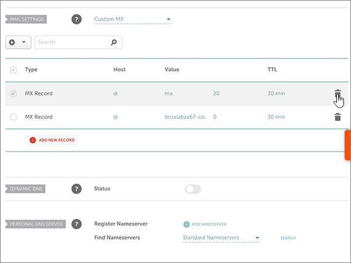

# Creare record DNS su Namecheap per Office 365Create DNS records at Namecheap for Office 365

 Se non si trova ciò che si sta cercando, **[vedere le domande frequenti sui domini](../setup/domains-faq.md)**.**[Check the Domains FAQ](../setup/domains-faq.md)** if you don't find what you're looking for. 
  
Se il proprio provider di hosting DNS è Namecheap, seguire i passaggi di questo articolo per verificare il dominio e configurare i record DNS per posta elettronica, Skype for Business online e così via.If Namecheap is your DNS hosting provider, follow the steps in this article to verify your domain and set up DNS records for email, Skype for Business Online, and so on.
  
Dopo aver aggiunto questi record in Namecheap, il domino sarà configurato per l'uso con i servizi di Office 365.After you add these records at Namecheap, your domain will be set up to work with Office 365 services.
  
> [!NOTE]
> In genere, l'applicazione delle modifiche ai record DNS richiede circa 15 minuti. A volte, tuttavia, l'aggiornamento di una modifica nel sistema DNS di Internet può richiedere più tempo. In caso di problemi relativi al flusso di posta o di altro tipo dopo l'aggiunta dei record DNS, vedere [Risolvere i problemi dopo la modifica del nome di dominio o dei record DNS](../get-help-with-domains/find-and-fix-issues.md).Typically it takes about 15 minutes for DNS changes to take effect. However, it can occasionally take longer for a change you've made to update across the Internet's DNS system. If you're having trouble with mail flow or other issues after adding DNS records, see [Troubleshoot issues after changing your domain name or DNS records](../get-help-with-domains/find-and-fix-issues.md). 
  
## Aggiungere un record TXT a scopo di verificaAdd a TXT record for verification

Prima di usare il proprio dominio con Office 365, è necessario dimostrare di esserne proprietari. La capacità di accedere al proprio account nel registrar e di creare il record DNS dimostra a Office 365 che si è proprietari del dominio.Before you use your domain with Office 365, we have to make sure that you own it. Your ability to log in to your account at your domain registrar and create the DNS record proves to Office 365 that you own the domain.
  
> [!NOTE]
> Questo record viene usato esclusivamente per verificare di essere proprietari del dominio e non ha altri effetti. È possibile eliminarlo in un secondo momento, se si preferisce.This record is used only to verify that you own your domain; it doesn't affect anything else. You can delete it later, if you like. 
  
Effettuare le operazioni seguenti.Follow the steps below.
  
1. Per iniziare, passare alla propria pagina dei domini su Namecheap usando [questo collegamento](https://www.namecheap.com/myaccount/login.aspx?ReturnUrl=%2f). Verrà richiesto di eseguire l'accesso e continuare.To get started, go to your domains page at Namecheap by using [this link](https://www.namecheap.com/myaccount/login.aspx?ReturnUrl=%2f). You'll be prompted to Sign in and Continue.
    
    
  
2. Nella pagina di **destinazione** , in **account**, scegliere **Domain List** nell'elenco a discesa.On the **Landing** page, under **Account**, choose **Domain List** from the drop-down list. 
    
    
  
3. Nella pagina **elenco dei domini** trovare il nome del dominio che si desidera modificare, quindi selezionare **Gestisci**.On the **Domain List** page, find the name of the domain that you want to edit, and then select **Manage**.
    
    
  
4. Selezionare **DNS avanzato**.Select **Advanced DNS**.
    
    
  
5. Nella sezione **Host Records** selezionare **Aggiungi nuovo record**.In the **HOST RECORDS** section, select **ADD NEW RECORD**.
    
    
  
6. Nell'elenco a discesa **Type** selezionare **TXT Record**.In the **Type** drop-down, select **TXT Record**.
    
    > [!NOTE]
    > L'elenco a discesa **tipo** viene visualizzato automaticamente quando si seleziona **Aggiungi nuovo record**.The **Type** drop-down automatically appears when you select **ADD NEW RECORD**. 
  
    
  
7. Nelle caselle del nuovo record digitare oppure copiare e incollare i valori della tabella seguente.In the boxes for the new record, type or copy and paste the values from the following table.
    
    Scegliere il valore **TTL** nell'elenco a discesa.(Choose the **TTL** value from the drop-down list.) 
    
    |**Tipo****Type**|**Host****Host**|**Valore****Value**|**TTL****TTL**|
    |:-----|:-----|:-----|:-----|
    |TXTTXT    |@    |MS=ms *XXXXXXXX*MS=ms *XXXXXXXX*   **Note:** questo è un esempio.**Note:** This is an example. Usare il valore specifico di **Indirizzo di destinazione o puntamento** indicato nella tabella in Office 365.Use your specific **Destination or Points to Address** value here, from the table in Office 365.  [Come trovarloHow do I find this?](../get-help-with-domains/information-for-dns-records.md)          |30 min30 min    |
       
    
  
8. Selezionare il controllo **Salva modifiche** (segno di spunta).Select the **Save Changes** (check mark) control. 
    
    
  
9. Attendere alcuni minuti prima di continuare, in modo che il record appena creato venga aggiornato in Internet.Wait a few minutes before you continue, so that the record you just created can update across the Internet.
    
Una volta aggiunto il record al sito del registrar, è possibile tornare in Office 365 e chiedere di cercarlo.Now that you've added the record at your domain registrar's site, you'll go back to Office 365 and request Office 365 to look for the record.
  
Quando Office 365 trova il record TXT corretto, il dominio è verificato.When Office 365 finds the correct TXT record, your domain is verified.
  
1. Nell'interfaccia di amministrazione passare a **Impostazioni** \> pagina <a href="https://go.microsoft.com/fwlink/p/?linkid=834818" target="_blank">Domini</a>.In the admin center, go to the **Settings** \> <a href="https://go.microsoft.com/fwlink/p/?linkid=834818" target="_blank">Domains</a> page.
    
2. Nella pagina **Domini** selezionare il dominio da verificare.On the **Domains** page, select the domain that you are verifying. 
    
    
  
3. Nella pagina **Configurazione** selezionare **Avvia configurazione**.On the **Setup** page, select **Start setup**.
    
    
  
4. Nella pagina **Verifica dominio** selezionare **Verifica**.On the **Verify domain** page, select **Verify**.
    
    
  
> [!NOTE]
> In genere, l'applicazione delle modifiche ai record DNS richiede circa 15 minuti. A volte, tuttavia, l'aggiornamento di una modifica nel sistema DNS di Internet può richiedere più tempo. In caso di problemi relativi al flusso di posta o di altro tipo dopo l'aggiunta dei record DNS, vedere [Risolvere i problemi dopo la modifica del nome di dominio o dei record DNS](../get-help-with-domains/find-and-fix-issues.md).Typically it takes about 15 minutes for DNS changes to take effect. However, it can occasionally take longer for a change you've made to update across the Internet's DNS system. If you're having trouble with mail flow or other issues after adding DNS records, see [Troubleshoot issues after changing your domain name or DNS records](../get-help-with-domains/find-and-fix-issues.md). 

  
## Aggiungere un record MX in modo che la posta elettronica per il dominio venga recapitata in Office 365Add an MX record so email for your domain will come to Office 365

Effettuare le operazioni seguenti.Follow the steps below.
  
1. Per iniziare, passare alla propria pagina dei domini su Namecheap usando [questo collegamento](https://www.namecheap.com/myaccount/login.aspx?ReturnUrl=%2f). Verrà richiesto di eseguire l'accesso e continuare.To get started, go to your domains page at Namecheap by using [this link](https://www.namecheap.com/myaccount/login.aspx?ReturnUrl=%2f). You'll be prompted to Sign in and Continue.
    
    
  
2. Nella pagina di **destinazione** , in **account**, scegliere **Domain List** nell'elenco a discesa.On the **Landing** page, under **Account**, choose **Domain List** from the drop-down list. 
    
    
  
3. Nella pagina **elenco dei domini** trovare il nome del dominio che si desidera modificare, quindi selezionare **Gestisci**.On the **Domain List** page, find the name of the domain that you want to edit, and then select **Manage**.
    
    
  
4. Selezionare **DNS avanzato**.Select **Advanced DNS**.
    
    
  
5. Nella sezione **MAIL SETTINGS** selezionare **Custom MX** dall'elenco a discesa **Email Forwarding**.In the **MAIL SETTINGS** section, select **Custom MX** from the **Email Forwarding** drop-down list. 
    
    Può essere necessario scorrere la pagina.(You may have to scroll down.)
    
    
  
6. Selezionare **Aggiungi nuovo record**.Select **Add New Record**.
    
    
  
7. Nelle caselle del nuovo record digitare oppure copiare e incollare i valori della tabella seguenteIn the boxes for the new record, type or copy and paste the values, from the following table.
    
    (la casella **Priority** è quella senza nome accanto alla casella **Value**.(The **Priority** box is the unnamed box to the right of the **Value** box. Scegliere il valore **TTL** nell'elenco a discesa.Choose the **TTL** value from the drop-down list.) 
    
    |**Tipo****Type**|**Host****Host**|**Valore****Value**|**Priorità****Priority**|**TTL****TTL**|
    |:-----|:-----|:-----|:-----|:-----|
    |Record MXMX Record    |@    |\<*Domain-Key*\>. mail.Protection.Outlook.com.\<*domain-key*\>.mail.protection.outlook.com.    **This value MUST end with a period (.)****This value MUST end with a period (.)**   **Nota:** Ottenere la propria \* \<chiave\> di dominio\* dall'account di Office 365.**Note:** Get your  *\<domain-key\>*  from your Office 365 account.  [Come trovarlaHow do I find this?](../get-help-with-domains/information-for-dns-records.md)          |00    Per altre informazioni sulla priorità, vedere [Informazioni sulla priorità MX](https://support.office.com/article/2784cc4d-95be-443d-b5f7-bb5dd867ba83.aspx).For more information about priority, see [What is MX priority?](https://support.office.com/article/2784cc4d-95be-443d-b5f7-bb5dd867ba83.aspx)   |30 min30 min    |
       
    
  
8. Selezionare il controllo **Salva modifiche** (segno di spunta).Select the **Save Changes** (check mark) control. 
    
    
  
9. Se sono presenti altri record MX, usare il processo in due passaggi seguente per rimuovere ognuno di essi:If there are any other MX records, use the following two-step process to remove each of them:
    
    In primo luogo, selezionare l' **icona di eliminazione** (Cestino) per il record che si desidera rimuovere.First, select the **Delete icon** (trash can) for the record that you want to remove. 
    
    
  
    In secondo luogo, selezionare **Sì** per confermare l'eliminazione.Second, select **Yes** to confirm the deletion. 
    
    
  
    Rimuovere tutti i record MX, ad eccezione di quello aggiunto in precedenza in questa procedura.Remove all MX records except for the one that you added earlier in this procedure.

  
## Aggiungere i sei record CNAME necessari per Office 365Add the six CNAME records that are required for Office 365

Effettuare le operazioni seguenti.Follow the steps below.
  
1. Per iniziare, passare alla propria pagina dei domini su Namecheap usando [questo collegamento](https://www.namecheap.com/myaccount/login.aspx?ReturnUrl=%2f). Verrà richiesto di eseguire l'accesso e continuare.To get started, go to your domains page at Namecheap by using [this link](https://www.namecheap.com/myaccount/login.aspx?ReturnUrl=%2f). You'll be prompted to Sign in and Continue.
    
    
  
2. Nella pagina di **destinazione** , in **account**, scegliere **Domain List** nell'elenco a discesa.On the **Landing** page, under **Account**, choose **Domain List** from the drop-down list. 
    
    
  
3. Nella pagina **elenco dei domini** trovare il nome del dominio che si desidera modificare, quindi selezionare **Gestisci**.On the **Domain List** page, find the name of the domain that you want to edit, and then select **Manage**.
    
    
  
4. Selezionare **DNS avanzato**.Select **Advanced DNS**.
    
    
  
5. Nella sezione **Host Records** selezionare **Aggiungi nuovo record**.In the **HOST RECORDS** section, select **ADD NEW RECORD**.
    
    
  
6. Nell'elenco a discesa **Type** selezionare **CNAME Record**.In the **Type** drop-down, select **CNAME Record**.
    
    > [!NOTE]
    > L'elenco a discesa **tipo** viene visualizzato automaticamente quando si seleziona **Aggiungi nuovo record**.The **Type** drop-down automatically appears when you select **ADD NEW RECORD**. 
  
    
  
7. Nelle caselle vuote del nuovo record selezionare **CNAME** per **Record Type** e quindi digitare oppure copiare e incollare i valori dalla prima riga nella tabella seguente.In the empty boxes for the new record, select **CNAME** for the **Record Type**, and then type or copy and paste the values from the first row in the following table.
    
    |**Tipo****Type**|**Host****Host**|**Valore****Value**|**TTL****TTL**|
    |:-----|:-----|:-----|:-----|
    |CNAMECNAME    |autodiscoverautodiscover    |autodiscover.outlook.com.autodiscover.outlook.com.    **Questo valore DEVE terminare con un punto (.)****This value MUST end with a period (.)**   |36003600    |
    |CNAMECNAME    |sipsip    |sipdir.online.lync.com.sipdir.online.lync.com.    **Questo valore DEVE terminare con un punto (.)****This value MUST end with a period (.)**   |36003600    |
    |CNAMECNAME    |lyncdiscoverlyncdiscover    |webdir.online.lync.com.webdir.online.lync.com.    **Questo valore DEVE terminare con un punto (.)****This value MUST end with a period (.)**   |36003600    |
    |CNAMECNAME    |enterpriseregistrationenterpriseregistration    |enterpriseregistration.windows.net.enterpriseregistration.windows.net.    **Questo valore DEVE terminare con un punto (.)****This value MUST end with a period (.)**   |36003600    |
    |CNAMECNAME    |enterpriseenrollmententerpriseenrollment    |enterpriseenrollment-s.manage.microsoft.com.enterpriseenrollment-s.manage.microsoft.com.    **This value MUST end with a period (.)****This value MUST end with a period (.)**   |36003600    |
       
    
  
8. Selezionare il controllo **Salva modifiche** (segno di spunta).Select the **Save Changes** (check mark) control. 
    
    
  
9. Utilizzando i quattro passaggi precedenti e i valori delle altre cinque righe nella tabella, aggiungere ognuno degli altri cinque record CNAME.Using the preceding four steps and the values from the other five rows in the table, add each of the other five CNAME records.

  
## Aggiungere un record TXT per SPF per evitare di ricevere posta indesiderataAdd a TXT record for SPF to help prevent email spam

> [!IMPORTANT]
> Non può essere presente più di un record TXT per SPF per un dominio.You cannot have more than one TXT record for SPF for a domain. Se il dominio ha più record SPF, si verificheranno errori nella gestione della posta elettronica, oltre a problemi di recapito e di classificazione della posta indesiderata.If your domain has more than one SPF record, you'll get email errors, as well as delivery and spam classification issues. If you already have an SPF record for your domain, don't create a new one for Office 365.If you already have an SPF record for your domain, don't create a new one for Office 365. Al contrario, aggiungere i valori di Office 365 richiesti al record corrente in modo da ottenere un *unico* record SPF che include entrambi i set di valori.Instead, add the required Office 365 values to the current record so that you have a  *single*  SPF record that includes both sets of values. 

Effettuare le operazioni seguenti.Follow the steps below.
  
1. Per iniziare, passare alla propria pagina dei domini su Namecheap usando [questo collegamento](https://www.namecheap.com/myaccount/login.aspx?ReturnUrl=%2f). Verrà richiesto di eseguire l'accesso e continuare.To get started, go to your domains page at Namecheap by using [this link](https://www.namecheap.com/myaccount/login.aspx?ReturnUrl=%2f). You'll be prompted to Sign in and Continue.
    
2. Nella pagina di **destinazione** , in **account**, scegliere **Domain List** nell'elenco a discesa.On the **Landing** page, under **Account**, choose **Domain List** from the drop-down list. 
    
    
  
3. Nella pagina **elenco dei domini** individuare il nome del dominio che si desidera modificare e quindi selezionare **Gestisci**.On the **Domain List** page, find the name of the domain that you want to edit and then select **Manage**.
    
    
  
4. Selezionare **DNS avanzato**.Select **Advanced DNS**.
    
    
  
5. Nella sezione **Host Records** selezionare **Aggiungi nuovo record**.In the **HOST RECORDS** section, select **ADD NEW RECORD**.
    
    
  
6. Nell'elenco a discesa **Type** selezionare **TXT Record**.In the **Type** drop-down, select **TXT Record**.
    
    > [!NOTE]
    > L'elenco a discesa **tipo** viene visualizzato automaticamente quando si seleziona **Aggiungi nuovo record**.The **Type** drop-down automatically appears when you select **ADD NEW RECORD**. 
  
    
  
7. Nelle caselle del nuovo record digitare oppure copiare e incollare i valori della tabella seguente.In the boxes for the new record, type or copy and paste the following values from the following table.
    
    Scegliere il valore **TTL** nell'elenco a discesa.(Choose the **TTL** value from the drop-down list.) 
    
    |**Tipo****Type**|**Host****Host**|**Valore****Value**|**TTL****TTL**|
    |:-----|:-----|:-----|:-----|
    |TXTTXT    |@    |v=spf1 include:spf.protection.outlook.com -allv=spf1 include:spf.protection.outlook.com -all    **Nota:** è consigliabile copiare e incollare questa voce, in modo che tutti i caratteri di spaziatura siano corretti.**Note:** We recommend copying and pasting this entry, so that all of the spacing stays correct.           |30 min30 min    |
       
    
  
8. Selezionare il controllo **Salva modifiche** (segno di spunta).Select the **Save Changes** (check mark) control. 
    
    
  
## Aggiungere i due record SRV necessari per Office 365Add the two SRV records that are required for Office 365

1. Per iniziare, passare alla propria pagina dei domini su Namecheap usando [questo collegamento](https://www.namecheap.com/myaccount/login.aspx?ReturnUrl=%2f). Verrà richiesto di eseguire l'accesso.To get started, go to your domains page at Namecheap by using [this link](https://www.namecheap.com/myaccount/login.aspx?ReturnUrl=%2f). You'll be prompted to sign in.
    
    
  
2. Nella pagina di **destinazione** , in **account**, scegliere **Domain List** nell'elenco a discesa.On the **Landing** page, under **Account**, choose **Domain List** from the drop-down list. 
    
    
  
3. Nella pagina **elenco dei domini** individuare il nome del dominio che si desidera modificare e quindi selezionare **Gestisci**.On the **Domain List** page, find the name of the domain that you want to edit and then select **Manage**.
    
    
  
4. Selezionare **DNS avanzato**.Select **Advanced DNS**.
    
    
  
5. Nella sezione **Host Records** selezionare **Aggiungi nuovo record**.In the **HOST RECORDS** section, select **ADD NEW RECORD**.
    
    
  
6. Nell'elenco a discesa **Type** selezionare **SRV Record**.In the **Type** drop-down, select **SRV Record**.
    
    > [!NOTE]
    > L'elenco a discesa **tipo** viene visualizzato automaticamente quando si seleziona **Aggiungi nuovo record**.The **Type** drop-down automatically appears when you select **ADD NEW RECORD**. 
  
    
  
7. Nelle caselle vuote dei nuovi record digitare oppure copiare e incollare i valori dalla prima riga della tabella seguente.In the empty boxes for the new records, type or copy and paste the values from the first row in the following table.
    
    |**Servizio****Service**|**Protocollo****Protocol**|**Priorità****Priority**|**Peso****Weight**|**Porta****Port**|**Target****Target**|**TTL****TTL**|
    |:-----|:-----|:-----|:-----|:-----|:-----|:-----|
    |_sip_sip    |_tls_tls    |100100    |1 1    |443443    |sipdir.online.lync.com.sipdir.online.lync.com.    **Questo valore DEVE terminare con un punto (.)****This value MUST end with a period (.)**   |30 min30 min    |
    |_sipfederationtls_sipfederationtls    |_tcp_tcp    |100100    |1 1    |50615061    |sipfed.online.lync.com.sipfed.online.lync.com.    **Questo valore DEVE terminare con un punto (.)****This value MUST end with a period (.)**   |30 min30 min    |
       
    
  
8. Selezionare il controllo **Salva modifiche** (segno di spunta).Select the **Save Changes** (check mark) control. 
    
    
  
9. Usando i quattro passaggi descritti in precedenza e i valori dalla seconda riga nella tabella, aggiungere l'altro record SRV.Using the preceding four steps and the values from the second row in the table, add the other SRV record.
    
> [!NOTE]
> In genere, l'applicazione delle modifiche ai record DNS richiede circa 15 minuti. A volte, tuttavia, l'aggiornamento di una modifica nel sistema DNS di Internet può richiedere più tempo. In caso di problemi relativi al flusso di posta o di altro tipo dopo l'aggiunta dei record DNS, vedere [Risolvere i problemi dopo la modifica del nome di dominio o dei record DNS](../get-help-with-domains/find-and-fix-issues.md).Typically it takes about 15 minutes for DNS changes to take effect. However, it can occasionally take longer for a change you've made to update across the Internet's DNS system. If you're having trouble with mail flow or other issues after adding DNS records, see [Troubleshoot issues after changing your domain name or DNS records](../get-help-with-domains/find-and-fix-issues.md). 
  

  
