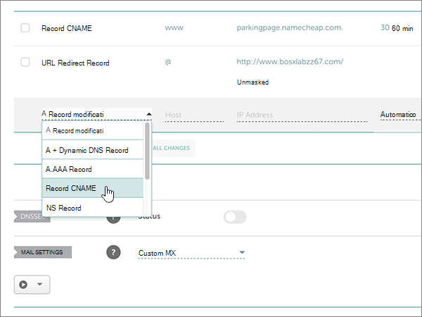

# Creare record DNS su Namecheap per Office 365

 Se non si trova ciò che si sta cercando, **[vedere le domande frequenti sui domini](../setup/domains-faq.md)**. 
  
Se il proprio provider di hosting DNS è Namecheap, seguire i passaggi di questo articolo per verificare il dominio e configurare i record DNS per posta elettronica, Skype for Business online e così via.
  
Dopo aver aggiunto questi record in Namecheap, il domino sarà configurato per l'uso con i servizi di Office 365.
  
> [!NOTE]
> In genere, l'applicazione delle modifiche ai record DNS richiede circa 15 minuti. A volte, tuttavia, l'aggiornamento di una modifica nel sistema DNS di Internet può richiedere più tempo. In caso di problemi relativi al flusso di posta o di altro tipo dopo l'aggiunta dei record DNS, vedere [Risolvere i problemi dopo la modifica del nome di dominio o dei record DNS](../get-help-with-domains/find-and-fix-issues.md). 
  
## Aggiungere un record TXT a scopo di verifica

Prima di usare il proprio dominio con Office 365, è necessario dimostrare di esserne proprietari. La capacità di accedere al proprio account nel registrar e di creare il record DNS dimostra a Office 365 che si è proprietari del dominio.
  
> [!NOTE]
> Questo record viene usato esclusivamente per verificare di essere proprietari del dominio e non ha altri effetti. È possibile eliminarlo in un secondo momento, se si preferisce. 
  
Effettuare le operazioni seguenti.
  
1. Per iniziare, passare alla propria pagina dei domini su Namecheap usando [questo collegamento](https://www.namecheap.com/myaccount/login.aspx?ReturnUrl=%2f). Verrà richiesto di eseguire l'accesso e continuare.
    
    
  
2. Nella pagina di **destinazione** , in **account**, scegliere **Domain List** nell'elenco a discesa. 
    
    
  
3. Nella pagina **elenco dei domini** trovare il nome del dominio che si desidera modificare, quindi selezionare **Gestisci**.
    
    
  
4. Selezionare **DNS avanzato**.
    
    
  
5. Nella sezione **Host Records** selezionare **Aggiungi nuovo record**.
    
    
  
6. Nell'elenco a discesa **Type** selezionare **TXT Record**.
    
    > [!NOTE]
    > L'elenco a discesa **tipo** viene visualizzato automaticamente quando si seleziona **Aggiungi nuovo record**. 
  
    
  
7. Nelle caselle del nuovo record digitare oppure copiare e incollare i valori della tabella seguente.
    
    Scegliere il valore **TTL** nell'elenco a discesa. 
    
    |**Tipo**|**Host**|**Valore**|**TTL**|
    |:-----|:-----|:-----|:-----|
    |TXT    |@    |MS=ms *XXXXXXXX*   **Note:** questo è un esempio. Usare il valore specifico di **Indirizzo di destinazione o puntamento** indicato nella tabella in Office 365.  [Come trovarlo](../get-help-with-domains/information-for-dns-records.md)          |30 min    |
       
    
  
8. Selezionare il controllo **Salva modifiche** (segno di spunta). 
    
    
  
9. Attendere alcuni minuti prima di continuare, in modo che il record appena creato venga aggiornato in Internet.
    
Una volta aggiunto il record al sito del registrar, è possibile tornare in Office 365 e chiedere di cercarlo.
  
Quando Office 365 trova il record TXT corretto, il dominio è verificato.
  
1. Nell'interfaccia di amministrazione passare a **Impostazioni** \> pagina <a href="https://go.microsoft.com/fwlink/p/?linkid=834818" target="_blank">Domini</a>.
    
2. Nella pagina **Domini** selezionare il dominio da verificare. 
    
    
  
3. Nella pagina **Configurazione** selezionare **Avvia configurazione**.
    
    
  
4. Nella pagina **Verifica dominio** selezionare **Verifica**.
    
    
  
> [!NOTE]
> In genere, l'applicazione delle modifiche ai record DNS richiede circa 15 minuti. A volte, tuttavia, l'aggiornamento di una modifica nel sistema DNS di Internet può richiedere più tempo. In caso di problemi relativi al flusso di posta o di altro tipo dopo l'aggiunta dei record DNS, vedere [Risolvere i problemi dopo la modifica del nome di dominio o dei record DNS](../get-help-with-domains/find-and-fix-issues.md). 

  
## Aggiungere un record MX in modo che la posta elettronica per il dominio venga recapitata in Office 365

Effettuare le operazioni seguenti.
  
1. Per iniziare, passare alla propria pagina dei domini su Namecheap usando [questo collegamento](https://www.namecheap.com/myaccount/login.aspx?ReturnUrl=%2f). Verrà richiesto di eseguire l'accesso e continuare.
    
    
  
2. Nella pagina di **destinazione** , in **account**, scegliere **Domain List** nell'elenco a discesa. 
    
    
  
3. Nella pagina **elenco dei domini** trovare il nome del dominio che si desidera modificare, quindi selezionare **Gestisci**.
    
    
  
4. Selezionare **DNS avanzato**.
    
    
  
5. Nella sezione **MAIL SETTINGS** selezionare **Custom MX** dall'elenco a discesa **Email Forwarding**. 
    
    Può essere necessario scorrere la pagina.
    
    
  
6. Selezionare **Aggiungi nuovo record**.
    
    
  
7. Nelle caselle del nuovo record digitare oppure copiare e incollare i valori della tabella seguente
    
    (la casella **Priority** è quella senza nome accanto alla casella **Value**. Scegliere il valore **TTL** nell'elenco a discesa. 
    
    |**Tipo**|**Host**|**Valore**|**Priorità**|**TTL**|
    |:-----|:-----|:-----|:-----|:-----|
    |Record MX    |@    |\<*Domain-Key*\>. mail.Protection.Outlook.com.    **This value MUST end with a period (.)**   **Nota:** Ottenere la propria * \<chiave\> di dominio* dall'account di Office 365.  [Come trovarla](../get-help-with-domains/information-for-dns-records.md)          |0    Per altre informazioni sulla priorità, vedere [Informazioni sulla priorità MX](https://support.office.com/article/2784cc4d-95be-443d-b5f7-bb5dd867ba83.aspx).   |30 min    |
       
    
  
8. Selezionare il controllo **Salva modifiche** (segno di spunta). 
    
    
  
9. Se sono presenti altri record MX, usare il processo in due passaggi seguente per rimuovere ognuno di essi:
    
    In primo luogo, selezionare l' **icona di eliminazione** (Cestino) per il record che si desidera rimuovere. 
    
    
  
    In secondo luogo, selezionare **Sì** per confermare l'eliminazione. 
    
    
  
    Rimuovere tutti i record MX, ad eccezione di quello aggiunto in precedenza in questa procedura.

  
## Aggiungere i sei record CNAME necessari per Office 365

Effettuare le operazioni seguenti.
  
1. Per iniziare, passare alla propria pagina dei domini su Namecheap usando [questo collegamento](https://www.namecheap.com/myaccount/login.aspx?ReturnUrl=%2f). Verrà richiesto di eseguire l'accesso e continuare.
    
    
  
2. Nella pagina di **destinazione** , in **account**, scegliere **Domain List** nell'elenco a discesa. 
    
    
  
3. Nella pagina **elenco dei domini** trovare il nome del dominio che si desidera modificare, quindi selezionare **Gestisci**.
    
    
  
4. Selezionare **DNS avanzato**.
    
    
  
5. Nella sezione **Host Records** selezionare **Aggiungi nuovo record**.
    
    
  
6. Nell'elenco a discesa **Type** selezionare **CNAME Record**.
    
    > [!NOTE]
    > L'elenco a discesa **tipo** viene visualizzato automaticamente quando si seleziona **Aggiungi nuovo record**. 
  
    
  
7. Nelle caselle vuote del nuovo record selezionare **CNAME** per **Record Type** e quindi digitare oppure copiare e incollare i valori dalla prima riga nella tabella seguente.
    
    |**Tipo**|**Host**|**Valore**|**TTL**|
    |:-----|:-----|:-----|:-----|
    |CNAME    |autodiscover    |autodiscover.outlook.com.    **Questo valore DEVE terminare con un punto (.)**   |3600    |
    |CNAME    |sip    |sipdir.online.lync.com.    **Questo valore DEVE terminare con un punto (.)**   |3600    |
    |CNAME    |lyncdiscover    |webdir.online.lync.com.    **Questo valore DEVE terminare con un punto (.)**   |3600    |
    |CNAME    |enterpriseregistration    |enterpriseregistration.windows.net.    **Questo valore DEVE terminare con un punto (.)**   |3600    |
    |CNAME    |enterpriseenrollment    |enterpriseenrollment-s.manage.microsoft.com.    **This value MUST end with a period (.)**   |3600    |
       
    
  
8. Selezionare il controllo **Salva modifiche** (segno di spunta). 
    
    
  
9. Utilizzando i quattro passaggi precedenti e i valori delle altre cinque righe nella tabella, aggiungere ognuno degli altri cinque record CNAME.

  
## Aggiungere un record TXT per SPF per evitare di ricevere posta indesiderata

> [!IMPORTANT]
> Non può essere presente più di un record TXT per SPF per un dominio. Se il dominio ha più record SPF, si verificheranno errori nella gestione della posta elettronica, oltre a problemi di recapito e di classificazione della posta indesiderata. If you already have an SPF record for your domain, don't create a new one for Office 365. Al contrario, aggiungere i valori di Office 365 richiesti al record corrente in modo da ottenere un *unico* record SPF che include entrambi i set di valori. 

Effettuare le operazioni seguenti.
  
1. Per iniziare, passare alla propria pagina dei domini su Namecheap usando [questo collegamento](https://www.namecheap.com/myaccount/login.aspx?ReturnUrl=%2f). Verrà richiesto di eseguire l'accesso e continuare.
    
2. Nella pagina di **destinazione** , in **account**, scegliere **Domain List** nell'elenco a discesa. 
    
    
  
3. Nella pagina **elenco dei domini** individuare il nome del dominio che si desidera modificare e quindi selezionare **Gestisci**.
    
    
  
4. Selezionare **DNS avanzato**.
    
    
  
5. Nella sezione **Host Records** selezionare **Aggiungi nuovo record**.
    
    
  
6. Nell'elenco a discesa **Type** selezionare **TXT Record**.
    
    > [!NOTE]
    > L'elenco a discesa **tipo** viene visualizzato automaticamente quando si seleziona **Aggiungi nuovo record**. 
  
    
  
7. Nelle caselle del nuovo record digitare oppure copiare e incollare i valori della tabella seguente.
    
    Scegliere il valore **TTL** nell'elenco a discesa. 
    
    |**Tipo**|**Host**|**Valore**|**TTL**|
    |:-----|:-----|:-----|:-----|
    |TXT    |@    |v=spf1 include:spf.protection.outlook.com -all    **Nota:** è consigliabile copiare e incollare questa voce, in modo che tutti i caratteri di spaziatura siano corretti.           |30 min    |
       
    
  
8. Selezionare il controllo **Salva modifiche** (segno di spunta). 
    
    
  
## Aggiungere i due record SRV necessari per Office 365

1. Per iniziare, passare alla propria pagina dei domini su Namecheap usando [questo collegamento](https://www.namecheap.com/myaccount/login.aspx?ReturnUrl=%2f). Verrà richiesto di eseguire l'accesso.
    
    
  
2. Nella pagina di **destinazione** , in **account**, scegliere **Domain List** nell'elenco a discesa. 
    
    
  
3. Nella pagina **elenco dei domini** individuare il nome del dominio che si desidera modificare e quindi selezionare **Gestisci**.
    
    
  
4. Selezionare **DNS avanzato**.
    
    
  
5. Nella sezione **Host Records** selezionare **Aggiungi nuovo record**.
    
    
  
6. Nell'elenco a discesa **Type** selezionare **SRV Record**.
    
    > [!NOTE]
    > L'elenco a discesa **tipo** viene visualizzato automaticamente quando si seleziona **Aggiungi nuovo record**. 
  
    
  
7. Nelle caselle vuote dei nuovi record digitare oppure copiare e incollare i valori dalla prima riga della tabella seguente.
    
    |**Servizio**|**Protocollo**|**Priorità**|**Peso**|**Porta**|**Target**|**TTL**|
    |:-----|:-----|:-----|:-----|:-----|:-----|:-----|
    |_sip    |_tls    |100    |1    |443    |sipdir.online.lync.com.    **Questo valore DEVE terminare con un punto (.)**   |30 min    |
    |_sipfederationtls    |_tcp    |100    |1    |5061    |sipfed.online.lync.com.    **Questo valore DEVE terminare con un punto (.)**   |30 min    |
       
    
  
8. Selezionare il controllo **Salva modifiche** (segno di spunta). 
    
    
  
9. Usando i quattro passaggi descritti in precedenza e i valori dalla seconda riga nella tabella, aggiungere l'altro record SRV.
    
> [!NOTE]
> In genere, l'applicazione delle modifiche ai record DNS richiede circa 15 minuti. A volte, tuttavia, l'aggiornamento di una modifica nel sistema DNS di Internet può richiedere più tempo. In caso di problemi relativi al flusso di posta o di altro tipo dopo l'aggiunta dei record DNS, vedere [Risolvere i problemi dopo la modifica del nome di dominio o dei record DNS](../get-help-with-domains/find-and-fix-issues.md). 
  

  
