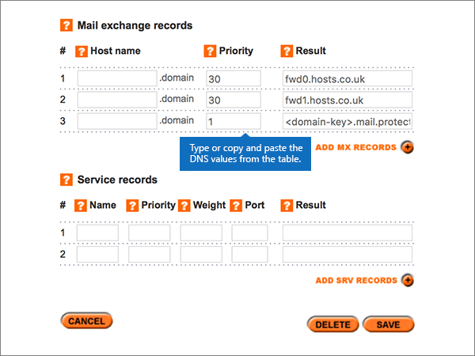

# Creare record DNS in Names.co.uk per Microsoft

 **Se non si trova ciò che si sta cercando, [vedere le domande frequenti sui domini](../setup/domains-faq.yml)**. 
  
Se il provider di hosting DNS è Names.co.uk, seguire i passaggi di questo articolo per verificare il dominio e configurare i record DNS per posta elettronica, Skype for Business online e così via.
    
Dopo aver aggiunto questi record in Names.co.uk, il dominio sarà configurato per l'utilizzo con i servizi Microsoft.
  

  
> [!NOTE]
>  In genere, l'applicazione delle modifiche ai record DNS richiede circa 15 minuti. A volte, tuttavia, l'aggiornamento di una modifica nel sistema DNS di Internet può richiedere più tempo. In caso di problemi relativi al flusso di posta o di altro tipo dopo l'aggiunta dei record DNS, vedere [Risolvere i problemi dopo la modifica del nome di dominio o dei record DNS](../get-help-with-domains/find-and-fix-issues.md). 
  
## Aggiungere un record TXT a scopo di verifica

Prima di usare il proprio dominio con Microsoft, è necessario dimostrare di esserne il proprietario. La capacità di accedere al proprio account nel registrar e di creare il record DNS dimostra a Microsoft che si è il proprietario del dominio.
  
> [!NOTE]
> Questo record viene usato esclusivamente per verificare di essere proprietari del dominio e non ha altri effetti. È possibile eliminarlo in un secondo momento, se si preferisce. 
  
1. Per iniziare, passare alla propria pagina dei domini su Names.co.uk usando [questo collegamento](https://account.names.co.uk/dashboard#/). Verrà richiesto di eseguire l'accesso.
    
    
  
2. On the **Dashboard** page, find the name of the domain that you are updating, and then choose **DNS Settings** from the drop-down list. 
    
    (You may have to scroll down.)
    
    
  
3. On the **Add/Modify DNS Zone** page, in the **A, CNAME, AAAA, TXT and NS records** section, in the boxes for the new record, type or copy and paste the values from the following table. 
    
    Selezionare il valore **Type** nell'elenco a discesa. 
    
    Se è necessario aggiungere una riga, selezionare **ADD A/CNAME RECORDS (+)**.
    
    Può essere necessario scorrere la pagina.
        
    |**Nome host**|**Tipo**|**Risultato**|
    |:-----|:-----|:-----|
    |(Leave this field empty.)    |TXT    |MS=ms *XXXXXXXX*    **Note:** questo è un esempio. Usare il valore specifico di **Indirizzo di destinazione o puntamento** indicato nella tabella.           [Come trovarlo](../get-help-with-domains/information-for-dns-records.md)    |
       
    
  
4. Selezionare **Salva**.
    
    Può essere necessario scorrere la pagina.
    
    
  
5. Attendere alcuni minuti prima di continuare, in modo che il record appena creato venga aggiornato in Internet.
    
Una volta che il record è stato aggiunto al sito del registrar, è possibile tornare a Microsoft e richiedere il record.
  
Quando Microsoft trova il record TXT corretto, il dominio è verificato.
  
1. Nell'interfaccia di amministrazione passare a **Impostazioni** \> pagina <a href="https://go.microsoft.com/fwlink/p/?linkid=834818" target="_blank">Domini</a>.
    
2. Nella pagina **Domini** selezionare il dominio da verificare. 
    
    
  
3. Nella pagina **Configurazione** selezionare **Avvia configurazione**.
    
    
  
4. Nella pagina **Verifica dominio** selezionare **Verifica**.
    
    
  
> [!NOTE]
>  In genere, l'applicazione delle modifiche ai record DNS richiede circa 15 minuti. A volte, tuttavia, l'aggiornamento di una modifica nel sistema DNS di Internet può richiedere più tempo. In caso di problemi relativi al flusso di posta o di altro tipo dopo l'aggiunta dei record DNS, vedere [Risolvere i problemi dopo la modifica del nome di dominio o dei record DNS](../get-help-with-domains/find-and-fix-issues.md). 
  
## Aggiungere un record MX in modo che la posta elettronica del dominio venga recapitata in Microsoft

1. Per iniziare, passare alla propria pagina dei domini su Names.co.uk usando [questo collegamento](https://account.names.co.uk/dashboard#/). Verrà richiesto di eseguire l'accesso.
    
    
  
2. On the **Dashboard** page, find the name of the domain that you are updating, and then choose **DNS Settings** from the drop-down list. 
    
    (You may have to scroll down.)
    
    
  
3. Nella pagina **Add/Modify DNS Zone** digitare oppure copiare e incollare i valori della tabella seguente nelle caselle del nuovo record nella sezione **Add/Modify DNS Zone**. 
    
    Può essere necessario scorrere la pagina.
    
    |**Nome host**|**Priority**|**Result**|
    |:-----|:-----|:-----|
    |Lasciare vuoto questo campo.    |1    Per altre informazioni sulla priorità, vedere [Che cos'è la priorità MX](../setup/domains-faq.yml).   | *\<domain-key\>*  .mail.protection.outlook.com    > [!NOTE]> ottenere il  *\<domain-key\>*  tuo account Microsoft.           [Come trovarlo](../get-help-with-domains/information-for-dns-records.md)          |
       
    
  
4. Selezionare **Salva**.
    
    Può essere necessario scorrere la pagina.
    
    
  
5. Se sono presenti altri record MX nella sezione **Mail exchange records**, eliminarli uno alla volta selezionandoli e premendo **CANC**. 
    
    
  
6. Selezionare **Salva**.
    
    Può essere necessario scorrere la pagina.
    
    
  
## Aggiungere i sei record CNAME necessari per Microsoft

1. Per iniziare, passare alla propria pagina dei domini su Names.co.uk usando [questo collegamento](https://account.names.co.uk/dashboard#/). Verrà richiesto di eseguire l'accesso.
    
    
  
2. On the **Dashboard** page, find the name of the domain that you are updating, and then choose **DNS Settings** from the drop-down list. 
    
    (You may have to scroll down.)
    
    
  
3. On the **Add/Modify DNS Zone** page, in the **A, CNAME, AAAA, TXT and NS records** section, in the boxes for the new record, type or copy and paste the values from the following table. 
    
    Selezionare il valore **Type** nell'elenco a discesa. 
    
    Se è necessario aggiungere una riga, selezionare **ADD A/CNAME RECORDS (+)**.
    
    Può essere necessario scorrere la pagina.
    
    |**Host Name**|**Type**|**Result**|
    |:-----|:-----|:-----|
    |individuazione automatica    |CNAME    |autodiscover.outlook.com    |
    |sip    |CNAME    |sipdir.online.lync.com    |
    |lyncdiscover    |CNAME    |webdir.online.lync.com    |
    |enterpriseregistration    |CNAME    |enterpriseregistration.windows.net    |
    |enterpriseenrollment    |CNAME    |enterpriseenrollment-s.manage.microsoft.com    |
       
    
  
4. Selezionare **Salva**.
    
    
  
## Aggiungere un record TXT per SPF per evitare di ricevere posta indesiderata

> [!IMPORTANT]
> Non può essere presente più di un record TXT per SPF per un dominio. Se il dominio ha più record SPF, si verificheranno errori nella gestione della posta elettronica, oltre a problemi di recapito e di classificazione della posta indesiderata. Se si dispone già di un record SPF per il dominio, non crearne uno nuovo per Microsoft. Aggiungere invece i valori Microsoft necessari al record corrente in modo da disporre di un singolo record  *SPF*  che include entrambi i set di valori.
  
1. Per iniziare, passare alla propria pagina dei domini su Names.co.uk usando [questo collegamento](https://account.names.co.uk/dashboard#/). Verrà richiesto di eseguire l'accesso.
    
    
  
2. On the **Dashboard** page, find the name of the domain that you are updating, and then choose **DNS Settings** from the drop-down list. 
    
    (You may have to scroll down.)
    
    
  
3. Nella colonna Domain **name** della pagina **DNS Zones on Account** selezionare il nome del dominio da aggiornare. 
    
    
  
4. On the **Add/Modify DNS Zone** page, in the **A, CNAME, AAAA, TXT and NS records** section, in the boxes for the new record, type or copy and paste the values from the following table. 
    
    Selezionare il valore **Type** nell'elenco a discesa. 
    
    Se è necessario aggiungere una riga, selezionare **ADD A/CNAME RECORDS (+)**.
    
    Può essere necessario scorrere la pagina.
    
    |**Nome host**|**Tipo**|**Risultato**|
    |:-----|:-----|:-----|
    |(Leave this field empty.)    |TXT    |v=spf1 include:spf.protection.outlook.com -all    **Nota:** è consigliabile copiare e incollare questa voce, in modo che tutti i caratteri di spaziatura siano corretti.           |
       
    
  
5. Selezionare **Salva**.
    
    Può essere necessario scorrere la pagina.
    
    
  
## Aggiungere i due record SRV necessari per Microsoft

1. Per iniziare, passare alla propria pagina dei domini su Names.co.uk usando [questo collegamento](https://account.names.co.uk/dashboard#/). Verrà richiesto di eseguire l'accesso.
    
    
  
2. On the **Dashboard** page, find the name of the domain that you are updating, and then choose **DNS Settings** from the drop-down list. 
    
    (You may have to scroll down.)
    
    
  
3. Nella pagina **Add/Modify DNS Zone** digitare oppure copiare e incollare i valori della tabella seguente nelle caselle del nuovo record nella sezione **Service records**. 
    
    Può essere necessario scorrere la pagina.
    
    |**Name**|**Priorità**|**Peso**|**Porta**|**Result**|
    |:-----|:-----|:-----|:-----|:-----|
    |_sip._tls    |100    |1    |443    |sipdir.online.lync.com    |
    |_sipfederationtls._tcp    |100    |1    |5061    |sipfed.online.lync.com    |
       
    
  
4. Selezionare **Salva**.
    
    Può essere necessario scorrere la pagina.
    
    
  
> [!NOTE]
>  In genere, l'applicazione delle modifiche ai record DNS richiede circa 15 minuti. A volte, tuttavia, l'aggiornamento di una modifica nel sistema DNS di Internet può richiedere più tempo. In caso di problemi relativi al flusso di posta o di altro tipo dopo l'aggiunta dei record DNS, vedere [Risolvere i problemi dopo la modifica del nome di dominio o dei record DNS](../get-help-with-domains/find-and-fix-issues.md). 
