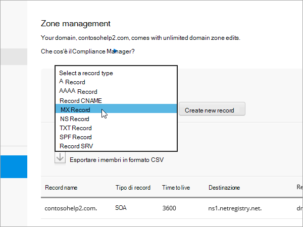
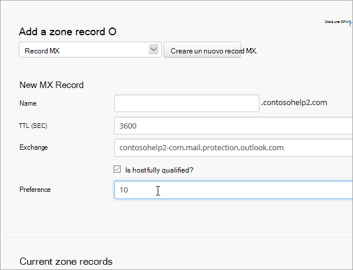
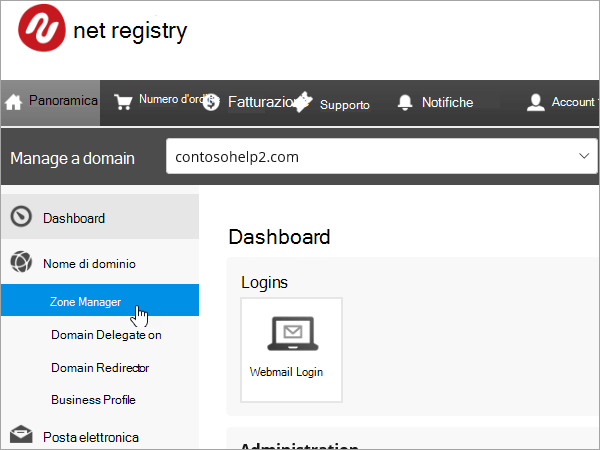
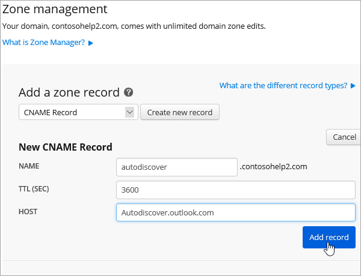
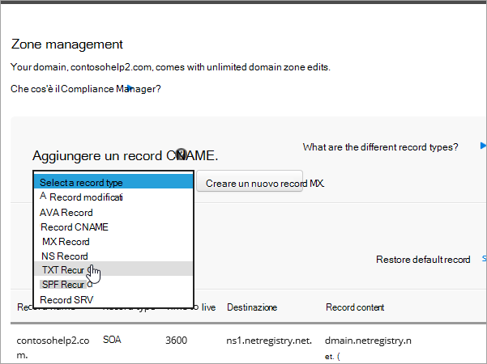
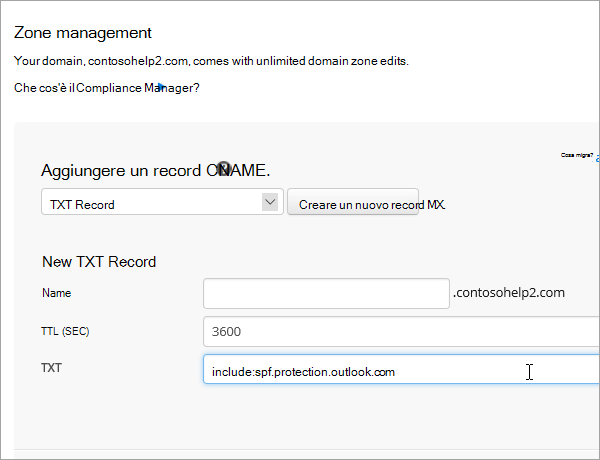
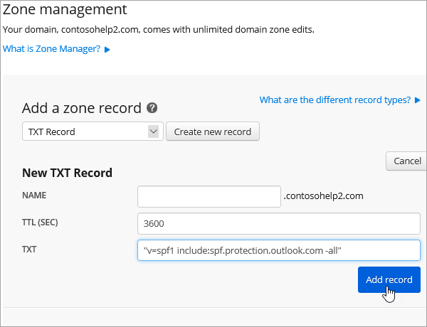
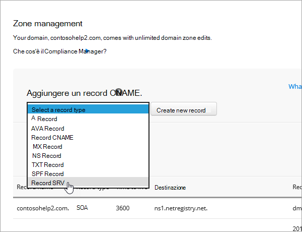
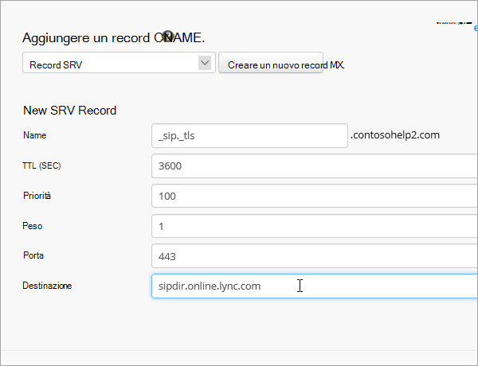

# Creare record DNS in Netregistry per Office 365Create DNS records at Netregistry for Office 365

Se non si trovano le informazioni desiderate, [vedere le domande frequenti sui domini](../setup/domains-faq.md).[Check the Domains FAQ](../setup/domains-faq.md) if you don't find what you're looking for. 
  
Se Netregistry è il provider di hosting DNS, seguire la procedura descritta in questo articolo per verificare il dominio e configurare i record DNS per la posta elettronica, Skype for business online e così via.If Netregistry is your DNS hosting provider, follow the steps in this article to verify your domain and set up DNS records for email, Skype for Business Online, and so on.
  
Ecco i principali record da aggiungere.These are the main records to add.
  
- [Aggiungere un record TXT a scopo di verificaAdd a TXT record for verification](#add-a-txt-record-for-verification)
    
- [Aggiungere un record MX in modo che la posta elettronica per il dominio venga recapitata in Office 365Add an MX record so email for your domain will come to Office 365](#add-an-mx-record-so-email-for-your-domain-will-come-to-office-365)

- [Aggiungere i record CNAME necessari per Office 365Add the CNAME records that are required for Office 365](#add-the-cname-records-that-are-required-for-office-365)
    
- [Aggiungere un record TXT per SPF per evitare di ricevere posta indesiderataAdd a TXT record for SPF to help prevent email spam](#add-a-txt-record-for-spf-to-help-prevent-email-spam)
    
- [Aggiungere i due record SRV necessari per Office 365Add the two SRV records that are required for Office 365](#add-the-two-srv-records-that-are-required-for-office-365)
    
Dopo aver aggiunto questi record in Netregistry, il dominio sarà configurato per l'uso con i servizi di Office 365.After you add these records at Netregistry, your domain will be set up to work with Office 365 services.
  
Per informazioni su hosting Web e DNS per i siti Web con Office 365, vedere [Usare un sito Web pubblico con Office 365](https://support.office.com/article/a8178510-501d-4bd8-9921-b04f2e9517a5.aspx).To learn about webhosting and DNS for websites with Office 365, see [Use a public website with Office 365](https://support.office.com/article/a8178510-501d-4bd8-9921-b04f2e9517a5.aspx).
  
> [!NOTE]
> In genere, l'applicazione delle modifiche ai record DNS richiede circa 15 minuti. A volte, tuttavia, l'aggiornamento di una modifica nel sistema DNS di Internet può richiedere più tempo. In caso di problemi relativi al flusso di posta o di altro tipo dopo l'aggiunta dei record DNS, vedere [Risolvere i problemi dopo la modifica del nome di dominio o dei record DNS](../get-help-with-domains/find-and-fix-issues.md).Typically it takes about 15 minutes for DNS changes to take effect. However, it can occasionally take longer for a change you've made to update across the Internet's DNS system. If you're having trouble with mail flow or other issues after adding DNS records, see [Troubleshoot issues after changing your domain name or DNS records](../get-help-with-domains/find-and-fix-issues.md). 
  
## Aggiungere un record TXT a scopo di verificaAdd a TXT record for verification

Prima di usare il proprio dominio con Office 365, è necessario dimostrare di esserne proprietari. La capacità di accedere al proprio account nel registrar e di creare il record DNS dimostra a Office 365 che si è proprietari del dominio.Before you use your domain with Office 365, we have to make sure that you own it. Your ability to log in to your account at your domain registrar and create the DNS record proves to Office 365 that you own the domain.
  
> [!NOTE]
> Questo record viene usato esclusivamente per verificare di essere proprietari del dominio e non ha altri effetti. È possibile eliminarlo in un secondo momento, se si preferisce.This record is used only to verify that you own your domain; it doesn't affect anything else. You can delete it later, if you like. 
  
1. Per iniziare, passare alla propria pagina dei domini in Netregistry usando [questo collegamento](https://theconsole.netregistry.com.au/).To get started, go to your domains page in Netregistry by using [this link](https://theconsole.netregistry.com.au/). You'll be prompted to log in.You'll be prompted to log in.
    
    
  
2. Accanto al dominio che si desidera gestire, selezionare **Gestisci**.Next to the domain you want to manage, select **Manage**.
    
    
  
3. Selezionare **Gestione aree**.Select **Zone Manager**.
    
    
  
4. In **Aggiungi un record di area**scegliere **txt record** nell'elenco e quindi selezionare **Crea nuovo record**.Under **Add a zone record**, choose **TXT Record** from the list, and then select **Create new record**.
    
    
  
    > [!NOTE]
    > È necessario utilizzare le virgolette prima e dopo la voce nella casella TXT.You must use quotation marks before and after the entry in the TXT box. 
  
    Nella maschera **nuovo record TXT** Digitare oppure copiare e incollare i valori della tabella seguente.In the **New TXT Record** form, type or copy and paste the values from the following table. 
    
    |**Nome****Name**|**TTL (SEC)****TTL (SEC)**|**TXT (punta all'indirizzo o al valore)****TXT (Points to address or value)**|
    |:-----|:-----|:-----|
    |(lasciare vuoto)(leave blank)    |3600 (secondi)3600 (seconds)    |"MS = msXXXXXXXX""MS=msXXXXXXXX"    **Note:** questo è un esempio.**Note:** This is an example. Usare il valore specifico di **Indirizzo di destinazione o puntamento** indicato nella tabella in Office 365.Use your specific **Destination or Points to Address** value here, from the table in Office 365. [Come trovarloHow do I find this?](../get-help-with-domains/information-for-dns-records.md)  |
       
    
  
6. Selezionare **Aggiungi record**.Select **Add record**.
    
Una volta aggiunto il record al sito del registrar, è possibile tornare in Office 365 e chiedere di cercarlo.Now that you've added the record at your domain registrar's site, you'll go back to Office 365 and request Office 365 to look for the record.
  
Quando Office 365 trova il record TXT corretto, il dominio è verificato.When Office 365 finds the correct TXT record, your domain is verified.
  
1. Nell'interfaccia di amministrazione passare a **Impostazioni** \> pagina <a href="https://go.microsoft.com/fwlink/p/?linkid=834818" target="_blank">Domini</a>.In the admin center, go to the **Settings** \> <a href="https://go.microsoft.com/fwlink/p/?linkid=834818" target="_blank">Domains</a> page.
    
2. Nella pagina **Domini** selezionare il dominio da verificare.On the **Domains** page, select the domain that you are verifying. 
    
    
  
3. Nella pagina **Configurazione** selezionare **Avvia configurazione**.On the **Setup** page, select **Start setup**.
    
    
  
4. Nella pagina **Verifica dominio** selezionare **Verifica**.On the **Verify domain** page, select **Verify**.
    
    
  
> [!NOTE]
>  In genere, l'applicazione delle modifiche ai record DNS richiede circa 15 minuti. A volte, tuttavia, l'aggiornamento di una modifica nel sistema DNS di Internet può richiedere più tempo. In caso di problemi relativi al flusso di posta o di altro tipo dopo l'aggiunta dei record DNS, vedere [Risolvere i problemi dopo la modifica del nome di dominio o dei record DNS](../get-help-with-domains/find-and-fix-issues.md).Typically it takes about 15 minutes for DNS changes to take effect. However, it can occasionally take longer for a change you've made to update across the Internet's DNS system. If you're having trouble with mail flow or other issues after adding DNS records, see [Troubleshoot issues after changing your domain name or DNS records](../get-help-with-domains/find-and-fix-issues.md). 
  
## Aggiungere un record MX in modo che la posta elettronica per il dominio venga recapitata in Office 365Add an MX record so email for your domain will come to Office 365

1. Per iniziare, passare alla propria pagina dei domini in Netregistry usando [questo collegamento](https://theconsole.netregistry.com.au/).To get started, go to your domains page in Netregistry by using [this link](https://theconsole.netregistry.com.au/). You'll be prompted to log in.You'll be prompted to log in.
    
    
  
2. Accanto al dominio che si desidera gestire, selezionare **Gestisci**.Next to the domain you want to manage, select **Manage**.
    
    
  
3. Selezionare **Gestione aree**.Select **Zone Manager**.
    
    
  
4. In **current zone Records**rimuovere i record MX predefiniti selezionando **Rimuovi** accanto a ogni record MX nell'elenco.Under **Current zone records**, remove the default MX records by selecting **Remove** next to each MX record in the list. 
    
    
  
5. In **aggiungere un record di area**scegliere **record MX** dall'elenco e quindi selezionare **Crea nuovo record**.Under **Add a zone record**, choose **MX Record** from the list, and then select **Create new record**.
    
    
  
6. Nella maschera **nuovo record MX** , digitare oppure copiare e incollare i valori della tabella seguente.In the **New MX Record** form, type or copy and paste the values from the following table. 
    
    |**Nome****Name**|**TTL (SEC)****TTL (SEC)**|**Exchange (punta all'indirizzo o al valore)****Exchange (Points to address or value)**|**L'host è completo?****Is host fully qualified?**|**Preferenza (priorità)****Preference (Priority)**|
    |:-----|:-----|:-----|:-----|:-----|
    |(lasciare vuoto)(leave blank)    |3600 (secondi)3600 (seconds)    | *\<chiave-dominio\>*  .mail.protection.outlook.com*\<domain-key\>*  .mail.protection.outlook.com    **Nota:** Ottenere la propria \* \<chiave\> di dominio\* dall'account di Office 365.**Note:** Get your  *\<domain-key\>*  from your Office 365 account.  [Come trovarloHow do I find this?](../get-help-with-domains/information-for-dns-records.md)      |(Seleziona la casella di controllo)(select the checkbox)    |10 10    For more information about priority, see What is MX priority?For more information about priority, see What is MX priority?    |
       
    
  
7. Selezionare **Aggiungi record**.Select **Add Record**.
    
    
  
## Aggiungere i record CNAME necessari per Office 365Add the CNAME records that are required for Office 365

1. Per iniziare, passare alla propria pagina dei domini in Netregistry usando [questo collegamento](https://theconsole.netregistry.com.au/).To get started, go to your domains page in Netregistry by using [this link](https://theconsole.netregistry.com.au/). You'll be prompted to log in.You'll be prompted to log in.
    
    
  
2. Accanto al dominio che si desidera gestire, selezionare **Gestisci**.Next to the domain you want to manage, select **Manage**.
    
    
  
3. Selezionare **Gestione aree**.Select **Zone Manager**.
    
    
  
4. In **Aggiungi un record di area**scegliere **CNAME record** nell'elenco, quindi selezionare **Crea nuovo record**.Under  **Add a zone record**, choose **CNAME Record** from the list, and then select **Create new record**.
    
    
  
5. Nelle caselle del nuovo record digitare oppure copiare e incollare i valori della tabella seguente.In the boxes for the new record, type or copy and paste the values from the following table.
    
    |**Nome****Name**|**Tipo****Type**|**TTL****TTL**|**HOST (indica il valore o l'indirizzo)****HOST (Points to or address value)**|
    |:-----|:-----|:-----|:-----|
    |autodiscoverautodiscover    |CNAMECNAME    |3600 (secondi)3600 (seconds)    |autodiscover.outlook.comautodiscover.outlook.com    |
    |sipsip    |CNAMECNAME    |3600 (secondi)3600 (seconds)    |sipdir.online.lync.comsipdir.online.lync.com    |
    |lyncdiscoverlyncdiscover    |CNAMECNAME    |3600 (secondi)3600 (seconds)    |webdir.online.lync.comwebdir.online.lync.com    |
    |enterpriseregistrationenterpriseregistration    |CNAMECNAME    |3600 (secondi)3600 (seconds)    |enterpriseregistration.windows.netenterpriseregistration.windows.net    |
    |enterpriseenrollmententerpriseenrollment    |CNAMECNAME    |3600 (secondi)3600 (seconds)    |enterpriseenrollment-s.manage.microsoft.comenterpriseenrollment-s.manage.microsoft.com    |
       
    
      
6. Selezionare **Aggiungi record**.Select **Add record**.
    
    
  
7. Ripetere i passaggi precedenti per creare gli altri cinque record CNAME.Repeat the previous steps to create the other five CNAME records.
    
    Per ogni record, digitare o copiare e incollare i valori dalla riga successiva della tabella precedente nelle caselle corrispondenti.For each record, type or copy and paste the values from the next row of the table above into the boxes for that record.
    
## Aggiungere un record TXT per SPF per evitare di ricevere posta indesiderataAdd a TXT record for SPF to help prevent email spam

> [!IMPORTANT]
> Non può essere presente più di un record TXT per SPF per un dominio.You cannot have more than one TXT record for SPF for a domain. Se il dominio ha più record SPF, si verificheranno errori nella gestione della posta elettronica, oltre a problemi di recapito e di classificazione della posta indesiderata.If your domain has more than one SPF record, you'll get email errors, as well as delivery and spam classification issues. If you already have an SPF record for your domain, don't create a new one for Office 365.If you already have an SPF record for your domain, don't create a new one for Office 365. Al contrario, aggiungere i valori di Office 365 richiesti al record corrente in modo da ottenere un *unico* record SPF che include entrambi i set di valori.Instead, add the required Office 365 values to the current record so that you have a  *single*  SPF record that includes both sets of values.
  
1. Per iniziare, passare alla propria pagina dei domini in Netregistry usando [questo collegamento](https://theconsole.netregistry.com.au/).To get started, go to your domains page in Netregistry by using [this link](https://theconsole.netregistry.com.au/). You'll be prompted to log in.You'll be prompted to log in.
    
    
  
2. Accanto al dominio che si desidera gestire, selezionare **Gestisci**.Next to the domain you want to manage, select **Manage**.
    
    
  
3. Selezionare **Gestione aree**.Select **Zone Manager**.
    
    
  
4. In **Aggiungi un record di area**scegliere **txt record** nell'elenco e quindi selezionare **Crea nuovo record**.Under **Add a zone record**, choose **TXT Record** from the list, and then select **Create new record**.
    
    
  
5. Nelle caselle del nuovo record digitare oppure copiare e incollare i valori della tabella seguente.In the boxes for the new record, type or copy and paste the values from the following table. 
    
    > [!NOTE]
    > È necessario utilizzare le virgolette prima e dopo la voce nella casella TXT.You must use quotation marks before and after the entry in the TXT box. 
  
    |**Nome****Name**|**Tipo****Type**|**TTL****TTL**|**Dati TXT (destinazione)****TXT Data (Target)**|
    |:-----|:-----|:-----|:-----|
    |(lasciare vuoto)(leave blank)    |TXTTXT    |3600 (secondi)3600 (seconds)    |"v = spf1 include: SPF. Protection. Outlook. com-All""v=spf1 include:spf.protection.outlook.com -all"    **Nota:** è consigliabile copiare e incollare questa voce, in modo che tutti i caratteri di spaziatura siano corretti.**Note:** We recommend copying and pasting this entry, so that all of the spacing stays correct.           |
   
    
  
6. Selezionare **Aggiungi record**.Select **Add Record**.
    
    
  
## Aggiungere i due record SRV necessari per Office 365Add the two SRV records that are required for Office 365

1. Per iniziare, passare alla propria pagina dei domini in Netregistry usando [questo collegamento](https://theconsole.netregistry.com.au/).To get started, go to your domains page in Netregistry by using [this link](https://theconsole.netregistry.com.au/). You'll be prompted to log in.You'll be prompted to log in.
    
    
  
2. Accanto al dominio che si desidera gestire, selezionare **Gestisci**.Next to the domain you want to manage, select  **Manage**.
    
    
  
3. Selezionare **Gestione aree**.Select **Zone Manager**.
    
    
  
4. In **aggiungere un record di area**scegliere **SRV record** nell'elenco e quindi selezionare **Crea nuovo record**.Under  **Add a zone record**, choose **SRV Record** from the list, and then select **Create new record**.
    
    
  
5. Nelle caselle del nuovo record digitare oppure copiare e incollare i valori della tabella seguente.In the boxes for the new record, type or copy and paste the values from the following table.
    
    > [!NOTE]
    > Il campo nome è una combinazione del servizio (ad esempio, _sip) e del protocollo, ad esempio _tls.The Name field is a combination of the service (for example, _sip) and protocol (for example, _tls). 
  
    |**Tipo****Type**|**Nome****Name**|**TTL (SEC)****TTL (SEC)**|**Priorità****Priority**|**Peso****Weight**|**Porta****Port**|**Target****Target**|
    |:-----|:-----|:-----|:-----|:-----|:-----|:-----|
    |SRV (Service)SRV (service)    |_sip. _tls_sip._tls    |3600 (secondi)3600 (seconds)    |100100    |11    |443443    |sipdir.online.lync.comsipdir.online.lync.com    |
    |SRV (Service)SRV (service)    |_sipfederationtls. _tcp_sipfederationtls._tcp    |3600 (secondi)3600 (seconds)    |100100    |11    |50615061    |sipfed.online.lync.comsipfed.online.lync.com    |
       
    
  
6. Selezionare **Aggiungi record**.Select **Add Record**.
    
    
  
7. Ripetere i passaggi precedenti per creare l'altro record SRV.Repeat the previous steps to create the other SRV record.
    
    Digitare o copiare e incollare i valori dalla seconda riga della tabella precedente nelle caselle per il secondo record.Type or copy and paste the values from the second row of the table above into the boxes for the second record.
    
> [!NOTE]
> In genere, l'applicazione delle modifiche ai record DNS richiede circa 15 minuti. A volte, tuttavia, l'aggiornamento di una modifica nel sistema DNS di Internet può richiedere più tempo. In caso di problemi relativi al flusso di posta o di altro tipo dopo l'aggiunta dei record DNS, vedere [Risolvere i problemi dopo la modifica del nome di dominio o dei record DNS](../get-help-with-domains/find-and-fix-issues.md).Typically it takes about 15 minutes for DNS changes to take effect. However, it can occasionally take longer for a change you've made to update across the Internet's DNS system. If you're having trouble with mail flow or other issues after adding DNS records, see [Troubleshoot issues after changing your domain name or DNS records](../get-help-with-domains/find-and-fix-issues.md). 
  

