# Creare record DNS in OVH per MicrosoftCreate DNS records at OVH for Microsoft

Se non si trovano le informazioni desiderate, [vedere le domande frequenti sui domini](../setup/domains-faq.md).[Check the Domains FAQ](../setup/domains-faq.md) if you don't find what you're looking for. 
  
Se OVH è il provider di hosting DNS in uso, eseguire i passaggi descritti in questo articolo per verificare il dominio e configurare i record DNS per posta elettronica, Skype for Business Online e così via.If OVH is your DNS hosting provider, follow the steps in this article to verify your domain and set up DNS records for email, Skype for Business Online, and so on.
  
Ecco i principali record da aggiungere.These are the main records to add. 
  
- [Creare record DNS in OVH per MicrosoftCreate DNS records at OVH for Microsoft](#create-dns-records-at-ovh-for-microsoft)
    
- [Aggiungere un record MX in modo che la posta elettronica del dominio venga recapitata in MicrosoftAdd an MX record so email for your domain will come to Microsoft](#add-an-mx-record-so-email-for-your-domain-will-come-to-microsoft)
    
- [Aggiungere i record CNAME necessari per MicrosoftAdd the CNAME records that are required for Microsoft](#add-the-cname-records-that-are-required-for-microsoft)
    
- [Aggiungere un record TXT per SPF per evitare di ricevere posta indesiderataAdd a TXT record for SPF to help prevent email spam](#add-a-txt-record-for-spf-to-help-prevent-email-spam)
    
- [Aggiungere i due record SRV necessari per MicrosoftAdd the two SRV records that are required for Microsoft](#add-the-two-srv-records-that-are-required-for-microsoft)
    
Dopo aver aggiunto questi record in OVH, il dominio sarà configurato per l'uso con i servizi Microsoft.After you add these records at OVH, your domain will be set up to work with Microsoft services.

  
> [!NOTE]
>  In genere, l'applicazione delle modifiche ai record DNS richiede circa 15 minuti. A volte, tuttavia, l'aggiornamento di una modifica nel sistema DNS di Internet può richiedere più tempo. In caso di problemi relativi al flusso di posta o di altro tipo dopo l'aggiunta dei record DNS, vedere [Risolvere i problemi dopo la modifica del nome di dominio o dei record DNS](../get-help-with-domains/find-and-fix-issues.md).Typically it takes about 15 minutes for DNS changes to take effect. However, it can occasionally take longer for a change you've made to update across the Internet's DNS system. If you're having trouble with mail flow or other issues after adding DNS records, see [Troubleshoot issues after changing your domain name or DNS records](../get-help-with-domains/find-and-fix-issues.md). 
  
## Aggiungere un record TXT a scopo di verificaAdd a TXT record for verification

Prima di usare il proprio dominio con Microsoft, è necessario dimostrare di esserne il proprietario. La capacità di accedere al proprio account nel registrar e di creare il record DNS dimostra a Microsoft che si è il proprietario del dominio.Before you use your domain with Microsoft, we have to make sure that you own it. Your ability to log in to your account at your domain registrar and create the DNS record proves to Microsoft that you own the domain.
  
> [!NOTE]
> Questo record viene usato esclusivamente per verificare di essere proprietari del dominio e non ha altri effetti. È possibile eliminarlo in un secondo momento, se si preferisce.This record is used only to verify that you own your domain; it doesn't affect anything else. You can delete it later, if you like. 
  
1. Per iniziare, passare alla propria pagina dei domini in OVH usando [questo collegamento](https://www.ovh.com/manager/). Verrà chiesto di accedere.To get started, go to your domains page in OVH by using [this link](https://www.ovh.com/manager/). You'll be prompted to log in.
    
    
  
2. In **domini**selezionare il nome del dominio che si desidera modificare.Under **Domains**, select the name of the domain that you want edit.
    
    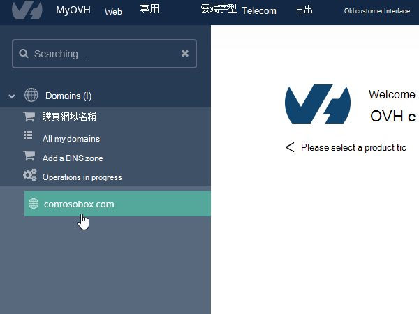
  
3. Selezionare la **zona DNS**.Select **DNS zone**.
    
    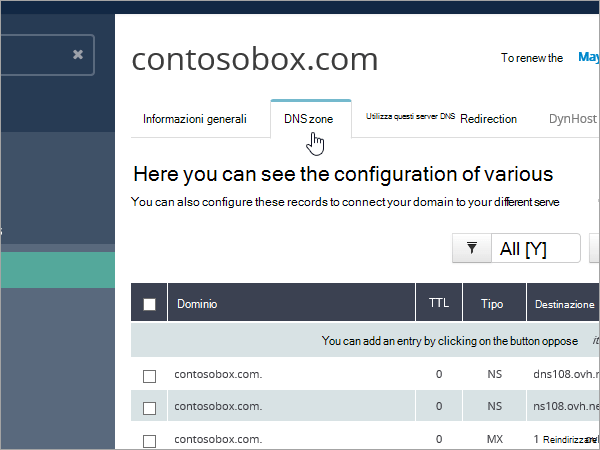
  
4. Selezionare **Aggiungi una voce**.Select **Add an entry**.
    
    
  
5. Seleziona **txt**Select **TXT**
    
    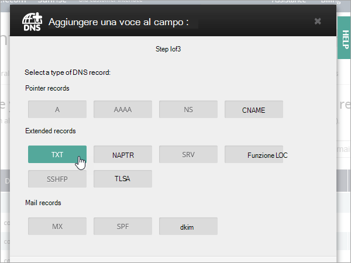
  
6. Nelle caselle del nuovo record digitare oppure copiare e incollare i valori della tabella seguente.In the boxes for the new record, type or copy and paste the values from the following table. Per assegnare un valore TTL, scegliere **personalizzato** dall'elenco a discesa e quindi digitare il valore nella casella di testo.To assign a TTL value, choose **Personalized** from the drop-down list, and then type the value in the text box. 
    
    |**Tipo di record****Record type**|**Sottodominio****Sub-domain**|**TTL****TTL**|**Valore****Value**|
    |:-----|:-----|:-----|:-----|
    |TXTTXT    |(lasciare vuoto)(leave blank)    |3600 (secondi)3600 (seconds)    |MS=msxxxxxxxxMS=msxxxxxxxx    **Note:** questo è un esempio.**Note:** This is an example. Usare il valore specifico di **Indirizzo di destinazione o puntamento** indicato nella tabella.Use your specific **Destination or Points to Address** value here, from the table.           [Come trovarloHow do I find this?](../get-help-with-domains/information-for-dns-records.md)          |
   
7. Selezionare **Conferma**.Select **Confirm**. 
    
    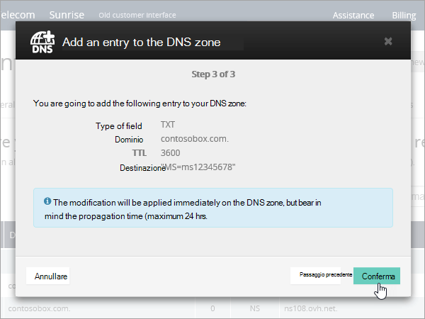
  
8. Attendere alcuni minuti prima di continuare, in modo che il record appena creato venga aggiornato in Internet.Wait a few minutes before you continue, so that the record you just created can update across the Internet.
    
Una volta che il record è stato aggiunto al sito del registrar, è possibile tornare a Microsoft e richiedere il record.Now that you've added the record at your domain registrar's site, you'll go back to Microsoft and request the record.
  
Quando Microsoft trova il record TXT corretto, il dominio è verificato.When Microsoft finds the correct TXT record, your domain is verified.
  
1. Nell'interfaccia di amministrazione passare a **Impostazioni** \> pagina <a href="https://go.microsoft.com/fwlink/p/?linkid=834818" target="_blank">Domini</a>.In the admin center, go to the **Settings** \> <a href="https://go.microsoft.com/fwlink/p/?linkid=834818" target="_blank">Domains</a> page.
    
2. Nella pagina **Domini** selezionare il dominio da verificare.On the **Domains** page, select the domain that you are verifying. 
    
    
  
3. Nella pagina **Configurazione** selezionare **Avvia configurazione**.On the **Setup** page, select **Start setup**.
    
    
  
4. Nella pagina **Verifica dominio** selezionare **Verifica**.On the **Verify domain** page, select **Verify**.
    
    
  
> [!NOTE]
>  In genere, l'applicazione delle modifiche ai record DNS richiede circa 15 minuti. A volte, tuttavia, l'aggiornamento di una modifica nel sistema DNS di Internet può richiedere più tempo. In caso di problemi relativi al flusso di posta o di altro tipo dopo l'aggiunta dei record DNS, vedere [Risolvere i problemi dopo la modifica del nome di dominio o dei record DNS](../get-help-with-domains/find-and-fix-issues.md).Typically it takes about 15 minutes for DNS changes to take effect. However, it can occasionally take longer for a change you've made to update across the Internet's DNS system. If you're having trouble with mail flow or other issues after adding DNS records, see [Troubleshoot issues after changing your domain name or DNS records](../get-help-with-domains/find-and-fix-issues.md). 
  
## Aggiungere un record MX in modo che la posta elettronica del dominio venga recapitata in MicrosoftAdd an MX record so email for your domain will come to Microsoft

1. Per iniziare, passare alla propria pagina dei domini in OVH usando [questo collegamento](https://www.ovh.com/manager/). Verrà chiesto di accedere.To get started, go to your domains page in OVH by using [this link](https://www.ovh.com/manager/). You'll be prompted to log in.
    
    
  
2. In **domini**selezionare il nome del dominio che si desidera modificare.Under **Domains**, select the name of the domain that you want edit.
    
    
  
3. Selezionare la **zona DNS**.Select **DNS zone**.
    
    
  
4. Selezionare **Aggiungi una voce**.Select **Add an entry**.
    
    
  
5. Selezionare **MX**.Select **MX**.
    
    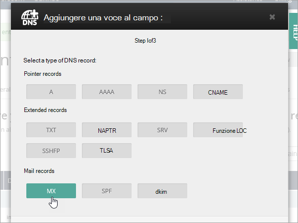
  
6. Nelle caselle per il nuovo record digitare oppure copiare e incollare i valori indicati nella tabella seguente.In the boxes for the new record, type or copy and paste the values from the following table. Per assegnare un valore TTL, scegliere **personalizzato** dall'elenco a discesa e quindi digitare il valore nella casella di testo.To assign a TTL value, choose **Personalized** from the drop-down list, and then type the value in the text box. 
    
    > [!NOTE]
    > Per impostazione predefinita, in OVH viene utilizzata la notazione relativa per la destinazione, che aggiunge il nome di dominio alla fine del record di destinazione.By default OVH uses relative notation for the target, which adds the domain name to the end of the target record. Per usare invece la notazione assoluta, aggiungere un punto al record di destinazione, come mostrato nella tabella seguente.To use absolute notation instead, add a dot to the target record as shown in the table below. 
  
    |**Tipo di record****Record type**|**Sottodominio****Sub-domain**|**TTL****TTL**|**Priorità****Priority**|**Destinazione****Target**|
    |:-----|:-----|:-----|:-----|:-----|
    |MXMX    |(lasciare vuoto)(leave blank)    |3600 (secondi)3600 (seconds)    |10  10    Per altre informazioni sulla priorità, vedere [Informazioni sulla priorità MX](https://docs.microsoft.com/microsoft-365/admin/setup/domains-faq).For more information about priority, see [What is MX priority?](https://docs.microsoft.com/microsoft-365/admin/setup/domains-faq)   |\<domain-key\>. mail.protection.outlook.com.\<domain-key\>.mail.protection.outlook.com.    **Nota:** Ottenere il vostro  *\<domain-key\>*  dal vostro account Microsoft.**Note:** Get your  *\<domain-key\>*  from your Microsoft account.  [Come trovarloHow do I find this?](../get-help-with-domains/information-for-dns-records.md)  |
   
    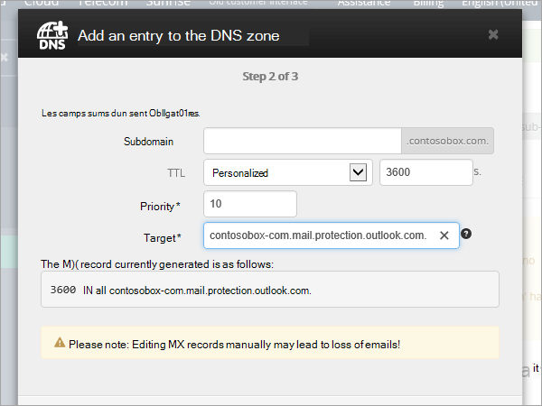
  
7. Selezionare **Avanti**.Select **Next**.
    
    
  
8. Selezionare **Conferma**.Select **Confirm**.
    
    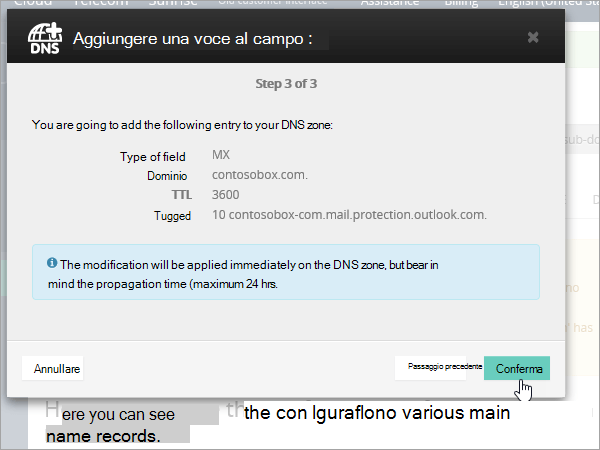
  
9. Se sono presenti altri record MX, eliminarli tutti nella pagina **DNS zone**.If there are any other MX records, delete them all in the list on the **DNS zone** page. Selezionare ogni record e quindi, nella colonna **azioni** , selezionare l'icona Cestino-Can **Delete** .Select each record and then, in the **Actions** column, select the trash-can **Delete** icon. 
    
    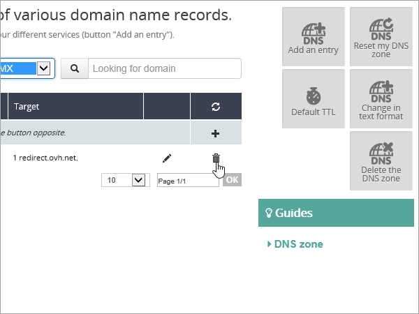
  
10. Selezionare **Conferma**.Select **Confirm**.
    
## Aggiungere i record CNAME necessari per MicrosoftAdd the CNAME records that are required for Microsoft

1. Per iniziare, passare alla propria pagina dei domini in OVH usando [questo collegamento](https://www.ovh.com/manager/). Verrà chiesto di accedere.To get started, go to your domains page in OVH by using [this link](https://www.ovh.com/manager/). You'll be prompted to log in.
    
    
  
2. In **domini**selezionare il nome del dominio che si desidera modificare.Under **Domains**, select the name of the domain that you want edit.
    
    
  
3. Selezionare la **zona DNS**.Select **DNS zone**.
    
    
  
4. Selezionare **Aggiungi una voce**.Select **Add an entry**.
    
    
  
5. Selezionare **CNAME**.Select **CNAME**.
    
    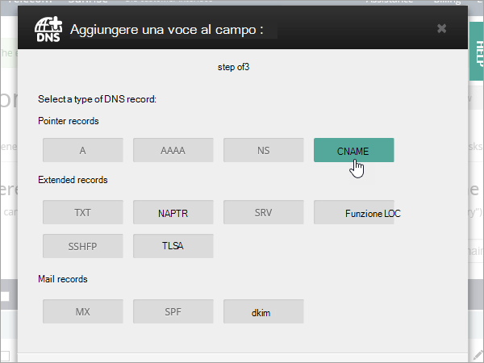
  
6. Creare il primo record CNAME.Create the first CNAME record.
    
    Nelle caselle del nuovo record digitare oppure copiare e incollare i valori dalla prima riga della tabella seguente.In the boxes for the new record, type or copy and paste the values from the first row of the following table. Per assegnare un valore TTL, scegliere **personalizzato** dall'elenco a discesa e quindi digitare il valore nella casella di testo.To assign a TTL value, choose **Personalized** from the drop-down list, and then type the value in the text box. 
    
    |**Tipo di record****Record type**|**Sottodominio****Sub-domain**|**Destinazione****Target**|**TTL****TTL**|
    |:-----|:-----|:-----|:-----|
    |CNAMECNAME    |autodiscoverautodiscover    |autodiscover.outlook.com.autodiscover.outlook.com.    |3600 secondi3600 seconds    |
    |CNAMECNAME    |sipsip    |sipdir.online.lync.com.sipdir.online.lync.com.    |3600 secondi3600 seconds    |
    |CNAMECNAME    |lyncdiscoverlyncdiscover    |webdir.online.lync.com.webdir.online.lync.com.    |3600 secondi3600 seconds    |
    |CNAMECNAME    |enterpriseregistrationenterpriseregistration    |enterpriseregistration.windows.net.enterpriseregistration.windows.net.    |3600 secondi3600 seconds    |
    |CNAMECNAME    |enterpriseenrollmententerpriseenrollment    |enterpriseenrollment-s.manage.microsoft.com.enterpriseenrollment-s.manage.microsoft.com.    |3600 secondi3600 seconds    |
   
    
  
7. Selezionare **Avanti**.Select **Next**.
    
    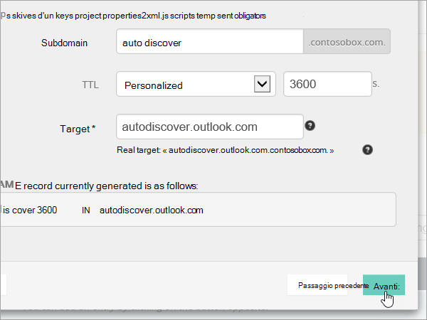
  
8. Selezionare **Conferma**.Select **Confirm**.
    
9. Ripetere i passaggi precedenti per creare gli altri cinque record CNAME.Repeat the previous steps to create the other five CNAME records.
    
    Per ogni record, digitare o copiare e incollare i valori dalla riga successiva della tabella precedente nelle caselle corrispondenti.For each record, type or copy and paste the values from the next row of the table above into the boxes for that record.
    
## Aggiungere un record TXT per SPF per evitare di ricevere posta indesiderataAdd a TXT record for SPF to help prevent email spam

> [!IMPORTANT]
> Non può essere presente più di un record TXT per SPF per un dominio.You cannot have more than one TXT record for SPF for a domain. Se il dominio ha più record SPF, si verificheranno errori nella gestione della posta elettronica, oltre a problemi di recapito e di classificazione della posta indesiderata.If your domain has more than one SPF record, you'll get email errors, as well as delivery and spam classification issues. Se si dispone già di un record SPF per il dominio, non crearne uno nuovo per Microsoft.If you already have an SPF record for your domain, don't create a new one for Microsoft. Al contrario, aggiungere i valori Microsoft necessari al record corrente in modo da disporre di un  *singolo*  record SPF che includa entrambi i set di valori.Instead, add the required Microsoft values to the current record so that you have a  *single*  SPF record that includes both sets of values. 
  
1. Per iniziare, passare alla propria pagina dei domini in OVH usando [questo collegamento](https://www.ovh.com/manager/). Verrà chiesto di accedere.To get started, go to your domains page in OVH by using [this link](https://www.ovh.com/manager/). You'll be prompted to log in.
    
    
  
2. In **domini**selezionare il nome del dominio che si desidera modificare.Under **Domains**, select the name of the domain that you want edit.
    
    
  
3. Selezionare la **zona DNS**.Select **DNS zone**.
    
    
  
4. Selezionare **Aggiungi una voce**.Select **Add an entry**.
    
    
  
5. Selezionare **txt**.Select **TXT**.
    
6. Nelle caselle del nuovo record digitare oppure copiare e incollare i valori seguenti.In the boxes for the new record, type or copy and paste the following values.
    
    |**Tipo di record****Record type**|**Sottodominio****Sub-domain**|**TTL****TTL**|**Valore TXT****TXT Value**|
    |:-----|:-----|:-----|:-----|
    |TXTTXT    |(lasciare vuoto)(leave blank)    |3600 (secondi)3600 (seconds)    |v=spf1 include:spf.protection.outlook.com -allv=spf1 include:spf.protection.outlook.com -all    **Nota:** è consigliabile copiare e incollare questa voce, in modo che tutti i caratteri di spaziatura siano corretti.**Note:** We recommend copying and pasting this entry, so that all of the spacing stays correct.           |
   
    
  
7. Selezionare **Avanti**.Select **Next**.
    
    
  
8. Selezionare **Conferma**.Select **Confirm**.
    
    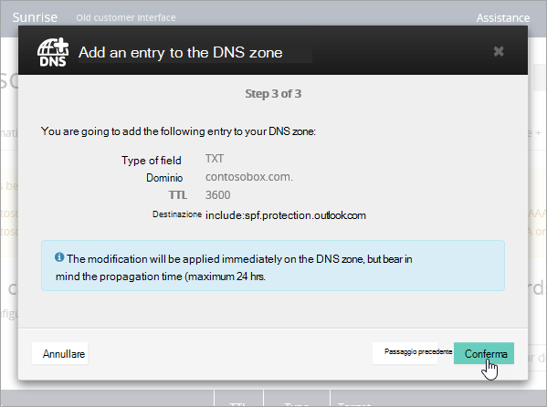
  
## Aggiungere i due record SRV necessari per MicrosoftAdd the two SRV records that are required for Microsoft

1. Per iniziare, passare alla propria pagina dei domini in OVH usando [questo collegamento](https://www.ovh.com/manager/). Verrà chiesto di accedere.To get started, go to your domains page in OVH by using [this link](https://www.ovh.com/manager/). You'll be prompted to log in.
    
    
  
2. In **domini**selezionare il nome del dominio che si desidera modificare.Under **Domains**, select the name of the domain that you want edit.
    
    
  
3. Selezionare la **zona DNS**.Select **DNS zone**.
    
    
  
4. Selezionare **Aggiungi una voce**.Select **Add an entry**.
    
    
  
5. Selezionare **SRV**.Select **SRV**.
    
    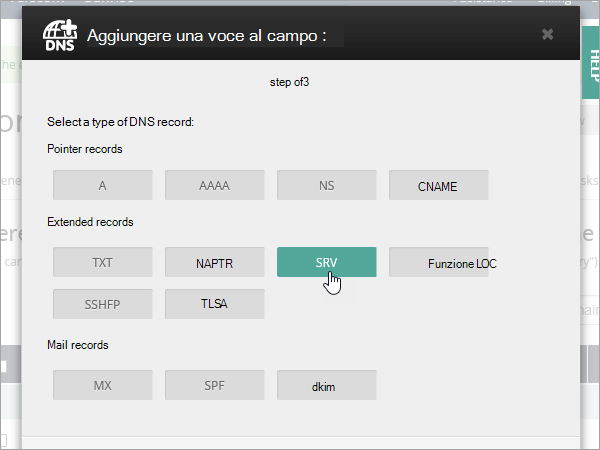
  
6. Creare il primo record SRV.Create the first SRV record.
    
    Nelle caselle del nuovo record digitare oppure copiare e incollare i valori dalla prima riga della tabella seguente.In the boxes for the new record, type or copy and paste the values from the first row of the following table. Per assegnare un valore TTL, scegliere **personalizzato** dall'elenco a discesa e quindi digitare il valore nella casella di testo.To assign a TTL value, choose **Personalized** from the drop-down list, and then type the value in the text box. 
    
    |**Tipo di record****Record type**|**Sottodominio****Sub-domain**|**Priorità****Priority**|**Peso****Weight**|**Porta****Port**|**TTL****TTL**|**Destinazione****Target**|
    |:-----|:-----|:-----|:-----|:-----|:-----|:-----|
    |SRV (Service)SRV (Service)    |_sip._tls_sip._tls    |100100    |1 1    |443443    |3600 (secondi)3600 (seconds)    |sipdir.online.lync.com.sipdir.online.lync.com.    |
    |SRV (Service)SRV (Service)    |_sipfederationtls._tcp_sipfederationtls._tcp    |100100    |1 1    |50615061    |3600 (secondi)3600 (seconds)    |sipfed.online.lync.com.sipfed.online.lync.com.    |
       
    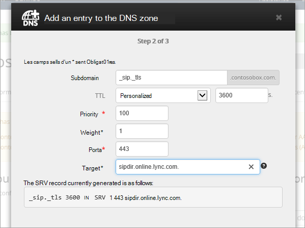
  
7. Selezionare **Avanti**.Select **Next**.
    
    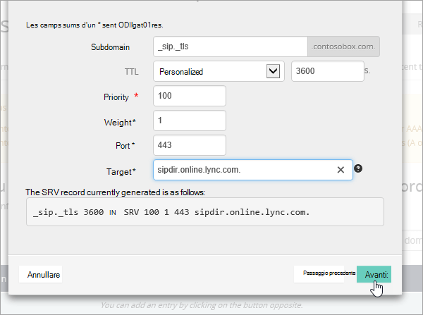
  
8. Selezionare **Conferma**.Select **Confirm**.
    
9. Ripetere i passaggi precedenti per creare l'altro record SRV. Digitare o copiare e incollare i valori dalla seconda riga della tabella precedente nelle caselle per il secondo record.Repeat the previous steps to create the other SRV record. Type or copy and paste the values from the second row of the table above into the boxes for the second record.
    
> [!NOTE]
>  In genere, l'applicazione delle modifiche ai record DNS richiede circa 15 minuti. A volte, tuttavia, l'aggiornamento di una modifica nel sistema DNS di Internet può richiedere più tempo. In caso di problemi relativi al flusso di posta o di altro tipo dopo l'aggiunta dei record DNS, vedere [Risolvere i problemi dopo la modifica del nome di dominio o dei record DNS](../get-help-with-domains/find-and-fix-issues.md).Typically it takes about 15 minutes for DNS changes to take effect. However, it can occasionally take longer for a change you've made to update across the Internet's DNS system. If you're having trouble with mail flow or other issues after adding DNS records, see [Troubleshoot issues after changing your domain name or DNS records](../get-help-with-domains/find-and-fix-issues.md). 
  
