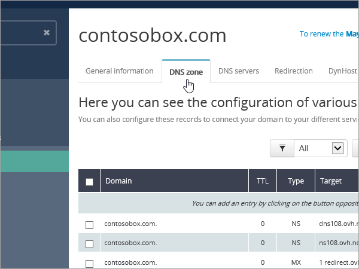

# Creare record DNS in OVH per Office 365Create DNS records at OVH for Office 365

Se non si trovano le informazioni desiderate, [vedere le domande frequenti sui domini](../setup/domains-faq.md).[Check the Domains FAQ](../setup/domains-faq.md) if you don't find what you're looking for. 
  
Se OVH è il provider di hosting DNS in uso, eseguire i passaggi descritti in questo articolo per verificare il dominio e configurare i record DNS per posta elettronica, Skype for Business Online e così via.If OVH is your DNS hosting provider, follow the steps in this article to verify your domain and set up DNS records for email, Skype for Business Online, and so on.
  
Ecco i principali record da aggiungere.These are the main records to add. 
  
- [Creare record DNS in OVH per Office 365Create DNS records at OVH for Office 365](#create-dns-records-at-ovh-for-office-365)
    
- [Aggiungere un record MX in modo che la posta elettronica per il dominio venga recapitata in Office 365Add an MX record so email for your domain will come to Office 365](#add-an-mx-record-so-email-for-your-domain-will-come-to-office-365)
    
- [Aggiungere i record CNAME necessari per Office 365Add the CNAME records that are required for Office 365](#add-the-cname-records-that-are-required-for-office-365)
    
- [Aggiungere un record TXT per SPF per evitare di ricevere posta indesiderataAdd a TXT record for SPF to help prevent email spam](#add-a-txt-record-for-spf-to-help-prevent-email-spam)
    
- [Aggiungere i due record SRV necessari per Office 365Add the two SRV records that are required for Office 365](#add-the-two-srv-records-that-are-required-for-office-365)
    
Dopo aver aggiunto questi record in OVH, il domino sarà configurato per l'uso con i servizi di Office 365.After you add these records at OVH, your domain will be set up to work with Office 365 services.
  
Per informazioni su hosting Web e DNS per i siti Web con Office 365, vedere [Usare un sito Web pubblico con Office 365](https://support.office.com/article/a8178510-501d-4bd8-9921-b04f2e9517a5.aspx).To learn about webhosting and DNS for websites with Office 365, see [Use a public website with Office 365](https://support.office.com/article/a8178510-501d-4bd8-9921-b04f2e9517a5.aspx).
  
> [!NOTE]
>  In genere l'applicazione delle modifiche al DNS richiede circa 15 minuti. A volte può tuttavia capitare che l'aggiornamento di una modifica nel sistema DNS di Internet richieda più tempo. In caso di problemi con il flusso di posta o altro dopo l'aggiunta dei record DNS, vedere [Risolvere i problemi dopo la modifica del nome di dominio o dei record DNS](../get-help-with-domains/find-and-fix-issues.md).Typically it takes about 15 minutes for DNS changes to take effect. However, it can occasionally take longer for a change you've made to update across the Internet's DNS system. If you're having trouble with mail flow or other issues after adding DNS records, see [Troubleshoot issues after changing your domain name or DNS records](../get-help-with-domains/find-and-fix-issues.md). 
  
## Aggiungere un record TXT a scopo di verificaAdd a TXT record for verification

Prima di usare il proprio dominio con Office 365, è necessario dimostrare di esserne proprietari. La capacità di accedere al proprio account nel registrar e di creare il record DNS dimostra a Office 365 che si è proprietari del dominio.Before you use your domain with Office 365, we have to make sure that you own it. Your ability to log in to your account at your domain registrar and create the DNS record proves to Office 365 that you own the domain.
  
> [!NOTE]
> Questo record viene usato esclusivamente per verificare di essere proprietari del dominio e non ha altri effetti. È possibile eliminarlo in un secondo momento, se si preferisce.This record is used only to verify that you own your domain; it doesn't affect anything else. You can delete it later, if you like. 
  
1. Per iniziare, passare alla propria pagina dei domini in OVH usando [questo collegamento](https://www.ovh.com/manager/). Verrà chiesto di accedere.To get started, go to your domains page in OVH by using [this link](https://www.ovh.com/manager/). You'll be prompted to log in.
    
    
  
2. In **domini**selezionare il nome del dominio che si desidera modificare.Under **Domains**, select the name of the domain that you want edit.
    
    
  
3. Selezionare la **zona DNS**.Select **DNS zone**.
    
    
  
4. Selezionare **Aggiungi una voce**.Select **Add an entry**.
    
    
  
5. Seleziona **txt**Select **TXT**
    
    
  
6. In the boxes for the new record, type or copy and paste the values from the following table.In the boxes for the new record, type or copy and paste the values from the following table. Per assegnare un valore TTL, scegliere **personalizzato** dall'elenco a discesa e quindi digitare il valore nella casella di testo.To assign a TTL value, choose **Personalized** from the drop-down list, and then type the value in the text box. 
    
    |**Tipo di record****Record type**|**Sottodominio****Sub-domain**|**TTL****TTL**|**Valore****Value**|
    |:-----|:-----|:-----|:-----|
    |TXTTXT    |(lasciare vuoto)(leave blank)    |3600 (secondi)3600 (seconds)    |MS=msxxxxxxxxMS=msxxxxxxxx    **Note:** questo è un esempio. Usare il valore specifico di **Indirizzo di destinazione o puntamento** indicato nella tabella in Office 365.           [Come trovarlo](../get-help-with-domains/information-for-dns-records.md)**Note:** This is an example. Use your specific **Destination or Points to Address** value here, from the table in Office 365.           [How do I find this?](../get-help-with-domains/information-for-dns-records.md)          |
   
7. Selezionare **conferma**.Select **Confirm**. 
    
    
  
8. Attendere alcuni minuti prima di continuare, in modo che il record appena creato venga aggiornato in Internet.Wait a few minutes before you continue, so that the record you just created can update across the Internet.
    
Now that you've added the record at your domain registrar's site, you'll go back to Office 365 and request Office 365 to look for the record.Now that you've added the record at your domain registrar's site, you'll go back to Office 365 and request Office 365 to look for the record.
  
When Office 365 finds the correct TXT record, your domain is verified.When Office 365 finds the correct TXT record, your domain is verified.
  
1. Nell'interfaccia di amministrazione, andare alla pagina \*\*\*\* \> <a href="https://go.microsoft.com/fwlink/p/?linkid=834818" target="_blank">Domains</a> Settings.In the admin center, go to the **Settings** \> <a href="https://go.microsoft.com/fwlink/p/?linkid=834818" target="_blank">Domains</a> page.
    
2. Nella pagina **Domains** selezionare il dominio che si sta verificando.On the **Domains** page, select the domain that you are verifying. 
    
    
  
3. Nella pagina **configurazione** , selezionare **Avvia installazione**.On the **Setup** page, select **Start setup**.
    
    
  
4. Nella pagina **Verifica dominio** selezionare **Verifica**.On the **Verify domain** page, select **Verify**.
    
    
  
> [!NOTE]
>  In genere l'applicazione delle modifiche al DNS richiede circa 15 minuti. A volte può tuttavia capitare che l'aggiornamento di una modifica nel sistema DNS di Internet richieda più tempo. In caso di problemi con il flusso di posta o altro dopo l'aggiunta dei record DNS, vedere [Risolvere i problemi dopo la modifica del nome di dominio o dei record DNS](../get-help-with-domains/find-and-fix-issues.md).Typically it takes about 15 minutes for DNS changes to take effect. However, it can occasionally take longer for a change you've made to update across the Internet's DNS system. If you're having trouble with mail flow or other issues after adding DNS records, see [Troubleshoot issues after changing your domain name or DNS records](../get-help-with-domains/find-and-fix-issues.md). 
  
## Aggiungere un record MX in modo che la posta elettronica per il dominio venga recapitata in Office 365Add an MX record so email for your domain will come to Office 365

1. Per iniziare, passare alla propria pagina dei domini in OVH usando [questo collegamento](https://www.ovh.com/manager/). Verrà chiesto di accedere.To get started, go to your domains page in OVH by using [this link](https://www.ovh.com/manager/). You'll be prompted to log in.
    
    
  
2. In **domini**selezionare il nome del dominio che si desidera modificare.Under **Domains**, select the name of the domain that you want edit.
    
    
  
3. Selezionare la **zona DNS**.Select **DNS zone**.
    
    
  
4. Selezionare **Aggiungi una voce**.Select **Add an entry**.
    
    
  
5. Selezionare **MX**.Select **MX**.
    
    
  
6. Nelle caselle per il nuovo record digitare oppure copiare e incollare i valori indicati nella tabella seguente.In the boxes for the new record, type or copy and paste the values from the following table. Per assegnare un valore TTL, scegliere **personalizzato** dall'elenco a discesa e quindi digitare il valore nella casella di testo.To assign a TTL value, choose **Personalized** from the drop-down list, and then type the value in the text box. 
    
    > [!NOTE]
    > Per impostazione predefinita, in OVH viene utilizzata la notazione relativa per la destinazione, che aggiunge il nome di dominio alla fine del record di destinazione.By default OVH uses relative notation for the target, which adds the domain name to the end of the target record. Per usare invece la notazione assoluta, aggiungere un punto al record di destinazione, come mostrato nella tabella seguente.To use absolute notation instead, add a dot to the target record as shown in the table below. 
  
    |**Tipo di record****Record type**|**Sottodominio****Sub-domain**|**TTL****TTL**|**Priorità****Priority**|**Destinazione****Target**|
    |:-----|:-----|:-----|:-----|:-----|
    |MXMX    |(lasciare vuoto)(leave blank)    |3600 (secondi)3600 (seconds)    |10 10    Per altre informazioni sulla priorità, vedere [Informazioni sulla priorità MX](https://support.office.com/article/2784cc4d-95be-443d-b5f7-bb5dd867ba83.aspx).For more information about priority, see [What is MX priority?](https://support.office.com/article/2784cc4d-95be-443d-b5f7-bb5dd867ba83.aspx)   |\<chiave-dominio\>.mail.protection.outlook.com.\<domain-key\>.mail.protection.outlook.com.    **Nota:** Ottenere la propria \* \<chiave\> di dominio\* dall'account di Office 365.**Note:** Get your  *\<domain-key\>*  from your Office 365 account.  [Come trovarloHow do I find this?](../get-help-with-domains/information-for-dns-records.md)  |
   
    
  
7.  Select **Next**. Select **Next**.
    
    
  
8. Selezionare **conferma**.Select **Confirm**.
    
    
  
9. Se sono presenti altri record MX, eliminarli tutti nella pagina **DNS zone**.If there are any other MX records, delete them all in the list on the **DNS zone** page. Selezionare ogni record e quindi, nella colonna **azioni** , selezionare l'icona Cestino-Can **Delete** .Select each record and then, in the **Actions** column, select the trash-can **Delete** icon. 
    
    
  
10. Selezionare **conferma**.Select **Confirm**.
    
## Aggiungere i record CNAME necessari per Office 365Add the CNAME records that are required for Office 365

1. Per iniziare, passare alla propria pagina dei domini in OVH usando [questo collegamento](https://www.ovh.com/manager/). Verrà chiesto di accedere.To get started, go to your domains page in OVH by using [this link](https://www.ovh.com/manager/). You'll be prompted to log in.
    
    
  
2. In **domini**selezionare il nome del dominio che si desidera modificare.Under **Domains**, select the name of the domain that you want edit.
    
    
  
3. Selezionare la **zona DNS**.Select **DNS zone**.
    
    
  
4. Selezionare **Aggiungi una voce**.Select **Add an entry**.
    
    
  
5. Selezionare **CNAME**.Select **CNAME**.
    
    
  
6. Creare il primo record CNAME.Create the first CNAME record.
    
    Nelle caselle del nuovo record digitare oppure copiare e incollare i valori dalla prima riga della tabella seguente.In the boxes for the new record, type or copy and paste the values from the first row of the following table. Per assegnare un valore TTL, scegliere **personalizzato** dall'elenco a discesa e quindi digitare il valore nella casella di testo.To assign a TTL value, choose **Personalized** from the drop-down list, and then type the value in the text box. 
    
    |**Tipo di record****Record type**|**Sottodominio****Sub-domain**|**Destinazione****Target**|**TTL****TTL**|
    |:-----|:-----|:-----|:-----|
    |CNAMECNAME    |autodiscoverautodiscover    |autodiscover.outlook.com.autodiscover.outlook.com.    |3600 secondi3600 seconds    |
    |CNAMECNAME    |sipsip    |sipdir.online.lync.com.sipdir.online.lync.com.    |3600 secondi3600 seconds    |
    |CNAMECNAME    |lyncdiscoverlyncdiscover    |webdir.online.lync.com.webdir.online.lync.com.    |3600 secondi3600 seconds    |
    |CNAMECNAME    |enterpriseregistrationenterpriseregistration    |enterpriseregistration.windows.net.enterpriseregistration.windows.net.    |3600 secondi3600 seconds    |
    |CNAMECNAME    |enterpriseenrollmententerpriseenrollment    |enterpriseenrollment-s.manage.microsoft.com.enterpriseenrollment-s.manage.microsoft.com.    |3600 secondi3600 seconds    |
   
    
  
7.  Select **Next**. Select **Next**.
    
    
  
8. Selezionare **conferma**.Select **Confirm**.
    
9. Ripetere i passaggi precedenti per creare gli altri cinque record CNAME.Repeat the previous steps to create the other five CNAME records.
    
    Per ogni record, digitare o copiare e incollare i valori dalla riga successiva della tabella precedente nelle caselle corrispondenti.For each record, type or copy and paste the values from the next row of the table above into the boxes for that record.
    
## Aggiungere un record TXT per SPF per evitare di ricevere posta indesiderataAdd a TXT record for SPF to help prevent email spam

> [!IMPORTANT]
> You cannot have more than one TXT record for SPF for a domain.You cannot have more than one TXT record for SPF for a domain. If your domain has more than one SPF record, you'll get email errors, as well as delivery and spam classification issues.If your domain has more than one SPF record, you'll get email errors, as well as delivery and spam classification issues. If you already have an SPF record for your domain, don't create a new one for Office 365.If you already have an SPF record for your domain, don't create a new one for Office 365. Al contrario, aggiungere i valori di Office 365 necessari al record corrente in modo che sia presente un *singolo* record SPF che includa entrambi i set di valori.Instead, add the required Office 365 values to the current record so that you have a  *single*  SPF record that includes both sets of values. 
  
1. Per iniziare, passare alla propria pagina dei domini in OVH usando [questo collegamento](https://www.ovh.com/manager/). Verrà chiesto di accedere.To get started, go to your domains page in OVH by using [this link](https://www.ovh.com/manager/). You'll be prompted to log in.
    
    
  
2. In **domini**selezionare il nome del dominio che si desidera modificare.Under **Domains**, select the name of the domain that you want edit.
    
    
  
3. Selezionare la **zona DNS**.Select **DNS zone**.
    
    
  
4. Selezionare **Aggiungi una voce**.Select **Add an entry**.
    
    
  
5. Selezionare **txt**.Select **TXT**.
    
6. Nelle caselle del nuovo record digitare oppure copiare e incollare i valori seguenti.In the boxes for the new record, type or copy and paste the following values.
    
    |**Tipo di record****Record type**|**Sottodominio****Sub-domain**|**TTL****TTL**|**Valore TXT****TXT Value**|
    |:-----|:-----|:-----|:-----|
    |TXTTXT    |(lasciare vuoto)(leave blank)    |3600 (secondi)3600 (seconds)    |v=spf1 include:spf.protection.outlook.com -allv=spf1 include:spf.protection.outlook.com -all    **Nota:** è consigliabile copiare e incollare questa voce, in modo che tutti i caratteri di spaziatura siano corretti.**Note:** We recommend copying and pasting this entry, so that all of the spacing stays correct.           |
   
    
  
7.  Select **Next**. Select **Next**.
    
    
  
8. Selezionare **conferma**.Select **Confirm**.
    
    
  
## Aggiungere i due record SRV necessari per Office 365Add the two SRV records that are required for Office 365

1. Per iniziare, passare alla propria pagina dei domini in OVH usando [questo collegamento](https://www.ovh.com/manager/). Verrà chiesto di accedere.To get started, go to your domains page in OVH by using [this link](https://www.ovh.com/manager/). You'll be prompted to log in.
    
    
  
2. In **domini**selezionare il nome del dominio che si desidera modificare.Under **Domains**, select the name of the domain that you want edit.
    
    
  
3. Selezionare la **zona DNS**.Select **DNS zone**.
    
    
  
4. Selezionare **Aggiungi una voce**.Select **Add an entry**.
    
    
  
5. Selezionare **SRV**.Select **SRV**.
    
    
  
6. Creare il primo record SRV.Create the first SRV record.
    
    Nelle caselle del nuovo record digitare oppure copiare e incollare i valori dalla prima riga della tabella seguente.In the boxes for the new record, type or copy and paste the values from the first row of the following table. Per assegnare un valore TTL, scegliere **personalizzato** dall'elenco a discesa e quindi digitare il valore nella casella di testo.To assign a TTL value, choose **Personalized** from the drop-down list, and then type the value in the text box. 
    
    |**Tipo di record****Record type**|**Sottodominio****Sub-domain**|**Priorità****Priority**|**Peso****Weight**|**Port****Port**|**TTL****TTL**|**Destinazione****Target**|
    |:-----|:-----|:-----|:-----|:-----|:-----|:-----|
    |SRV (Service)SRV (Service)    |_sip. _tls_sip._tls    |100100    |11    |443443    |3600 (secondi)3600 (seconds)    |sipdir.online.lync.com.sipdir.online.lync.com.    |
    |SRV (Service)SRV (Service)    |_sipfederationtls. _tcp_sipfederationtls._tcp    |100100    |11    |50615061    |3600 (secondi)3600 (seconds)    |sipfed.online.lync.com.sipfed.online.lync.com.    |
       
    
  
7.  Select **Next**. Select **Next**.
    
    
  
8. Selezionare **conferma**.Select **Confirm**.
    
9. Ripetere i passaggi precedenti per creare l'altro record SRV. Digitare o copiare e incollare i valori dalla seconda riga della tabella precedente nelle caselle per il secondo record.Repeat the previous steps to create the other SRV record. Type or copy and paste the values from the second row of the table above into the boxes for the second record.
    
> [!NOTE]
>  In genere, l'applicazione delle modifiche al DNS richiede circa 15 minuti. A volte, tuttavia, l'aggiornamento di una modifica nel sistema DNS di Internet può richiedere più tempo. In caso di problemi con il flusso di posta o di altro tipo dopo l'aggiunta dei record DNS, vedere [Risolvere i problemi dopo la modifica del nome di dominio o dei record DNS](../get-help-with-domains/find-and-fix-issues.md).Typically it takes about 15 minutes for DNS changes to take effect. However, it can occasionally take longer for a change you've made to update across the Internet's DNS system. If you're having trouble with mail flow or other issues after adding DNS records, see [Troubleshoot issues after changing your domain name or DNS records](../get-help-with-domains/find-and-fix-issues.md). 
  
