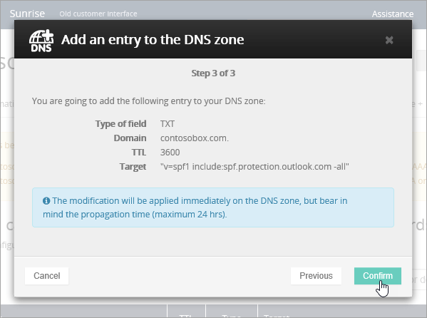

# Creare record DNS in OVH per Office 365

Se non si trovano le informazioni desiderate, [vedere le domande frequenti sui domini](../setup/domains-faq.md). 
  
Se OVH è il provider di hosting DNS in uso, eseguire i passaggi descritti in questo articolo per verificare il dominio e configurare i record DNS per posta elettronica, Skype for Business Online e così via.
  
Ecco i principali record da aggiungere. 
  
- [Creare record DNS in OVH per Office 365](#create-dns-records-at-ovh-for-office-365)
    
- [Aggiungere un record MX in modo che la posta elettronica per il dominio venga recapitata in Office 365](#add-an-mx-record-so-email-for-your-domain-will-come-to-office-365)
    
- [Aggiungere i record CNAME necessari per Office 365](#add-the-cname-records-that-are-required-for-office-365)
    
- [Aggiungere un record TXT per SPF per evitare di ricevere posta indesiderata](#add-a-txt-record-for-spf-to-help-prevent-email-spam)
    
- [Aggiungere i due record SRV necessari per Office 365](#add-the-two-srv-records-that-are-required-for-office-365)
    
Dopo aver aggiunto questi record in OVH, il domino sarà configurato per l'uso con i servizi di Office 365.
  
Per informazioni su hosting Web e DNS per i siti Web con Office 365, vedere [Usare un sito Web pubblico con Office 365](https://support.office.com/article/a8178510-501d-4bd8-9921-b04f2e9517a5.aspx).
  
> [!NOTE]
>  In genere, l'applicazione delle modifiche ai record DNS richiede circa 15 minuti. A volte, tuttavia, l'aggiornamento di una modifica nel sistema DNS di Internet può richiedere più tempo. In caso di problemi relativi al flusso di posta o di altro tipo dopo l'aggiunta dei record DNS, vedere [Risolvere i problemi dopo la modifica del nome di dominio o dei record DNS](../get-help-with-domains/find-and-fix-issues.md). 
  
## Aggiungere un record TXT a scopo di verifica

Prima di usare il proprio dominio con Office 365, è necessario dimostrare di esserne proprietari. La capacità di accedere al proprio account nel registrar e di creare il record DNS dimostra a Office 365 che si è proprietari del dominio.
  
> [!NOTE]
> Questo record viene usato esclusivamente per verificare di essere proprietari del dominio e non ha altri effetti. È possibile eliminarlo in un secondo momento, se si preferisce. 
  
1. Per iniziare, passare alla propria pagina dei domini in OVH usando [questo collegamento](https://www.ovh.com/manager/). Verrà chiesto di accedere.
    
    
  
2. In **domini**selezionare il nome del dominio che si desidera modificare.
    
    
  
3. Selezionare la **zona DNS**.
    
    
  
4. Selezionare **Aggiungi una voce**.
    
    
  
5. Seleziona **txt**
    
    
  
6. Nelle caselle del nuovo record digitare oppure copiare e incollare i valori della tabella seguente. Per assegnare un valore TTL, scegliere **personalizzato** dall'elenco a discesa e quindi digitare il valore nella casella di testo. 
    
    |**Tipo di record**|**Sottodominio**|**TTL**|**Valore**|
    |:-----|:-----|:-----|:-----|
    |TXT    |(lasciare vuoto)    |3600 (secondi)    |MS=msxxxxxxxx    **Note:** questo è un esempio. Usare il valore specifico di **Indirizzo di destinazione o puntamento** indicato nella tabella in Office 365.           [Come trovarlo](../get-help-with-domains/information-for-dns-records.md)          |
   
7. Selezionare **conferma**. 
    
    
  
8. Attendere alcuni minuti prima di continuare, in modo che il record appena creato venga aggiornato in Internet.
    
Una volta aggiunto il record al sito del registrar, è possibile tornare in Office 365 e chiedere di cercarlo.
  
Quando Office 365 trova il record TXT corretto, il dominio è verificato.
  
1. Nell'interfaccia di amministrazione passare a **Impostazioni** \> pagina <a href="https://go.microsoft.com/fwlink/p/?linkid=834818" target="_blank">Domini</a>.
    
2. Nella pagina **Domini** selezionare il dominio da verificare. 
    
    
  
3. Nella pagina **Configurazione** selezionare **Avvia configurazione**.
    
    
  
4. Nella pagina **Verifica dominio** selezionare **Verifica**.
    
    
  
> [!NOTE]
>  In genere, l'applicazione delle modifiche ai record DNS richiede circa 15 minuti. A volte, tuttavia, l'aggiornamento di una modifica nel sistema DNS di Internet può richiedere più tempo. In caso di problemi relativi al flusso di posta o di altro tipo dopo l'aggiunta dei record DNS, vedere [Risolvere i problemi dopo la modifica del nome di dominio o dei record DNS](../get-help-with-domains/find-and-fix-issues.md). 
  
## Aggiungere un record MX in modo che la posta elettronica per il dominio venga recapitata in Office 365

1. Per iniziare, passare alla propria pagina dei domini in OVH usando [questo collegamento](https://www.ovh.com/manager/). Verrà chiesto di accedere.
    
    
  
2. In **domini**selezionare il nome del dominio che si desidera modificare.
    
    
  
3. Selezionare la **zona DNS**.
    
    
  
4. Selezionare **Aggiungi una voce**.
    
    
  
5. Selezionare **MX**.
    
    
  
6. Nelle caselle per il nuovo record digitare oppure copiare e incollare i valori indicati nella tabella seguente. Per assegnare un valore TTL, scegliere **personalizzato** dall'elenco a discesa e quindi digitare il valore nella casella di testo. 
    
    > [!NOTE]
    > Per impostazione predefinita, in OVH viene utilizzata la notazione relativa per la destinazione, che aggiunge il nome di dominio alla fine del record di destinazione. Per usare invece la notazione assoluta, aggiungere un punto al record di destinazione, come mostrato nella tabella seguente. 
  
    |**Tipo di record**|**Sottodominio**|**TTL**|**Priorità**|**Destinazione**|
    |:-----|:-----|:-----|:-----|:-----|
    |MX    |(lasciare vuoto)    |3600 (secondi)    |10     Per altre informazioni sulla priorità, vedere [Informazioni sulla priorità MX](https://support.office.com/article/2784cc4d-95be-443d-b5f7-bb5dd867ba83.aspx).   |\<chiave-dominio\>.mail.protection.outlook.com.    **Nota:** Ottenere la propria * \<chiave\> di dominio* dall'account di Office 365.  [Come trovarlo](../get-help-with-domains/information-for-dns-records.md)  |
   
    
  
7.  Select **Next**. 
    
    
  
8. Selezionare **conferma**.
    
    
  
9. Se sono presenti altri record MX, eliminarli tutti nella pagina **DNS zone**. Selezionare ogni record e quindi, nella colonna **azioni** , selezionare l'icona Cestino-Can **Delete** . 
    
    
  
10. Selezionare **conferma**.
    
## Aggiungere i record CNAME necessari per Office 365

1. Per iniziare, passare alla propria pagina dei domini in OVH usando [questo collegamento](https://www.ovh.com/manager/). Verrà chiesto di accedere.
    
    
  
2. In **domini**selezionare il nome del dominio che si desidera modificare.
    
    
  
3. Selezionare la **zona DNS**.
    
    
  
4. Selezionare **Aggiungi una voce**.
    
    
  
5. Selezionare **CNAME**.
    
    
  
6. Creare il primo record CNAME.
    
    Nelle caselle del nuovo record digitare oppure copiare e incollare i valori dalla prima riga della tabella seguente. Per assegnare un valore TTL, scegliere **personalizzato** dall'elenco a discesa e quindi digitare il valore nella casella di testo. 
    
    |**Tipo di record**|**Sottodominio**|**Destinazione**|**TTL**|
    |:-----|:-----|:-----|:-----|
    |CNAME    |autodiscover    |autodiscover.outlook.com.    |3600 secondi    |
    |CNAME    |sip    |sipdir.online.lync.com.    |3600 secondi    |
    |CNAME    |lyncdiscover    |webdir.online.lync.com.    |3600 secondi    |
    |CNAME    |enterpriseregistration    |enterpriseregistration.windows.net.    |3600 secondi    |
    |CNAME    |enterpriseenrollment    |enterpriseenrollment-s.manage.microsoft.com.    |3600 secondi    |
   
    
  
7.  Select **Next**. 
    
    
  
8. Selezionare **conferma**.
    
9. Ripetere i passaggi precedenti per creare gli altri cinque record CNAME.
    
    Per ogni record, digitare o copiare e incollare i valori dalla riga successiva della tabella precedente nelle caselle corrispondenti.
    
## Aggiungere un record TXT per SPF per evitare di ricevere posta indesiderata

> [!IMPORTANT]
> Non può essere presente più di un record TXT per SPF per un dominio. Se il dominio ha più record SPF, si verificheranno errori nella gestione della posta elettronica, oltre a problemi di recapito e di classificazione della posta indesiderata. If you already have an SPF record for your domain, don't create a new one for Office 365. Al contrario, aggiungere i valori di Office 365 richiesti al record corrente in modo da ottenere un *unico* record SPF che include entrambi i set di valori. 
  
1. Per iniziare, passare alla propria pagina dei domini in OVH usando [questo collegamento](https://www.ovh.com/manager/). Verrà chiesto di accedere.
    
    
  
2. In **domini**selezionare il nome del dominio che si desidera modificare.
    
    
  
3. Selezionare la **zona DNS**.
    
    
  
4. Selezionare **Aggiungi una voce**.
    
    
  
5. Selezionare **txt**.
    
6. Nelle caselle del nuovo record digitare oppure copiare e incollare i valori seguenti.
    
    |**Tipo di record**|**Sottodominio**|**TTL**|**Valore TXT**|
    |:-----|:-----|:-----|:-----|
    |TXT    |(lasciare vuoto)    |3600 (secondi)    |v=spf1 include:spf.protection.outlook.com -all    **Nota:** è consigliabile copiare e incollare questa voce, in modo che tutti i caratteri di spaziatura siano corretti.           |
   
    
  
7.  Select **Next**. 
    
    
  
8. Selezionare **conferma**.
    
    
  
## Aggiungere i due record SRV necessari per Office 365

1. Per iniziare, passare alla propria pagina dei domini in OVH usando [questo collegamento](https://www.ovh.com/manager/). Verrà chiesto di accedere.
    
    
  
2. In **domini**selezionare il nome del dominio che si desidera modificare.
    
    
  
3. Selezionare la **zona DNS**.
    
    
  
4. Selezionare **Aggiungi una voce**.
    
    
  
5. Selezionare **SRV**.
    
    
  
6. Creare il primo record SRV.
    
    Nelle caselle del nuovo record digitare oppure copiare e incollare i valori dalla prima riga della tabella seguente. Per assegnare un valore TTL, scegliere **personalizzato** dall'elenco a discesa e quindi digitare il valore nella casella di testo. 
    
    |**Tipo di record**|**Sottodominio**|**Priorità**|**Peso**|**Porta**|**TTL**|**Destinazione**|
    |:-----|:-----|:-----|:-----|:-----|:-----|:-----|
    |SRV (Service)    |_sip. _tls    |100    |1    |443    |3600 (secondi)    |sipdir.online.lync.com.    |
    |SRV (Service)    |_sipfederationtls. _tcp    |100    |1    |5061    |3600 (secondi)    |sipfed.online.lync.com.    |
       
    
  
7.  Select **Next**. 
    
    
  
8. Selezionare **conferma**.
    
9. Ripetere i passaggi precedenti per creare l'altro record SRV. Digitare o copiare e incollare i valori dalla seconda riga della tabella precedente nelle caselle per il secondo record.
    
> [!NOTE]
>  In genere, l'applicazione delle modifiche ai record DNS richiede circa 15 minuti. A volte, tuttavia, l'aggiornamento di una modifica nel sistema DNS di Internet può richiedere più tempo. In caso di problemi relativi al flusso di posta o di altro tipo dopo l'aggiunta dei record DNS, vedere [Risolvere i problemi dopo la modifica del nome di dominio o dei record DNS](../get-help-with-domains/find-and-fix-issues.md). 
  
