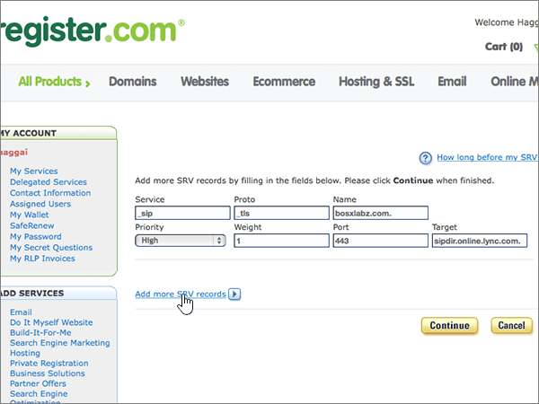

# Creare record DNS in Register.com per MicrosoftCreate DNS records at Register.com for Microsoft

 **Se non si trova ciò che si sta cercando, [vedere le domande frequenti sui domini](../setup/domains-faq.yml)**.**[Check the Domains FAQ](../setup/domains-faq.yml)** if you don't find what you're looking for. 
  
Se il proprio provider di hosting DNS è Register.com, seguire i passaggi di questo articolo per verificare il dominio e configurare i record DNS per la posta elettronica, Skype for Business online e così via.If Register.com is your DNS hosting provider, follow the steps in this article to verify your domain and set up DNS records for email, Skype for Business Online, and so on.
  
Ecco i principali record da aggiungere.These are the main records to add. Seguire i passaggi indicati sotto oppure [guardare il video](https://support.microsoft.com/office/7448dd9e-c0e7-4d5e-a7e9-f0e4715433c4).Follow the steps below or [watch the video](https://support.microsoft.com/office/7448dd9e-c0e7-4d5e-a7e9-f0e4715433c4).
  
- [Aggiungere un record TXT su Register.com per verificare di essere proprietari del dominioAdd a TXT record at Register.com to verify that you own the domain](#add-a-txt-record-at-registercom-to-verify-that-you-own-the-domain)
    
- [Aggiungere un record MX in modo che la posta elettronica del dominio venga recapitata in MicrosoftAdd an MX record so email for your domain will come to Microsoft](#add-an-mx-record-so-email-for-your-domain-will-come-to-microsoft)
    
- [Aggiungere i record CNAME necessari per MicrosoftAdd the CNAME records that are required for Microsoft](#add-the-cname-records-that-are-required-for-microsoft)
    
- [Aggiungere un record TXT per SPF per evitare di ricevere posta indesiderataAdd a TXT record for SPF to help prevent email spam](#add-a-txt-record-for-spf-to-help-prevent-email-spam)

- [Aggiungere i due record SRV necessari per MicrosoftAdd the two SRV records that are required for Microsoft](#add-the-two-srv-records-that-are-required-for-microsoft)
    
Dopo aver aggiunto questi record in Register.com, il dominio sarà configurato per l'utilizzo con i servizi Microsoft.After you add these records at Register.com, your domain will be set up to work with Microsoft services.
  

  
> [!NOTE]
> In genere, l'applicazione delle modifiche al DNS richiede circa 15 minuti. Tuttavia, a volte può capitare che l'aggiornamento di una modifica nel sistema DNS di Internet richieda più tempo. In caso di problemi con il flusso di posta o di altro tipo dopo l'aggiunta dei record DNS, vedere [Individuare e correggere i problemi dopo l'aggiunta del dominio o dei record DNS](../get-help-with-domains/find-and-fix-issues.md).Typically it takes about 15 minutes for DNS changes to take effect. However, it can occasionally take longer for a change you've made to update across the Internet's DNS system. If you're having trouble with mail flow or other issues after adding DNS records, see [Find and fix issues after adding your domain or DNS records](../get-help-with-domains/find-and-fix-issues.md). 
  
## Aggiungere un record TXT su Register.com per verificare di essere proprietari del dominioAdd a TXT record at Register.com to verify that you own the domain

Prima di usare il proprio dominio con Microsoft, è necessario dimostrare di esserne il proprietario. La capacità di accedere al proprio account nel registrar e di creare il record DNS dimostra a Microsoft che si è il proprietario del dominio.Before you use your domain with Microsoft, we have to make sure that you own it. Your ability to log in to your account at your domain registrar and create the DNS record proves to Microsoft that you own the domain.
  
> [!NOTE]
> Questo record viene usato esclusivamente per verificare di essere proprietari del dominio e non ha altri effetti. È possibile eliminarlo in un secondo momento, se si preferisce.This record is used only to verify that you own your domain; it doesn't affect anything else. You can delete it later, if you like. 
  
Seguire i passaggi indicati sotto oppure [guardare il video (iniziare da 0:44)](https://support.microsoft.com/office/7448dd9e-c0e7-4d5e-a7e9-f0e4715433c4).Follow the steps below or [watch the video (start at 0:44)](https://support.microsoft.com/office/7448dd9e-c0e7-4d5e-a7e9-f0e4715433c4).
  
1. Per iniziare, passare alla propria pagina dei domini su Register.com usando [questo collegamento](https://www.register.com/myaccount/). Verrà richiesto di eseguire l'accesso.To get started, go to your domains page at Register.com by using [this link](https://www.register.com/myaccount/). You'll be prompted to sign in.
    
2. Selezionare **Domini**.Select **Domains**.
    
3. Selezionare **Gestisci**.Select **Manage**.
    
4. Individuare la riga contenente il nome del dominio che si desidera modificare. e quindi, in tale riga, selezionare **Gestisci**.Find the row that contains the name of the domain that you want to modify; and then, in that row, select **Manage**.
    
5. Scorrere verso il basso **fino alla sezione Advanced Technical Settings** e quindi selezionare Edit TXT Records **(SPF)**.Scroll down to the **Advanced Technical Settings** section, and then select **Edit TXT Records (SPF)**.
    
6. In the boxes for the new record, type or copy and paste the values from the following table.In the boxes for the new record, type or copy and paste the values from the following table.
    
    |||
    |:-----|:-----|
    |**Host Name****Host Name**   |**TXT Record****TXT Record**   |
    |@    |MS=ms *XXXXXXXX*MS=ms *XXXXXXXX*    **Note:** questo è un esempio.**Note:** This is an example. Usare il valore specifico di **Indirizzo di destinazione o puntamento** indicato nella tabella.Use your specific **Destination or Points to Address** value here, from the table. [Come trovarloHow do I find this?](../get-help-with-domains/information-for-dns-records.md)          |
   
7. Selezionare **Continua.**Select **Continue**.
    
8. Nella pagina successiva selezionare di **nuovo Continua** per confermare le modifiche.On the next page, select **Continue** again to confirm your changes. 
    
9. Attendere alcuni minuti prima di continuare, in modo che il record appena creato venga aggiornato in Internet.Wait a few minutes before you continue, so that the record you just created can update across the Internet.
    
Una volta che il record è stato aggiunto al sito del registrar, è possibile tornare a Microsoft e richiedere il record.Now that you've added the record at your domain registrar's site, you'll go back to Microsoft and request the record.
  
Quando Microsoft trova il record TXT corretto, il dominio è verificato.When Microsoft finds the correct TXT record, your domain is verified.
  
1. Nell'interfaccia di amministrazione passare a **Impostazioni** \> pagina <a href="https://go.microsoft.com/fwlink/p/?linkid=834818" target="_blank">Domini</a>.In the admin center, go to the **Settings** \> <a href="https://go.microsoft.com/fwlink/p/?linkid=834818" target="_blank">Domains</a> page.
    
2. Nella pagina **Domini** selezionare il dominio da verificare.On the **Domains** page, select the domain that you are verifying. 
    
3. Nella pagina **Configurazione** selezionare **Avvia configurazione**.On the **Setup** page, select **Start setup**.
    
4. Nella pagina **Verifica dominio** selezionare **Verifica**.On the **Verify domain** page, select **Verify**.
    
> [!NOTE]
> In genere, l'applicazione delle modifiche al DNS richiede circa 15 minuti. Tuttavia, a volte può capitare che l'aggiornamento di una modifica nel sistema DNS di Internet richieda più tempo. In caso di problemi con il flusso di posta o di altro tipo dopo l'aggiunta dei record DNS, vedere [Individuare e correggere i problemi dopo l'aggiunta del dominio o dei record DNS](../get-help-with-domains/find-and-fix-issues.md).Typically it takes about 15 minutes for DNS changes to take effect. However, it can occasionally take longer for a change you've made to update across the Internet's DNS system. If you're having trouble with mail flow or other issues after adding DNS records, see [Find and fix issues after adding your domain or DNS records](../get-help-with-domains/find-and-fix-issues.md). 
  
## Aggiungere un record MX in modo che la posta elettronica del dominio venga recapitata in MicrosoftAdd an MX record so email for your domain will come to Microsoft

Seguire i passaggi indicati sotto oppure [guardare il video (iniziare da 3:32)](https://support.microsoft.com/office/7448dd9e-c0e7-4d5e-a7e9-f0e4715433c4).Follow the steps below or [watch the video (start at 3:32)](https://support.microsoft.com/office/7448dd9e-c0e7-4d5e-a7e9-f0e4715433c4).
  
1. Per iniziare, passare alla propria pagina dei domini su Register.com usando [questo collegamento](https://www.register.com/myaccount/). Verrà richiesto di eseguire l'accesso.To get started, go to your domains page at Register.com by using [this link](https://www.register.com/myaccount/). You'll be prompted to sign in.
    
2. Selezionare **Domini**.Select **Domains**.
    
3. Selezionare **Gestisci**.Select **Manage**.
    
4. Individuare la riga contenente il nome del dominio che si desidera modificare. e quindi, in tale riga, selezionare **Gestisci**.Find the row that contains the name of the domain that you want to modify; and then, in that row, select **Manage**.
    
5. Scorrere fino alla **sezione Impostazioni tecniche avanzate** e quindi selezionare Modifica record Mail **Exchanger.**Scroll to the **Advanced Technical Settings** section, and then select **Edit Mail Exchanger Records**.
    
    
  
6. Nelle caselle del nuovo record digitare oppure copiare e incollare i valori della tabella seguente.In the boxes for the new record, type or copy and paste the values from the following table.
    
    Scegliere il **valore Priority** nell'elenco a discesa.(Choose the **Priority** value from the drop-down list.) 
    
    |\*\*\*\*Host Name\*\*\*\*\*\*\*\*Host Name\*\*\*\*|\*\*\*\*Priority\*\*\*\*\*\*\*\*Priority\*\*\*\*|\*\*\*\*Mail Server\*\*\*\*\*\*\*\*Mail Server\*\*\*\*|
    |:-----|:-----|:-----|
    |@    |HighHigh    Per altre informazioni sulla priorità, vedere [Che cos'è la priorità MX](../setup/domains-faq.yml).For more information about priority, see [What is MX priority?](../setup/domains-faq.yml)   | *\<domain-key\>*  .mail.protection.outlook.com*\<domain-key\>*  .mail.protection.outlook.com      **Nota:** ottenere il valore \<*domain-key*\> dal proprio account Microsoft.**Note:** Get your \<*domain-key*\> from your Microsoft account.   [Come trovarloHow do I find this?](../get-help-with-domains/information-for-dns-records.md)          |
   
    
  
7. Se nell'elenco sono presenti altri record MX, selezionare ognuno di essi per eliminarlo.If there were any other MX records already listed, select each of those records to be deleted.
    
    
  
8. Selezionare **Continua.**Select **Continue**.
    
    
  
9. Nella pagina successiva selezionare di nuovo **Continua** per confermare e salvare le modifiche.On the next page, select **Continue** again to confirm and save your changes. 
    
    
  
## Aggiungere i record CNAME necessari per MicrosoftAdd the CNAME records that are required for Microsoft

Seguire i passaggi indicati sotto oppure [guardare il video (iniziare da 4:23)](https://support.microsoft.com/office/7448dd9e-c0e7-4d5e-a7e9-f0e4715433c4).Follow the steps below or [watch the video (start at 4:23)](https://support.microsoft.com/office/7448dd9e-c0e7-4d5e-a7e9-f0e4715433c4).
  
1. Per iniziare, passare alla propria pagina dei domini su Register.com usando [questo collegamento](https://www.register.com/myaccount/). Verrà richiesto di eseguire l'accesso.To get started, go to your domains page at Register.com by using [this link](https://www.register.com/myaccount/). You'll be prompted to sign in.
    
2. Selezionare **Domini**.Select **Domains**.
    
3. Selezionare **Gestisci**.Select **Manage**.
    
4. Individuare la riga contenente il nome del dominio che si desidera modificare. e quindi, in tale riga, selezionare **Gestisci**.Find the row that contains the name of the domain that you want to modify; and then, in that row, select **Manage**.
    
5. Scorrere fino alla **sezione Impostazioni tecniche avanzate** e quindi selezionare Modifica record alias di **dominio**.Scroll to the **Advanced Technical Settings** section, and then select **Edit Domain Aliases Records**.
    
    
  
6. Selezionare **Aggiungi altri alias di dominio**.Select **Add more domain aliases**.
    
    
  
7. Aggiungere i record CNAME necessari.Add the required CNAME records.
    
    Nelle caselle del nuovo record digitare oppure copiare e incollare i valori dalla prima riga della tabella seguente.In the boxes for the new record, type or copy and paste the values from the first row of the following table.
    
    |\*\*\*\*Primo campo (senza etichetta)\*\*\*\*\*\*\*\*First field (unlabeled)\*\*\*\*|\*\*\*\*Punta a\*\*\*\*\*\*\*\*Points to\*\*\*\*|
    |:-----|:-----|
    |individuazione automaticaautodiscover    |autodiscover.outlook.comautodiscover.outlook.com       |
    |sipsip    |sipdir.online.lync.comsipdir.online.lync.com       |
    |lyncdiscoverlyncdiscover    |webdir.online.lync.comwebdir.online.lync.com      |
    |enterpriseregistrationenterpriseregistration    |enterpriseregistration.windows.netenterpriseregistration.windows.net       |
    |enterpriseenrollmententerpriseenrollment    |enterpriseenrollment-s.manage.microsoft.comenterpriseenrollment-s.manage.microsoft.com       |
   
     
  
8. Dopo aver aggiunto tutti i record CNAME necessari, selezionare **Continua.**When you have added all of the CNAME records that you need, select **Continue**.
    
    
  
9. Nella pagina successiva selezionare di nuovo **Continua** per confermare e salvare le modifiche.On the next page, select **Continue** again to confirm and save your changes. 
    
    
  
## Aggiungere un record TXT per SPF per evitare di ricevere posta indesiderataAdd a TXT record for SPF to help prevent email spam

> [!IMPORTANT]
> Non può essere presente più di un record TXT per SPF per un dominio.You cannot have more than one TXT record for SPF for a domain. Se il dominio ha più record SPF, si verificheranno errori nella gestione della posta elettronica, oltre a problemi di recapito e di classificazione della posta indesiderata.If your domain has more than one SPF record, you'll get email errors, as well as delivery and spam classification issues. Se si dispone già di un record SPF per il dominio, non crearne uno nuovo per Microsoft.If you already have an SPF record for your domain, don't create a new one for Microsoft. Al contrario, aggiungere i valori di Microsoft necessari al record corrente in modo da ottenere un unico record SPF che include entrambi i set di valori.Instead, add the required Microsoft values to the current record so that you have a single SPF record that includes both sets of values.  
  
Seguire i passaggi indicati sotto oppure [guardare il video (iniziare da 5:12)](https://support.microsoft.com/office/7448dd9e-c0e7-4d5e-a7e9-f0e4715433c4).Follow the steps below or [watch the video (start at 5:12)](https://support.microsoft.com/office/7448dd9e-c0e7-4d5e-a7e9-f0e4715433c4).
  
1. Per iniziare, passare alla propria pagina dei domini su Register.com usando [questo collegamento](https://www.register.com/myaccount/). Verrà richiesto di eseguire l'accesso.To get started, go to your domains page at Register.com by using [this link](https://www.register.com/myaccount/). You'll be prompted to sign in.
    
2. Selezionare **Domini**.Select **Domains**.
    
3. Selezionare **Gestisci**.Select **Manage**.
    
4. Individuare la riga contenente il nome del dominio che si desidera modificare. e quindi, in tale riga, selezionare **Gestisci**.Find the row that contains the name of the domain that you want to modify; and then, in that row, select **Manage**.
    
5. Scorrere fino alla **sezione Advanced Technical Settings** e quindi selezionare Edit TXT Records **(SPF)**.Scroll to the **Advanced Technical Settings** section, and then select **Edit TXT Records (SPF)**.
    
    
  
6. Nelle caselle del nuovo record digitare oppure copiare e incollare i valori della tabella seguente.In the boxes for the new record, type or copy and paste the values from the following table.
    
    |\*\*\*\*Host Name\*\*\*\*\*\*\*\*Host Name\*\*\*\*|\*\*\*\*Record TXT\*\*\*\*\*\*\*\*TXT Record\*\*\*\*|
    |:-----|:-----|
    |@    |v=spf1 include:spf.protection.outlook.com -allv=spf1 include:spf.protection.outlook.com -all    **Nota:** è consigliabile copiare e incollare questa voce, in modo che tutti i caratteri di spaziatura siano corretti.**Note:** We recommend copying and pasting this entry, so that all of the spacing stays correct.  |
   
     
  
7. Selezionare **Continua.**Select **Continue**.
    
    
  
8. Nella pagina successiva selezionare di nuovo **Continua** per confermare e salvare le modifiche.On the next page, select **Continue** again to confirm and save your changes. 
    
    
  
## Aggiungere i due record SRV necessari per MicrosoftAdd the two SRV records that are required for Microsoft

Seguire i passaggi indicati sotto oppure [guardare il video (iniziare da 5:55)](https://support.microsoft.com/office/7448dd9e-c0e7-4d5e-a7e9-f0e4715433c4).Follow the steps below or [watch the video (start at 5:55)](https://support.microsoft.com/office/7448dd9e-c0e7-4d5e-a7e9-f0e4715433c4).
  
1. Per iniziare, passare alla propria pagina dei domini su Register.com usando [questo collegamento](https://www.register.com/myaccount/). Verrà richiesto di eseguire l'accesso.To get started, go to your domains page at Register.com by using [this link](https://www.register.com/myaccount/). You'll be prompted to sign in.
    
2. Selezionare **Domini**.Select **Domains**.
    
3. Selezionare **Gestisci**.Select **Manage**.
    
4. Individuare la riga contenente il nome del dominio che si desidera modificare. e quindi, in tale riga, selezionare **Gestisci**.Find the row that contains the name of the domain that you want to modify; and then, in that row, select **Manage**.
    
5. Scorrere fino alla **sezione Impostazioni tecniche avanzate** e quindi selezionare Modifica record **SRV.**Scroll to the **Advanced Technical Settings** section, and then select **Edit SRV Records**.
    
    
  
6. Aggiungere il primo dei due record SRV:Add the first of the two SRV records:
    
    Nelle caselle del nuovo record digitare oppure copiare e incollare i valori dalla prima riga della tabella seguente.In the boxes for the new record, type or copy and paste the values from the first row of the following table.
    
    Scegliere il **valore Priority** nell'elenco a discesa.(Choose the **Priority** value from the drop-down list.) 
    
    |\*\*\*\*Service\*\*\*\*\*\*\*\*Service\*\*\*\*|\*\*\*\*Proto\*\*\*\*\*\*\*\*Proto\*\*\*\*|\*\*\*\*Name\*\*\*\*\*\*\*\*Name\*\*\*\*|\*\*\*\*Priority\*\*\*\*\*\*\*\*Priority\*\*\*\*|\*\*\*\*Weight\*\*\*\*\*\*\*\*Weight\*\*\*\*|\*\*\*\*Port\*\*\*\*\*\*\*\*Port\*\*\*\*|\*\*\*\*Target\*\*\*\*\*\*\*\*Target\*\*\*\*|
    |:-----|:-----|:-----|:-----|:-----|:-----|:-----|
    |_sip_sip    |_tls_tls    |@    |HighHigh    |11    |443443    |sipdir.online.lync.comsipdir.online.lync.com       |
    |_sipfederationtls_sipfederationtls    |_tcp_tcp    |@    |HighHigh    |11    |50615061    |sipfed.online.lync.comsipfed.online.lync.com       |
   
    
  
7. Selezionare **Aggiungi altri record SRV.**Select **Add more SRV records**.
    
    
  
8. Aggiungere il secondo record SRV:Add the second SRV record:
    
    Digitare o copiare e incollare i valori della seconda riga della tabella precedente nelle caselle per il secondo record.Type or copy and paste the values from the second row of the table above into the boxes for the second record.
    
9. Dopo aver aggiunto entrambi i record SRV, selezionare **Continua**.When you have added both of the SRV records, select **Continue**.
    
    
  
10. Nella pagina successiva selezionare di nuovo **Continua** per confermare e salvare le modifiche.On the next page, select **Continue** again to confirm and save your changes. 
    
    
  
> [!NOTE]
> In genere, l'applicazione delle modifiche al DNS richiede circa 15 minuti. Tuttavia, a volte può capitare che l'aggiornamento di una modifica nel sistema DNS di Internet richieda più tempo. In caso di problemi con il flusso di posta o di altro tipo dopo l'aggiunta dei record DNS, vedere [Individuare e correggere i problemi dopo l'aggiunta del dominio o dei record DNS](../get-help-with-domains/find-and-fix-issues.md).Typically it takes about 15 minutes for DNS changes to take effect. However, it can occasionally take longer for a change you've made to update across the Internet's DNS system. If you're having trouble with mail flow or other issues after adding DNS records, see [Find and fix issues after adding your domain or DNS records](../get-help-with-domains/find-and-fix-issues.md). 
