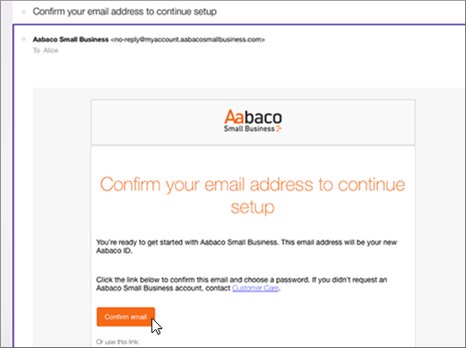
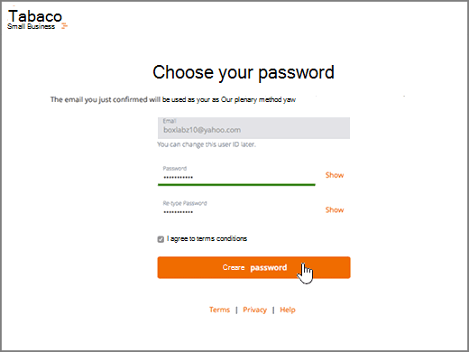
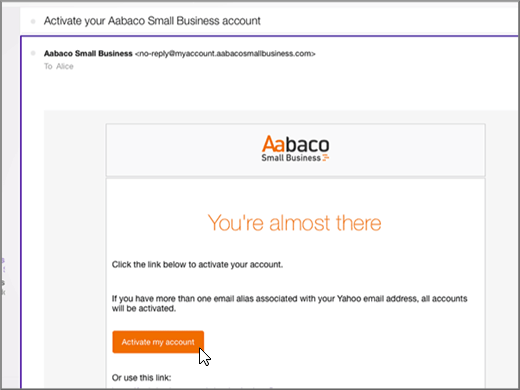
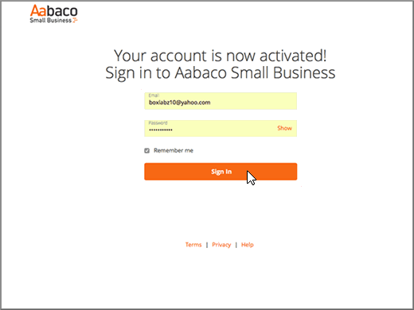

# Creare record DNS in Yahoo!Create DNS records at Yahoo! Small Business per MicrosoftSmall Business for Microsoft

 **Se non si trova ciò che si sta cercando, [vedere le domande frequenti sui domini](../setup/domains-faq.md)**.**[Check the Domains FAQ](../setup/domains-faq.md)** if you don't find what you're looking for. 
  
Se il proprio provider di hosting DNS era Yahoo! Small Business, occorre sapere che il nuovo provider è ora Aabaco Small Business.If Yahoo! Small Business has been your DNS hosting provider, you should be aware that your provider is now Aabaco Small Business.
  
Seguire i passaggi in questo articolo per creare un account su Aabaco, in cui è possibile apportare le modifiche DNS e rinnovare il dominio o i domini.Follow the steps in this article to create an account at Aabaco, where you can make DNS changes and renew your domain or domains.
  
È necessario creare un account Aabaco prima di poter [creare record DNS](../get-help-with-domains/create-dns-records-at-any-dns-hosting-provider.md).You must create your Aabaco account before you can [create DNS records](../get-help-with-domains/create-dns-records-at-any-dns-hosting-provider.md).

  
## Creare un account di Aabaco Small BusinessCreate an Aabaco Small Business account

1. Per iniziare, passare alla propria pagina dei domini su Aabaco usando [questo collegamento](https://www.luminate.com/services/)e selezionare **setup your Aabaco Small Business account**.To get started, go to your domains page at Aabaco by using [this link](https://www.luminate.com/services/), and select **Setup your Aabaco Small Business account**.
    
    
  
2. Fornire il proprio indirizzo e-mail/ID Yahoo di Yahoo!Provide your Yahoo! Small Business **e-mail/Yahoo ID**, quindi selezionare **io non sono un robot**.Small Business **Email/Yahoo ID**, and then select **I'm not a robot**.
    
    
  
3. Selezionare **inizia**.Select **Get started**.
    
    
  
4. Eseguire l'accesso all'account e-mail Yahoo! Small Business e aprire la nuova e-mail inviata da Aabaco Small Business.Sign in to your Yahoo! Small Business email account and open the new email from Aabaco Small Business.
    
    > [!NOTE]
    > Inviare di nuovo il messaggio, se necessario, scegliendo il collegamento **resend the email** nella pagina **You've got mail**.Resend the message, if necessary, by choosing the **resend the email link** on the **You've got mail** page. 
  
    
  
5. Nella Aabaco **confermare il proprio indirizzo di posta elettronica per continuare a configurare il messaggio di** posta elettronica, selezionare **conferma posta elettronica**.In the Aabaco **Confirm your email address to continue setup** email message, select **Confirm email**.
    
    
  
6. Nella pagina **Choose your password** digitare oppure copiare e incollare la password che si vuole usare per il proprio account di Aabaco.On the **Choose your password** page, type or copy and paste the password that you want to use for your Aabaco account. 
    
    > [!NOTE]
    > È possibile usare la stessa password usata con l'account di Yahoo! Small Business.You can use the same password that you used with your Yahoo! Small Business account. 
  
    
  
7. Selezionare Accetto **i termini e le condizioni**e quindi selezionare **Crea password**.Select **I agree to the terms and conditions**, and then select **Create password**.
    
    
  
8. Eseguire l'accesso all'account e-mail Yahoo! Small Business e quindi aprire la nuova e-mail inviata da Aabaco Small Business.Sign in to your Yahoo! Small Business email account, and then open the new email from Aabaco Small Business.
    
    > [!NOTE]
    > Inviare di nuovo il messaggio, se necessario, scegliendo il collegamento **resend the email** nella pagina **You're almost done!**.Resend the message, if necessary, by choosing the **resend the email link** on the **You're almost done!** page. 
  
    
  
9. In Aabaco **ci sono quasi** messaggi di posta elettronica, selezionare **Attiva account personale**.In the Aabaco **You're almost there** email message, select **Activate my account**.
    
    
  
10. Accedere al proprio account di Aabaco Small Business.Sign in to your Aabaco Small Business account.
    
    
  
Dopo aver creato l'account Aabaco, è possibile [creare record DNS in Aabaco Small Business per Microsoft](../get-help-with-domains/create-dns-records-at-any-dns-hosting-provider.md).Now that you have created your Aabaco account, you can [Create DNS records at Aabaco Small Business for Microsoft](../get-help-with-domains/create-dns-records-at-any-dns-hosting-provider.md).
  
