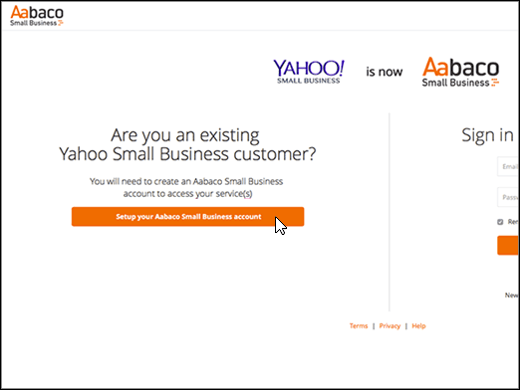

# Creare record DNS in Yahoo! Small Business per Microsoft

 **Se non si trova ciò che si sta cercando, [vedere le domande frequenti sui domini](../setup/domains-faq.yml)**. 
  
Se il proprio provider di hosting DNS era Yahoo! Small Business, occorre sapere che il nuovo provider è ora Aabaco Small Business.
  
Seguire i passaggi in questo articolo per creare un account su Aabaco, in cui è possibile apportare le modifiche DNS e rinnovare il dominio o i domini.
  
È necessario creare l'account Aabaco prima di poter [creare record DNS.](../get-help-with-domains/create-dns-records-at-any-dns-hosting-provider.md)

  
## Creare un account di Aabaco Small Business

1. To get started, go to your domains page at Aabaco by using [this link](https://www.luminate.com/services/), and select Setup **your Aabaco Small Business account**.
    
    
  
2. Fornire il proprio indirizzo e-mail/ID Yahoo di Yahoo! Small Business **Email/Yahoo ID**, quindi selezionare **I'm not a robot**.
    
    
  
3. Selezionare **Introduzione.**
    
    
  
4. Eseguire l'accesso all'account e-mail Yahoo! Small Business e aprire la nuova e-mail inviata da Aabaco Small Business.
    
    > [!NOTE]
    > Inviare di nuovo il messaggio, se necessario, scegliendo il collegamento **resend the email** nella pagina **You've got mail**. 
  
    
  
5. In Aabaco **Confermare l'indirizzo di posta elettronica per continuare la configurazione** del messaggio di posta elettronica, selezionare Conferma messaggio di posta **elettronica.**
    
    
  
6. Nella pagina **Choose your password** digitare oppure copiare e incollare la password che si vuole usare per il proprio account di Aabaco. 
    
    > [!NOTE]
    > È possibile usare la stessa password usata con l'account di Yahoo! Small Business. 
  
    
  
7. Selezionare **Accetto i termini e le condizioni,** quindi selezionare **Crea password.**
    
    
  
8. Eseguire l'accesso all'account e-mail Yahoo! Small Business e quindi aprire la nuova e-mail inviata da Aabaco Small Business.
    
    > [!NOTE]
    > Inviare di nuovo il messaggio, se necessario, scegliendo il collegamento **resend the email** nella pagina **You're almost done!**. 
  
    
  
9. In the Aabaco **You're almost there** email message, select **Activate my account**.
    
    
  
10. Accedere al proprio account di Aabaco Small Business.
    
    
  
Dopo aver creato l'account Aabaco, è possibile [creare record DNS in Aabaco Small Business per Microsoft.](../get-help-with-domains/create-dns-records-at-any-dns-hosting-provider.md)
  
