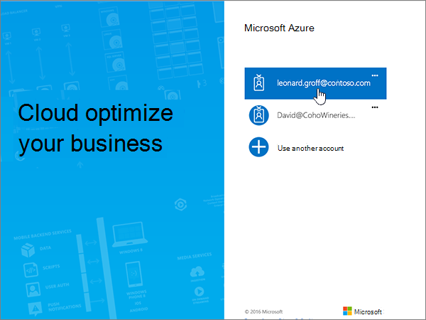
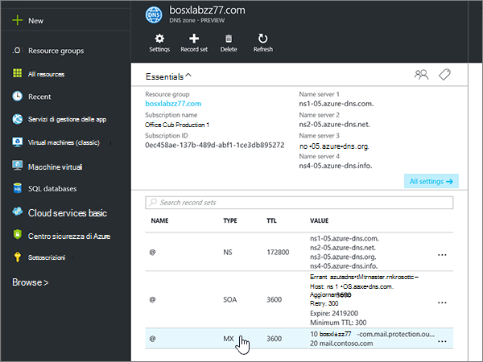
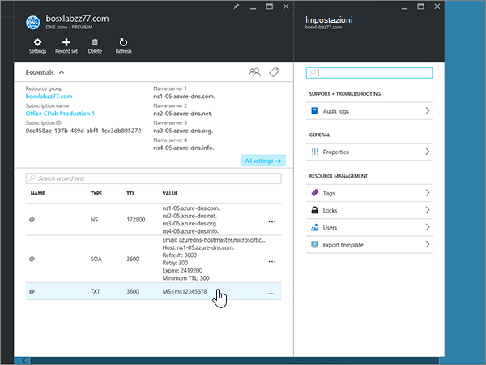
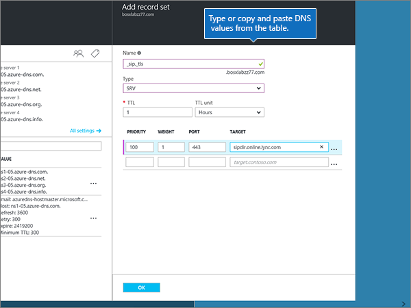

# Creare record DNS per le aree DNS di AzureCreate DNS records for Azure DNS zones

 Se non si trova ciò che si sta cercando, **[vedere le domande frequenti sui domini](../setup/domains-faq.md)**.**[Check the Domains FAQ](../setup/domains-faq.md)** if you don't find what you're looking for. 
  
Se Azure è il provider di hosting DNS, seguire la procedura descritta in questo articolo per verificare il dominio e configurare i record DNS per la posta elettronica, Skype for business online e così via.If Azure is your DNS hosting provider, follow the steps in this article to verify your domain and set up DNS records for email, Skype for Business Online, and so on.
  
Ecco i principali record da aggiungere.These are the main records to add. 
  
- [Modificare i record dei server dei nomi del dominioChange your domain's nameserver (NS) records](#change-your-domains-nameserver-ns-records)
    
- [Aggiungere un record TXT a scopo di verificaAdd a TXT record for verification](#add-a-txt-record-for-verification)

- [Aggiungere un record MX in modo che la posta elettronica del dominio venga recapitata in MicrosoftAdd an MX record so email for your domain will come to Microsoft](#add-an-mx-record-so-email-for-your-domain-will-come-to-microsoft)
    
- [Aggiungere i quattro record CNAME necessari per MicrosoftAdd the four CNAME records that are required for Microsoft](#add-the-four-cname-records-that-are-required-for-microsoft)
    
- [Aggiungere un record TXT per SPF per evitare di ricevere posta indesiderataAdd a TXT record for SPF to help prevent email spam](#add-a-txt-record-for-spf-to-help-prevent-email-spam)
    
- [Aggiungere i due record SRV necessari per MicrosoftAdd the two SRV records that are required for Microsoft](#add-the-two-srv-records-that-are-required-for-microsoft)
    
Dopo aver aggiunto questi record in Azure, il dominio sarà configurato per l'uso con i servizi Microsoft.After you add these records at Azure, your domain will be set up to work with Microsoft services.
  
> [!NOTE]
> In genere, l'applicazione delle modifiche ai record DNS richiede circa 15 minuti. A volte, tuttavia, l'aggiornamento di una modifica nel sistema DNS di Internet può richiedere più tempo. In caso di problemi relativi al flusso di posta o di altro tipo dopo l'aggiunta dei record DNS, vedere [Risolvere i problemi dopo la modifica del nome di dominio o dei record DNS](../get-help-with-domains/find-and-fix-issues.md).Typically it takes about 15 minutes for DNS changes to take effect. However, it can occasionally take longer for a change you've made to update across the Internet's DNS system. If you're having trouble with mail flow or other issues after adding DNS records, see [Troubleshoot issues after changing your domain name or DNS records](../get-help-with-domains/find-and-fix-issues.md). 
  
## Modificare i record dei server dei nomi del dominioChange your domain's nameserver (NS) records

> [!IMPORTANT]
> È necessario eseguire questa procedura presso il registrar da cui è stato acquistato e registrato il dominio.You must perform this procedure at the domain registrar where you purchased and registered your domain. 
  
Quando è stato eseguito l'accesso a Azure, è stato creato un gruppo di risorse all'interno di un'area DNS e quindi è stato assegnato il nome di dominio a tale gruppo di risorse.When you signed up for Azure, you created a resource group within a DNS zone, and then assigned your domain name to that resource group. Tale nome di dominio è registrato in un registro di dominio esterno. Azure non offre servizi di registrazione dei domini.That domain name is registered to an external domain registrar; Azure does not offer domain registration services.
  
Per verificare e creare record DNS per il proprio dominio in Microsoft, è innanzitutto necessario cambiare i server dei nomi presso il registrar in modo che utilizzino i server dei nomi di Azure assegnati al gruppo di risorse.To verify and create DNS records for your domain in Microsoft, you first need to change the nameservers at your domain registrar so that they use the Azure nameservers assigned to your resource group.
  
Per modificare i server dei nomi del dominio presso il registrar, seguire questa procedura:To change your domain's name servers at your domain registrar's website yourself, follow these steps.
  
1. Trovare l'area del sito Web del registrar in cui è possibile modificare i server dei nomi per il dominio.Find the area on the domain registrar's website where you can edit the nameservers for your domain.
    
2. Creare due record dei server dei nomi usando i valori della tabella seguente oppure modificare quelli esistenti in modo che corrispondano a questi valori.Either create two nameserver records by using the values in the following table, or edit the existing nameserver records so that they match these values. Di seguito è riportato un esempio di server dei nomi assegnati di Azure.An example of Azure assigned nameservers is shown below.
    

**Primo server dei nomi:** Utilizzare il valore Name Server assegnato da Azure.**First nameserver:** Use the name server value assigned by Azure.  
**Secondo server dei nomi:** Utilizzare il valore Name Server assegnato da Azure.**Second nameserver:** Use the name server value assigned by Azure.  

  
> [!TIP]
> You should use at least two name server records.You should use at least two name server records. Se sono presenti altri server dei nomi elencati nel sito Web del registrar, è consigliabile eliminarli.If there are any other name servers listed at your domain registrar's website, you should delete them. 
  
3. Salvare le modifiche apportate.Save your changes.
    
> [!NOTE]
> L'aggiornamento dei record dei server dei nomi nel sistema DNS di Internet può richiedere fino a diverse ore.Your nameserver record updates may take up to several hours to update across the Internet's DNS system. L'indirizzo di posta elettronica e gli altri servizi di Microsoft saranno tutti impostati per l'utilizzo con il dominio.Then your Microsoft email and other services will be all set to work with your domain. 
  
## Aggiungere un record TXT a scopo di verificaAdd a TXT record for verification

Prima di usare il proprio dominio con Microsoft, è necessario dimostrare di esserne il proprietario. La capacità di accedere al proprio account nel registrar e di creare il record DNS dimostra a Microsoft che si è il proprietario del dominio.Before you use your domain with Microsoft, we have to make sure that you own it. Your ability to log in to your account at your domain registrar and create the DNS record proves to Microsoft that you own the domain.
  
> [!NOTE]
> Questo record viene usato esclusivamente per verificare di essere proprietari del dominio e non ha altri effetti. È possibile eliminarlo in un secondo momento, se si preferisce.This record is used only to verify that you own your domain; it doesn't affect anything else. You can delete it later, if you like. 
  
1. Per iniziare, passare alla propria pagina dei domini su Azure usando [questo collegamento](https://portal.azure.com ).To get started, go to your domains page at Azure by using [this link](https://portal.azure.com ). Verrà richiesto di eseguire l'accesso.You'll be prompted to log in first.
    
    
  
2. Se si utilizza la **barra di ricerca** nella pagina del **Dashboard** , digitare le **aree DNS**.Using the **search bar** on the **Dashboard** page, type in **DNS zones**. Nella visualizzazione dei risultati, selezionare **aree DNS** nella parte **Servizi** .In the results display, select **DNS zones** under the **Services** portion. Dopo aver reindirizzato, selezionare il dominio che si desidera aggiornare.Once you've been redirected, select the domain that you want to update.
    
    
  
3. Nella pagina **Impostazioni** del dominio, nell'area **DNS zone** , selezionare **+ set di record**.On the **Settings** page for your domain, in the **DNS zone** area, select **+ Record set**.
    
    
  
4. Nelle caselle del nuovo set di record nell'area **Add record set** selezionare i valori della tabella seguente.In the **Add record set** area, in the boxes for the new record set, select the values from the following table. 
    
    Scegliere i valori di **tipo** e **unità TTL** negli elenchi a discesa.(Choose the **Type** and **TTL unit** values from the drop-down lists.) 
    
    |**Nome****Name**|**Tipo****Type**|**TTL****TTL**|**Unità TTL****TTL unit**|**Valore****Value**|
    |:-----|:-----|:-----|:-----|:-----|
    |@    |TXTTXT    |1 1    |OreHours    |MS=ms *XXXXXXXX*MS=ms *XXXXXXXX*    **Note:** questo è un esempio.**Note:** This is an example. Usare il valore specifico di **Indirizzo di destinazione o puntamento** indicato nella tabella.Use your specific **Destination or Points to Address** value here, from the table.           [Come trovarloHow do I find this?](../get-help-with-domains/information-for-dns-records.md)          |
   
    
  
5. Selezionare **OK**.Select **OK**.
  
6. Attendere alcuni minuti prima di continuare, in modo che il record appena creato venga aggiornato in Internet.Wait a few minutes before you continue, so that the record you just created can update across the Internet.
    
Una volta che il record è stato aggiunto al sito del registrar, è possibile tornare a Microsoft e richiedere il record.Now that you've added the record at your domain registrar's site, you'll go back to Microsoft and request the record.
  
Quando Microsoft trova il record TXT corretto, il dominio è verificato.When Microsoft finds the correct TXT record, your domain is verified.
  
1. Nell'interfaccia di amministrazione passare a **Impostazioni** \> pagina <a href="https://go.microsoft.com/fwlink/p/?linkid=834818" target="_blank">Domini</a>.In the admin center, go to the **Settings** \> <a href="https://go.microsoft.com/fwlink/p/?linkid=834818" target="_blank">Domains</a> page.
    
2. Nella pagina **Domini** selezionare il dominio da verificare.On the **Domains** page, select the domain that you are verifying. 
    
    
  
3. Nella pagina **Configurazione** selezionare **Avvia configurazione**.On the **Setup** page, select **Start setup**.
    
    
  
4. Nella pagina **Verifica dominio** selezionare **Verifica**.On the **Verify domain** page, select **Verify**.
    
    
  
> [!NOTE]
>  In genere, l'applicazione delle modifiche ai record DNS richiede circa 15 minuti. A volte, tuttavia, l'aggiornamento di una modifica nel sistema DNS di Internet può richiedere più tempo. In caso di problemi relativi al flusso di posta o di altro tipo dopo l'aggiunta dei record DNS, vedere [Risolvere i problemi dopo la modifica del nome di dominio o dei record DNS](../get-help-with-domains/find-and-fix-issues.md).Typically it takes about 15 minutes for DNS changes to take effect. However, it can occasionally take longer for a change you've made to update across the Internet's DNS system. If you're having trouble with mail flow or other issues after adding DNS records, see [Troubleshoot issues after changing your domain name or DNS records](../get-help-with-domains/find-and-fix-issues.md). 
  
## Aggiungere un record MX in modo che la posta elettronica del dominio venga recapitata in MicrosoftAdd an MX record so email for your domain will come to Microsoft

1. Per iniziare, passare alla propria pagina dei domini su Azure usando [questo collegamento](https://portal.azure.com ).To get started, go to your domains page at Azure by using [this link](https://portal.azure.com ). Verrà richiesto di eseguire l'accesso.You'll be prompted to log in first.
    
    
  
2. Nell'area **tutte le risorse** della pagina **Dashboard** selezionare il dominio che si desidera aggiornare.On the **Dashboard** page, in the **All resources** area, select the domain that you want to update. 
    
    
  
3. Nella pagina **Impostazioni** del dominio, nell'area **DNS zone** , selezionare **+ set di record**.On the **Settings** page for your domain, in the **DNS zone** area, select **+ Record set**.
    
    
  
4. Nelle caselle del nuovo set di record nell'area **Add record set** selezionare i valori della tabella seguente.In the **Add record set** area, in the boxes for the new record set, select the values from the following table. 
    
    Scegliere i valori di **tipo** e **unità TTL** negli elenchi a discesa.(Choose the **Type** and **TTL unit** values from the drop-down lists.) 
    
    |**Nome****Name**|**Tipo****Type**|**TTL****TTL**|**Unità TTL****TTL unit**|**Preference****Preference**|**Exchange Mail****Mail Exchange**|
    |:-----|:-----|:-----|:-----|:-----|:-----|
    |@    |MXMX    |1 1    |OreHours    |10  10    Per altre informazioni sulla priorità, vedere [Informazioni sulla priorità MX](https://docs.microsoft.com/microsoft-365/admin/setup/domains-faq).For more information about priority, see [What is MX priority?](https://docs.microsoft.com/microsoft-365/admin/setup/domains-faq)   | *\<domain-key\>*. mail.protection.outlook.com*\<domain-key\>*  .mail.protection.outlook.com    **Nota:** Ottenere il vostro *\<domain-key\>* dal vostro account Microsoft.**Note:** Get your  *\<domain-key\>*  from your Microsoft account.   [Come trovarloHow do I find this?](../get-help-with-domains/information-for-dns-records.md)  
   
    
  
5. Selezionare **OK**.Select **OK**.
    
    
  
6. Se sono elencati altri record MX nella sezione **MX Records** , è necessario eliminarli.If there are any other MX records listed in the **MX Records** section, you must delete them. 
    
    In primo luogo, nell'area **DNS zone** selezionare il **set di record MX**.First, in the **DNS zone** area, select the **MX Record set**.
    
    
  
    Successivamente, selezionare il record MX che si desidera eliminare.Next, select the MX record you want to delete.
    
    
  
7. Selezionare il **menu di scelta rapida (...)** e quindi fare clic su **Rimuovi**.Select the **Context menu (…)**, and then choose **Remove**.
    
    
  
8. Selezionare **Salva**.Select **Save**.
    
    
  
## Aggiungere i quattro record CNAME necessari per MicrosoftAdd the four CNAME records that are required for Microsoft

1. Per iniziare, passare alla propria pagina dei domini su Azure usando [questo collegamento](https://portal.azure.com ).To get started, go to your domains page at Azure by using [this link](https://portal.azure.com ). Verrà richiesto di eseguire l'accesso.You'll be prompted to log in first.
    
    
  
2. Nell'area **tutte le risorse** della pagina **Dashboard** selezionare il dominio che si desidera aggiornare.On the **Dashboard** page, in the **All resources** area, select the domain that you want to update. 
    
    
  
3. Nella pagina **Impostazioni** del dominio, nell'area **DNS zone** , selezionare **+ set di record**.On the **Settings** page for your domain, in the **DNS zone** area, select **+ Record set**.
    
    
  
4. Aggiungere il primo dei quattro record CNAME.Add the first of the four CNAME records.
    
    Nelle caselle del nuovo set di record nell'area **Add record set** Digitare oppure copiare e incollare i valori della prima riga della tabella seguente.In the **Add record set** area, in the boxes for the new record set, type or copy and paste the values from the first row in the following table. 
    
    Scegliere i valori di **tipo** e **unità TTL** negli elenchi a discesa.(Choose the **Type** and **TTL unit** values from the drop-down lists.) 
    
    |**Nome****Name**|**Tipo****Type**|**TTL****TTL**|**Unità TTL****TTL unit**|**Alias****Alias**|
    |:-----|:-----|:-----|:-----|:-----|
    |autodiscoverautodiscover    |CNAMECNAME    |1 1    |OreHours    |autodiscover.outlook.comautodiscover.outlook.com    |
    |sipsip    |CNAMECNAME    |1 1    |OreHours    |sipdir.online.lync.comsipdir.online.lync.com    |
    |lyncdiscoverlyncdiscover    |CNAMECNAME    |1 1    |OreHours    |webdir.online.lync.comwebdir.online.lync.com    |
    
   
    
  
5. Selezionare **OK**.Select **OK**.
    
    
  
6. Aggiungere gli altri tre record CNAME.Add each of the other three CNAME records.
    
    Nell'area **DNS zone** selezionare **+ set di record**.In the **DNS zone** area, select **+ Record set**. Quindi, nel set di record vuoto, creare un record usando i valori della riga successiva della tabella e selezionare di nuovo **OK** per completare il record.Then, in the empty record set, create a record by using the values from the next row in the table, and again select **OK** to complete that record. 
    
    Ripetere questa procedura fino a creare tutti e quattro i record CNAME.Repeat this process until you have created all four CNAME records.
    
7.  Optional Aggiungere 2 record CNAME per MDM.(Optional) Add 2 CNAME records for MDM.

> [!IMPORTANT]
> Se si dispone di gestione dei dispositivi mobili (MDM) per Microsoft, è necessario creare due record CNAME aggiuntivi.If you have Mobile Device Management (MDM) for Microsoft, then you must create two additional CNAME records. Follow the procedure that you used for the other four CNAME records, but supply the values from the following table.Follow the procedure that you used for the other four CNAME records, but supply the values from the following table. Se non si dispone di MDM, è possibile ignorare questo passaggio.(If you do not have MDM, you can skip this step.) 
  
|**Nome****Name**|**Tipo****Type**|**TTL****TTL**|**Unità TTL****TTL unit**|**Alias****Alias**|
|:-----|:-----|:-----|:-----|:-----|
|enterpriseregistrationenterpriseregistration    |CNAMECNAME    |1 1    |OreHours    |enterpriseregistration.windows.netenterpriseregistration.windows.net    |
|enterpriseenrollmententerpriseenrollment    |CNAMECNAME    |1 1    |OreHours    |enterpriseenrollment-s.manage.microsoft.comenterpriseenrollment-s.manage.microsoft.com    |
   
## Aggiungere un record TXT per SPF per evitare di ricevere posta indesiderataAdd a TXT record for SPF to help prevent email spam

> [!IMPORTANT]
> Non può essere presente più di un record TXT per SPF per un dominio.You cannot have more than one TXT record for SPF for a domain. Se il dominio ha più record SPF, si verificheranno errori nella gestione della posta elettronica, oltre a problemi di recapito e di classificazione della posta indesiderata.If your domain has more than one SPF record, you'll get email errors, as well as delivery and spam classification issues. Se si dispone già di un record SPF per il dominio, non crearne uno nuovo per Microsoft.If you already have an SPF record for your domain, don't create a new one for Microsoft. Al contrario, aggiungere i valori Microsoft necessari al record corrente in modo da disporre di un *singolo* record SPF che includa entrambi i set di valori.Instead, add the required Microsoft values to the current record so that you have a  *single*  SPF record that includes both sets of values. 
  
1. Per iniziare, passare alla propria pagina dei domini su Azure usando [questo collegamento](https://portal.azure.com ).To get started, go to your domains page at Azure by using [this link](https://portal.azure.com ). Verrà richiesto di eseguire l'accesso.You'll be prompted to log in first.
    
    
  
2. Nell'area **tutte le risorse** della pagina **Dashboard** selezionare il dominio che si desidera aggiornare.On the **Dashboard** page, in the **All resources** area, select the domain that you want to update. 
    
    
  
3. Nell'area **DNS zone** selezionare il set di **record TXT**.In the **DNS zone** area, select the **TXT record set**.
    
    
  
4. Nelle caselle del nuovo record nell'area **proprietà del set di record** selezionare i valori della tabella seguente.In the **Record set properties** area, in the boxes for the new record set, select the values from the following table. 
    
    Scegliere i valori di **tipo** e **unità TTL** negli elenchi a discesa.(Choose the **Type** and **TTL unit** values from the drop-down lists.) 
    
    |**Nome****Name**|**Tipo****Type**|**TTL****TTL**|**Unità TTL****TTL unit**|**Valore****Value**|
    |:-----|:-----|:-----|:-----|:-----|
    |@    |TXTTXT    |1 1    |OreHours    |v=spf1 include:spf.protection.outlook.com -allv=spf1 include:spf.protection.outlook.com -all    **Nota:** è consigliabile copiare e incollare questa voce, in modo che tutti i caratteri di spaziatura siano corretti.**Note:** We recommend copying and pasting this entry, so that all of the spacing stays correct.           

    
  
5. Selezionare **Salva**.Select **Save**.
    
    
  
## Aggiungere i due record SRV necessari per MicrosoftAdd the two SRV records that are required for Microsoft

1. Per iniziare, passare alla propria pagina dei domini su Azure usando [questo collegamento](https://portal.azure.com ).To get started, go to your domains page at Azure by using [this link](https://portal.azure.com ). Verrà richiesto di eseguire l'accesso.You'll be prompted to log in first.
    
    
  
2. Nell'area **tutte le risorse** della pagina **Dashboard** selezionare il dominio che si desidera aggiornare.On the **Dashboard** page, in the **All resources** area, select the domain that you want to update. 
    
    
  
3. Nella pagina **Impostazioni** del dominio, nell'area **DNS zone** , selezionare **+ set di record**.On the **Settings** page for your domain, in the **DNS zone** area, select **+ Record set**.
    
    
  
4. Aggiungere il primo dei due record SRV.Add the first of the two SRV records.
    
    Nelle caselle del nuovo set di record nell'area **Add record set** selezionare i valori della prima riga della tabella seguente.In the **Add record set** area, in the boxes for the new record set, select the values from the first row in the following table. 
    
    Scegliere i valori di **tipo** e **unità TTL** negli elenchi a discesa.(Choose the **Type** and **TTL unit** values from the drop-down lists.) 
    
    |**Nome****Name**|**Tipo****Type**|**TTL****TTL**|**Unità TTL****TTL unit**|**Priorità****Priority**|**Peso****Weight**|**Porta****Port**|**Target****Target**|
    |:-----|:-----|:-----|:-----|:-----|:-----|:-----|:-----|
    |_sip. _tls_sip._tls    |SRVSRV    |1 1    |OreHours    |100100    |1 1    |443443    |sipdir.online.lync.comsipdir.online.lync.com    |
    |_sipfederationtls. _tcp_sipfederationtls._tcp    |SRVSRV    |1 1    |OreHours    |100100    |1 1    |50615061    |sipfed.online.lync.comsipfed.online.lync.com    

    
  
5. Selezionare **OK**.Select **OK**.
    
    
  
6. Aggiungere l'altro record SRV.Add the other SRV record.
    
    Nelle caselle del nuovo record digitare oppure copiare e incollare i valori della seconda riga della tabella.In the boxes for the new record, type or copy and paste the values from the second row of the table.
    
> [!NOTE]
> In genere, l'applicazione delle modifiche ai record DNS richiede circa 15 minuti. A volte, tuttavia, l'aggiornamento di una modifica nel sistema DNS di Internet può richiedere più tempo. In caso di problemi relativi al flusso di posta o di altro tipo dopo l'aggiunta dei record DNS, vedere [Risolvere i problemi dopo la modifica del nome di dominio o dei record DNS](../get-help-with-domains/find-and-fix-issues.md).Typically it takes about 15 minutes for DNS changes to take effect. However, it can occasionally take longer for a change you've made to update across the Internet's DNS system. If you're having trouble with mail flow or other issues after adding DNS records, see [Troubleshoot issues after changing your domain name or DNS records](../get-help-with-domains/find-and-fix-issues.md). 
  
