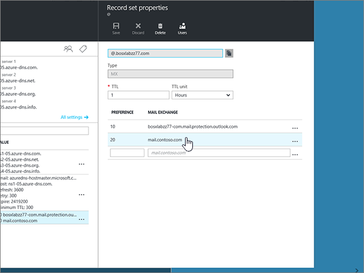
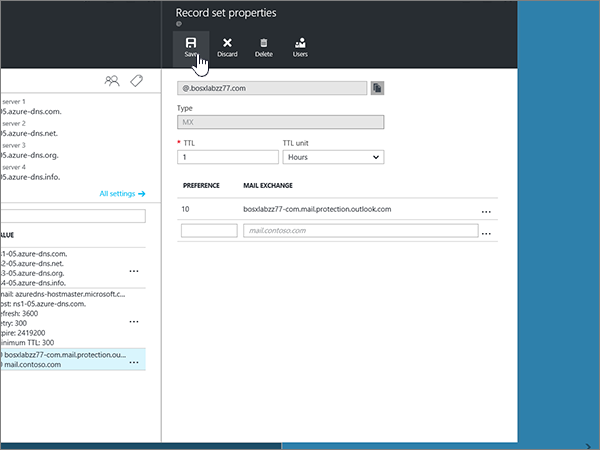
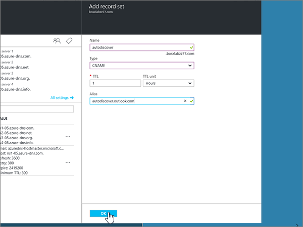
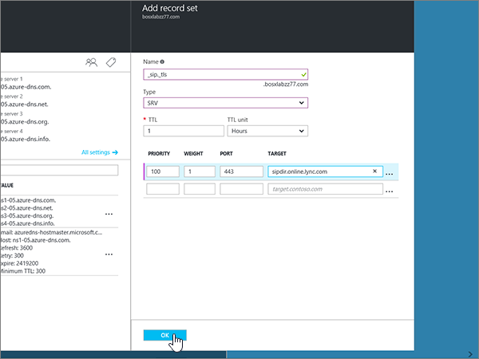

# Creare record DNS per le aree DNS di Azure

 Se non si trova ciò che si sta cercando, **[vedere le domande frequenti sui domini](../setup/domains-faq.md)**. 
  
Se Azure è il provider di hosting DNS, seguire la procedura descritta in questo articolo per verificare il dominio e configurare i record DNS per la posta elettronica, Skype for business online e così via.
  
Ecco i principali record da aggiungere. 
  
- [Modificare i record dei server dei nomi del dominio](#change-your-domains-nameserver-ns-records)
    
- [Aggiungere un record TXT a scopo di verifica](#add-a-txt-record-for-verification)

- [Aggiungere un record MX in modo che la posta elettronica per il dominio venga recapitata in Office 365](#add-an-mx-record-so-email-for-your-domain-will-come-to-office-365)
    
- [Aggiungere i quattro record CNAME necessari per Office 365](#add-the-four-cname-records-that-are-required-for-office-365)
    
- [Aggiungere un record TXT per SPF per evitare di ricevere posta indesiderata](#add-a-txt-record-for-spf-to-help-prevent-email-spam)
    
- [Aggiungere i due record SRV necessari per Office 365](#add-the-two-srv-records-that-are-required-for-office-365)
    
Dopo aver aggiunto questi record in Azure, il dominio sarà configurato per l'uso con i servizi di Office 365.
  
> [!NOTE]
> In genere l'applicazione delle modifiche al DNS richiede circa 15 minuti. A volte può tuttavia capitare che l'aggiornamento di una modifica nel sistema DNS di Internet richieda più tempo. In caso di problemi con il flusso di posta o altro dopo l'aggiunta dei record DNS, vedere [Risolvere i problemi dopo la modifica del nome di dominio o dei record DNS](../get-help-with-domains/find-and-fix-issues.md). 
  
## Modificare i record dei server dei nomi del dominio

> [!IMPORTANT]
> È necessario eseguire questa procedura presso il registrar da cui è stato acquistato e registrato il dominio. 
  
Quando è stato eseguito l'accesso a Azure, è stato creato un gruppo di risorse all'interno di un'area DNS e quindi è stato assegnato il nome di dominio a tale gruppo di risorse. Tale nome di dominio è registrato in un registro di dominio esterno. Azure non offre servizi di registrazione dei domini.
  
Per verificare e creare record DNS per il proprio dominio in Office 365, è innanzitutto necessario modificare i server dei nomi presso il registrar in modo che utilizzino i server dei nomi di Azure assegnati al gruppo di risorse.
  
Per modificare i server dei nomi del dominio presso il registrar, seguire questa procedura:
  
1. Trovare l'area del sito Web del registrar in cui è possibile modificare i server dei nomi per il dominio.
    
2. Creare due record dei server dei nomi usando i valori della tabella seguente oppure modificare quelli esistenti in modo che corrispondano a questi valori. Di seguito è riportato un esempio di server dei nomi assegnati di Azure.
    

**Primo server dei nomi:** Utilizzare il valore Name Server assegnato da Azure.  
**Secondo server dei nomi:** Utilizzare il valore Name Server assegnato da Azure.  

  
> [!TIP]
> You should use at least two name server records. Se sono presenti altri server dei nomi elencati nel sito Web del registrar, è consigliabile eliminarli. 
  
3. Salvare le modifiche apportate.
    
> [!NOTE]
> L'aggiornamento dei record dei server dei nomi nel sistema DNS di Internet può richiedere fino a diverse ore. Al termine, la posta elettronica e altri servizi di Office 365 verranno tutti impostati per funzionare con il dominio. 
  
## Aggiungere un record TXT a scopo di verifica

Prima di usare il proprio dominio con Office 365, è necessario dimostrare di esserne proprietari. La capacità di accedere al proprio account nel registrar e di creare il record DNS dimostra a Office 365 che si è proprietari del dominio.
  
> [!NOTE]
> Questo record viene usato esclusivamente per verificare di essere proprietari del dominio e non ha altri effetti. È possibile eliminarlo in un secondo momento, se si preferisce. 
  
1. Per iniziare, passare alla propria pagina dei domini su Azure usando [questo collegamento](https://portal.azure.com ). You'll be prompted to log in first.
    
    
  
2. Se si utilizza la **barra di ricerca** nella pagina del **Dashboard** , digitare le **aree DNS**. Nella visualizzazione dei risultati, selezionare **aree DNS** nella parte **Servizi** . Dopo aver reindirizzato, selezionare il dominio che si desidera aggiornare.
    
    
  
3. Nella pagina **Impostazioni** del dominio, nell'area **DNS zone** , selezionare **+ set di record**.
    
    
  
4. Nelle caselle del nuovo set di record nell'area **Add record set** selezionare i valori della tabella seguente. 
    
    Scegliere i valori di **tipo** e **unità TTL** negli elenchi a discesa. 
    
    |**Nome**|**Tipo**|**TTL**|**Unità TTL**|**Valore**|
    |:-----|:-----|:-----|:-----|:-----|
    |@    |TXT    |1    |Ore    |MS=ms *XXXXXXXX*    **Note:** questo è un esempio. Usare il valore specifico di **Indirizzo di destinazione o puntamento** indicato nella tabella in Office 365.           [Come trovarlo](../get-help-with-domains/information-for-dns-records.md)          |
   
    
  
5. Selezionare **OK**.
  
6. Attendere alcuni minuti prima di continuare, in modo che il record appena creato venga aggiornato in Internet.
    
Now that you've added the record at your domain registrar's site, you'll go back to Office 365 and request Office 365 to look for the record.
  
When Office 365 finds the correct TXT record, your domain is verified.
  
1. Nell'interfaccia di amministrazione, andare alla pagina **** \> <a href="https://go.microsoft.com/fwlink/p/?linkid=834818" target="_blank">Domains</a> Settings.
    
2. Nella pagina **Domains** selezionare il dominio che si sta verificando. 
    
    
  
3. Nella pagina **configurazione** , selezionare **Avvia installazione**.
    
    
  
4. Nella pagina **Verifica dominio** selezionare **Verifica**.
    
    
  
> [!NOTE]
>  In genere l'applicazione delle modifiche al DNS richiede circa 15 minuti. A volte può tuttavia capitare che l'aggiornamento di una modifica nel sistema DNS di Internet richieda più tempo. In caso di problemi con il flusso di posta o altro dopo l'aggiunta dei record DNS, vedere [Risolvere i problemi dopo la modifica del nome di dominio o dei record DNS](../get-help-with-domains/find-and-fix-issues.md). 
  
## Aggiungere un record MX in modo che la posta elettronica per il dominio venga recapitata in Office 365

1. Per iniziare, passare alla propria pagina dei domini su Azure usando [questo collegamento](https://portal.azure.com ). You'll be prompted to log in first.
    
    
  
2. Nell'area **tutte le risorse** della pagina **Dashboard** selezionare il dominio che si desidera aggiornare. 
    
    
  
3. Nella pagina **Impostazioni** del dominio, nell'area **DNS zone** , selezionare **+ set di record**.
    
    
  
4. Nelle caselle del nuovo set di record nell'area **Add record set** selezionare i valori della tabella seguente. 
    
    Scegliere i valori di **tipo** e **unità TTL** negli elenchi a discesa. 
    
    |**Nome**|**Tipo**|**TTL**|**Unità TTL**|**Preference**|**Exchange Mail**|
    |:-----|:-----|:-----|:-----|:-----|:-----|
    |@    |MX    |1    |Ore    |10     Per altre informazioni sulla priorità, vedere [Informazioni sulla priorità MX](https://support.office.com/article/2784cc4d-95be-443d-b5f7-bb5dd867ba83.aspx).   | *\<chiave-dominio\>*  .mail.protection.outlook.com    **Nota:** Ottenere la propria * \<chiave\> di dominio* dall'account di Office 365.   [Come trovarlo](../get-help-with-domains/information-for-dns-records.md)  
   
    
  
5. Selezionare **OK**.
    
    
  
6. Se sono elencati altri record MX nella sezione **MX Records** , è necessario eliminarli. 
    
    In primo luogo, nell'area **DNS zone** selezionare il **set di record MX**.
    
    
  
    Successivamente, selezionare il record MX che si desidera eliminare.
    
    
  
7. Selezionare il **menu di scelta rapida (...)** e quindi fare clic su **Rimuovi**.
    
    
  
8. Selezionare **Salva**.
    
    
  
## Aggiungere i quattro record CNAME necessari per Office 365

1. Per iniziare, passare alla propria pagina dei domini su Azure usando [questo collegamento](https://portal.azure.com ). You'll be prompted to log in first.
    
    
  
2. Nell'area **tutte le risorse** della pagina **Dashboard** selezionare il dominio che si desidera aggiornare. 
    
    
  
3. Nella pagina **Impostazioni** del dominio, nell'area **DNS zone** , selezionare **+ set di record**.
    
    
  
4. Aggiungere il primo dei quattro record CNAME.
    
    Nelle caselle del nuovo set di record nell'area **Add record set** Digitare oppure copiare e incollare i valori della prima riga della tabella seguente. 
    
    Scegliere i valori di **tipo** e **unità TTL** negli elenchi a discesa. 
    
    |**Nome**|**Tipo**|**TTL**|**Unità TTL**|**Alias**|
    |:-----|:-----|:-----|:-----|:-----|
    |autodiscover    |CNAME    |1    |Ore    |autodiscover.outlook.com    |
    |sip    |CNAME    |1    |Ore    |sipdir.online.lync.com    |
    |lyncdiscover    |CNAME    |1    |Ore    |webdir.online.lync.com    |
    
   
    
  
5. Selezionare **OK**.
    
    
  
6. Aggiungere gli altri tre record CNAME.
    
    Nell'area **DNS zone** selezionare **+ set di record**. Quindi, nel set di record vuoto, creare un record usando i valori della riga successiva della tabella e selezionare di nuovo **OK** per completare il record. 
    
    Ripetere questa procedura fino a creare tutti e quattro i record CNAME.
    
7.  Optional Aggiungere 2 record CNAME per MDM.

> [!IMPORTANT]
> Se si dispone di Gestione di dispositivi mobili per Office 365, è necessario creare due record CNAME aggiuntivi. Seguire la procedura usata per gli altri quattro record CNAME, specificando però i valori della tabella seguente. Se non si dispone di MDM, è possibile ignorare questo passaggio. 
  
|**Nome**|**Tipo**|**TTL**|**Unità TTL**|**Alias**|
|:-----|:-----|:-----|:-----|:-----|
|enterpriseregistration    |CNAME    |1    |Ore    |enterpriseregistration.windows.net    |
|enterpriseenrollment    |CNAME    |1    |Ore    |enterpriseenrollment-s.manage.microsoft.com    |
   
## Aggiungere un record TXT per SPF per evitare di ricevere posta indesiderata

> [!IMPORTANT]
> You cannot have more than one TXT record for SPF for a domain. If your domain has more than one SPF record, you'll get email errors, as well as delivery and spam classification issues. If you already have an SPF record for your domain, don't create a new one for Office 365. Al contrario, aggiungere i valori di Office 365 necessari al record corrente in modo che sia presente un *singolo* record SPF che includa entrambi i set di valori. 
  
1. Per iniziare, passare alla propria pagina dei domini su Azure usando [questo collegamento](https://portal.azure.com ). You'll be prompted to log in first.
    
    
  
2. Nell'area **tutte le risorse** della pagina **Dashboard** selezionare il dominio che si desidera aggiornare. 
    
    
  
3. Nell'area **DNS zone** selezionare il set di **record TXT**.
    
    
  
4. Nelle caselle del nuovo record nell'area **proprietà del set di record** selezionare i valori della tabella seguente. 
    
    Scegliere i valori di **tipo** e **unità TTL** negli elenchi a discesa. 
    
    |**Nome**|**Tipo**|**TTL**|**Unità TTL**|**Valore**|
    |:-----|:-----|:-----|:-----|:-----|
    |@    |TXT    |1    |Ore    |v=spf1 include:spf.protection.outlook.com -all    **Nota:** è consigliabile copiare e incollare questa voce, in modo che tutti i caratteri di spaziatura siano corretti.           

    
  
5. Selezionare **Salva**.
    
    
  
## Aggiungere i due record SRV necessari per Office 365

1. Per iniziare, passare alla propria pagina dei domini su Azure usando [questo collegamento](https://portal.azure.com ). You'll be prompted to log in first.
    
    
  
2. Nell'area **tutte le risorse** della pagina **Dashboard** selezionare il dominio che si desidera aggiornare. 
    
    
  
3. Nella pagina **Impostazioni** del dominio, nell'area **DNS zone** , selezionare **+ set di record**.
    
    
  
4. Aggiungere il primo dei due record SRV.
    
    Nelle caselle del nuovo set di record nell'area **Add record set** selezionare i valori della prima riga della tabella seguente. 
    
    Scegliere i valori di **tipo** e **unità TTL** negli elenchi a discesa. 
    
    |**Nome**|**Tipo**|**TTL**|**Unità TTL**|**Priorità**|**Peso**|**Port**|**Target**|
    |:-----|:-----|:-----|:-----|:-----|:-----|:-----|:-----|
    |_sip. _tls    |SRV    |1    |Ore    |100    |1    |443    |sipdir.online.lync.com    |
    |_sipfederationtls. _tcp    |SRV    |1    |Ore    |100    |1    |5061    |sipfed.online.lync.com    

    
  
5. Selezionare **OK**.
    
    
  
6. Aggiungere l'altro record SRV.
    
    Nelle caselle del nuovo record digitare oppure copiare e incollare i valori della seconda riga della tabella.
    
> [!NOTE]
> In genere, l'applicazione delle modifiche al DNS richiede circa 15 minuti. A volte, tuttavia, l'aggiornamento di una modifica nel sistema DNS di Internet può richiedere più tempo. In caso di problemi con il flusso di posta o di altro tipo dopo l'aggiunta dei record DNS, vedere [Risolvere i problemi dopo la modifica del nome di dominio o dei record DNS](../get-help-with-domains/find-and-fix-issues.md). 
  
