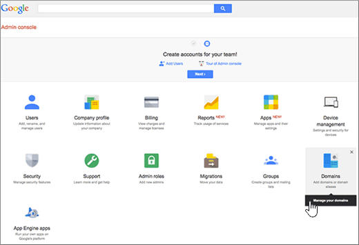

# Creare record DNS quando il dominio è gestito da Google (eNom)Create DNS records when your domain is managed by Google (eNom)

 Se non si trova ciò che si sta cercando, **[vedere le domande frequenti sui domini](../setup/domains-faq.yml)**.**[Check the Domains FAQ](../setup/domains-faq.yml)** if you don't find what you're looking for. 
  
Per eseguire la migrazione degli account di posta elettronica a Microsoft, è necessario creare un record DNS presso il registrar.To migrate your mail accounts to Microsoft, you need to create a DNS record at your domain registrar.
  
Se il dominio è stato acquistato tramite Google durante l'iscrizione per l'account di **Google Apps for Work** , i record DNS vengono gestiti da Google ma registrati con eNom.If you purchased your domain through Google while signing up for your **Google Apps for Work** account, your DNS records are managed by Google but registered with eNom. 
  
È possibile accedere a eNom e creare DNS tramite la pagina **domini** di Google.You can access eNom, and create DNS, through the Google **Domains** page. Seguire i passaggi descritti in questo articolo.Just follow the steps in this article. 
  
## Creare il record DNSCreate the DNS record

1. Nella [console di amministrazione di Google](https://www.google.com/work/apps/business), selezionare **Accedi**.At the [Google Admin console](https://www.google.com/work/apps/business), select **Sign In**.
    
    
  
2. Immettere il proprio nome di dominio, quindi selezionare **Vai**.Enter your domain name, and then select **Go**.
    
    
  
3. Nella parte inferiore della pagina, selezionare **altri controlli**.At the bottom of the page, select **More controls**.
    
    
  
4. Selezionare **Domini**.Select **Domains**.
    
    
  
5. Nella pagina **Domains** selezionare **Aggiungi/Rimuovi domini**.On the **Domains** page, select **Add/remove domains**.
    
    
  
6. Nella pagina **Domains** selezionare **Advanced DNS Settings**.On the **Domains** page, select **Advanced DNS settings**.
    
    > [!NOTE]
    > Se non si è acquistato un nome di dominio tramite Google durante l'iscrizione per l'account di **Google Apps for Work**, nella pagina **Domini** non sarà disponibile l'opzione **Impostazioni DNS avanzate**.If you didn't purchase a domain name through Google while signing up for your **Google Apps for Work** account, you won't have **Advanced DNS settings** on your **Domains** page. Occorre invece accedere alle impostazioni DNS direttamente dal sito Web dell'host del dominio ed eseguire questo passaggio e i seguenti.Instead, you must go directly to your domain host's web site to access your DNS settings and to perform this and the following steps. Per ulteriori informazioni, vedere [Access your G Suite Domain Settings](https://support.google.com/a/answer/54693?hl=en) .See [Access your G Suite domain settings](https://support.google.com/a/answer/54693?hl=en) for more information. 
  
    
  
7. Nella pagina **impostazioni DNS avanzate** , selezionare **Accedi alla console DNS**.On the **Advanced DNS settings** page, select **Sign in to DNS Console**. Annotare le informazioni relative al **nome di accesso** e alla **password**.Note the **Sign-in name** and **Password** information. Verranno richieste nel passaggio successivo.You'll need it in the next step. 
    
    
  
8. Usando le informazioni di **Nome di accesso** e **Password** della pagina **Impostazioni DNS avanzate**, accedere a **Gestione dominio** di Google.Log in to the Google **Domain Manager** using the **Sign-in name** and **Password** from the **Advanced DNS settings** page. 
    
    
  
9. Nella sezione **_ host Records della pagina _Domain_name_\*_**\* fare clic su **modifica**.On the **_domain_name_*_ page, in the _\* Host Records*\* section, select **Edit**.
    
    
  
10. Nella sezione **Host Records** selezionare **Aggiungi nuovo**.In the **Host Records** section, select **Add New**.
    
    
  
11. Nelle caselle del nuovo record digitare oppure copiare e incollare i valori della tabella seguente.In the boxes for the new record, type or copy and paste the values from the following table.
    
    |**HOST****HOST**|**TXT VALUE****TXT VALUE**|**TIPO DI RECORD****RECORD TYPE**|
    |:-----|:-----|:-----|
    |@    ||TXTTXT    |

    > [!NOTE]
    > This is an example.This is an example. Usare il valore specifico di **Indirizzo di destinazione o puntamento** indicato nella tabella.Use your specific **Destination or Points to Address** value here, from the table. 
  
    [Come trovarloHow do I find this?](../get-help-with-domains/information-for-dns-records.md)
  
12. Selezionare **Salva**.Select **Save**.
    
    
  
13. Selezionare **Salva modifiche**.Select **Save Changes**.
    
    
  
> [!NOTE]
>  In genere, l'applicazione delle modifiche ai record DNS richiede circa 15 minuti. A volte, tuttavia, l'aggiornamento di una modifica nel sistema DNS di Internet può richiedere più tempo. In caso di problemi relativi al flusso di posta o di altro tipo dopo l'aggiunta dei record DNS, vedere [Risolvere i problemi dopo la modifica del nome di dominio o dei record DNS](../get-help-with-domains/find-and-fix-issues.md).Typically it takes about 15 minutes for DNS changes to take effect. However, it can occasionally take longer for a change you've made to update across the Internet's DNS system. If you're having trouble with mail flow or other issues after adding DNS records, see [Troubleshoot issues after changing your domain name or DNS records](../get-help-with-domains/find-and-fix-issues.md). 
  
