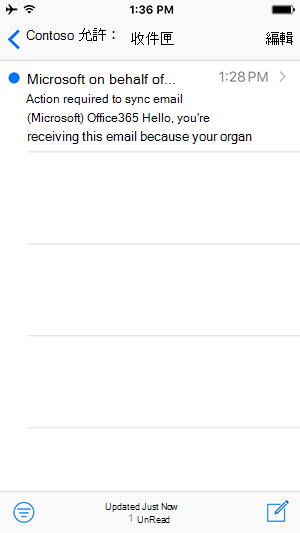

# Opzioni per accedere alla posta elettronica dal dispositivo mobileOptions for accessing email from your mobile device

L'organizzazione configura le impostazioni che controllano le app per dispositivi mobili che puoi usare per accedere all'account aziendale per posta elettronica, calendario e contatti.Your organization configures settings which control what mobile apps you can use to access your work account for email, calendar and contacts.

Le Outlook per Android e Outlook per le app per dispositivi mobili iOS sono progettate per la posta elettronica di lavoro o dell'istituto di istruzione.The Outlook for Android and Outlook for iOS mobile apps are designed for your work or school email. Queste app offrono funzionalità come [Posta](https://support.microsoft.com/office/f445ad7f-02f4-4294-a82e-71d8964e3978)in arrivo concentrata , che mantiene importanti messaggi di posta elettronica in primo piano e al centro, [e Assistente Pianificazione](https://support.microsoft.com/office/scheduling-made-easy-in-outlook-mobile-11c5bee5-d78a-4a2b-80c2-2b386ddb4470), che consente di trovare gli orari delle riunioni che lavorano con i colleghi e semplicemente di trovare sale riunioni disponibili.These apps provide features like [Focused Inbox](https://support.microsoft.com/office/f445ad7f-02f4-4294-a82e-71d8964e3978), which keeps important emails front and center, and [Scheduling Assistant](https://support.microsoft.com/office/scheduling-made-easy-in-outlook-mobile-11c5bee5-d78a-4a2b-80c2-2b386ddb4470), which helps you find meeting times that work with colleagues and simply finds available conference rooms.
  
## Esperienza utente finaleEnd user experience

### Outlook SoloOutlook Only

L'organizzazione richiede di usare il Outlook per Android o Outlook per le app per dispositivi mobili iOS per accedere alla posta elettronica, al calendario e ai contatti aziendali.Your organization requires that you use the Outlook for Android or Outlook for iOS mobile apps to access company email, calendar, and contacts. I dati inizieranno a sincronizzarsi dopo aver scaricato e installato Outlook per Android o Outlook per iOS.Your data will start syncing once you download and install Outlook for Android or Outlook for iOS.

Consulta [Ottimizzare l'Outlook per dispositivi mobili per il](https://support.microsoft.com/office/de075b19-b73c-4d8a-841b-459982c7e890) tuo telefono iOS o Android per altre Outlook funzionalità.Check out [Optimize the Outlook mobile app for your iOS or Android phone](https://support.microsoft.com/office/de075b19-b73c-4d8a-841b-459982c7e890) for more Outlook features. E vai a [Outlook per iOS e Android Help Center](https://support.microsoft.com/office/cd84214e-a5ac-4e95-9ea3-e07f78d0cde6) se si verificano problemi.And go to [Outlook for iOS and Android Help Center](https://support.microsoft.com/office/cd84214e-a5ac-4e95-9ea3-e07f78d0cde6) if you run into any issues.

### Qualsiasi app di posta elettronicaAny email app

L'organizzazione consiglia di usare l'app Outlook per dispositivi mobili Android o iOS per accedere all'account aziendale o dell'istituto di istruzione per posta elettronica, calendario e contatti.Your organization recommends that you use the Outlook for Android or iOS mobile app to access your work or school account for email, calendar, and contacts. Se non si esegue alcuna azione entro le prossime ore, la sincronizzazione del messaggio di posta elettronica inizierà automaticamente.If you don't take any action within the next few hours, your email will automatically begin syncing. Se scegli di usare l'app Outlook per dispositivi mobili Android o iOS, i dati verranno sincronizzati solo con l'app Outlook per Android o Outlook per dispositivi mobili iOS.If you choose to use the Outlook for Android or iOS mobile app, your data will only sync with the Outlook for Android or Outlook for iOS mobile app. Se scegli di continuare a usare l'app di terze parti, i dati inizieranno a sincronizzarsi immediatamente.If you choose to continue using the third-party app, your data will start to sync instantly.