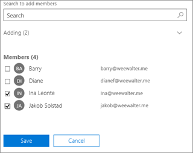

# Creare una cassetta postale condivisaCreate a shared mailbox 

> [!NOTE]
> Se l'organizzazione utilizza un ambiente Exchange ibrido, è necessario ricorrere all'interfaccia di amministrazione di Exchange per creare e gestire cassette postali condivise.If your organization uses a hybrid Exchange environment, you should use the on-premises Exchange admin center (EAC) to create and manage shared mailboxes. Vedere [Creare cassette postali condivise nell'interfaccia di amministrazione di Exchange](https://docs.microsoft.com/Exchange/collaboration/shared-mailboxes/create-shared-mailboxes?view=exchserver-2019.)See [Create shared mailboxes in the Exchange admin center](https://docs.microsoft.com/Exchange/collaboration/shared-mailboxes/create-shared-mailboxes?view=exchserver-2019.)  
> Se non si è sicuri di dover creare una cassetta postale condivisa o un gruppo di Microsoft 365 per Outlook, vedere [Confrontare i gruppi](../create-groups/compare-groups.md) per indicazioni.If you're not sure if you should create a shared mailbox or a Microsoft 365 group for Outlook, see [Compare groups](../create-groups/compare-groups.md) for some guidance. Notare che al momento non è possibile eseguire la migrazione di una cassetta postale condivisa a un gruppo di Microsoft 365.Note that currently, it's not possible to migrate a shared mailbox to a Microsoft 365 group. Se si vuole ottenere questa possibilità, inviare commenti e suggerimenti [votando qui](https://go.microsoft.com/fwlink/?linkid=871518).If this is something you want, let us know by [voting here](https://go.microsoft.com/fwlink/?linkid=871518).

Le cassette postali condivise consentono a un gruppo di persone di monitorare e inviare posta elettronica da un indirizzo di posta elettronica comune, come info@contoso.com. Quando un utente del gruppo risponde a un messaggio inviato alla cassetta postale condivisa, il messaggio di risposta sembrerà inviato dalla cassetta postale condivisa, non dal singolo utente.It's easy to create shared mailboxes so a group of people can monitor and send email from a common email addresses, like info@contoso.com. When a person in the group replies to a message sent to the shared mailbox, the email appears to be from the shared mailbox, not from the individual user.

Le cassette postali condivise includono un calendario condiviso.Shared mailboxes include a shared calendar. Sono molte le piccole aziende che trovano utile usare un calendario condiviso come posizione centralizzata in cui tutti possono inserire i propri appuntamenti.A lot of small businesses like to use the shared calendar as a place for everyone to enter their appointments. Ad esempio, se un'azienda ha 3 persone che effettuano visite presso clienti, tutte e tre possono usare il calendario condiviso per immettere gli appuntamenti.For example, if you have 3 people who do customer visits, all can use the shared calendar to enter the appointments. È un modo semplice per tenersi informati sulle reciproche posizioni.This is an easy way to keep everyone informed where people are.

Prima di creare una cassetta postale condivisa, leggere [Informazioni sulle cassette postali condivise](about-shared-mailboxes.md) per altre informazioni.Before creating a shared mailbox, be sure to read [About shared mailboxes](about-shared-mailboxes.md) for more information.

## Creare una cassetta postale condivisa e aggiungervi membriCreate a shared mailbox and add members
  
1. Effettuare l'accesso con un account amministratore globale o con un account amministratore di Exchange.Sign in with a global admin account or Exchange admin account. Se viene visualizzato il messaggio "**Non si dispone dell'autorizzazione necessaria per accedere a questa pagina o eseguire questa azione**", non si è amministratori.If you get the message "**You don't have permission to access this page or perform this action**," then you aren't an admin. 

::: moniker range="o365-worldwide"

2. Nell'interfaccia di amministrazione passare alla pagina **Gruppi** \> <a href="https://go.microsoft.com/fwlink/p/?linkid=2066847" target="_blank">Cassette postali condivise</a>.In the admin center, go to the **Groups** \> <a href="https://go.microsoft.com/fwlink/p/?linkid=2066847" target="_blank">Shared mailboxes</a> page.

::: moniker-end

::: moniker range="o365-germany"

2. Nell'[interfaccia di amministrazione](https://go.microsoft.com/fwlink/p/?linkid=848041) passare alla pagina **Gruppi** \> **Cassette postali condivise**.In the [admin center](https://go.microsoft.com/fwlink/p/?linkid=848041), go to the **Groups** \> **Shared mailboxes** page.

::: moniker-end

::: moniker range="o365-21vianet"

2. Nell'[interfaccia di amministrazione](https://go.microsoft.com/fwlink/p/?linkid=850627) passare alla pagina **Gruppi** \> **Cassette postali condivise**.In the [admin center](https://go.microsoft.com/fwlink/p/?linkid=850627), go to the **Groups** \> **Shared mailboxes** page.

::: moniker-end
    
3. Nella pagina **Cassette postali condivise** selezionare **+ Aggiungi cassetta postale**.On the **Shared mailboxes** page, select **+ Add a mailbox**. Immettere un nome per la cassetta postale condivisa.Enter a name for the shared mailbox. La procedura guidata sceglie l'indirizzo di posta elettronica, ma è possibile cambiarlo.Then the wizard chooses the email address, but you can edit it.
    
    
  
4. Selezionare **Aggiungi**.Select **Add**. Potrebbero trascorrere alcuni minuti prima che si possa iniziare ad aggiungere membri.It may take a few minutes before you can add members.

5. In **Passaggi successivi** scegliere **Aggiungere membri a questa cassetta postale**.Under **Next steps**, select **Add members to this mailbox**. I membri sono le persone che potranno visualizzare la posta in entrata in questa cassetta postale condivisa e le risposte in uscita.Members are the people who will be able to view the incoming mail to this shared mailbox, and the outgoing replies.

   

6. Selezionare il pulsante **+ Aggiungi membri**.Select the **+Add members** button. Inserire un segno di spunta accanto alle persone a cui si vuole consentire di usare la cassetta postale condivisa, quindi selezionare **Salva**.Put a check mark next to the people who you want to use this shared mailbox, and select **Save**.

   

7. Selezionare **Chiudi**.Select **Close**.

Si dispone di una cassetta postale condivisa che include un calendario condiviso.You have a shared mailbox and it includes a shared calendar. Procedere con il passaggio successivo: bloccare l'accesso per l'account della cassetta postale condivisa.Now go on to the next step: block sign-in for the shared mailbox account.

## Bloccare l'accesso per l'account della cassetta postale condivisaBlock sign-in for the shared mailbox account

Ogni cassetta postale condivisa ha un account utente corrispondente.Every shared mailbox has a corresponding user account. Anche se non è stata richiesta una password al momento della creazione della cassetta postale condivisa,Notice how you weren't asked to provide a password when you created the shared mailbox? l'account dispone di una password, ma è generata dal sistema (sconosciuta).The account has a password, but it's system-generated (unknown). Non è necessario usare l'account per accedere alla cassetta postale condivisa.You aren't supposed to use the account to log in to the shared mailbox.

Ma cosa succede se un amministratore reimposta semplicemente la password dell'account utente della cassetta postale condivisa,But what if an admin simply resets the password of the shared mailbox user account? o se un utente malintenzionato accede alle credenziali dell'account della cassetta postale condivisa?Or what if an attacker gains access to the shared mailbox account credentials? In questo modo l'account utente potrebbe accedere alla cassetta postale condivisa e inviare messaggi di posta elettronica.This would allow the user account to log in to the shared mailbox and send email. Per evitare questo problema, è necessario bloccare l'accesso per l'account associato alla cassetta postale condivisa.To prevent this, you need to block sign-in for the account that's associated with the shared mailbox.

::: moniker range="o365-worldwide"

1. Nell'interfaccia di amministrazione passare alla pagina **Utenti** \> <a href="https://go.microsoft.com/fwlink/p/?linkid=834822" target="_blank">Utenti attivi</a>.In the admin center, go to the **Users** \> <a href="https://go.microsoft.com/fwlink/p/?linkid=834822" target="_blank">Active users</a> page.

2. Nell'elenco di account utente individuare l'account della cassetta postale condivisa (ad esempio, impostare il filtro su **Utenti senza licenza**).In the list of user accounts, find the account for the shared mailbox (for example, change the filter to **Unlicensed users**).

3. Selezionare l'utente per aprire il riquadro proprietà e quindi selezionare l'icona **Bloccare l’utente** .Select the user to open their properties pane, and then select the **Block this user** icon .

   **Nota**: se l'account è già bloccato, verrà visualizzato **Accesso bloccato** nella parte superiore e sull'icona sarà scritto **Sbloccare l’utente**.**Note**: If the account is already blocked, **Sign in blocked** will appear at the top and the icon will read **Unblock this user**.

4. Nel riquadro **Bloccare l'utente?**, selezionare **Blocca l'accesso dell'utente** e quindi selezionare **Salva modifiche**.In the **Block this user?** pane, select **Block the user from signing in**, and then select **Save changes**.

::: moniker-end

::: moniker range="o365-germany"

1. Nell'interfaccia di amministrazione passare alla pagina **Utenti** \> <a href="https://go.microsoft.com/fwlink/p/?linkid=847686" target="_blank">Utenti attivi</a>.In the admin center, go to the **Users** \> <a href="https://go.microsoft.com/fwlink/p/?linkid=847686" target="_blank">Active users</a> page.

2. Nell'elenco di account utente individuare l'account della cassetta postale condivisa (ad esempio, impostare la visualizzazione su **Utenti senza licenza**) e selezionare l’account.In the list of user accounts, find the account for the shared mailbox (for example, change the view to **Unlicensed users**) and then select the account.

3. Nel riquadro a comparsa Proprietà, selezionare **Blocca l’accesso**.In the properties flyout, select **Block sign-in**.

    **Nota:** se l'account fosse già bloccato, il pulsante riporterebbe la scritta **Sblocca l’accesso**.**Note:** If the account was already blocked, the button would say **Unblock sign-in**.

4. Nel riquadro a comparsa **Modifica stato di accesso**, verificare che l'opzione Blocca l'accesso dell'utente sia selezionata, selezionare **Salva** e quindi **Chiudi**.In the **Edit sign-in status** flyout, verify that Block the user from signing in is selected, select **Save** and then **Close**.

::: moniker-end

::: moniker range="o365-21vianet"

1. Nell'interfaccia di amministrazione passare alla pagina **Utenti** \> <a href="https://go.microsoft.com/fwlink/p/?linkid=850628" target="_blank">Utenti attivi</a>.In the admin center, go to the **Users** \> <a href="https://go.microsoft.com/fwlink/p/?linkid=850628" target="_blank">Active users</a> page.

2. Nell'elenco di account utente individuare l'account della cassetta postale condivisa (ad esempio, impostare la visualizzazione su **Utenti senza licenza**) e selezionare l’account.In the list of user accounts, find the account for the shared mailbox (for example, change the view to **Unlicensed users**) and then select the account.

3. Nel riquadro a comparsa Proprietà, selezionare **Blocca l’accesso**.In the properties flyout, select **Block sign-in**.

    **Nota:** se l'account fosse già bloccato, il pulsante riporterebbe la scritta **Sblocca l’accesso**.**Note:** If the account was already blocked, the button would say **Unblock sign-in**.

4. Nel riquadro a comparsa **Modifica stato di accesso**, verificare che l'opzione Blocca l'accesso dell'utente sia selezionata, selezionare **Salva** e quindi **Chiudi**.In the **Edit sign-in status** flyout, verify that Block the user from signing in is selected, select **Save** and then **Close**.
::: moniker-end

Per istruzioni su come bloccare l'accesso per gli account con Azure AD PowerShell (anche per molti account contemporaneamente), vedere [Bloccare gli account utente con Office 365 PowerShell](https://docs.microsoft.com/office365/enterprise/powershell/block-user-accounts-with-office-365-powershell).For instructions on how to block sign-in for accounts using Azure AD PowerShell (including many accounts at the same time), see [Block user accounts with Office 365 PowerShell](https://docs.microsoft.com/office365/enterprise/powershell/block-user-accounts-with-office-365-powershell).

## Aggiungere la cassetta postale condivisa in OutlookAdd the shared mailbox to Outlook

Se nell'azienda è abilitata l'impostazione AutoMapping (per impostazione predefinita, è abilitata nella maggior parte dei casi), la cassetta postale condivisa verrà visualizzata nell'app Outlook degli utenti automaticamente dopo la chiusura e il riavvio di Outlook.If you have automapping enabled in your business (by default, most people do), the shared mailbox will appear in your user's Outlook app automatically after they close and restart Outlook. 

L'opzione AutoMapping viene impostata sulla cassetta postale dell'utente, non su quella condivisa.  Automapping is set on the user's mailbox, not the shared mailbox. Questo significa che se si cerca di usare un gruppo di sicurezza per gestire le autorizzazioni di accesso alla cassetta postale condivisa, AutoMapping non funziona.This means if you try to use a security group to manage who has access to the shared mailbox, automapping won't work. Se quindi si vuole usare questa impostazione, occorre assegnare le autorizzazioni in modo esplicito.So, if you want automapping, you have to assign permissions explicitly. L’opzione AutoMapping è attivata per impostazione predefinita.Automapping is on by default. Per informazioni su come disattivarla, vedere [Rimuovere AutoMapping per una cassetta postale condivisa](https://docs.microsoft.com/office365/troubleshoot/administration/remove-automapping-for-shared-mailbox).To learn how to turn it off, see [Remove automapping for a shared mailbox](https://docs.microsoft.com/office365/troubleshoot/administration/remove-automapping-for-shared-mailbox).

Per ulteriori informazioni sulle cassette postali condivise in Outlook, vedere:To learn more about shared mailboxes in Outlook, see:

- <a href="https://support.microsoft.com/office/d94a8e9e-21f1-4240-808b-de9c9c088afd" target="_blank">Aprire e usare cassette postali condivise in Outlook</a><a href="https://support.microsoft.com/office/d94a8e9e-21f1-4240-808b-de9c9c088afd" target="_blank">Open and use a shared mailbox in Outlook</a>

- <a href="https://support.microsoft.com/office/98b5a90d-4e38-415d-a030-f09a4cd28207" target="_blank">Aggiungere una cassetta postale condivisa in Outlook sul Web</a><a href="https://support.microsoft.com/office/98b5a90d-4e38-415d-a030-f09a4cd28207" target="_blank">Add a shared mailbox to Outlook on the web</a>

- <a href="https://support.microsoft.com/office/f866242c-81b2-472e-8776-6c49c5473c9f" target="_blank">Aggiungere una cassetta postale condivisa in Outlook per dispositivi mobili</a><a href="https://support.microsoft.com/office/f866242c-81b2-472e-8776-6c49c5473c9f" target="_blank">Add a shared mailbox to Outlook mobile</a>

- <a href="https://support.microsoft.com/office/6ecc39c5-5577-4a1d-b18c-bbdc92972cb2" target="_blank">Aprire una cartella o una cassetta postale condivisa in Outlook per Mac</a><a href="https://support.microsoft.com/office/6ecc39c5-5577-4a1d-b18c-bbdc92972cb2" target="_blank">Open a shared folder or mailbox in Outlook for Mac</a>

- <a href="https://support.microsoft.com/office/b0963400-2a51-4c64-afc7-b816d737d164" target="_blank">Aggiungere regole a una cassetta postale condivisa</a><a href="https://support.microsoft.com/office/b0963400-2a51-4c64-afc7-b816d737d164" target="_blank">Add rules to a shared mailbox</a>

## Usare una cassetta postale condivisa in un dispositivo mobile (telefono o tablet)Use a shared mailbox on a mobile device (phone or tablet)

È possibile accedere a una cassetta postale condivisa in un dispositivo mobile in due modi:You can access a shared mailbox on a mobile device in two ways:
- Aggiungere la cassetta postale condivisa nell'<a href="https://apps.apple.com/us/app/microsoft-outlook/id951937596" target="_blank">app Outlook per iOS</a> o nell'<a href="https://play.google.com/store/apps/details?id=com.microsoft.office.outlook&hl=en_US" target="_blank">app Outlook per Android per dispositivi mobili</a>.Add the shared mailbox in the <a href="https://apps.apple.com/us/app/microsoft-outlook/id951937596" target="_blank">Outlook for iOS app</a> or the <a href="https://play.google.com/store/apps/details?id=com.microsoft.office.outlook&hl=en_US" target="_blank">Outlook for Android mobile app</a>. 
    
    Per le istruzioni, vedere <a href="https://support.microsoft.com/office/f866242c-81b2-472e-8776-6c49c5473c9f" target="_blank">Aggiungere una cassetta postale condivisa in Outlook per dispositivi mobili</a>.For instructions, see <a href="https://support.microsoft.com/office/f866242c-81b2-472e-8776-6c49c5473c9f" target="_blank">Add a shared mailbox to Outlook mobile</a>.

- Aprire il browser, effettuare l'accesso e quindi passare a Outlook sul web.Open your browser, sign in, and then go to Outlook on the web. Da Outlook sul web sarà possibile accedere alla cassetta postale condivisa.From Outlook on the web you'll be able to access the shared mailbox.

    Per le istruzioni, vedere <a href="https://support.microsoft.com/office/98b5a90d-4e38-415d-a030-f09a4cd28207" target="_blank">Aggiungere una cassetta postale condivisa in Outlook sul web</a>.For instructions, see <a href="https://support.microsoft.com/office/98b5a90d-4e38-415d-a030-f09a4cd28207" target="_blank">Add a shared mailbox to Outlook on the web</a>.
    
> [!NOTE]
> La cassetta postale condivisa può essere aggiunta solo all'Outlook per iOS o all'app mobile Outlook per AndroidShared mailbox can only be added to Outlook for iOS app or the Outlook for Android mobile app

## Usare il calendario condivisoUse the shared calendar

Dopo aver creato la cassetta postale condivisa, viene creato automaticamente un calendario condiviso.When you created the shared mailbox, you automatically created a shared calendar. Il calendario della cassetta postale condivisa viene in genere preferito a un calendario di SharePoint per tenere traccia degli appuntamenti e della posizione delle persone.We like the shared mailbox calendar rather than a SharePoint calendar for keeping track of appointments and where people are. Un calendario condiviso è integrato in Outlook ed è molto più facile da usare rispetto a un calendario di SharePoint.A shared calendar is integrated with Outlook and it's much easier to use than a SharePoint calendar.

1. Nell'app Outlook passare alla visualizzazione Calendario e selezionare la cassetta postale condivisa.In the Outlook app, go to calendar view, and select the shared mailbox.

2. Quando si immette un appuntamento, ogni membro della cassetta postale condivisa potrà vederlo. When you enter appointments, everyone who is a member of the shared mailbox will be able to see them.

3. Qualsiasi membro della cassetta postale condivisa può creare, visualizzare e gestire gli appuntamenti nel calendario, come gli appuntamenti personali.Any member of the shared mailbox can create, view, and manage appointments on the calendar, just like they would their personal appointments. Tutti i membri della cassetta postale condivisa possono vedere le modifiche apportate al calendario condiviso.Everyone who is a member of shared mailbox can see their changes to the shared calendar.

## Articoli correlatiRelated articles

[Informazioni sulle cassette postali condiviseAbout shared mailboxes](about-shared-mailboxes.md)

[Configurare una cassetta postale condivisaConfigure a shared mailbox](configure-a-shared-mailbox.md)

[Convertire una cassetta postale utente in una cassetta postale condivisaConvert a user mailbox to a shared mailbox](convert-user-mailbox-to-shared-mailbox.md)

[Rimuovere una licenza da una cassetta postale condivisaRemove a license from a shared mailbox](remove-license-from-shared-mailbox.md)

[Risolvere i problemi relativi alle cassette postali condiviseResolve issues with shared mailboxes](resolve-issues-with-shared-mailboxes.md)

