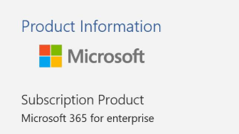

# <a name="determine-if-centralized-deployment-of-add-ins-works-for-your-organization"></a><span data-ttu-id="f33d2-103">Determinare se la distribuzione centralizzata dei componenti aggiuntivi funziona per l'organizzazione</span><span class="sxs-lookup"><span data-stu-id="f33d2-103">Determine if Centralized Deployment of add-ins works for your organization</span></span>

<span data-ttu-id="f33d2-104">La distribuzione centralizzata è il metodo consigliato e più ricco di funzionalità per la maggior parte dei clienti per distribuire i componenti aggiuntivi di Office agli utenti e ai gruppi all'interno dell'organizzazione.</span><span class="sxs-lookup"><span data-stu-id="f33d2-104">Centralized Deployment is the recommended and most feature-rich way for most customers to deploy Office add-ins to users and groups within your organization.</span></span> <span data-ttu-id="f33d2-105">Se si è un amministratore, utilizzare queste linee guida per determinare se l'organizzazione e gli utenti soddisfano i requisiti affinché sia possibile utilizzare la distribuzione centralizzata.</span><span class="sxs-lookup"><span data-stu-id="f33d2-105">If you're an admin, use this guidance to determine if your organization and users meet the requirements so that you can use Centralized Deployment.</span></span>

<span data-ttu-id="f33d2-106">La distribuzione centralizzata offre i vantaggi seguenti:</span><span class="sxs-lookup"><span data-stu-id="f33d2-106">Centralized Deployment provides the following benefits:</span></span>
  
- <span data-ttu-id="f33d2-107">Un amministratore globale può assegnare un componente aggiuntivo direttamente a un utente, a più utenti tramite un gruppo o a tutti i clienti nell'organizzazione.</span><span class="sxs-lookup"><span data-stu-id="f33d2-107">A Global admin can assign an add-in directly to a user, to multiple users via a group, or to everyone in the organization.</span></span>
    
- <span data-ttu-id="f33d2-108">Quando viene avviata l'applicazione di Office pertinente, viene scaricato automaticamente il componente aggiuntivo.</span><span class="sxs-lookup"><span data-stu-id="f33d2-108">When the relevant Office application starts, the add-in automatically downloads.</span></span> <span data-ttu-id="f33d2-109">Se il componente aggiuntivo supporta i comandi del componente aggiuntivo, il componente aggiuntivo verrà visualizzato automaticamente nella barra multifunzione all'interno dell'applicazione di Office.</span><span class="sxs-lookup"><span data-stu-id="f33d2-109">If the add-in supports add-in commands, the add-in automatically appears in the ribbon within the Office application.</span></span>
    
- <span data-ttu-id="f33d2-110">I componenti aggiuntivi non vengono più visualizzati per gli utenti se l'amministratore disattiva o Elimina il componente aggiuntivo oppure se l'utente è stato rimosso da Azure Active Directory o da un gruppo a cui è assegnato il componente aggiuntivo.</span><span class="sxs-lookup"><span data-stu-id="f33d2-110">Add-ins no longer appear for users if the admin turns off or deletes the add-in, or if the user is removed from Azure Active Directory or from a group that the add-in is assigned to.</span></span>

<span data-ttu-id="f33d2-111">La distribuzione centralizzata supporta tre piattaforme desktop Windows, Mac e le app di Office Online.</span><span class="sxs-lookup"><span data-stu-id="f33d2-111">Centralized Deployment supports three desktop platforms Windows, Mac and Online Office apps.</span></span> <span data-ttu-id="f33d2-112">La distribuzione centralizzata supporta anche iOS e Android (solo componenti aggiuntivi di Outlook Mobile).</span><span class="sxs-lookup"><span data-stu-id="f33d2-112">Centralized Deployment also supports iOS and Android (Outlook Mobile Add-ins Only).</span></span>

<span data-ttu-id="f33d2-113">È possibile richiedere fino a 24 ore affinché un componente aggiuntivo venga visualizzato per il client per tutti gli utenti.</span><span class="sxs-lookup"><span data-stu-id="f33d2-113">It can take up to 24 hours for an add-in to show up for client for all users.</span></span>
  
## <a name="requirements"></a><span data-ttu-id="f33d2-114">Requisiti</span><span class="sxs-lookup"><span data-stu-id="f33d2-114">Requirements</span></span>

<span data-ttu-id="f33d2-115">La distribuzione centralizzata dei componenti aggiuntivi richiede che gli utenti utilizzino Microsoft 365 Apps for Enterprise o Microsoft 365 Business Premium (e che siano firmati in Office utilizzando l'ID dell'organizzazione) e dispongano di cassette postali di Exchange Online e Active Exchange Online.</span><span class="sxs-lookup"><span data-stu-id="f33d2-115">Centralized deployment of add-ins requires that the users are using Microsoft 365 Apps for enterprise, or Microsoft 365 Business Premium (and are signed into Office using their organizational ID), and have Exchange Online and active Exchange Online mailboxes.</span></span> <span data-ttu-id="f33d2-116">È necessario che la directory di sottoscrizione sia in o federata in Azure Active Directory.</span><span class="sxs-lookup"><span data-stu-id="f33d2-116">Your subscription directory must either be in, or federated to Azure Active Directory.</span></span>
<span data-ttu-id="f33d2-117">È possibile visualizzare i requisiti specifici per Office ed Exchange di seguito oppure utilizzare la[Verifica compatibilità della distribuzione centralizzata](#centralized-deployment-compatibility-checker).</span><span class="sxs-lookup"><span data-stu-id="f33d2-117">You can view specific requirements for Office and Exchange below, or use the[Centralized Deployment Compatibility Checker](#centralized-deployment-compatibility-checker).</span></span>

<span data-ttu-id="f33d2-118">La distribuzione centralizzata non supporta quanto segue:</span><span class="sxs-lookup"><span data-stu-id="f33d2-118">Centralized Deployment doesn't support the following:</span></span>
  
- <span data-ttu-id="f33d2-119">Componenti aggiuntivi per Word, Excel o PowerPoint in Office 2013</span><span class="sxs-lookup"><span data-stu-id="f33d2-119">Add-ins that target Word, Excel, or PowerPoint in Office 2013</span></span> 
- <span data-ttu-id="f33d2-120">Servizio di directory locale</span><span class="sxs-lookup"><span data-stu-id="f33d2-120">An on-premises directory service</span></span>
- <span data-ttu-id="f33d2-121">Distribuzione di componenti aggiuntivi in una cassetta postale di Exchange on-Prem</span><span class="sxs-lookup"><span data-stu-id="f33d2-121">Add-in Deployment to an Exchange On-Prem Mailbox</span></span>
- <span data-ttu-id="f33d2-122">Distribuzione di componenti aggiuntivi in SharePoint</span><span class="sxs-lookup"><span data-stu-id="f33d2-122">Add-in deployment to SharePoint</span></span>  
- <span data-ttu-id="f33d2-123">App Teams</span><span class="sxs-lookup"><span data-stu-id="f33d2-123">Teams apps</span></span>
- <span data-ttu-id="f33d2-124">Distribuzione dei componenti aggiuntivi Component Object Model (COM) o Visual Studio Tools per Office (VSTO)</span><span class="sxs-lookup"><span data-stu-id="f33d2-124">Deployment of Component Object Model (COM) or Visual Studio Tools for Office (VSTO) add-ins</span></span>
- <span data-ttu-id="f33d2-125">Distribuzioni di Microsoft 365 che non includono Exchange, ad esempio Microsoft 365 Apps for business</span><span class="sxs-lookup"><span data-stu-id="f33d2-125">Deployments of Microsoft 365 that do not include Exchange such as Microsoft 365 Apps for business</span></span>

### <a name="office-requirements"></a><span data-ttu-id="f33d2-126">Requisiti di Office</span><span class="sxs-lookup"><span data-stu-id="f33d2-126">Office Requirements</span></span>

- <span data-ttu-id="f33d2-127">Per i componenti aggiuntivi di Word, Excel e PowerPoint, è necessario che gli utenti utilizzino uno dei seguenti elementi:</span><span class="sxs-lookup"><span data-stu-id="f33d2-127">For Word, Excel, and PowerPoint add-ins, your users must be using one of the following:</span></span>
  - <span data-ttu-id="f33d2-128">Su un dispositivo Windows, versione 1704 o successiva di Microsoft 365 Apps for Enterprise, o Microsoft 365 Business Premium.</span><span class="sxs-lookup"><span data-stu-id="f33d2-128">On a Windows device, Version 1704 or later of Microsoft 365 Apps for enterprise, or Microsoft 365 Business Premium.</span></span>
  - <span data-ttu-id="f33d2-129">Su un Mac, versione 15,34 o successiva.</span><span class="sxs-lookup"><span data-stu-id="f33d2-129">On a Mac, Version 15.34 or later.</span></span>

- <span data-ttu-id="f33d2-130">Per Outlook, è necessario che gli utenti utilizzino una delle opzioni seguenti:</span><span class="sxs-lookup"><span data-stu-id="f33d2-130">For Outlook, your users must be using one of the following:</span></span> 
  - <span data-ttu-id="f33d2-131">Versione 1701 o successiva di Microsoft 365 Apps for Enterprise o Microsoft 365 Business Premium.</span><span class="sxs-lookup"><span data-stu-id="f33d2-131">Version 1701 or later of Microsoft 365 Apps for enterprise, or Microsoft 365 Business Premium.</span></span>
  - <span data-ttu-id="f33d2-132">Versione 1808 o successiva di Office Professional Plus 2019 o Office standard 2019.</span><span class="sxs-lookup"><span data-stu-id="f33d2-132">Version 1808 or later of Office Professional Plus 2019 or Office Standard 2019.</span></span>
  - <span data-ttu-id="f33d2-133">Version 16.0.4494.1000 o versione successiva di Office Professional Plus 2016 (MSI) o Office standard 2016 (MSI)\*</span><span class="sxs-lookup"><span data-stu-id="f33d2-133">Version 16.0.4494.1000 or later of Office Professional Plus 2016 (MSI) or Office Standard 2016 (MSI)\*</span></span>
  - <span data-ttu-id="f33d2-134">Version 15.0.4937.1000 o versione successiva di Office Professional Plus 2013 (MSI) o Office Standard 2013 (MSI)\*</span><span class="sxs-lookup"><span data-stu-id="f33d2-134">Version 15.0.4937.1000 or later of Office Professional Plus 2013 (MSI) or Office Standard 2013 (MSI)\*</span></span>
  - <span data-ttu-id="f33d2-135">Version 16.0.9318.1000 o versione successiva di Office 2016 per Mac</span><span class="sxs-lookup"><span data-stu-id="f33d2-135">Version 16.0.9318.1000 or later of Office 2016 for Mac</span></span> 
- <span data-ttu-id="f33d2-136">Version 2.75.0 o versione successiva di Outlook Mobile per iOS</span><span class="sxs-lookup"><span data-stu-id="f33d2-136">Version 2.75.0 or later of Outlook mobile for iOS</span></span> 
- <span data-ttu-id="f33d2-137">Version 2.2.145 o versione successiva di Outlook Mobile per Android</span><span class="sxs-lookup"><span data-stu-id="f33d2-137">Version 2.2.145 or later of Outlook mobile for Android</span></span> 
    
    <span data-ttu-id="f33d2-138">\* Le versioni MSI di Outlook visualizzano i componenti aggiuntivi installati dall'amministratore nella barra multifunzione di Outlook appropriata e non nella sezione "componenti aggiuntivi".</span><span class="sxs-lookup"><span data-stu-id="f33d2-138">\*MSI versions of Outlook show admin-installed add-ins in the appropriate Outlook ribbon, not the "My add-ins" section.</span></span>
    

#### <a name="find-out-if-microsoft-365-apps-for-enterprise-is-installed"></a><span data-ttu-id="f33d2-139">Scoprire se Microsoft 365 Apps for Enterprise è installato</span><span class="sxs-lookup"><span data-stu-id="f33d2-139">Find out if Microsoft 365 Apps for enterprise is installed</span></span>

<span data-ttu-id="f33d2-140">Per utilizzare Microsoft 365 Apps for Enterprise, un utente deve disporre di un account Microsoft 365 e deve disporre di una licenza.</span><span class="sxs-lookup"><span data-stu-id="f33d2-140">To use Microsoft 365 Apps for enterprise, a user must have an Microsoft 365 account and must have been assigned a license.</span></span> <span data-ttu-id="f33d2-141">Per ulteriori informazioni, vedere [Overview of Microsoft 365 Apps for Enterprise](https://go.microsoft.com/fwlink/p/?linkid=846328).</span><span class="sxs-lookup"><span data-stu-id="f33d2-141">For more information, see [Overview of Microsoft 365 Apps for enterprise](https://go.microsoft.com/fwlink/p/?linkid=846328).</span></span>

<span data-ttu-id="f33d2-142">Il modo più semplice per rilevare se un utente ha installato Microsoft 365 Apps for Enterprise e lo ha utilizzato di recente consiste nell'utilizzare il rapporto attivazioni di Microsoft Office, disponibile nell'interfaccia di amministrazione di Microsoft 365.</span><span class="sxs-lookup"><span data-stu-id="f33d2-142">The simplest way to detect if a user has Microsoft 365 Apps for enterprise installed and has been using it recently is to use the Microsoft Office Activations report, which is available in the Microsoft 365 admin center.</span></span> <span data-ttu-id="f33d2-143">Il rapporto fornisce un elenco di tutti gli utenti che hanno attivato Microsoft 365 Apps for Enterprise negli ultimi 7 giorni, 30 giorni, 90 o 180 giorni.</span><span class="sxs-lookup"><span data-stu-id="f33d2-143">The report provides a list of all users who have activated Microsoft 365 Apps for enterprise within the last 7 days, 30 days, 90 days, or 180 days.</span></span> <span data-ttu-id="f33d2-144">Ai fini della distribuzione centralizzata, le attivazioni desktop per Windows o Mac rappresentano le colonne più importanti del report.</span><span class="sxs-lookup"><span data-stu-id="f33d2-144">For centralized deployment purposes, the desktop activations for Windows or Mac are the important columns in the report.</span></span> <span data-ttu-id="f33d2-145">È possibile esportare il report in Excel.</span><span class="sxs-lookup"><span data-stu-id="f33d2-145">You can export the report to Excel.</span></span> <span data-ttu-id="f33d2-146">Per ulteriori informazioni sul report, vedere [rapporti microsoft 365 nell'interfaccia di amministrazione-attivazioni di Microsoft Office](../activity-reports/microsoft-office-activations.md).</span><span class="sxs-lookup"><span data-stu-id="f33d2-146">For more information about the report, see [Microsoft 365 Reports in the Admin Center - Microsoft Office activations](../activity-reports/microsoft-office-activations.md).</span></span>
  
<span data-ttu-id="f33d2-147">Se non si desidera utilizzare il rapporto attivazioni, è possibile chiedere a un utente di aprire un'applicazione di Office come Word nel computer in uso e quindi scegliere **File** \> **account**file.</span><span class="sxs-lookup"><span data-stu-id="f33d2-147">If you don't want to use the Activations report, you can ask a user to open an Office application such as Word on their machine, and then choose **File** \> **Account**.</span></span> <span data-ttu-id="f33d2-148">In **informazioni sui prodotti**, dovrebbe essere visualizzato il **prodotto di sottoscrizione** e **Microsoft 365 per Enterprise**, o Microsoft 365 Business Premium, analogo a quello mostrato nell'immagine seguente.</span><span class="sxs-lookup"><span data-stu-id="f33d2-148">Under **Product Information**, you should see **Subscription Product** and **Microsoft 365 for enterprise**,or Microsoft 365 Business Premium, similar to what is shown in the following image.</span></span>


  
<span data-ttu-id="f33d2-150">Per informazioni su Microsoft 365 Apps for Enterprise, vedere [Troubleshooting Tips for microsoft 365 Apps for Enterprise](https://go.microsoft.com/fwlink/p/?linkid=846339).</span><span class="sxs-lookup"><span data-stu-id="f33d2-150">For help with Microsoft 365 Apps for enterprise, see [Troubleshooting tips for Microsoft 365 Apps for enterprise](https://go.microsoft.com/fwlink/p/?linkid=846339).</span></span>


### <a name="exchange-online-requirements"></a><span data-ttu-id="f33d2-151">Requisiti di Exchange Online</span><span class="sxs-lookup"><span data-stu-id="f33d2-151">Exchange Online requirements</span></span>

<span data-ttu-id="f33d2-152">Microsoft Exchange archivia i manifesti del componente aggiuntivo all'interno del tenant dell'organizzazione.</span><span class="sxs-lookup"><span data-stu-id="f33d2-152">Microsoft Exchange stores the add-in manifests within your organization's tenant.</span></span> <span data-ttu-id="f33d2-153">Gli amministratori che distribuiscono i componenti aggiuntivi e gli utenti che ricevono i componenti aggiuntivi devono trovarsi in una versione di Exchange Online che supporta l'autenticazione OAuth.</span><span class="sxs-lookup"><span data-stu-id="f33d2-153">The admin deploying add-ins and the users receiving those add-ins must be on a version of Exchange Online that supports OAuth authentication.</span></span>
  
<span data-ttu-id="f33d2-p109">Contattare l'amministratore di Exchange dell'organizzazione per sapere quale configurazione è in uso. La connettività OAuth per ogni utente può essere verificata usando il cmdlet di PowerShell [Test-OAuthConnectivity](https://go.microsoft.com/fwlink/p/?linkid=846351).</span><span class="sxs-lookup"><span data-stu-id="f33d2-p109">Check with your organization's Exchange admin to find out which configuration is in use. OAuth connectivity per user can be verified by using the [Test-OAuthConnectivity](https://go.microsoft.com/fwlink/p/?linkid=846351) PowerShell cmdlet.</span></span> 


### <a name="centralized-deployment-compatibility-checker"></a><span data-ttu-id="f33d2-156">Verifica compatibilità della distribuzione centralizzata</span><span class="sxs-lookup"><span data-stu-id="f33d2-156">Centralized Deployment Compatibility Checker</span></span>

<span data-ttu-id="f33d2-157">Tramite Verifica compatibilità della distribuzione centralizzata, è possibile verificare se gli utenti del tenant sono configurati per l'utilizzo della distribuzione centralizzata per Word, Excel e PowerPoint.</span><span class="sxs-lookup"><span data-stu-id="f33d2-157">Using the Centralized Deployment Compatibility Checker, you can verify whether the users on your tenant are set up to use Centralized Deployment for Word, Excel and PowerPoint.</span></span> <span data-ttu-id="f33d2-158">Verifica compatibilità non è necessario per il supporto di Outlook.</span><span class="sxs-lookup"><span data-stu-id="f33d2-158">The Compatibility Checker is not required for Outlook support.</span></span> <span data-ttu-id="f33d2-159">Scaricare Verifica compatibilità [qui](https://aka.ms/officeaddindeploymentorgcompatibilitychecker).</span><span class="sxs-lookup"><span data-stu-id="f33d2-159">Download the compatibility checker [here](https://aka.ms/officeaddindeploymentorgcompatibilitychecker).</span></span>
  
#### <a name="run-the-compatibility-checker"></a><span data-ttu-id="f33d2-160">Esecuzione di verifica compatibilità</span><span class="sxs-lookup"><span data-stu-id="f33d2-160">Run the compatibility checker</span></span>
  
1. <span data-ttu-id="f33d2-161">Avviare una finestra di PowerShell.exe con privilegi elevati.</span><span class="sxs-lookup"><span data-stu-id="f33d2-161">Start an elevated PowerShell.exe window.</span></span>
    
2. <span data-ttu-id="f33d2-162">Eseguire il comando seguente:</span><span class="sxs-lookup"><span data-stu-id="f33d2-162">Run the following command:</span></span>

   ```powershell
   Import-Module O365CompatibilityChecker
   ```
    
3. <span data-ttu-id="f33d2-163">Eseguire il comando **Invoke-CompatabilityCheck** :</span><span class="sxs-lookup"><span data-stu-id="f33d2-163">Run the **Invoke-CompatabilityCheck** command:</span></span>

   ```powershell
   Invoke-CompatibilityCheck
   ```
   <span data-ttu-id="f33d2-164">Questo comando richiede di  *_TenantDomain_* (ad esempio, *TailspinToysIncorporated. onmicrosoft. </span> com*) e le credenziali di  *_TenantAdmin_* (utilizzare le credenziali di amministratore globale) e quindi richiede il consenso.</span><span class="sxs-lookup"><span data-stu-id="f33d2-164">This command prompts you for  *_TenantDomain_* (for example, *TailspinToysIncorporated.onmicrosoft.</span>com*) and  *_TenantAdmin_* credentials (use your global admin credentials), and then requests consent.</span></span>
    
   > [!NOTE]
   > <span data-ttu-id="f33d2-165">A seconda del numero di utenti nel tenant, la verifica potrebbe richiedere minuti o ore.</span><span class="sxs-lookup"><span data-stu-id="f33d2-165">Depending on the number of users in your tenant, the checker could complete in minutes or hours.</span></span> 
  
<span data-ttu-id="f33d2-166">Al termine dell'esecuzione dello strumento, viene generato un file di output in formato CSV (valori separati da virgola).</span><span class="sxs-lookup"><span data-stu-id="f33d2-166">When the tool finishes running, it produces an output file in comma-separated (.csv) format.</span></span> <span data-ttu-id="f33d2-167">Il file viene salvato in **C:\Windows\System32** per impostazione predefinita.</span><span class="sxs-lookup"><span data-stu-id="f33d2-167">The file is saved to **C:\windows\system32** by default.</span></span> <span data-ttu-id="f33d2-168">Il file di output contiene le informazioni seguenti:</span><span class="sxs-lookup"><span data-stu-id="f33d2-168">The output file contains the following information:</span></span>
  
- <span data-ttu-id="f33d2-169">Nome utente</span><span class="sxs-lookup"><span data-stu-id="f33d2-169">User Name</span></span>
    
- <span data-ttu-id="f33d2-170">ID utente (indirizzo di posta elettronica dell'utente)</span><span class="sxs-lookup"><span data-stu-id="f33d2-170">User ID (User's email address)</span></span>
    
- <span data-ttu-id="f33d2-171">Distribuzione centralizzata pronta: se gli elementi rimanenti sono veri</span><span class="sxs-lookup"><span data-stu-id="f33d2-171">Centralized Deployment ready - If the remaining items are true</span></span>
    
- <span data-ttu-id="f33d2-172">Piano di Office: il piano di Office in cui sono concessi in licenza</span><span class="sxs-lookup"><span data-stu-id="f33d2-172">Office plan - The plan of Office they are licensed for</span></span>
    
- <span data-ttu-id="f33d2-173">Office attivato: se Office è stato attivato</span><span class="sxs-lookup"><span data-stu-id="f33d2-173">Office Activated - If they have activated Office</span></span>
    
- <span data-ttu-id="f33d2-174">Cassetta postale supportata: se la cassetta postale è abilitata per OAuth</span><span class="sxs-lookup"><span data-stu-id="f33d2-174">Supported Mailbox - If they are on an OAuth-enabled mailbox</span></span>


  
## <a name="user-and-group-assignments"></a><span data-ttu-id="f33d2-175">Assegnazioni di utenti e gruppi</span><span class="sxs-lookup"><span data-stu-id="f33d2-175">User and group assignments</span></span>

<span data-ttu-id="f33d2-176">La funzionalità di distribuzione centralizzata supporta attualmente la maggior parte dei gruppi supportati da Azure Active Directory, inclusi i gruppi di Microsoft 365, le liste di distribuzione e i gruppi di sicurezza.</span><span class="sxs-lookup"><span data-stu-id="f33d2-176">The Centralized Deployment feature currently supports the majority of groups supported by Azure Active Directory, including Microsoft 365 groups, distribution lists, and security groups.</span></span>
  
> [!NOTE]
> <span data-ttu-id="f33d2-177">I gruppi di sicurezza non abilitati alla posta elettronica non sono attualmente supportati.</span><span class="sxs-lookup"><span data-stu-id="f33d2-177">Non-mail enabled security groups are not currently supported.</span></span> 
  
<span data-ttu-id="f33d2-178">La distribuzione centralizzata supporta le assegnazioni a singoli utenti, gruppi e tutti i clienti del tenant.</span><span class="sxs-lookup"><span data-stu-id="f33d2-178">Centralized Deployment supports assignments to individual users, groups, and everyone in the tenant.</span></span> <span data-ttu-id="f33d2-179">La distribuzione centralizzata supporta gli utenti in gruppi di primo livello o in gruppi senza gruppi padre, ma non gli utenti in gruppi annidati o in gruppi con gruppi padre.</span><span class="sxs-lookup"><span data-stu-id="f33d2-179">Centralized Deployment supports users in top-level groups or groups without parent groups, but not users in nested groups or groups that have parent groups.</span></span>
   
<span data-ttu-id="f33d2-p113">Esaminare l'esempio seguente, in cui Valeria, Pupetta e il gruppo Reparto vendite vengono assegnati a un componente aggiuntivo. Reparto vendite costa occidentale è un gruppo annidato, quindi Gianni e Albertino non sono assegnati a un componente aggiuntivo.</span><span class="sxs-lookup"><span data-stu-id="f33d2-p113">Take a look at the following example where Sandra, Sheila, and the Sales Department group are assigned to an add-in. Because the West Coast Sales Department is a nested group, Bert and Fred aren't assigned to an add-in.</span></span>
  


   
### <a name="find-out-if-a-group-contains-nested-groups"></a><span data-ttu-id="f33d2-183">Scoprire se un gruppo contiene gruppi annidati</span><span class="sxs-lookup"><span data-stu-id="f33d2-183">Find out if a group contains nested groups</span></span>

<span data-ttu-id="f33d2-184">Il modo più semplice per rilevare se un gruppo contiene gruppi annidati consiste nel visualizzare la scheda contatto del gruppo in Outlook.</span><span class="sxs-lookup"><span data-stu-id="f33d2-184">The easiest way to detect if a group contains nested groups is to view the group contact card within Outlook.</span></span> <span data-ttu-id="f33d2-185">Se si immette il nome del gruppo all'interno del campo **a** di un messaggio di posta elettronica e quindi si seleziona il nome del gruppo quando viene risolto, verrà visualizzato se contiene utenti o gruppi nidificati.</span><span class="sxs-lookup"><span data-stu-id="f33d2-185">If you enter the group name within the **To** field of an email and then select the group name when it resolves, it will show you if it contains users or nested groups.</span></span> <span data-ttu-id="f33d2-186">Nell'esempio seguente la scheda **Membri** della scheda contatto di Outlook per il gruppo di test non visualizza utenti e contiene solo due sottogruppi.</span><span class="sxs-lookup"><span data-stu-id="f33d2-186">In the example below, the **Members** tab of the Outlook contact card for the Test Group shows no users and only two sub groups.</span></span> 
  

  
<span data-ttu-id="f33d2-p115">È possibile eseguire la query opposta risolvendo il gruppo per vedere se è un membro di un gruppo. Nell'esempio seguente nella scheda **Appartenenza** della scheda contatto di Outlook si vede che il sottogruppo 1 è un membro del gruppo di test.</span><span class="sxs-lookup"><span data-stu-id="f33d2-p115">You can do the opposite query by resolving the group to see if it's a member of any group. In the example below, you can see under the **Membership** tab of the Outlook contact card that Sub Group 1 is a member of the Test Group.</span></span> 
  

  
<span data-ttu-id="f33d2-p116">In alternativa, è possibile usare l'API di Azure Active Directory Graph per eseguire query per trovare l'elenco dei gruppi all'interno di un gruppo. Per altre informazioni, vedere [Operazioni su gruppi | Riferimento API Graph](https://go.microsoft.com/fwlink/p/?linkid=846342).</span><span class="sxs-lookup"><span data-stu-id="f33d2-p116">Alternately, you can use the Azure Active Directory Graph API to run queries to find the list of groups within a group. For more information, see [Operations on groups | Graph API reference](https://go.microsoft.com/fwlink/p/?linkid=846342).</span></span>
  
### <a name="contacting-microsoft-for-support"></a><span data-ttu-id="f33d2-193">Contattare Microsoft per assistenza</span><span class="sxs-lookup"><span data-stu-id="f33d2-193">Contacting Microsoft for support</span></span>

<span data-ttu-id="f33d2-194">Se l'utente o gli utenti riscontrano problemi durante il caricamento del componente aggiuntivo utilizzando le app di Office per il Web (Word, Excel e così via), che sono state distribuite in modo centralizzato, potrebbe essere necessario contattare il supporto tecnico Microsoft ([informazioni su come](../contact-support-for-business-products.md)).</span><span class="sxs-lookup"><span data-stu-id="f33d2-194">If you or your users encounter problems loading the add-in while using Office apps for the web (Word, Excel, etc.), which were centrally deployed, you may need to contact Microsoft support ([learn how](../contact-support-for-business-products.md)).</span></span> <span data-ttu-id="f33d2-195">Fornire le seguenti informazioni sull'ambiente Microsoft 365 nel ticket di supporto.</span><span class="sxs-lookup"><span data-stu-id="f33d2-195">Provide the following information about your Microsoft 365 environment in the support ticket.</span></span>
  
|<span data-ttu-id="f33d2-196">**Piattaforma**</span><span class="sxs-lookup"><span data-stu-id="f33d2-196">**Platform**</span></span>|<span data-ttu-id="f33d2-197">**Informazioni di debug**</span><span class="sxs-lookup"><span data-stu-id="f33d2-197">**Debug information**</span></span>|
|:-----|:-----|
|<span data-ttu-id="f33d2-198">Ufficio</span><span class="sxs-lookup"><span data-stu-id="f33d2-198">Office</span></span>  <br/> | <span data-ttu-id="f33d2-199">Log di Charles/Fiddler</span><span class="sxs-lookup"><span data-stu-id="f33d2-199">Charles/Fiddler logs</span></span>  <br/>  <span data-ttu-id="f33d2-200">ID tenant ( [informazioni](https://docs.microsoft.com/onedrive/find-your-office-365-tenant-id.aspx))</span><span class="sxs-lookup"><span data-stu-id="f33d2-200">Tenant ID ( [learn how](https://docs.microsoft.com/onedrive/find-your-office-365-tenant-id.aspx))</span></span>  <br/>  <span data-ttu-id="f33d2-201">CorrelationId.</span><span class="sxs-lookup"><span data-stu-id="f33d2-201">CorrelationID.</span></span> <span data-ttu-id="f33d2-202">Visualizzare l'origine di una delle pagine di Office e cercare il valore dell'ID correlazione e inviarlo al supporto:</span><span class="sxs-lookup"><span data-stu-id="f33d2-202">View the source of one of the office pages and look for the Correlation ID value and send it to support:</span></span>  <br/>`<input name=" **wdCorrelationId**" type="hidden" value=" **{BC17079E-505F-3000-C177-26A8E27EB623}**">`  <br/>  `<input name="user_id" type="hidden" value="1003bffd96933623"></form>`  <br/> |
|<span data-ttu-id="f33d2-203">Rich client (Windows, Mac)</span><span class="sxs-lookup"><span data-stu-id="f33d2-203">Rich clients (Windows, Mac)</span></span>  <br/> | <span data-ttu-id="f33d2-204">Log di Charles/Fiddler</span><span class="sxs-lookup"><span data-stu-id="f33d2-204">Charles/Fiddler logs</span></span>  <br/>  <span data-ttu-id="f33d2-205">Creare numeri dell'app client (preferibilmente come schermata da **file/account**)</span><span class="sxs-lookup"><span data-stu-id="f33d2-205">Build numbers of the client app (preferably as a screenshot from **File/Account**)</span></span>  <br/> |
   

