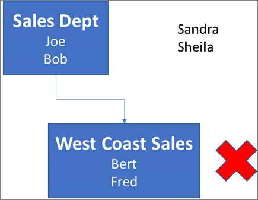
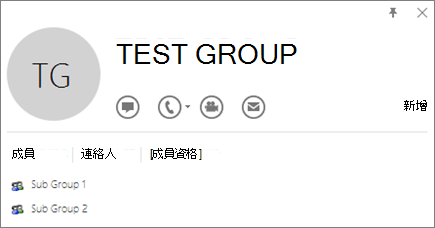
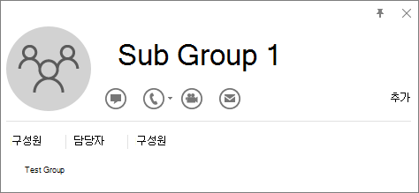

# <a name="determine-if-centralized-deployment-of-add-ins-works-for-your-organization"></a>Determinare se la distribuzione centralizzata dei componenti aggiuntivi funziona per l'organizzazione

La distribuzione centralizzata è il modo consigliato e più ricco di funzionalità per la maggior parte dei clienti di distribuire componenti aggiuntivi di Office a utenti e gruppi all'interno dell'organizzazione. Se sei un amministratore, usa queste indicazioni per determinare se l'organizzazione e gli utenti soddisfano i requisiti in modo da poter usare la distribuzione centralizzata.

La distribuzione centralizzata offre i vantaggi seguenti:
  
- Un amministratore globale può assegnare un componente aggiuntivo direttamente a un utente, a più utenti tramite un gruppo o a tutti gli utenti dell'organizzazione.
    
- All'avvio dell'applicazione di Office rilevante, il componente aggiuntivo viene scaricato automaticamente. Se il componente aggiuntivo supporta i comandi del componente aggiuntivo, il componente aggiuntivo verrà visualizzato automaticamente nella barra multifunzione all'interno dell'applicazione di Office.
    
- I componenti aggiuntivi non vengono più visualizzati per gli utenti se l'amministratore disattiva o elimina il componente aggiuntivo oppure se l'utente viene rimosso da Azure Active Directory o da un gruppo a cui è assegnato il componente aggiuntivo.

La distribuzione centralizzata supporta tre piattaforme desktop Windows, Mac e app di Office online. La distribuzione centralizzata supporta anche iOS e Android (solo componenti aggiuntivi per Outlook Mobile).

La visualizzazione di un componente aggiuntivo per tutti gli utenti può richiedere fino a 24 ore.
  
## <a name="requirements"></a>Requisiti

Per la distribuzione centralizzata dei componenti aggiuntivi è necessario che gli utenti utilizzino SKU Di Microsoft 365 Enterprise: E3/E5/F3 o SKU aziendali: Business Basic, Business Standard, Business Premium (e sono connessi a Office utilizzando l'ID dell'organizzazione) e disporre di cassette postali di Exchange Online e di Exchange Online attive. La directory di sottoscrizione deve essere in o federata in Azure Active Directory.
È possibile visualizzare i requisiti specifici per Office ed Exchange di seguito oppure utilizzare Verifica compatibilità [distribuzione centralizzata.](#centralized-deployment-compatibility-checker)

La distribuzione centralizzata non supporta quanto segue:
  
- Componenti aggiuntivi per Word, Excel o PowerPoint in Office 2013 
- Servizio di directory locale
- Distribuzione di componenti aggiuntivi in una cassetta postale locale di Exchange
- Distribuzione di componenti aggiuntivi in SharePoint  
- App di Teams
- Distribuzione di componenti aggiuntivi COM (Component Object Model) o Visual Studio Tools for Office (VSTO).
- Distribuzioni di Microsoft 365 che non includono Exchange Online, ad esempio SKU: Microsoft 365 Apps for Business e Microsoft 365 Apps for Enterprise.

### <a name="office-requirements"></a>Requisiti di Office

- Per i componenti aggiuntivi di Word, Excel e PowerPoint, gli utenti devono utilizzare uno dei componenti seguenti:
  - In un dispositivo Windows, versione 1704 o successiva delle SKU di Microsoft 365 Enterprise: E3/E5/F3 o SKU aziendali: Business Basic, Business Standard, Business Premium.
  - In un Mac, versione 15.34 o successiva.

- Per Outlook, gli utenti devono utilizzare una delle opzioni seguenti: 
  - Versione 1701 o successiva delle SKU di Microsoft 365 Enterprise: E3/E5/F3 o SKU aziendali: Business Basic, Business Standard, Business Premium.
  - Versione 1808 o successiva di Office Professional Plus 2019 o Office Standard 2019.
  - Versione 16.0.4494.1000 o successiva di Office Professional Plus 2016 (MSI) o Office Standard 2016 (MSI)\*
  - Versione 15.0.4937.1000 o successiva di Office Professional Plus 2013 (MSI) o Office Standard 2013 (MSI)\*
  - Versione 16.0.9318.1000 o successiva di Office 2016 per Mac 
- Versione 2.75.0 o successiva di Outlook mobile per iOS 
- Versione 2.2.145 o successiva di Outlook mobile per Android 
    
    *Le versioni MSI di Outlook mostrano i componenti aggiuntivi installati dall'amministratore nella barra multifunzione di Outlook appropriata, non nella sezione "Componenti aggiuntivi".

### <a name="exchange-online-requirements"></a>Requisiti di Exchange Online

Microsoft Exchange archivia i manifesti dei componenti aggiuntivi all'interno del tenant dell'organizzazione. L'amministratore che distribuisce i componenti aggiuntivi e gli utenti che ricevono tali componenti aggiuntivi devono essere in una versione di Exchange Online che supporta l'autenticazione OAuth.
  
Contattare l'amministratore di Exchange dell'organizzazione per sapere quale configurazione è in uso. La connettività OAuth per ogni utente può essere verificata usando il cmdlet di PowerShell [Test-OAuthConnectivity](/powershell/module/exchange/test-oauthconnectivity). 


### <a name="centralized-deployment-compatibility-checker"></a>Verifica compatibilità distribuzione centralizzata

Tramite Verifica compatibilità distribuzione centralizzata è possibile verificare se gli utenti del tenant sono impostati per l'utilizzo della distribuzione centralizzata per Word, Excel e PowerPoint. Verifica compatibilità non è necessario per il supporto di Outlook. Scaricare Verifica compatibilità [qui](https://aka.ms/officeaddindeploymentorgcompatibilitychecker).
  
#### <a name="run-the-compatibility-checker"></a>Eseguire Verifica compatibilità
  
1. Avviare una finestra PowerShell.exe elevata.
    
2. Eseguire il comando qui riportato:

   ```powershell
   Import-Module O365CompatibilityChecker
   ```
    
3. Eseguire il **comando Invoke-CompatabilityCheck:**

   ```powershell
   Invoke-CompatibilityCheck
   ```
   Questo comando richiede di specificare  *_TenantDomain,_* ad esempio *TailspinToysIncorporated.onmicrosoft. </span> com*)  *_e Le credenziali TenantAdmin_* (usare le credenziali di amministratore globale) e quindi richiede il consenso.
    
   > [!NOTE]
   > A seconda del numero di utenti nel tenant, la verifica potrebbe richiedere minuti o ore. 
  
Al termine dell'esecuzione dello strumento, viene generato un file di output in formato CSV (valori separati da virgola). Il file viene salvato in **C:\windows\system32** per impostazione predefinita. Il file di output contiene le informazioni seguenti:
  
- Nome utente
    
- ID utente (indirizzo di posta elettronica dell'utente)
    
- Distribuzione centralizzata pronta: se gli elementi rimanenti sono veri
    
- Piano di Office - Piano di Office per cui sono concessi in licenza
    
- Office attivato: se Office è stato attivato
    
- Cassetta postale supportata: se la cassetta postale è abilitata per OAuth

> [!NOTE]
> L'autenticazione a più fattori non è supportata quando si utilizza il modulo PowerShell per la distribuzione centrale.
  
## <a name="user-and-group-assignments"></a>Assegnazioni di utenti e gruppi

La funzionalità distribuzione centralizzata attualmente supporta la maggior parte dei gruppi supportati da Azure Active Directory, inclusi i gruppi di Microsoft 365, le liste di distribuzione e i gruppi di sicurezza.
  
> [!NOTE]
> I gruppi di sicurezza non abilitati alla posta elettronica non sono attualmente supportati. 
  
La distribuzione centralizzata supporta le assegnazioni a singoli utenti, gruppi e a tutti gli utenti del tenant. La distribuzione centralizzata supporta gli utenti in gruppi di primo livello o in gruppi senza gruppi padre, ma non gli utenti in gruppi annidati o in gruppi con gruppi padre.
   
Esaminare l'esempio seguente, in cui Valeria, Pupetta e il gruppo Reparto vendite vengono assegnati a un componente aggiuntivo. Reparto vendite costa occidentale è un gruppo annidato, quindi Gianni e Albertino non sono assegnati a un componente aggiuntivo.
  


   
### <a name="find-out-if-a-group-contains-nested-groups"></a>Scoprire se un gruppo contiene gruppi annidati

Il modo più semplice per rilevare se un gruppo contiene gruppi annidati consiste nel visualizzare la scheda contatto del gruppo in Outlook. Se si immette il nome del gruppo nel campo **A** di un messaggio di posta elettronica e quindi si seleziona il nome del gruppo quando viene risolto, verrà visualizzato se contiene utenti o gruppi annidati. Nell'esempio seguente la scheda **Membri** della scheda contatto di Outlook per il gruppo di test non visualizza utenti e contiene solo due sottogruppi. 
  

  
È possibile eseguire la query opposta risolvendo il gruppo per vedere se è un membro di un gruppo. Nell'esempio seguente nella scheda **Appartenenza** della scheda contatto di Outlook si vede che il sottogruppo 1 è un membro del gruppo di test. 
  

  
In alternativa, è possibile usare l'API di Azure Active Directory Graph per eseguire query per trovare l'elenco dei gruppi all'interno di un gruppo. Per altre informazioni, vedere [Operazioni su gruppi | Riferimento API Graph](/previous-versions/azure/ad/graph/api/groups-operations).
  
### <a name="contacting-microsoft-for-support"></a>Contattare Microsoft per assistenza

Se l'utente o gli utenti riscontrano problemi durante il caricamento del componente aggiuntivo durante l'utilizzo delle app di Office per il Web (Word, Excel e così via), che sono state distribuite centralmente, potrebbe essere necessario contattare il supporto Tecnico Microsoft[(](../contact-support-for-business-products.md)informazioni su come ). Fornisci le informazioni seguenti sull'ambiente Microsoft 365 nel ticket di supporto.
  
|**Piattaforma**|**Informazioni di debug**|
|:-----|:-----|
|Ufficio  <br/> | Log di Charles/Fiddler  <br/>  ID tenant ( [informazioni](/onedrive/find-your-office-365-tenant-id.aspx))  <br/>  CorrelationID. Visualizzare l'origine di una delle pagine di Office e cercare il valore id correlazione e inviarlo al supporto:  <br/>`<input name=" **wdCorrelationId**" type="hidden" value=" **{BC17079E-505F-3000-C177-26A8E27EB623}**">`  <br/>  `<input name="user_id" type="hidden" value="1003bffd96933623"></form>`  <br/> |
|Rich client (Windows, Mac)  <br/> | Log di Charles/Fiddler  <br/>  Numeri di build dell'app client (preferibilmente come screenshot da **File/Account)**  <br/> |
