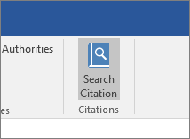

# Gestire la distribuzione dei componenti aggiuntivi nell'interfaccia di amministrazione di Microsoft 365

::: moniker range="o365-21vianet"

> [!NOTE]
> L'interfaccia di amministrazione sta cambiando. Se alcuni dettagli non corrispondono a quelli presentati qui, vedere [Informazioni sulla nuova interfaccia di amministrazione di Microsoft 365](https://docs.microsoft.com/microsoft-365/admin/microsoft-365-admin-center-preview?view=o365-21vianet).

::: moniker-end

I componenti aggiuntivi di Office consentono di personalizzare i documenti e semplificare la modalità di accesso alle informazioni sul Web (vedere [iniziare a utilizzare il componente aggiuntivo di Office](https://support.office.com/article/82e665c4-6700-4b56-a3f3-ef5441996862.aspx)). Come amministratore, è possibile distribuire i componenti aggiuntivi di Office per gli utenti dell'organizzazione. È possibile eseguire questa operazione utilizzando la caratteristica di distribuzione centralizzata nell'interfaccia di amministrazione di Microsoft 365.
  
La distribuzione centralizzata è il metodo consigliato e più ricco di funzionalità per la maggior parte degli amministratori per la distribuzione di componenti aggiuntivi per utenti e gruppi all'interno di un'organizzazione. Per ulteriori informazioni su come determinare se l'organizzazione è in grado di supportare la distribuzione centralizzata, vedere [determinare se la distribuzione centralizzata dei componenti aggiuntivi funziona per l'organizzazione](centralized-deployment-of-add-ins.md).
  
La distribuzione centralizzata offre i vantaggi seguenti:
  
- Un amministratore globale può assegnare un componente aggiuntivo direttamente a un utente, a più utenti tramite un gruppo o a tutti i clienti del tenant.
    
- All'avvio dell'applicazione di Office rilevante, il componente aggiuntivo viene scaricato automaticamente per l'utente. Se il componente aggiuntivo supporta i comandi dell'interfaccia, viene automaticamente visualizzato nella barra multifunzione all'interno dell'applicazione di Office.
    
- I componenti aggiuntivi non verranno più visualizzati per gli utenti se l'amministratore disattiva o Elimina il componente aggiuntivo oppure se l'utente è stato rimosso da Azure Active Directory o da un gruppo a cui è assegnato il componente aggiuntivo.
    
> [!NOTE]
>  Per Word, Excel e PowerPoint utilizzano un [Catalogo app di SharePoint](https://dev.office.com/docs/add-ins/publish/publish-task-pane-and-content-add-ins-to-an-add-in-catalog) per distribuire i componenti aggiuntivi per gli utenti in un ambiente locale senza alcuna connessione a Microsoft 365 e/o il supporto per i componenti aggiuntivi di SharePoint necessari. > per Outlook utilizzare il pannello di controllo di Exchange per la distribuzione in un ambiente locale senza una connessione a Microsoft 365. > 
  
## Approccio consigliato per la distribuzione dei componenti aggiuntivi per Office

È consigliabile distribuire i componenti aggiuntivi in un approccio in fasi per essere certi che la distribuzione dei componenti aggiuntivi proceda correttamente. Ecco il piano consigliato:
  
1. Distribuire il componente aggiuntivo in un gruppo ristretto di stakeholder dell'azienda e di membri del reparto IT. Valutare se la distribuzione è riuscita e, in caso affermativo, passare al passaggio 2.
    
2. Eseguire la distribuzione in un set più ampio di persone all'interno dell'azienda che useranno il componente aggiuntivo. Valutare di nuovo i risultati e, se sono tutti positivi, andare al passaggio successivo per la distribuzione completa.
    
3. Distribuire completamente all'intero gruppo di destinatari.
    
A seconda delle dimensioni del gruppo di destinatari, si possono aggiungere o rimuovere i passaggi della distribuzione.
  
## Distribuire un componente aggiuntivo di Office utilizzando l'interfaccia di amministrazione

Prima di iniziare, vedere [determinare se la distribuzione centralizzata dei componenti aggiuntivi funziona per l'organizzazione](centralized-deployment-of-add-ins.md).

  
1. Nell'interfaccia di amministrazione, andare alla pagina dei componenti aggiuntivi di **Impostazioni** \> **Add-ins** .
    
2. Selezionare **Distribuisci componente aggiuntivo nella** parte superiore della pagina. Nella pagina Panoramica selezionare **Avanti**.
    
3. Seleziona un'opzione e segui le istruzioni.
  
4. Se è stata selezionata l'opzione per aggiungere un componente aggiuntivo da Office Store, è ora possibile effettuare la selezione del componente aggiuntivo. È possibile visualizzare i componenti aggiuntivi disponibili con le categorie **Consigliato per te**, **Valutazione** o **Nome**. Solo i componenti aggiuntivi gratuiti possono essere aggiunti dall'Office Store. Quelli a pagamento non sono al momento supportati. Dopo aver selezionato il componente aggiuntivo, è necessario accettare alcuni termini e condizioni aggiuntivi per poter procedere.    Nota: con l'opzione Office Store, gli aggiornamenti e i miglioramenti apportati al componente aggiuntivo verranno resi disponibili automaticamente agli utenti senza l'intervento dell'utente.

5. Nella pagina successiva selezionare **tutti**, **utenti/gruppi specifici** o **solo me** per specificare l'utente a cui è distribuito il componente aggiuntivo. Usare la casella di ricerca per trovare gli utenti o i gruppi a cui distribuire il componente aggiuntivo.  Nota: informazioni sugli altri Stati che si applicano a un componente aggiuntivo. Vedere [Stati dei componenti aggiuntivi](#add-in-states) più avanti in questo argomento.
  
6. Fare clic su **Distribuisci**.
  
7. Quando il componente aggiuntivo è stato distribuito, verrà visualizzato un segno di spunta verde. È possibile seguire le istruzioni visualizzate nella pagina per verificare che il componente aggiuntivo sia stato distribuito correttamente.

> [!NOTE]
> Gli utenti potrebbero dover rilanciare Office per visualizzare l'icona del componente aggiuntivo sulla barra multifunzione di app. I componenti aggiuntivi di Outlook possono richiedere fino a 12 ore per essere visualizzati sui nastri degli utenti.
    
8. Al termine, selezionare **Avanti**. Se è stata distribuita solo da solo, è possibile selezionare **cambia chi ha accesso al componente aggiuntivo** per la distribuzione a più utenti.

Se il componente aggiuntivo è stato distribuito ai membri dell'organizzazione diversi da te, seguire le istruzioni visualizzate per annunciare efficacemente la distribuzione del componente aggiuntivo.  È ora possibile visualizzare il componente aggiuntivo insieme ad altre app in Microsoft 365.
  
È consigliabile informare gli utenti e i gruppi che è stato distribuito il componente aggiuntivo in modo che sappiano che è disponibile. È opportuno inviare un messaggio di posta elettronica che descrive quando e come usare il componente aggiuntivo e che spiega in che modo può aiutarli a svolgere il proprio lavoro. Includere o collegare al contenuto della Guida pertinente o alle domande frequenti che potrebbero essere utili se gli utenti hanno problemi con il componente aggiuntivo.
  
### Considerazioni per l'assegnazione di un componente aggiuntivo a utenti e gruppi

Gli amministratori possono assegnare un componente aggiuntivo a tutti gli utenti o a gruppi e utenti specifici. Ogni opzione ha delle implicazioni:
  
- **Tutti**: Come suggerisce il nome, questa opzione assegna il componente aggiuntivo a tutti gli utenti nel tenant. Usare questa opzione con moderazione e solo per i componenti aggiuntivi che effettivamente servono a tutti gli utenti dell'organizzazione. 
    
- **Utenti**: se si assegna un componente aggiuntivo a un singolo utente, per distribuirlo a un nuovo utente è necessario prima aggiungere l'utente. Lo stesso vale per la rimozione degli utenti. 
    
- **Gruppi**: se si assegna un componente aggiuntivo a un gruppo, il componente aggiuntivo verrà assegnato automaticamente agli utenti aggiunti al gruppo. Inoltre, quando un utente viene rimosso da un gruppo, perde l'accesso al componente aggiuntivo. In entrambi i casi, gli amministratori non devono eseguire altre azioni. 

- **Solo me**: se si assegna un componente aggiuntivo solo a te stesso, questo assegna il componente aggiuntivo solo al tuo account. Questo è l'ideale se si desidera testare il componente aggiuntivo per primo.
    
L'opzione adatta per l'organizzazione dipende dalla configurazione. Tuttavia, è consigliabile effettuare le assegnazioni con i gruppi. Per gli amministratori può essere più semplice gestire i componenti aggiuntivi con i gruppi, controllando l'appartenenza a tali gruppi, invece di modificare ogni volta gli utenti assegnati. In alcune situazioni, invece, può essere utile limitare l'accesso a un piccolo set di utenti, effettuando le assegnazioni a utenti specifici. Di conseguenza, sarà necessario gestire le assegnazioni agli utenti manualmente.
  
### Stati dei componenti aggiuntivi

Un componente aggiuntivo può **essere nello stato attivato o** **disattivato** .
  
|**Stato**|**Quando si verifica lo stato**|**Impatto**|
|:-----|:-----|:-----|
|**Attivazione**    |L'amministratore ha caricato il componente aggiuntivo e lo ha assegnato a utenti o gruppi.    |Gli utenti e i gruppi assegnati al componente aggiuntivo lo vedono nei client pertinenti.    |
|**Disattivato**    |L'amministratore ha disattivato il componente aggiuntivo.    |Gli utenti e i gruppi assegnati al componente aggiuntivo non possono più accedervi.    Se lo stato del componente aggiuntivo viene modificato su Attivo, gli utenti e i gruppi potranno accedervi di nuovo.    |
|**Eliminato**    |L'amministratore ha eliminato il componente aggiuntivo.    |Gli utenti e i gruppi assegnati al componente aggiuntivo non possono più accedervi.    |
   
Se non è più in uso, è consigliabile eliminare un componente aggiuntivo. Disattivare un componente aggiuntivo può essere utile se viene usato solo in determinati periodi dell'anno.
  
### Sicurezza dei componenti aggiuntivi per Office

I componenti aggiuntivi per Office combinano un file manifesto XML che contiene alcuni metadati sul componente aggiuntivo, ma soprattutto che punta a un'applicazione Web che contiene tutto il codice e la logica. Le funzionalità dei componenti aggiuntivi possono variare. Ad esempio, i componenti aggiuntivi possono:
  
- Visualizzare i dati.
    
- Leggere il documento di un utente per offrire servizi contestuali.
    
- Leggere e scrivere dati da e verso il documento di un utente per fornire valore all'utente.
    
Per altre informazioni sui tipi e le funzionalità dei componenti aggiuntivi per Office, vedere [Panoramica della piattaforma Componenti aggiuntivi per Office](https://go.microsoft.com/fwlink/p/?linkid=846362), in particolare la sezione "Anatomia di un componente aggiuntivo per Office".
  
Per interagire con il documento dell'utente, il componente aggiuntivo deve dichiarare il tipo di autorizzazione necessario nel manifesto. Un modello di autorizzazioni di accesso per API JavaScript con cinque livelli costituisce la base per la privacy e la sicurezza degli utenti per i componenti aggiuntivi del riquadro attività. La maggior parte dei componenti aggiuntivi in Office Store sono di livello ReadWriteDocument e quasi tutti i componenti aggiuntivi supportano almeno il livello ReadDocument. Per altre informazioni sui livelli di autorizzazione, vedere [Richiesta di autorizzazioni per l'uso di API nei componenti aggiuntivi del contenuto e del riquadro attività](https://go.microsoft.com/fwlink/p/?linkid=848863).
  
Quando si aggiorna un manifesto, le modifiche tipiche riguardano l'icona e il testo di un componente aggiuntivo. In alcuni casi, vengono modificati i comandi del componente aggiuntivo. Tuttavia, le autorizzazioni del componente aggiuntivo non cambiano. L'applicazione Web in cui viene eseguito tutto il codice e la logica per il componente aggiuntivo può essere modificata in qualsiasi momento, come accade per tutte le applicazioni Web.
  
Gli aggiornamenti per i componenti aggiuntivi vengono eseguiti come segue:
  
- **Componente aggiuntivo line-of-business:** In questo caso, in cui un amministratore ha caricato in modo esplicito un manifesto, il componente aggiuntivo richiede che l'amministratore carichi un file manifesto nuovo per supportare le modifiche dei metadati. All'avvio successivo delle applicazioni di Office rilevanti, il componente aggiuntivo verrà aggiornato. L'applicazione Web può essere modificata in qualsiasi momento. 

    > [!NOTE]
    > Non è necessario che l'amministratore elimini un componente aggiuntivo LOB per eseguire un aggiornamento.   Nella sezione componenti aggiuntivi, l'amministratore può semplicemente fare clic sul componente aggiuntivo LOB e scegliere il **pulsante Aggiorna** nell'angolo in basso a destra. L'aggiornamento funzionerà solo se la versione del nuovo componente aggiuntivo è maggiore di quella del componente aggiuntivo esistente.   
    
- **Componente aggiuntivo di Office Store:** Se un amministratore ha selezionato un componente aggiuntivo da Office Store e questo viene aggiornato in Office Store, il componente aggiuntivo verrà aggiornato in un secondo momento nella distribuzione centralizzata. All'avvio successivo delle applicazioni di Office rilevanti, il componente aggiuntivo verrà aggiornato. L'applicazione Web può essere modificata in qualsiasi momento. 

### Modificare l'accesso del componente aggiuntivo

Dopo la distribuzione, gli amministratori possono anche modificare l'accesso degli utenti ai componenti aggiuntivi.

1. Nell'interfaccia di amministrazione passare alla pagina **Impostazioni**  >  **& componenti** aggiuntivi.

2. Selezionare il componente aggiuntivo distribuito.

3. Fare clic su **modifica** in **chi ha accesso**.
4. Salvare le modifiche.
    
### Impedisci download del componente aggiuntivo disattivando l'archivio di Office in tutti i client (eccetto Outlook)

> [!NOTE]
> L'installazione del componente aggiuntivo di Outlook è gestita da un [processo diverso](https://technet.microsoft.com/library/jj943754%28v=exchg.150%29.aspx).

Come organizzazione, è possibile che si desideri impedire il download di nuovi componenti aggiuntivi di Office dall'Office Store. Questo può essere utilizzato insieme alla distribuzione centralizzata per garantire che vengano distribuiti solo i componenti aggiuntivi approvati dall'organizzazione per gli utenti all'interno dell'organizzazione.
  
Per disattivare l'acquisizione del componente aggiuntivo:
  
1. Nell'interfaccia di amministrazione passare a **Impostazioni** \> [Servizi &amp; componenti aggiuntivi](https://go.microsoft.com/fwlink/p/?linkid=2053743).
    
3. Selezionare **le app e i servizi posseduti dall'utente**.
    
4. Cancellare l'opzione per consentire agli utenti di accedere a Office Store.

In questo modo tutti gli utenti potranno acquistare i componenti aggiuntivi seguenti dall'archivio.
  
- Componenti aggiuntivi per Word, Excel e PowerPoint 2016 da:
    
  - Windows
    
  - Mac
    
  - Ufficio
    
    
- Acquisizioni che iniziano all'interno di **AppSource**
    
- Componenti aggiuntivi in Microsoft 365
    
Un utente che cerca di accedere all'archivio vedrà il messaggio seguente: **Microsoft 365 è stato configurato per impedire l'acquisizione individuale dei componenti aggiuntivi di Office Store.**
  
Il supporto per la disattivazione di Office Store è disponibile nelle versioni seguenti:
  
- Windows: 16.0.9001-attualmente disponibile.
    
- Mac: 16.10.18011401-attualmente disponibile.
    
- iOS: 2.9.18010804-attualmente disponibile.
    
- Il Web-attualmente disponibile.
    
Questo non impedisce a un amministratore di utilizzare la distribuzione centralizzata per assegnare un componente aggiuntivo da Office Store.
  
Per impedire a un utente di accedere con un account Microsoft, è possibile limitare l'accesso per utilizzare solo l'account dell'organizzazione. Per ulteriori informazioni, vedere [qui](https://technet.microsoft.com/library/jj683102%28v=office.16%29.aspx).
 
  
## Minorenni e acquisizione di componenti aggiuntivi dallo Store

Il regolamento generale sulla protezione dei dati (GDPR) è un regolamento dell'Unione europea che diventerà efficace il 25 maggio 2018. Attribuisce ai diritti degli utenti e alla protezione dei dati. Uno degli aspetti della GDPR è che i minorenni non possono avere i dati personali inviati alle terze parti che il loro genitore o tutore non ha approvato. L'età specifica definita come minorenne dipende dall'area geografica in cui si trova l'individuo.
  
Le regioni che dispongono di regole statutarie sul consenso dei genitori sono gli Stati Uniti, la Corea del sud, il Regno Unito e l'Unione europea. Per queste aree, un minorenne verrà bloccato (tramite Azure Active Directory) dall'acquisizione di nuovi componenti aggiuntivi di Office dall'archivio e dall'esecuzione di componenti aggiuntivi acquisiti in precedenza. Per i paesi senza regole statutarie non sono previste restrizioni per il download.
  
Un utente è determinato a essere un minorenne in base ai dati specificati in Azure Active Directory. L'amministratore del tenant è responsabile della dichiarazione del gruppo di età legale e del consenso dei genitori per tale utente.
  
Se l'elemento padre/tutore acconsente a un minorenne utilizzando un componente aggiuntivo specifico, l'amministratore del tenant può utilizzare la distribuzione centralizzata per distribuire il componente aggiuntivo a tutti i minorenni che dispongono di un consenso.
  
Per essere conformi a GDPR per i minorenni, è necessario assicurarsi che una delle seguenti build di Office venga distribuita nella propria scuola/organizzazione.
  
 **Per Word, Excel, PowerPoint e Project**: 
  
|||
|:-----|:-----|
|**Piattaforma**   |**Numero di build**   |
|Microsoft 365 Apps for Enterprise (canale corrente)    |9001,2138     |
|Microsoft 365 Apps for Enterprise (canale semestrale per l'organizzazione)    |8431,2159    |
|Office 2016 per Windows    |16.0.4672.1000    |
|Office 2013 per Windows    |15.0.5023.1000    |
|Office 2016 per Mac    |16.11.18020200    |
|Office per il Web    |N/D    |
   
 **Per Outlook**: 
  
|||
|:-----|:-----|
|**Piattaforma**   |**Numero di build**   |
|Outlook 2016 per Windows (MSI)    |Build no TBD    |
|Outlook 2016 per Windows (C2R)    |16.0.9323.1000    |
|Office 2016 per Mac    |16.0.9318.1000    |
|Outlook Mobile per iOS    |2.75.0    |
|Outlook Mobile per Android    |2.2.145    |
|Outlook.com    |N/D    |
   
 **Requisiti di Office 2013**
  
Word, Excel e PowerPoint 2013 per Windows supportano gli stessi controlli secondari se è abilitata la libreria di autenticazione di Active Directory (ADAL). Sono disponibili due opzioni per la conformità, come illustrato di seguito.
  
- **Abilitare adal**. In questo articolo viene illustrato come abilitare ADAL per Office 2013: [utilizzo dell'autenticazione moderna di Microsoft 365 con i client di Office](https://docs.microsoft.com/office365/enterprise/modern-auth-for-office-2013-and-2016). È inoltre necessario impostare le chiavi del registro di sistema per abilitare ADAL come spiegato in [Enable Modern Authentication for Office 2013 on Windows Devices](../security-and-compliance/enable-modern-authentication.md). Inoltre, è necessario installare gli aggiornamenti di aprile seguenti per Office 2013:
    
  - [Descrizione dell'aggiornamento della sicurezza per Office 2013:10 aprile 2018](https://support.microsoft.com/help/4018330/description-of-the-security-update-for-office-2013-april-10-2018)
    
  - [2018 aprile 3, aggiornamento per Office 2013 (KB4018333)](https://support.microsoft.com/help/4018333/april-3-2018-update-for-office-2013-kb4018333)
    
- **Non abilitare adal**. Se non si è in grado di abilitare ADAL in Office 2013, è consigliabile utilizzare criteri di gruppo per disattivare l'archivio per i client di Office. Informazioni su come disattivare l'app per le impostazioni di Office si trova [qui](https://technet.microsoft.com/library/cc178992.aspx).
    
## Esperienza dell'utente finale con i componenti aggiuntivi

In seguito alla distribuzione del componente aggiuntivo gli utenti finali possono iniziare a usarlo nelle proprie applicazioni di Office. Vedere [Iniziare a usare il componente aggiuntivo per Office](https://support.office.com/article/82e665c4-6700-4b56-a3f3-ef5441996862.aspx). Il componente aggiuntivo verrà visualizzato in tutte le piattaforme che supporta.
  
Se il componente aggiuntivo supporta i comandi dell'interfaccia, questi vengono visualizzati sulla barra multifunzione di Office. Nell'esempio seguente il comando **Cerca citazione** viene visualizzato per il componente aggiuntivo **Citazioni**. 

  
Se il componente aggiuntivo distribuito non supporta i comandi del componente aggiuntivo o se si desidera visualizzare tutti i componenti aggiuntivi distribuiti, è possibile visualizzarli tramite i **componenti**aggiuntivi. 
  
### In Word 2016, Excel 2016 o PowerPoint 2016

1. Selezionare **Inserisci \> i componenti**aggiuntivi. 
    
2. Selezionare la scheda **Gestito dall'amministratore** nella finestra Componenti aggiuntivi per Office. 
    
3. Fare doppio clic sul componente aggiuntivo distribuito in precedenza, in questo esempio **Citazioni**.  
  
### In Outlook

1. Nella barra multifunzione **Home** selezionare **Ricevi componenti**aggiuntivi. 
  
2. Selezionare **gestito dall'amministratore** nel NAV sinistro.

## Eliminare il componente aggiuntivo

È inoltre possibile eliminare un componente aggiuntivo distribuito.

1. Nell'interfaccia di amministrazione passare alla pagina **Impostazioni**  >  **& componenti** aggiuntivi.

2. Selezionare il componente aggiuntivo distribuito.

3. Fare clic su **Elimina componente aggiuntivo**. Rimuovere il pulsante del componente aggiuntivo nell'angolo in basso a destra.
4. Convalidare le selezioni e scegliere **Rimuovi componente aggiuntivo**.
  
## Altre informazioni

Altre informazioni sulla creazione e sulla compilazione dei [componenti aggiuntivi per Office](https://go.microsoft.com/fwlink/p/?linkid=846362).
  
[Utilizzare i cmdlet di PowerShell per la distribuzione centralizzata per gestire i componenti](https://docs.microsoft.com/office365/enterprise/use-the-centralized-deployment-powershell-cmdlets-to-manage-add-ins)aggiuntivi.
  
[Risoluzione dei problemi: utenti che non vedono componenti aggiuntivi](https://docs.microsoft.com/office365/troubleshoot/access-management/user-not-seeing-add-ins)
