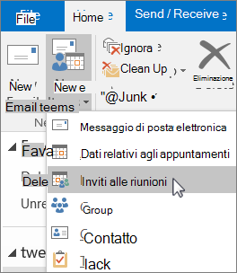
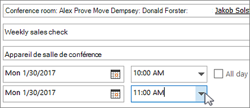
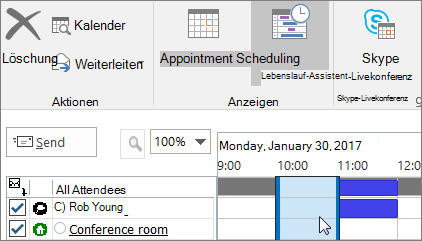
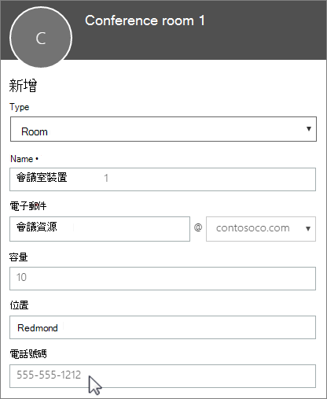

# Cassette postali della sala e attrezzaturaRoom and equipment mailboxes

Se si hanno risorse a disposizione di tutti, ad esempio sale riunioni, auto aziendali o attrezzature, occorre un modo per permettere a tutti di prenotarle. Il modo migliore per farlo consiste nel creare una cassetta postale sala o attrezzatura in Office 365 per ogni risorsa. Se ne può creare una per la sala riunioni al primo piano, per le attrezzature multimediali oppure per un camion.If you have a conference room, company car, or equipment that everyone needs to use, then you need to come up with a way to make those resources reservable to everyone. The best way to do that is to create a room or equipment mailbox in Office 365 for each resource. You might create one for your first floor conference room, media equipment, or a moving truck.
  
Dopo aver creato una cassetta postale sala o attrezzatura, tutti gli utenti aziendali potranno prenotarla per riunioni o eventi usando Outlook. Le prossime due schede ne spiegano l'**uso** e la **configurazione**. Ecco alcune altre domande frequenti sulle cassette postali sala e attrezzatura.Once you create a room or equipment mailbox, everyone in the company can reserve it for meetings or events using Outlook. Learn **how to use it** and **how to set it up** on the next two tabs. Here are some other common questions about room and equipment mailboxes. 
  
## Usare cassette postali della sala e dell’attrezzaturaUse room and equipment mailboxes

Per usare le cassette postali sala o attrezzatura, aprire Outlook dal computer o accedere a Outlook sul Web. Pianificare una nuova riunione e aggiungere la sala o l'attrezzatura alla riunione come si farebbe per invitare altri dipendenti o clienti. A questo punto la risorsa è stata prenotata.To use room or equipment mailboxes, open Outlook from your computer or sign in to Outlook on the web. Schedule a new meeting and add the room or equipment to the meeting like you would when inviting other employees or customers. You've now reserved it.
  
1. Aprire **Outlook** nel computer.Open **Outlook** on your computer. 
    
2. Nella scheda **Home** scegliere **Nuovi elementi** \> **Riunione**.On the **Home** tab, choose **New Items** \> **Meeting**.  In alternativa, selezionare semplicemente **Nuova riunione** nel Calendario.Or, from your Calendar, just select **New Meeting**.
    
3. Nel campo A digitare il nome della sala riunioni o dell'attrezzatura da prenotare, oltre a quelli dei partecipanti che si vogliono invitare.In the To field, type the name of the conference room or equipment you want to reserve, in addition to any attendees you'd like to invite. In alternativa, selezionare **A** e quindi fare doppio clic sulla sala riunioni o l'attrezzatura nell'elenco.Or, select **To** then double-click the conference room or equipment from the list. Infine scegliere **OK**.Then select **OK**. 
  
4. Nella riga **Oggetto** digitare lo scopo della prenotazione o della riunione.In the **Subject** line, type the purpose of the reservation or meeting. 
    
5. Modificare il valore **Luogo** o lasciarlo invariato.Change the **Location** value or leave as is. 
    
6. Modificare **Ora inizio** e **Ora fine**.Change the **Start time** and **End time**. In alternativa, selezionare **Evento giornata intera**.Or, select **All day event**. Per rendere la riunione o la prenotazione ricorrente, selezionare **Ricorrenza** nella parte superiore.To make the meeting or reservation repeat, select **Recurrence** at the top. 
  
7. Digitare un messaggio di descrizione dello scopo e allegare gli eventuali file necessari.Type a message describing the purpose and attach any files if needed.
    
8. Per consentire ad altri di partecipare alla riunione online o tramite telefono, selezionare **Riunione Skype**.To allow others to join online or call in to the meeting, select **Skype Meeting**.
    
9. Per assicurarsi che la sala, l'attrezzatura e le persone invitate siano disponibili, selezionare **Regole Pianificazione** nella parte superiore.To make sure the room, equipment, and people you've invited are available, select **Scheduling Assistant** at the top. Quindi, selezionare un orario disponibile nel calendario.Then select an available time in the calendar.   SUGGERIMENTO: nel calendario di pianificazione, blu indica che la sala o l'attrezzatura è prenotata o occupata.TIP: In the scheduling calendar, blue means the room or equipment is reserved, or busy. Selezionare l'area bianca (libera) nel calendario.Select the white, or free, area on the calendar. 
  
10. Al termine, selezionare **Invia**.When finished, select **Send**.
    
## Configurare le cassette postali della sala e dell’attrezzaturaSet up room and equipment mailboxes

Per configurare una cassetta postale sala o attrezzatura, passare all'interfaccia di amministrazione di Microsoft 365.To set up a room or equipment mailbox, go to the Microsoft 365 admin center. Per eseguire questa operazione è necessario disporre di autorizzazioni di amministratore. Creare la cassetta postale e comunicare a tutti che possono iniziare a prenotarla per riunioni ed eventi.(You'll need to have admin permission to do this.) Create the mailbox and let everyone know they can start reserving it for meetings and events.
  
1. Nell'interfaccia di amministrazione di passare alla pagina **Risorse** \> [Sale &amp; Attrezzatura](https://go.microsoft.com/fwlink/p/?linkid=2067334).In the admin center, go to the **Resources** \> [Rooms &amp; equipment](https://go.microsoft.com/fwlink/p/?linkid=2067334) page.
  
2. Seleziona **Aggiungi**.Select **Add**.
    
3. Compilare i campi della sala o attrezzatura:Fill out the room or equipment fields:  
  
  - **Sala** o **Attrezzatura**: tipo di cassetta postale che si vuole creare.**Room** or **Equipment**: the type of mailbox you'd like to create.
    
  - **Nome**: nome descrittivo o descrizione breve.**Name**: a friendly name or even short description.
    
  - **Posta elettronica**: alias di posta elettronica della sala o attrezzatura. È necessario per inviare una convocazione di riunione alla sala o attrezzatura.**Email**: the email alias of the room or equipment. This is necessary to send a meeting request to the room or equipment.
    
  - **Capacità**: numero di persone che la sala può contenere o che possono usare l'attrezzatura contemporaneamente.**Capacity**: the number of people who can fit in the room or use the equipment at the same time.
    
  - **Luogo**: numero della sala o posizione della sala in un edificio o un'area geografica.**Location**: the room number or location of the room in a building or region.
    
  - **Numero di telefono**: il numero della sala stessa. È diverso dal numero di telefono della riunione generato quando si usa Skype for Business.**Phone number**: the number of the room itself. This is different from the meeting phone number generated when using Skype for Business.
    
4. Seleziona **Aggiungi**.Select **Add**.
    
5. Selezionare la cassetta postale sala o attrezzatura appena creata per visualizzare o modificare i dettagli.Select the room or equipment mailbox you created to see or edit the details.
  
6. Se sono state apportate modifiche, selezionare **Salva** e quindi **Chiudi**.If you made changes, select **Save** and then **Close**.

> [!Note]
> Per mantenere al sicuro le cassette postali sala e attrezzatura, bloccare l'accesso a queste cassette postali.To keep your room and equipment mailboxes secure, block sign-in to these mailboxes. Per altre informazioni, vedere [Bloccare l'accesso per l'account della cassetta postale condivisa](https://docs.microsoft.com/office365/admin/email/create-a-shared-mailbox?view=o365-worldwide#block-sign-in-for-the-shared-mailbox-account).For more information, see [Block sign-in for the shared mailbox account](https://docs.microsoft.com/office365/admin/email/create-a-shared-mailbox?view=o365-worldwide#block-sign-in-for-the-shared-mailbox-account).

## Domande frequenti sulle cassette postali sala e attrezzaturaCommon questions about room and equipment mailboxes

### Come è possibile verificare se la sala o l'attrezzatura è disponibile?How can you tell when the room or equipment is available?

Aprire Outlook e creare una nuova riunione.Open Outlook and create a new meeting. Aggiungere la sala o l'attrezzatura alla riunione come se si trattasse di una persona e selezionare **Regole Pianificazione** per una visualizzazione Calendario in tempo reale della disponibilità della sala o dell'attrezzatura.Add the room or equipment to the meeting as if it were a person and select **Scheduling Assistant** to see a live calendar view of the room or equipment's availability. Se la fascia oraria di interesse è bianca è disponibile, se è blu è prenotata.If the hour slot is clear, it's available; if it's blue, it's reserved. 
  
### Come si annulla una richiesta di sala o attrezzatura?How do you cancel a room or equipment request?

Aprire la riunione pianificata in Outlook e quindi rimuovere la sala o l'attrezzatura dalla riunione come si farebbe per un partecipante. La risorsa verrà liberata in modo che altri possano prenotarla.Open the meeting you scheduled in Outlook and then remove the room or equipment from the meeting like you would an attendee. This will free up the room for others to reserve.
  
### È necessario che qualcuno accetti o rifiuti ogni richiesta di sala o attrezzatura?Does someone have to accept or decline every room or equipment request?

 No, non occorre che qualcuno accetti o rifiuti le richieste. È possibile decidere se lasciare la sala o l'attrezzatura prenotata automaticamente o se lasciarla gestire da un utente dell'organizzazione.No, you don't need someone to accept or decline requests. You can decide whether you want to let the room or equipment be automatically booked or managed by someone in your company. 
  
### Per una cassetta postale della sala o una cassetta postale attrezzatura è necessaria una licenza del prodotto?Does a room mailbox or equipment mailbox need a product license?

No. Anche se per la maggior parte degli utenti dell'organizzazione è necessaria una licenza per usare Office 365, non è necessario assegnare una licenza a una cassetta postale della sala o a una cassetta postale attrezzatura.No. While most people in your organization need a license to use Office 365, you don't need to assign a license to a room mailbox or equipment mailbox.
  
### È necessario definire un proprietario incaricato di prenotare sale e attrezzatura?Do I need an owner in charge of booking the rooms or equipment?

 No, non è necessario indicare un utente incaricato per la cassetta postale della sala o la cassetta postale attrezzatura.No, you don't need someone in charge of the room mailbox or equipment mailbox. 
