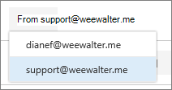

# Inviare messaggi di posta elettronica come lista di distribuzioneSend email as a distribution list

In Microsoft 365, è possibile inviare messaggi di posta elettronica come lista di distribuzione.In Microsoft 365, you can send email as a distribution list. Quando una persona che fa parte della lista di distribuzione risponde a un messaggio inviato alla lista di distribuzione, la posta elettronica sembra provenire dalla lista di distribuzione, non dal singolo utente.When a person who is a member of the distribution list replies to a message sent to the distribution list, the email appears to be from the distribution list, not from the individual user. In questo argomento viene illustrato come eseguire questa operazione.This topic shows you how to do this.
  
## Inviare messaggi di posta elettronica come lista di distribuzioneSend email as a distribution list

Prima di eseguire questa procedura, verificare di essere stati aggiunti a una lista di distribuzione di Microsoft 365 ed è stata concessa l'autorizzazione Invia come su di esso.Before you perform these steps, make sure you've been added to a Microsoft 365 distribution list and you've have been granted Send as permission on it.
  
 **Amministratori**: assicurarsi di aver seguito i passaggi riportati nell' [elenco Aggiungi un utente o un contatto di Microsoft 365](../email/add-user-or-contact-to-distribution-list.md) e consentire ai [membri di inviare messaggi di posta elettronica come argomenti di gruppo di Microsoft 365](../create-groups/allow-members-to-send-as-or-send-on-behalf-of-group.md#allow-members-to-send-email-as-a-group) e di aggiungere gli utenti corretti alla lista di distribuzione.**Admins**: Make sure you've followed the steps in the [Add a Microsoft 365 user or contact to a list](../email/add-user-or-contact-to-distribution-list.md) and [Allow members to send email as a Microsoft 365 Group](../create-groups/allow-members-to-send-as-or-send-on-behalf-of-group.md#allow-members-to-send-email-as-a-group) topics, and added the correct people to the distribution list.
  
1. Aprire Outlook sul Web e passare alla posta in arrivo.Open Outlook on the web and go to your inbox. 
    
2. Aprire un messaggio che è stato inviato alla lista di distribuzione.Open a message that was sent to the distribution list. 
    
3. Selezionare **Rispondi**.Select **Reply**. 
    
4. Nella parte inferiore del messaggio, selezionare **altro** \> **Mostra da**.At the bottom of the message, select **More** \> **Show from**.  
  
5. Fare clic con il pulsante destro del mouse sull'indirizzo `Ina@weewalter.me` mittente, ad esempio, e scegliere **Rimuovi**.Right-click on the From address - such as `Ina@weewalter.me` - and choose **Remove**.  
  
6. Digitare quindi l'indirizzo della lista di distribuzione, ad esempio support@contoso.com, e inviare il messaggio.Then type the distribution list address such as support@contoso.com, and send the message. La volta successiva che rispondi dalla lista di distribuzione, il suo indirizzo verrà visualizzato come opzione nell'elenco **da** .The next time you reply from the distribution list, its address will appear as an option in the **From** list. 
  

