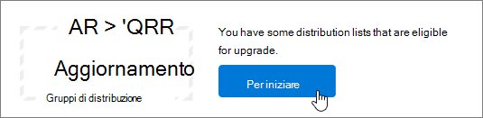

# <a name="upgrade-distribution-lists-to-microsoft-365-groups-in-outlook"></a><span data-ttu-id="8d613-103">Aggiornare le liste di distribuzione Microsoft 365 gruppi in Outlook</span><span class="sxs-lookup"><span data-stu-id="8d613-103">Upgrade distribution lists to Microsoft 365 Groups in Outlook</span></span>

<span data-ttu-id="8d613-104">È possibile aggiornare le liste di distribuzione Microsoft 365 gruppi in Outlook.</span><span class="sxs-lookup"><span data-stu-id="8d613-104">You can upgrade distribution lists to Microsoft 365 Groups in Outlook.</span></span> <span data-ttu-id="8d613-105">Si tratta di un ottimo modo per offrire alle liste di distribuzione dell'organizzazione tutte le caratteristiche e le funzionalità di Microsoft 365 gruppi.</span><span class="sxs-lookup"><span data-stu-id="8d613-105">This is a great way to give your organization's distribution lists all the features and functionality of Microsoft 365 Groups.</span></span> [<span data-ttu-id="8d613-106">Perché è consigliabile eseguire l'aggiornamento delle liste di distribuzione ai gruppi di Outlook</span><span class="sxs-lookup"><span data-stu-id="8d613-106">Why you should upgrade your distribution lists to groups in Outlook</span></span>](https://support.microsoft.com/office/7fb3d880-593b-4909-aafa-950dd50ce188)

<span data-ttu-id="8d613-107">È possibile aggiornare le liste di distribuzione una per volta oppure diverse contemporaneamente.</span><span class="sxs-lookup"><span data-stu-id="8d613-107">You can upgrade DLs one at a time, or several at the same time.</span></span>

## <a name="upgrade-one-or-many-distribution-list-groups-to-microsoft-365-groups-in-outlook"></a><span data-ttu-id="8d613-108">Aggiornare uno o più gruppi di liste di distribuzione Microsoft 365 gruppi in Outlook</span><span class="sxs-lookup"><span data-stu-id="8d613-108">Upgrade one or many distribution list groups to Microsoft 365 Groups in Outlook</span></span>

<span data-ttu-id="8d613-109">È necessario essere un amministratore globale o un Exchange per aggiornare un gruppo di liste di distribuzione.</span><span class="sxs-lookup"><span data-stu-id="8d613-109">You must be a global admin or Exchange admin to upgrade a distribution list group.</span></span> <span data-ttu-id="8d613-110">Per eseguire l'aggiornamento Microsoft 365 gruppi, il gruppo della lista di distribuzione deve disporre di un proprietario con una cassetta postale.</span><span class="sxs-lookup"><span data-stu-id="8d613-110">To upgrade to Microsoft 365 Groups, the distribution list group must have an owner with a mailbox.</span></span>

### <a name="use-the-new-eac-to-upgrade-one-or-many-distribution-list-groups-to-microsoft-365-groups-in-outlook"></a><span data-ttu-id="8d613-111">Utilizzare il nuovo interfaccia di amministrazione di Exchange per aggiornare uno o più gruppi di liste di distribuzione Microsoft 365 gruppi in Outlook</span><span class="sxs-lookup"><span data-stu-id="8d613-111">Use the new EAC to upgrade one or many distribution list groups to Microsoft 365 Groups in Outlook</span></span>

1. <span data-ttu-id="8d613-112">Passare alla nuova interfaccia [di Exchange](https://admin.exchange.microsoft.com)e passare a **Destinatari** \> **Gruppi**.</span><span class="sxs-lookup"><span data-stu-id="8d613-112">Go to the new [Exchange admin center](https://admin.exchange.microsoft.com), and navigate to **Recipients** \> **Groups**.</span></span>

2. <span data-ttu-id="8d613-113">Selezionare il gruppo della lista di distribuzione (denominato anche gruppo di **distribuzione)** che si desidera aggiornare Microsoft 365 gruppo dalla **pagina** Gruppi.</span><span class="sxs-lookup"><span data-stu-id="8d613-113">Select the distribution list group (also called a **distribution group**) that you want to upgrade to Microsoft 365 group from the **Groups** page.</span></span>

3. <span data-ttu-id="8d613-114">Selezionare il **gruppo di distribuzione Aggiorna** dalla barra degli strumenti.</span><span class="sxs-lookup"><span data-stu-id="8d613-114">Select the **Upgrade distribution group** from the tool bar.</span></span>

4. <span data-ttu-id="8d613-115">Nella finestra di dialogo **Pronto per l'aggiornamento?** fare clic su **Aggiorna.**</span><span class="sxs-lookup"><span data-stu-id="8d613-115">In the dialog box **Ready to upgrade?**, click **Upgrade**.</span></span> <span data-ttu-id="8d613-116">Il processo inizia immediatamente.</span><span class="sxs-lookup"><span data-stu-id="8d613-116">The process begins immediately.</span></span> <span data-ttu-id="8d613-117">A seconda delle dimensioni e del numero di gruppi di liste di distribuzione che si sta aggiornando, il processo può richiedere minuti o ore.</span><span class="sxs-lookup"><span data-stu-id="8d613-117">Depending on the size and number of distribution list groups you're upgrading, the process can take minutes or hours.</span></span>

> [!NOTE]
> <span data-ttu-id="8d613-118">Un banner nella parte superiore indica che l'aggiornamento, ad esempio i gruppi di distribuzione è *stato aggiornato. Saranno necessarie 5 minuti per riflettere le modifiche. Filtrare Microsoft 365 gruppi di* distribuzione per visualizzare i gruppi distrubtion aggiornati.</span><span class="sxs-lookup"><span data-stu-id="8d613-118">A banner at the top indicates the upgrade, for example, *Distribution group(s) has been upgraded. It will take 5 minutes to reflect the changes. Filter by Microsoft 365 groups to see the upgraded distrubtion groups(s)*.</span></span>

### <a name="use-the-classic-eac-to-upgrade-one-or-many-distribution-list-groups-to-microsoft-365-groups-in-outlook"></a><span data-ttu-id="8d613-119">Utilizzare l'interfaccia di amministrazione di Exchange classica per aggiornare uno o più gruppi di liste di distribuzione Microsoft 365 gruppi in Outlook</span><span class="sxs-lookup"><span data-stu-id="8d613-119">Use the Classic EAC to upgrade one or many distribution list groups to Microsoft 365 Groups in Outlook</span></span>

1. <span data-ttu-id="8d613-120">Passare all'interfaccia di <a href="https://go.microsoft.com/fwlink/p/?linkid=2059104" target="_blank">Exchange classica</a>.</span><span class="sxs-lookup"><span data-stu-id="8d613-120">Go to the Classic <a href="https://go.microsoft.com/fwlink/p/?linkid=2059104" target="_blank">Exchange admin center</a>.</span></span>

2. <span data-ttu-id="8d613-121">Nell'interfaccia di Exchange classica passare a **Destinatari** \> **Gruppi**.</span><span class="sxs-lookup"><span data-stu-id="8d613-121">In the Classic Exchange admin center, go to **Recipients** \> **Groups**.</span></span><br/><span data-ttu-id="8d613-122">Verrà visualizzato un avviso che indica che sono presenti liste di distribuzione (denominate anche gruppi di **distribuzione)** idonee per l'aggiornamento a Microsoft 365 gruppi.</span><span class="sxs-lookup"><span data-stu-id="8d613-122">You'll see a notice indicating you have distribution lists (also called **distribution groups**) that are eligible to be upgraded to Microsoft 365 Groups.</span></span><br/> <span data-ttu-id="8d613-123"></span><span class="sxs-lookup"><span data-stu-id="8d613-123"></span></span>

3. <span data-ttu-id="8d613-124">Selezionare una o più liste di distribuzione (denominate anche gruppo **di distribuzione)** dalla **pagina gruppi.**</span><span class="sxs-lookup"><span data-stu-id="8d613-124">Select one or more distribution lists (also called a **distribution group**) from the **groups** page.</span></span><br/><span data-ttu-id="8d613-125"></span><span class="sxs-lookup"><span data-stu-id="8d613-125"></span></span>

4. <span data-ttu-id="8d613-126">Selezionare l'icona di aggiornamento.</span><span class="sxs-lookup"><span data-stu-id="8d613-126">Select the upgrade icon.</span></span><br/>

5. <span data-ttu-id="8d613-128">Nella finestra di dialogo delle informazioni selezionare **Sì** per confermare l'aggiornamento.</span><span class="sxs-lookup"><span data-stu-id="8d613-128">On the information dialog, select **Yes** to confirm the upgrade.</span></span> <span data-ttu-id="8d613-129">Il processo inizia immediatamente.</span><span class="sxs-lookup"><span data-stu-id="8d613-129">The process begins immediately.</span></span> <span data-ttu-id="8d613-130">A seconda delle dimensioni e del numero di DLL da aggiornare, il processo può richiedere minuti o ore.</span><span class="sxs-lookup"><span data-stu-id="8d613-130">Depending on the size and number of DLs you're upgrading, the process can take minutes or hours.</span></span><br/><span data-ttu-id="8d613-131">Se la lista di distribuzione non può essere aggiornata, viene visualizzata una finestra di dialogo che indica questo problema.</span><span class="sxs-lookup"><span data-stu-id="8d613-131">If the distribution list can't be upgraded, a dialog appears saying so.</span></span> <span data-ttu-id="8d613-132">Vedere [Quali liste di distribuzione non possono essere aggiornate?](#which-distribution-lists-cant-be-upgraded).</span><span class="sxs-lookup"><span data-stu-id="8d613-132">See [Which distribution lists cannot be upgraded?](#which-distribution-lists-cant-be-upgraded).</span></span>

6. <span data-ttu-id="8d613-133">Se si stanno aggiornando più liste di distribuzione, utilizzare l'elenco a discesa per filtrare le liste di distribuzione aggiornate.</span><span class="sxs-lookup"><span data-stu-id="8d613-133">If you're upgrading multiple distribution lists, use the drop-down list to filter which distribution lists have been upgraded.</span></span> <span data-ttu-id="8d613-134">Se l'elenco non è completo, attendere ancora un po', quindi selezionare **Aggiorna** per vedere cosa è stato aggiornato correttamente.</span><span class="sxs-lookup"><span data-stu-id="8d613-134">If the list isn't complete, wait a while longer and then select **Refresh** to see what's been successfully upgraded.</span></span><br/><span data-ttu-id="8d613-p107">Al termine del processo di aggiornamento per tutte le liste di distribuzione selezionate, non viene visualizzato alcun avviso. Per ottenere questa informazione, è possibile esaminare le liste di distribuzione elencate in **Disponibili per l'aggiornamento** o **Liste di distribuzione aggiornate**.</span><span class="sxs-lookup"><span data-stu-id="8d613-p107">There's no notice that tells you when the upgrade process has completed for all DLs you selected. You can figure this out by looking to see what's listed under **Available for upgrade** or **Upgraded DLs**.</span></span>

7. <span data-ttu-id="8d613-137">Se è stata selezionata una dll per l'aggiornamento, ma è ancora visualizzata nella pagina come Disponibile per l'aggiornamento, l'aggiornamento non è riuscito.</span><span class="sxs-lookup"><span data-stu-id="8d613-137">If you selected a DL for upgrade, but it's still appeared on the page as Available to upgrade, then it failed to upgrade.</span></span> <span data-ttu-id="8d613-138">Vedere [Che cosa fare se l'aggiornamento non riesce](#what-to-do-if-the-upgrade-doesnt-work).</span><span class="sxs-lookup"><span data-stu-id="8d613-138">See [What to do if the upgrade doesn't work](#what-to-do-if-the-upgrade-doesnt-work).</span></span>

> [!NOTE]
> <span data-ttu-id="8d613-p109">Se si ricevono messaggi di posta elettronica di riepilogo dei gruppi, si potrebbe notare nella parte inferiore una notifica che offre di aggiornare tutte le liste di distribuzione idonee di cui si è proprietari. Per altre informazioni sui messaggi di posta elettronica di riepilogo, vedere [Avviare una conversazione di gruppo in Outlook](https://support.microsoft.com/office/a0482e24-a769-4e39-a5ba-a7c56e828b22).</span><span class="sxs-lookup"><span data-stu-id="8d613-p109">If you're getting the groups digest emails you may notice at the bottom that it will sometimes offer to let you upgrade any eligible distribution lists that you're the owner of. See [Have a group conversation in Outlook](https://support.microsoft.com/office/a0482e24-a769-4e39-a5ba-a7c56e828b22) for more information about digest emails.</span></span>

## <a name="what-to-do-if-the-upgrade-doesnt-work"></a><span data-ttu-id="8d613-141">Che cosa fare se l'aggiornamento non riesce</span><span class="sxs-lookup"><span data-stu-id="8d613-141">What to do if the upgrade doesn't work</span></span>

<span data-ttu-id="8d613-142">Le liste di distribuzione il cui aggiornamento non riesce restano inalterate.</span><span class="sxs-lookup"><span data-stu-id="8d613-142">Distribution lists that fail to upgrade remain unchanged.</span></span>

<span data-ttu-id="8d613-p110">Se l'aggiornamento di una o più liste di distribuzione **idonee** non riesce, aprire un [ticket di supporto](../../business-video/get-help-support.md). Il problema dovrà essere inoltrato al team dei tecnici dei gruppi, perché indaghi sul problema.</span><span class="sxs-lookup"><span data-stu-id="8d613-p110">If one or more **eligible** distribution lists fail to be upgraded, open a [Support ticket](../../business-video/get-help-support.md). The issue will need to be escalated to the Groups Engineering team for them to figure out the problem.</span></span>

<span data-ttu-id="8d613-145">È possibile che la lista di distribuzione non sia stata aggiornata a causa di un'interruzione del servizio, ma è improbabile.</span><span class="sxs-lookup"><span data-stu-id="8d613-145">It's possible that the distribution list didn't get upgraded because of a service outage, but unlikely.</span></span> <span data-ttu-id="8d613-146">È possibile attendere ancora e quindi riprovare ad aggiornare la lista di distribuzione.</span><span class="sxs-lookup"><span data-stu-id="8d613-146">If you want, wait a while and then try to upgrade the DL again.</span></span>

## <a name="how-to-use-powershell-to-upgrade-several-distribution-lists-at-the-same-time"></a><span data-ttu-id="8d613-147">Come usare PowerShell per aggiornare diverse liste di distribuzione contemporaneamente</span><span class="sxs-lookup"><span data-stu-id="8d613-147">How to use PowerShell to upgrade several distribution lists at the same time</span></span>

<span data-ttu-id="8d613-148">Se si ha esperienza nell'uso di PowerShell, potrebbe essere utile scegliere questo strumento invece dell'interfaccia utente.</span><span class="sxs-lookup"><span data-stu-id="8d613-148">If you're experienced at using PowerShell, you might want to go this route instead of using the UI.</span></span> <span data-ttu-id="8d613-149">È stato creato un set di cmdlet che consentono di aggiornare le liste di distribuzione.</span><span class="sxs-lookup"><span data-stu-id="8d613-149">We have a set of cmdlets that will help you upgrade distribution lists.</span></span> <span data-ttu-id="8d613-150">Vedi di seguito.</span><span class="sxs-lookup"><span data-stu-id="8d613-150">See below.</span></span>

### <a name="upgrade-a-single-dl"></a><span data-ttu-id="8d613-151">Aggiornare una singola dll</span><span class="sxs-lookup"><span data-stu-id="8d613-151">Upgrade a single DL</span></span>

<span data-ttu-id="8d613-152">Per aggiornare una singola dll, eseguire il comando seguente:</span><span class="sxs-lookup"><span data-stu-id="8d613-152">To upgrade a single DL, run the following command:</span></span>

```PowerShell
Upgrade-DistributionGroup -DlIdentities <Dl SMTP address>
```

<span data-ttu-id="8d613-153">Ad esempio, se si desidera aggiornare una DL con indirizzo SMTP dl1@contoso.com, eseguire il comando seguente:</span><span class="sxs-lookup"><span data-stu-id="8d613-153">For example, if you want to upgrade a DL with SMTP address dl1@contoso.com, run the following command:</span></span>

```PowerShell
Upgrade-DistributionGroup -DlIdentities dl1@contoso.com
```

> [!NOTE]
> <span data-ttu-id="8d613-154">È inoltre possibile aggiornare una singola lista di distribuzione a Microsoft 365 gruppo utilizzando il cmdlet [New-UnifiedGroup](/powershell/module/exchange/new-unifiedgroup) PowerShell</span><span class="sxs-lookup"><span data-stu-id="8d613-154">You can also upgrade a single distribution list to a Microsoft 365 group using the [New-UnifiedGroup](/powershell/module/exchange/new-unifiedgroup) PowerShell cmdlet</span></span>

### <a name="upgrade-multiple-dls-in-a-batch"></a><span data-ttu-id="8d613-155">Aggiornare più DLL in un batch</span><span class="sxs-lookup"><span data-stu-id="8d613-155">Upgrade multiple DLs in a batch</span></span>

<span data-ttu-id="8d613-156">Puoi anche passare più DLL come batch e aggiornarle insieme:</span><span class="sxs-lookup"><span data-stu-id="8d613-156">You can also pass multiple DLs as a batch and upgrade them together:</span></span>

```PowerShell
Upgrade-DistributionGroup -DlIdentities <DL SMTP address1>, <DL SMTP address2>,
<DL SMTP address3>, <DL SMTP address4>
```

<span data-ttu-id="8d613-157">Ad esempio, se si desidera aggiornare cinque DLL con indirizzo SMTP `dl1@contoso.com` e , e , eseguire il comando `dl2@contoso.com` `dl3@contoso.com` `dl4@contoso.com` `dl5@contoso.com` seguente:</span><span class="sxs-lookup"><span data-stu-id="8d613-157">For example, if you want to upgrade five DLs with SMTP address `dl1@contoso.com` and `dl2@contoso.com`, `dl3@contoso.com`, `dl4@contoso.com` and `dl5@contoso.com`, run the following command:</span></span>

`Upgrade-DistributionGroup -DlIdentities dl1@contoso.com, dl2@contoso.com, dl3@contoso.com, dl4@contoso.com, dl5@contoso.com`

### <a name="upgrade-all-eligible-dls"></a><span data-ttu-id="8d613-158">Aggiornare tutte le DLL idonee</span><span class="sxs-lookup"><span data-stu-id="8d613-158">Upgrade all eligible DLs</span></span>

<span data-ttu-id="8d613-159">Esistono due modi per aggiornare tutte le DLL idonee.</span><span class="sxs-lookup"><span data-stu-id="8d613-159">There are two ways in which you can upgrade all the eligible DLs.</span></span>

> [!NOTE]
> <span data-ttu-id="8d613-160">Il cmdlet Upgrade-DistributionGroup non riceve dati dalla pipeline, per questo motivo è necessario utilizzare l'operatore "foreach-object" per la corretta {} esecuzione.</span><span class="sxs-lookup"><span data-stu-id="8d613-160">The Upgrade-DistributionGroup cmdlet doesn't receive data from the pipeline, for this reason it's required to use "foreach-object{}" operator to run successfully.</span></span>

1. <span data-ttu-id="8d613-161">Ottieni le DLL idonee nel tenant e aggiornale usando il comando di aggiornamento:</span><span class="sxs-lookup"><span data-stu-id="8d613-161">Get the eligible DLs in the tenant and upgrade them using the upgrade command:</span></span>

```PowerShell
Get-EligibleDistributionGroupForMigration | Foreach-Object{
    Upgrade-DistributionGroup -DlIdentities $_.PrimarySMTPAddress
}
```

2. <span data-ttu-id="8d613-162">Ottenere l'elenco di tutte le DLL e aggiornare solo le DLL idonee:</span><span class="sxs-lookup"><span data-stu-id="8d613-162">Get the list of all DLs and upgrade only the eligible DLs:</span></span>

```PowerShell
Get-DistributionGroup| Foreach-Object{
    Upgrade-DistributionGroup -DlIdentities $_.PrimarySMTPAddress
}
```

## <a name="faq-about-upgrading-distribution-lists-to-microsoft-365-groups-in-outlook"></a><span data-ttu-id="8d613-163">Domande frequenti sull'aggiornamento delle liste di distribuzione Microsoft 365 gruppi in Outlook</span><span class="sxs-lookup"><span data-stu-id="8d613-163">FAQ about upgrading distribution lists to Microsoft 365 Groups in Outlook</span></span>

### <a name="which-distribution-lists-cant-be-upgraded"></a><span data-ttu-id="8d613-164">Quali liste di distribuzione non possono essere aggiornate?</span><span class="sxs-lookup"><span data-stu-id="8d613-164">Which distribution lists can't be upgraded?</span></span>

<span data-ttu-id="8d613-165">È possibile aggiornare solo liste di distribuzione semplici, gestite nel cloud e non annidate.</span><span class="sxs-lookup"><span data-stu-id="8d613-165">You can only upgrade cloud-managed, simple, non-nested distribution lists.</span></span> <span data-ttu-id="8d613-166">Nella tabella seguente sono elencate le liste di distribuzione **che non possono** essere aggiornate.</span><span class="sxs-lookup"><span data-stu-id="8d613-166">The table below lists distribution lists that **CANNOT** be upgraded.</span></span>

|<span data-ttu-id="8d613-167">**Proprietà**</span><span class="sxs-lookup"><span data-stu-id="8d613-167">**Property**</span></span>|<span data-ttu-id="8d613-168">**Idonea?**</span><span class="sxs-lookup"><span data-stu-id="8d613-168">**Eligible?**</span></span>|
|:-----|:-----|
|<span data-ttu-id="8d613-169">Lista di distribuzione gestita in locale</span><span class="sxs-lookup"><span data-stu-id="8d613-169">On-premises managed distribution list.</span></span>  <br/> |<span data-ttu-id="8d613-170">No</span><span class="sxs-lookup"><span data-stu-id="8d613-170">No</span></span>  <br/> |
|<span data-ttu-id="8d613-p114">Liste di distribuzione annidate. La lista di distribuzione ha gruppi figlio o è membro di un altro gruppo.</span><span class="sxs-lookup"><span data-stu-id="8d613-p114">Nested distribution lists. Distribution list either has child groups or is a member of another group.</span></span>  <br/> |<span data-ttu-id="8d613-173">No</span><span class="sxs-lookup"><span data-stu-id="8d613-173">No</span></span>  <br/> |
|<span data-ttu-id="8d613-174">Liste di distribuzione con **membro RecipientTypeDetails** diverso **da UserMailbox,** **SharedMailbox,** **TeamMailbox,** **MailUser**</span><span class="sxs-lookup"><span data-stu-id="8d613-174">Distribution lists with member **RecipientTypeDetails** other than **UserMailbox**, **SharedMailbox**, **TeamMailbox**, **MailUser**</span></span>  <br/> |<span data-ttu-id="8d613-175">No</span><span class="sxs-lookup"><span data-stu-id="8d613-175">No</span></span>  <br/> |
|<span data-ttu-id="8d613-176">Lista di distribuzione con più di 100 proprietari</span><span class="sxs-lookup"><span data-stu-id="8d613-176">Distribution list that has more than 100 owners</span></span>  <br/> |<span data-ttu-id="8d613-177">No</span><span class="sxs-lookup"><span data-stu-id="8d613-177">No</span></span>  <br/> |
|<span data-ttu-id="8d613-178">Lista di distribuzione che include solo membri ma nessun proprietario</span><span class="sxs-lookup"><span data-stu-id="8d613-178">Distribution list that only has members but no owner</span></span>  <br/> |<span data-ttu-id="8d613-179">No</span><span class="sxs-lookup"><span data-stu-id="8d613-179">No</span></span>  <br/> |
|<span data-ttu-id="8d613-180">Lista di distribuzione con alias contenente caratteri speciali</span><span class="sxs-lookup"><span data-stu-id="8d613-180">Distribution list that has alias containing special characters</span></span>  <br/> |<span data-ttu-id="8d613-181">No</span><span class="sxs-lookup"><span data-stu-id="8d613-181">No</span></span>  <br/> |
|<span data-ttu-id="8d613-182">Lista di distribuzione configurata come indirizzo di inoltro per la cassetta postale condivisa</span><span class="sxs-lookup"><span data-stu-id="8d613-182">If the distribution list is configured to be a forwarding address for Shared Mailbox</span></span>  <br/> |<span data-ttu-id="8d613-183">No</span><span class="sxs-lookup"><span data-stu-id="8d613-183">No</span></span>  <br/> |
|<span data-ttu-id="8d613-184">Se la dll fa parte di **Sender Restriction** in un'altra DL.</span><span class="sxs-lookup"><span data-stu-id="8d613-184">If the DL is part of **Sender Restriction** in another DL.</span></span>  <br/> |<span data-ttu-id="8d613-185">No</span><span class="sxs-lookup"><span data-stu-id="8d613-185">No</span></span>  <br/> |
|<span data-ttu-id="8d613-186">Gruppi di sicurezza</span><span class="sxs-lookup"><span data-stu-id="8d613-186">Security groups</span></span>  <br/> |<span data-ttu-id="8d613-187">No</span><span class="sxs-lookup"><span data-stu-id="8d613-187">No</span></span>  <br/> |
|<span data-ttu-id="8d613-188">Liste di distribuzione dinamiche</span><span class="sxs-lookup"><span data-stu-id="8d613-188">Dynamic Distribution lists</span></span>  <br/> |<span data-ttu-id="8d613-189">No</span><span class="sxs-lookup"><span data-stu-id="8d613-189">No</span></span>  <br/> |
|<span data-ttu-id="8d613-190">Liste di distribuzione convertite in **RoomLists**</span><span class="sxs-lookup"><span data-stu-id="8d613-190">Distribution lists that were converted to **RoomLists**</span></span>  <br/> |<span data-ttu-id="8d613-191">No</span><span class="sxs-lookup"><span data-stu-id="8d613-191">No</span></span>  <br/> |
|<span data-ttu-id="8d613-192">Liste di distribuzione **in cui MemberJoinRestriction** e/o **MemberDepartRestriction** è **Closed**</span><span class="sxs-lookup"><span data-stu-id="8d613-192">Distribution lists where **MemberJoinRestriction** and/or **MemberDepartRestriction** is **Closed**</span></span>  <br/> |<span data-ttu-id="8d613-193">No</span><span class="sxs-lookup"><span data-stu-id="8d613-193">No</span></span>  <br/> |

### <a name="check-which-dls-are-eligible-for-upgrade"></a><span data-ttu-id="8d613-194">Verificare quali DLL sono idonee per l'aggiornamento</span><span class="sxs-lookup"><span data-stu-id="8d613-194">Check which DLs are eligible for upgrade</span></span>

<span data-ttu-id="8d613-195">Se si desidera verificare se una dll è idonea o meno, è possibile eseguire il comando seguente:</span><span class="sxs-lookup"><span data-stu-id="8d613-195">If you want to check whether a DL is eligible or not, you can run the below command:</span></span>

`Get-DistributionGroup <DL SMTP address> | Get-EligibleDistributionGroupForMigration`

<span data-ttu-id="8d613-196">Se si desidera verificare quali DLL sono idonee per l'aggiornamento, eseguire il comando seguente:</span><span class="sxs-lookup"><span data-stu-id="8d613-196">If you want to check which DLs are eligible for upgrade just run the following command:</span></span>

`Get-EligibleDistributionGroupForMigration`

### <a name="who-can-run-the-upgrade-scripts"></a><span data-ttu-id="8d613-197">Chi può eseguire gli script di aggiornamento?</span><span class="sxs-lookup"><span data-stu-id="8d613-197">Who can run the upgrade scripts?</span></span>

<span data-ttu-id="8d613-198">Persone con diritti di amministratore globale o Exchange amministratore globale.</span><span class="sxs-lookup"><span data-stu-id="8d613-198">People with global admin or Exchange admin rights.</span></span>

### <a name="why-is-the-contact-card-still-showing-a-distribution-list-what-should-i-do-to-prevent-an-upgraded-distribution-list-from-showing-up-in-my-auto-suggest-list"></a><span data-ttu-id="8d613-199">Perché la scheda contatto mostra ancora una lista di distribuzione?</span><span class="sxs-lookup"><span data-stu-id="8d613-199">Why is the contact card still showing a distribution list?</span></span> <span data-ttu-id="8d613-200">Cosa è necessario fare per impedire la visualizzazione di una lista di distribuzione aggiornata nella mia lista di suggerimenti automatici?</span><span class="sxs-lookup"><span data-stu-id="8d613-200">What should I do to prevent an upgraded distribution list from showing up in my auto suggest list?</span></span>

- <span data-ttu-id="8d613-201">Ad Outlook: quando un utente tenta di inviare un messaggio di posta elettronica in Outlook digitando il nome del gruppo di Microsoft 365 dopo la migrazione, il destinatario verrà risolto come lista di distribuzione anziché come gruppo.</span><span class="sxs-lookup"><span data-stu-id="8d613-201">For Outlook: When someone tries to send an email in Outlook by typing the Microsoft 365 group name after migration, the recipient will be resolved as the distribution list instead of the group.</span></span> <span data-ttu-id="8d613-202">La scheda contatto del destinatario sarà la scheda contatto degli elenchi di distribuzione.</span><span class="sxs-lookup"><span data-stu-id="8d613-202">The contact card of the recipient will be the distribution lists contact card.</span></span> <span data-ttu-id="8d613-203">Questo dipende dalla cache dei destinatari o dalla cache dei nomi alternativi in Outlook.</span><span class="sxs-lookup"><span data-stu-id="8d613-203">This is because of the recipient cache or nick name cache in Outlook.</span></span> <span data-ttu-id="8d613-204">Il messaggio di posta elettronica verrà inviato correttamente al gruppo, ma potrebbe causare confusione al mittente.</span><span class="sxs-lookup"><span data-stu-id="8d613-204">The email will be sent successfully to the group, but might cause confusion to the sender.</span></span><br/><span data-ttu-id="8d613-205">È possibile eseguire i passaggi descritti in questo articolo, Informazioni sull'elenco Outlook [completamento](/outlook/troubleshoot/contacts/information-about-the-outlook-autocomplete-list) automatico per reimpostare la cache, che risolverà il problema.</span><span class="sxs-lookup"><span data-stu-id="8d613-205">You can perform the steps in this article, [Information about the Outlook AutoComplete list](/outlook/troubleshoot/contacts/information-about-the-outlook-autocomplete-list) to reset the cache, which will fix this issue.</span></span>

- <span data-ttu-id="8d613-206">Ad Outlook sul Web: in caso di Outlook sul Web, il destinatario della lista di distribuzione rimarrà ancora nella cache.</span><span class="sxs-lookup"><span data-stu-id="8d613-206">For Outlook on the web: In case of Outlook on the web, the distribution list recipient will still remain in the cache.</span></span> <span data-ttu-id="8d613-207">È possibile seguire la procedura descritta in [Rimuovere](https://support.microsoft.com/office/9E1419D9-E88F-445B-B07F-F558B8A37C58) il nome suggerito o l'indirizzo di posta elettronica dall'elenco di completamento automatico per aggiornare la cache per visualizzare la scheda contatto del gruppo.</span><span class="sxs-lookup"><span data-stu-id="8d613-207">You can follow the steps in [Remove suggested name or email address from the Auto-Complete List](https://support.microsoft.com/office/9E1419D9-E88F-445B-B07F-F558B8A37C58) to refresh the cache to see the group contact card.</span></span>

### <a name="do-new-group-members-get-a-welcome-email-in-their-inbox"></a><span data-ttu-id="8d613-208">I nuovi membri del gruppo ricevono un messaggio di posta elettronica di benvenuto nella propria posta in arrivo?</span><span class="sxs-lookup"><span data-stu-id="8d613-208">Do new group members get a welcome email in their inbox?</span></span>

<span data-ttu-id="8d613-p118">No. L'impostazione per abilitare i messaggi di benvenuto è impostata su false per impostazione predefinita. Questa impostazione interessa i nuovi membri del gruppo e quelli esistenti che potrebbero aggiungersi al termine dell'aggiornamento. Se successivamente il proprietario del gruppo consente utenti guest, questi non riceveranno un messaggio di posta elettronica di benvenuto nella propria posta in arrivo. I membri guest possono continuare a lavorare con il gruppo.</span><span class="sxs-lookup"><span data-stu-id="8d613-p118">No. The setting to enable welcome messages is set to false by default. This setting affects both existing and new group members who may join after the migration is complete. If the group owner later allows guest users, guest users won't receive a welcome email in their inbox. Guest members can continue working with the group.</span></span>

### <a name="what-if-one-or-some-of-the-dls-are-not-upgraded"></a><span data-ttu-id="8d613-214">Cosa succede se una o alcune delle DLL non vengono aggiornate?</span><span class="sxs-lookup"><span data-stu-id="8d613-214">What if one or some of the DLs are not upgraded?</span></span>

<span data-ttu-id="8d613-215">Esistono alcuni casi in cui DL è idoneo ma non può essere aggiornato.</span><span class="sxs-lookup"><span data-stu-id="8d613-215">There are some cases in which though DL is eligible but could not be upgraded.</span></span> <span data-ttu-id="8d613-216">La dll non viene aggiornata e rimane come DL.</span><span class="sxs-lookup"><span data-stu-id="8d613-216">The DL does not get upgraded and remains as a DL.</span></span>

- <span data-ttu-id="8d613-217">Se l'amministratore ha applicato criteri dell'indirizzo di posta elettronica di gruppo per i gruppi di un'organizzazione e tenta di aggiornare le DLL che non soddisfano i criteri, la dll non viene aggiornata </span><span class="sxs-lookup"><span data-stu-id="8d613-217">Where admin has applied **Group Email Address Policy** for the groups in an organization and they try to upgrade DLs that doesn't fulfill the criteria, the DL does not get upgraded</span></span>

- <span data-ttu-id="8d613-218">Non è stato possibile aggiornare le DLL con **MemberJoinRestriction** o **MemberDepartRestriction** impostato su **Closed**.</span><span class="sxs-lookup"><span data-stu-id="8d613-218">DLs with **MemberJoinRestriction** or **MemberDepartRestriction** set to **Closed**, could not be upgraded</span></span>

### <a name="what-happens-to-the-dl-if-the-upgrade-from-eac-fails"></a><span data-ttu-id="8d613-219">Che cosa succede alla lista di distribuzione se l'aggiornamento dall'interfaccia di amministrazione di Exchange non riesce?</span><span class="sxs-lookup"><span data-stu-id="8d613-219">What happens to the DL if the upgrade from EAC fails?</span></span>

<span data-ttu-id="8d613-p120">L'aggiornamento viene completato solo quando la chiamata viene inviata al server. Se l'aggiornamento non riesce, le liste di distribuzione restano inalterate e funzionano come prima.</span><span class="sxs-lookup"><span data-stu-id="8d613-p120">The upgrade will happen only when the call is submitted to the server. If the upgrade fails, your DLs will be intact. They will work like they used to.</span></span>

## <a name="related-content"></a><span data-ttu-id="8d613-223">Contenuto correlato</span><span class="sxs-lookup"><span data-stu-id="8d613-223">Related content</span></span>

<span data-ttu-id="8d613-224">[Confronto tra gruppi](../create-groups/compare-groups.md) (articolo)</span><span class="sxs-lookup"><span data-stu-id="8d613-224">[Compare groups](../create-groups/compare-groups.md) (article)</span></span>\
<span data-ttu-id="8d613-225">[Spiegazione di Microsoft 365 gruppi agli utenti](../create-groups/explain-groups-knowledge-worker.md) (articolo)</span><span class="sxs-lookup"><span data-stu-id="8d613-225">[Explaining Microsoft 365 Groups to your users](../create-groups/explain-groups-knowledge-worker.md) (article)</span></span>\
[<span data-ttu-id="8d613-226">Aggiungere o rimuovere membri da Microsoft 365 gruppi usando l'interfaccia di amministrazione</span><span class="sxs-lookup"><span data-stu-id="8d613-226">Add or remove members from Microsoft 365 groups using the admin center</span></span>](../create-groups/add-or-remove-members-from-groups.md)
