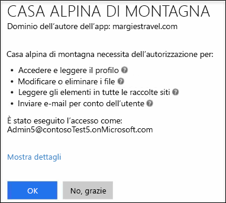

# Attivazione o disattivazione di App integrateTurning Integrated Apps on or off

Quando le app integrate sono attivate, gli utenti dell'organizzazione possono consentire alle app di terze parti di accedere alle informazioni di Microsoft 365.When Integrated Apps is turned on, users in your organization can allow third-party apps to access their Microsoft 365 information. Un'eventuale app di terze parti usata da qualcuno potrebbe ad esempio chiedere l'autorizzazione per accedere al calendario e per modificare i file contenuti in una cartella di OneDrive di questa persona.For example, when someone uses a third-party app, that app might ask for permission to access their calendar and to edit files that are in a OneDrive folder.

## Attivazione o disattivazione di App integrateTurning Integrated Apps on or off

Ecco come attivare o disattivare App integrate.Here's how to turn Integrated Apps on or off.

1. Nell'interfaccia di amministrazione di Microsoft 365 passare alla pagina dei [componenti &amp; aggiuntivi dei servizi](https://go.microsoft.com/fwlink/p/?linkid=2053743) di **Impostazioni** \> e quindi selezionare **app integrate**.In the Microsoft 365 admin center, go to the **Settings** \> [Services &amp; add-ins](https://go.microsoft.com/fwlink/p/?linkid=2053743) page, and then select **Integrated apps**.

2. Nella pagina **app integrate** , selezionare l'opzione per abilitare o disabilitare le app integrate.On the **Integrated Apps** page, select the option to turn Integrated Apps on or off.

## Altre informazioni sulle app integrateMore info on Integrated Apps

Un'app integrata può essere creata dall'interno dell'organizzazione oppure può provenire da un'altra organizzazione o da terze parti.An integrated app can be created from within your own organization, or it can come from another organization or a third-party.

Se l'opzione App integrate è attivata, le eventuali app che vengono usate chiedono l'autorizzazione per impostare il livello di accesso necessario per accedere alle informazioni dell'utente.When Integrated Apps is turned on and an app is used, the app asks for permission to set the level of access it needs when it accesses the user's information. Un utente può concedere l'accesso solo alle app che possiedono per accedere alle informazioni di Microsoft 365.A user can give access only to apps they own that access their Microsoft 365 information. Non può invece concedere l'accesso alle informazioni degli altri utenti.They can't give an app access to any other user's information.

Esistono due tipi di autorizzazioni che vengono utilizzate quando si utilizzano app integrate in Microsoft 365: autorizzazioni utente e autorizzazioni di amministratore.There are two kinds of permissions that are used when using Integrated Apps in Microsoft 365: user permissions and admin permissions. Se ad esempio le app integrate sono abilitate per l'organizzazione e un utente usa un'app di terze parti, quest'ultima può chiedere l'autorizzazione dell'utente per leggere i dettagli del suo profilo, modificare o eliminare file, leggere gli elementi contenuti nelle raccolte siti e inviare messaggi di posta elettronica a nome dell'utente.For example, when your organization is enabled for Integrated Apps and a user uses a third-party app, the app might ask for the user's permission to read their user profile details, edit or delete their files, read items contained in site collections, and send email as that user.

Se un amministratore registra un'app per tutti gli utenti di un'organizzazione, gli viene chiesto l'autorizzazione per consentire all'app di accedere alle informazioni e alle risorse nell'organizzazione.If an admin registers an app for all users in an organization, he or she is asked for permission to let that app access information and resources in the organization. Quando in seguito altri utenti dell'organizzazione useranno l'app, non visualizzeranno la richiesta di autorizzazione.After this, when other users in the organization use that app, they won't be asked for permission. L'amministratore che registra un'app deve verificare l'attendibilità di chi la pubblica.When an admin registers an app, that admin must make sure that they trust that app's publisher. Per informazioni sulla registrazione di app, vedere [Aggiunta, aggiornamento e rimozione di applicazioni](https://go.microsoft.com/fwlink/p/?LinkID=518600).For details on registering an app, see [Adding, Updating and Removing an Application](https://go.microsoft.com/fwlink/p/?LinkID=518600).

Se l'opzione App integrate viene disattivata, le app già installate e con l'autorizzazione per accedere alle informazioni non verranno disinstallate e le autorizzazioni non verranno rimosse. Anche se questa opzione è disattivata, gli amministratori possono comunque registrare app per renderle disponibili agli utenti e consentire l'accesso alle informazioni. Per informazioni sulla rimozione di un'applicazione registrata e delle relative autorizzazioni, vedere [Aggiunta, aggiornamento e rimozione di applicazioni](https://go.microsoft.com/fwlink/?LinkID=518600&amp;clcid=0x409).If Integrated Apps is turned off, apps that have already been installed and have permission to access information won't be uninstalled, and the permissions won't be removed. Even though Integrated Apps is turned off, admins can still register apps to make them available to their users and allow those apps access to the users' information. For details on removing a registered application and it's permissions, see [Adding, Updating and Removing an Application](https://go.microsoft.com/fwlink/?LinkID=518600&amp;clcid=0x409).

